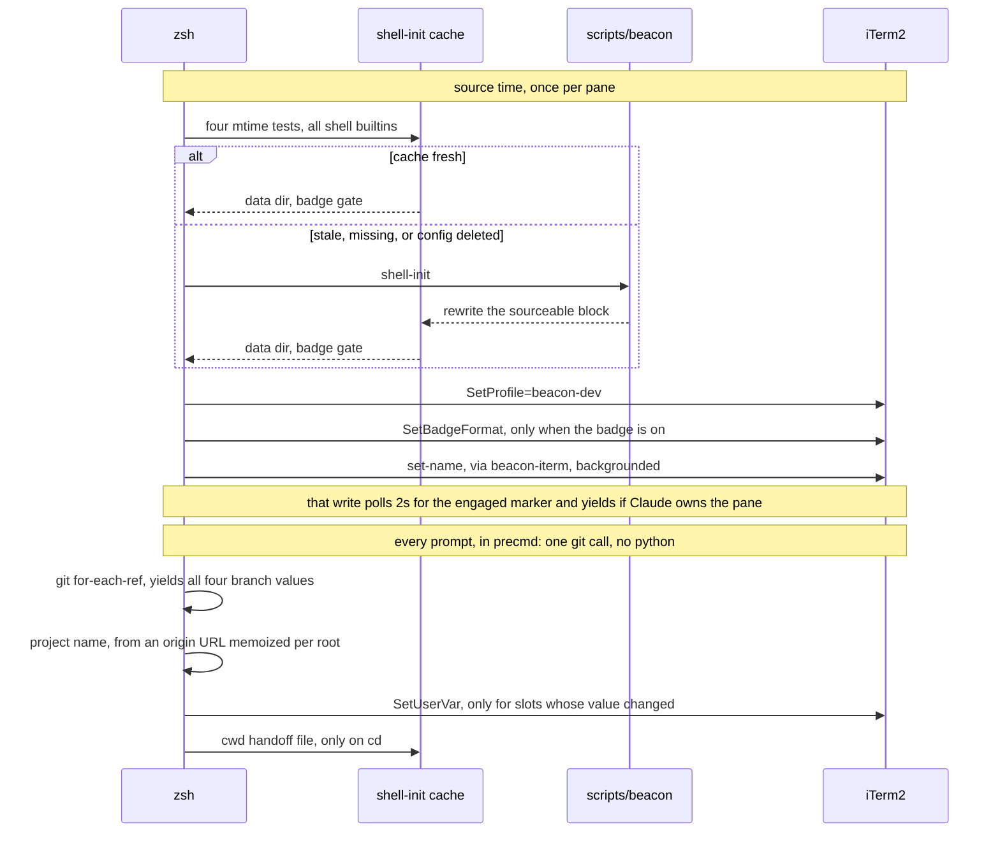
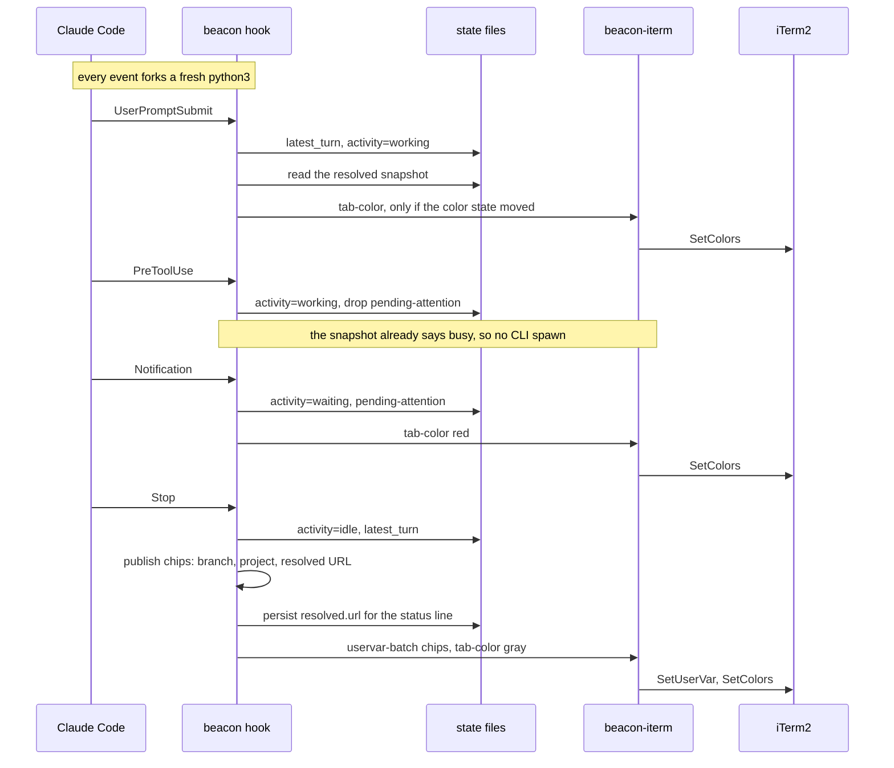
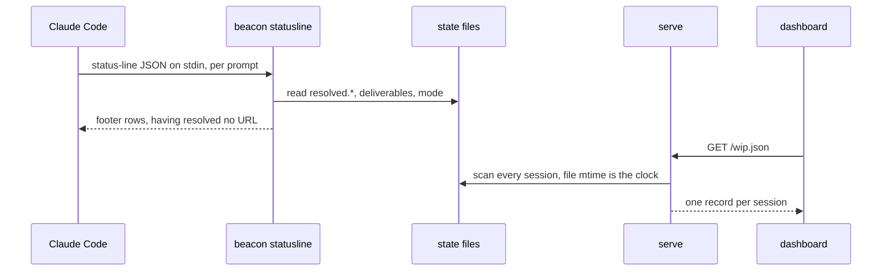

# beacon

At-a-glance awareness across concurrent Claude Code sessions — a terminal-agnostic fleet dashboard plus iTerm2 per-pane painting.

**[Read the docs](https://chris-peterson.github.io/beacon/)** for install, usage, and the full behavioral spec.

This README covers working *on* beacon. To install or use the released plugin, follow the docs site.

## Develop / install from a clone

Working on beacon directly (no marketplace):

```bash
git clone https://github.com/chris-peterson/beacon ~/src/beacon
python3 ~/src/beacon/scripts/beacon install
```

This wires up the shell side just like an installed `beacon install`, but pointed at your clone. To get the plugin side (slash commands, hooks, ambient rules) loaded into Claude Code, use the marketplace install path — `claude --plugin-dir` may not register hooks reliably across versions.

## Dependencies

The fleet dashboard (`wip` / `watch` / `serve`) needs only:

- Python 3 — the plugin script and CLI run via the system `python3`.

The per-pane painting layer (tab label and color, status bar, mode backgrounds; spec §4) additionally needs:

- macOS with iTerm2 — the render adapter is iTerm2-specific. `install` detects iTerm.app and skips these steps when it's absent.
- zsh — the shell snippet relies on zsh-only features.

The always-on serve service (`beacon serve install`) uses launchd on macOS, systemd user units on Linux.

## Repository layout

| Path | What |
|:---|:---|
| `bin/beacon-iterm` | Stateless CLI that translates subcommands to iTerm2 OSC sequences (D2) |
| `scripts/beacon` | Plugin script — hook handlers, COR resolver, slash command, install (D3) |
| `shell/beacon.zsh` | Sourceable zsh snippet — refreshes project name / branch / cwd on every prompt |
| `shell/beacon-remote.sh` | The same integration for the far side of an ssh connection — POSIX sh (zsh + bash), no python, installed by `beacon ssh-install <host>` |
| `hooks/`, `commands/` | Claude Code plugin glue |
| `rules/` | Ambient rules emitted into context at SessionStart by `hooks/emit-rules.sh` |
| `dashboard/index.html` | Self-contained reference fleet dashboard `serve` hosts at `/` |
| `iterm/profile.json.template` | Beacon dynamic profile, including the status-bar layout |
| `docs/` | Docsify site sources; `spec.md` is the EARS-style behavioral spec (D1) |

## Tests

```bash
just test                              # or:
python3 -m unittest discover -s tests -v
```

The suite is pure stdlib `unittest` — it loads `scripts/beacon` via importlib and mocks `_cli` and `sys.platform`, so the iTerm2 paint paths and the launchd/systemd/Windows branches are all exercised without a Mac. `.github/workflows/test.yml` runs it on an `ubuntu` / `macos` / `windows` × Python `3.9`–`3.13` matrix on every push and PR, which is what guards the cross-platform fallbacks (session-id seeding, `watch` polling) from regressing.

## Architecture

beacon ships as three deliverables with a hard boundary between them:

| ID | What | Form |
|:---|:---|:---|
| D1 | Behavioral spec | [SPEC.md](SPEC.md) |
| D2 | `beacon-iterm` CLI | Stateless OSC-emitter executable |
| D3 | `beacon` Claude Code plugin | Hooks, slash commands, ambient rule, COR resolver, shell integration |

D3 invokes D2 for every iTerm2 surface change. D2 has no Claude awareness — it can be used from any caller, which keeps the seam clean for future render-target CLIs (`beacon-tmux`, `beacon-kitty`) or driver plugins.

The behavioral contract for hooks vs shell is documented in [`AGENTS.md`](AGENTS.md): the plugin owns `mode` (with its note) and `activity`, and writes to its user-var slots; the shell owns `project`/`branch`/`cwd` and writes to disjoint slots; the CLI is unaware of either.

`beacon wip` / `watch` / `serve` (spec §3.8) are the terminal-agnostic fleet surface on D3 — they enumerate every session's state and render a snapshot (TTY, JSON, or localhost HTTP) for external dashboards rather than painting iTerm2, so they don't route through D2 and work in any terminal. `beacon serve install` keeps `serve` running under launchd/systemd. The per-session state-file directory is the single source of record: the iTerm2 paint and the fleet view both read it, and `serve` re-reads it per request, so they can't disagree.

## What runs when

Two writers, and the difference between them explains every caching decision below: the shell is **one long-lived process** per pane, so a last-value sentinel in a variable is enough to skip a repaint. Every hook is a **fresh `python3`**, so a plugin-side gate only works if it lives on disk.

A pane with no Claude in it pays python once, at source, and never again:



Under Claude the shell's `precmd` can't run — Claude holds the prompt — so the hooks carry it, and the `Stop` hook is where the once-per-turn work lands:



Readers never resolve anything. Both render per prompt or per request, so both are restricted to reading state files — which is why the URL is resolved on the hooks that already pay for git, and persisted:



| Cached value | Lives in | Recomputed when | Scope |
|:---|:---|:---|:---|
| Data dir + badge gate | `~/.config/beacon/shell-init<root>.zsh` | `scripts/beacon`, the `data-dir` pointer, or `config.json` is newer than the block — plus a presence flag, because an mtime test can't see a *deleted* config | One pane, keyed by plugin root |
| Origin URL per project root | `_BEACON_ORIGIN_URL` | Next `exec zsh`, which is when a `git remote set-url` shows up | The shell process |
| Last published user-var values | `_BEACON_LAST_*` sentinels | `chpwd` clears all of them | The shell process |
| cwd for the status-bar buttons | `<DATA_DIR>/cache/cwd-<pane-guid>.txt` | On `cd`; `prune` sweeps it by mtime | The pane, on disk |
| Last-painted surfaces | `<DATA_DIR>/state/<hash>.resolved` | Every `apply()` — this snapshot is what lets a hook skip the CLI spawn | The session, on disk |
| Resolved URL, label, project | `state/<hash>.resolved.url*` | SessionStart, and each `Stop` | The session, on disk |
| Origin URL and tack routes, python side | Module dicts in `scripts/beacon` | Nothing — the process exits with the hook | One hook invocation |

Which state a session writes, and how its hash is seeded, is in [`AGENTS.md`](AGENTS.md); the requirements behind each surface are in [SPEC.md](SPEC.md).

## License

MIT. See [LICENSE](LICENSE).
