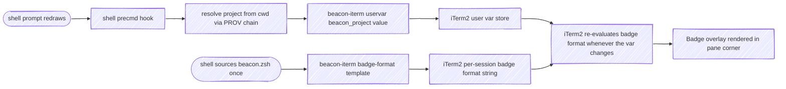
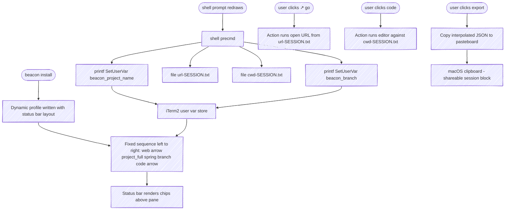

# beacon — Specification

At-a-glance session awareness across concurrent Claude Code sessions. Each session displays its identity (which project, what task), the phase it has declared itself in (`mode`, with an optional note), and what is happening right now (`activity`) on surfaces the user can scan without focusing.

beacon surfaces that state two ways:

- a **terminal-agnostic sessions view** (§3.8) — `wip` / `watch` / `serve` read every session's state and render it as a snapshot, a live TTY view, or a localhost HTTP feed for an external dashboard. A session row in that dashboard can be clicked to focus its window (§3.9). The sessions view paints no per-pane surface, so it works in any terminal with Python 3.
- an **iTerm2 per-pane render adapter** (§4) — paints a single session's state onto its own pane (tab label and color, status bar, mode backgrounds, and an opt-in badge) so the user can scan many panes without focusing each.

This document specifies requirements in [EARS](https://alistairmavin.com/ears/) form. §3 is render-agnostic and applies to any adapter; §4 collects the iTerm2-specific implementation (macOS, zsh).

---

## 1. Concepts

### 1.1 Session

A single Claude Code instance running in a terminal window or pane. Sessions are independent and may number in the dozens concurrently. Session identity must persist across the lifetime of the terminal session (not just one Claude turn).

### 1.2 Signals

Four fields together describe a session. They are orthogonal — each varies independently of the others — and they differ in **who writes them**, which is what a consumer needs to know to read one correctly.

| Field | Cardinality | Written by | Answers |
|---|---|---|---|
| `project` | 1 | Resolved (PROV-01), overridable | *Which codebase* is this session in |
| `task` | 0..1 | Resolved (PROV-02), overridable | *What unit of work* is it on |
| `mode` | 1, default `dev` (+ a note) | **Declared** by a user or skill | *What phase* has it declared itself in |
| `activity` | 1, default `idle` | **Observed** by hooks | *What is happening right now* |

Read that column before reading a value. `mode` is a claim the session makes about itself and persists until it is left; `activity` is a fact the hooks report and is rewritten several times a turn; `task` is a durable headline that may be an override, a PR title, or merely the branch name (which is why every resolved signal reports its provider, RES-02).

`mode` and `activity` were one `status` field until 2.5.0, merged by a provider chain that ranked the declared value above the observed one. The declared value therefore *discarded* the observed one, so a session in `release`, `retro`, or `done` could not report that it was blocked on the user — suppressing the one signal whose whole purpose is to interrupt. They are now separate fields with no chain between them (RES-06).

`branch` appears alongside these in the export surfaces but is **not** a signal: it comes straight from git, and an empty value means "on the repo's default branch", not "unknown" and not "detached".

A mode's **note** is not a fifth field. It is an argument of the mode, stored with it and cleared with it (STATE-02): only entering a mode writes either, and leaving one drops both. Recall context for the sessions view is `latest_turn`'s job (WIP-11), which is derived from the transcript and needs no cooperation.

### 1.3 Mode and activity values

**`activity` = what's happening right now.** Hook-driven, and the only writer. Default `idle`.

| Value | Meaning | Written by |
|:---|:---|:---|
| `idle` | Not actively engaged (turn just ended, just opened, freshly resumed) | Default; Hook Stop (turn finished, calm) |
| `working` | Claude is processing a turn | Hook UserPromptSubmit; Hook PreToolUse / PostToolUse (any tool) |
| `waiting` | Something is blocked on the user (a permission ask, an MCP elicitation, an unanswered prompt — highest user-attention priority) | Hook PermissionRequest (HOOK-03e); Hook Notification, attention kinds (HOOK-03) |

Activity has no declared tier: it cannot be set by hand. A pinned activity outranks the hooks and goes stale the moment the session moves on, which is what it did in practice — every pinned activity found in live state was contradicting the hooks beneath it, painting tabs `working` for months while the sessions were in fact blocked on the user.

**`mode` = what phase the session has declared itself in.** Set by a user or a skill; persists until left. Absent = `dev`, the default cycle.

| Value | Meaning | Declared by | Leaves on |
|:---|:---|:---|:---|
| `dev` | Everyday development — no declaration | (the absence of a mode) | — |
| `pause` | User has parked the session | `/beacon:pause` (CMD-25), `beacon pause`, `beacon status pause` | the next prompt (STATE-04) |
| `release` | A release / ship-it flow is in progress | `beacon release` or `beacon status release` | `resume` / `status dev` / session end |
| `retro` | A post-work follow-up / retro phase | `beacon retro` or `beacon status retro` | `resume` / `status dev` / session end |
| `done` | Session is complete and ready to hand off | `beacon done` or `beacon status done` | `resume` / `status dev` / session end |

Every mode owns a dedicated dynamic profile for its pane background (RENDER-05) and a glyph for its tab (TITLE-06). `pause` is a user halt; `release` marks a ship-it flow (the one *active* mode); `retro` is a deliberate closing-out phase; `done` is the terminal "this session is finished" signal a closing-out skill reaches for instead of `pause`.

Each mode accepts an optional note: `beacon pause "waiting for the VPN"`. The note surfaces in the Claude Code status line (STATUSLINE-01) and the sessions view (§3.8); it is never painted on the pane, where there is no room for prose.

### 1.4 Render target

A surface where signal state becomes visible. Two ship today: the render-agnostic sessions view (§3.8), which reads across all sessions and works in any terminal, and the iTerm2 per-pane adapter (§4), which paints one session's state onto its own pane. Render targets are pluggable — other plausible per-pane adapters: tmux status line, menubar app, Stream Deck, kitty.

### 1.5 Render collaborators

Three components write to iTerm2:

- **CLI** (`beacon-iterm`) — a stateless executable that translates simple commands into iTerm2 control operations: escape sequences written to `/dev/tty` for the painted surfaces, and Apple Events for out-of-band actions like focusing a session. Knows nothing about signals, sessions, or projects. The only writer that touches iTerm2 directly.
- **Plugin** (`beacon`) — a Claude Code plugin reacting to hooks and slash commands. Resolves signals through a chain-of-responsibility engine, then invokes the CLI to surface results. Owns `mode` (with its note) and `activity`.
- **Shell integration** — a sourceable zsh snippet shipped with the plugin. Owns `project` and `branch`, refreshed on every prompt. Calls the CLI directly to publish user vars; never goes through the plugin.

The plugin and shell write to disjoint user-var slots, so neither overwrites the other. The badge format (set once on the iTerm2 profile) consumes the relevant slots and re-evaluates whenever any var changes.

### 1.6 Provider

A function that attempts to derive a signal value from some source (file, environment, command output, user override). Each signal is resolved by walking a list of providers in priority order.

### 1.7 Chain of responsibility

For each signal, a list of named providers is consulted in order. The first provider that returns a non-empty value wins. The provenance (which provider supplied the value) is recorded for debugging.

---

## 2. Deliverables

beacon ships as three discrete deliverables. Section 3 organizes requirements around them.

| ID  | Deliverable | Form | Owns |
|:---|:---|:---|:---|
| **D1** | This specification | `SPEC.md`, copied to `docs/spec.md` at docs-build time and served as `/spec` | Requirements, architecture, scope. |
| **D2** | `beacon-iterm` CLI | A standalone executable on `$PATH` | Translating subcommands into iTerm2 control operations — escape sequences for painted surfaces, Apple Events for out-of-band actions like focus. Stateless; no Claude awareness. |
| **D3** | `beacon` Claude Code plugin | A plugin tree (hooks, commands, ambient rules, scripts, shell snippet, profile installer) | Hook handlers, COR resolver, slash commands, ambient rules, shell integration, profile installation. Calls D2 for every iTerm2 surface change. |

**Boundary discipline.** D2 has no knowledge of D3. D3 ships its shell snippet, which calls D2. D2 can be used outside Claude Code entirely (e.g. from CI scripts, ad-hoc terminal tools) — that is the test of whether the seam is clean.

---

## 3. Functional Requirements (EARS) — target-agnostic

These requirements describe what beacon does conceptually. They would apply unchanged to a non-iTerm2 render-target adapter (e.g. a future `beacon-tmux` or `beacon-kitty`). The iTerm2-specific implementation details are factored into §4.

| Namespace | Slice                                                       |
|:---|:---|
| `RES`   | Signal resolution model |
| `PROV`  | Provider chains |
| `HOOK`  | Claude Code hook event handlers |
| `OVR`   | User overrides (`set` / `clear`) |
| `STATE` | Declared modes, pause / resume semantics |
| `CMD`   | Slash command surface |
| `WIP`   | Cross-session introspection / export |
| `DUMP`  | Full-fidelity state backup / restore |
| `WATCH` | Live sessions view |
| `COLOR` | Human-readable output coloring |
| `FOCUS` | Dashboard-driven session focus |
| `FORGET`| Dashboard-driven session forget (state delete) |
| `PERF`  | Session-scan performance objectives |

### 3.1 Signal resolution (RES)

**RES-01.** The plugin shall resolve each *chained* signal — `project`, `task`, `url`, `icon` — via a chain of providers, returning the first non-empty value.

**RES-02.** The plugin shall record the name of the provider that supplied each chained signal's value, and expose it wherever that value is exposed (CMD-01, CMD-15). A resolved value alone is ambiguous: `task` can be byte-identical to `branch` because the branch name is the chain's third tier (PROV-02), so a consumer rendering both needs the provider to tell a deliberate label from a fallback.

**RES-03 — retired.** When no provider returned a value for `status`, the plugin used `idle`. `status` no longer exists; `activity`'s default is stated in RES-06, and `mode`'s is the absence of a mode.

**RES-04.** When no provider returns a value for `task`, the plugin shall treat task as absent (omit from displays, and emit `null` rather than `""` in the export surfaces).

**RES-05.** When no provider returns a value for `project`, the plugin shall use a non-empty placeholder so downstream rendering does not fail.

**RES-06.** The plugin shall resolve `mode` and `activity` **independently**, with no chain and no precedence between them. Each has exactly one writer — `mode` is declared, `activity` is observed — so neither has a tier to be outranked by. Absent state resolves to `dev` and `idle` respectively, and a stored value this version does not recognize resolves the same way as absent, so a name retired by a rename does not have to be migrated. Rationale: a single field merged by priority meant the declared value won and the observed one was thrown away, making `release · waiting` unrepresentable — a session could be shipping, or blocked on the user, but not both. It also forced every per-axis rule to name a value of the union: STATE-04 and STATE-12 each keyed on a single value of the merged field to say something about the mode axis alone, and now key on `mode` directly.

**RES-07.** A mode's note shall be stored as one value with the mode, not beside it. Entering a mode is the only thing that writes either, and leaving a mode drops both. Rationale: a note that can outlive the mode it annotates is a note that goes stale invisibly, and separate storage put the burden of clearing it on every mode setter, `clear`, `resume`, and the fresh-start wipe — six places that each had to remember.

### 3.2 Provider chains (PROV)

**PROV-01.** For `project`, the plugin shall consult providers in this order: user override, package manifest (`package.json` `name`, `Cargo.toml` `[package].name`, `pyproject.toml` `[project].name`), git remote origin (repo basename — the last path segment of the remote URL), project root directory name. The badge wants a short, scannable label; the owner-bearing identity is exposed separately via the `project_full` status-bar chip. See PROV-06 for the final pwd fallback when none of these provide a value.

**PROV-02.** For `task`, the plugin shall consult providers in this order: user override, GitHub PR title (`gh pr view`), git branch name (when not in `{main, master, develop, trunk, HEAD}`), Claude Code's auto-generated `ai-title` (PROV-09). A Claude Code `/rename` (the `custom-title` signal, PROV-09) is *not* a distinct tier: it is shorthand for setting the task, so the harvest folds a changed `custom-title` into the `task` override (PROV-09), where it competes on equal footing with `beacon set task` — the most recent of the two wins, rather than `/rename` sitting permanently above or below the agent's label. `ai-title` is the weakest fallback — a machine guess used only when nothing stronger (not even a branch name) is available, so a session that never labels itself still carries a readable headline.

**PROV-09.** The plugin shall harvest three Claude Code session signals from the session transcript, which records each as a dedicated JSONL record: `/color` (`agent-color`), `/rename` (`custom-title`), and the auto-generated `ai-title`. Claude Code fires no hook for these slash commands, so the plugin reads the transcript tail (the same transport as WIP-11 / HOOK-03c) on every hook that carries a `transcript_path`, persisting the latest value of each as per-session state (`cc.agent_color`, `cc.custom_title`, `cc.ai_title`). A value scrolls out of the bounded tail window once set early in a long session, so a record type absent from the tail leaves its prior persisted value in place rather than blanking a still-current signal (mirrors WIP-11). When the harvested `custom-title` differs from the prior persisted value — i.e. the user issued a new `/rename` — the plugin shall also write it into the `task` override, so `/rename` behaves as shorthand for `beacon set task` (PROV-02); comparing against the prior value keeps the fold idempotent, so a later `beacon set task` is not clobbered back on the next harvest (the `custom-title` is then unchanged) and a `custom-title` absent from the tail neither blanks nor re-applies a still-current label. `ai-title` feeds the `task` chain (PROV-02) directly as the weakest tier; `agent-color` is sessions-view metadata only (WIP-13) and is never painted — beacon's tab color is the activity traffic-light (BADGE-09), a closed contract the user's aesthetic color must not override. This is a soft dependency on a Claude-Code-internal format: if a record type disappears the signal goes quiet, never crashing a hook. A fresh-start wipe (HOOK-08a) and disengagement (HOOK-09) both clear the harvested signals so a reused pane does not inherit a prior tenant's title or color.

**PROV-02a.** When a Claude session's live subprocess cwd has wandered into a different project root than its SessionStart anchor (HOOK-08), the plugin shall surface the wandered project root's directory name as a **location** — resolved and carried separately from the task, since the two land on different lines of the tab — joined to the pinned home project by a ` @ ` separator (symmetric with the ` · ` task separator, so it reads "home @ where · what") as secondary spatial context. The task text after the location is the session's pinned label (an explicit task override — which now includes a folded `/rename`, PROV-02) when one is set; with no pinned label, the task chain (PR title → branch, PROV-02) is re-resolved at the wandered cwd so the marker carries what's happening there; with neither, the marker stands alone (the `ai-title` fallback is too weak to caption a wander and is skipped here). The project slot stays pinned to the anchor (BADGE-02); only the task slot reflects the drift, so the badge reads e.g. `beacon @ ai-sdlc · committing dashboard tweaks` (override) or `beacon @ ai-sdlc` (nothing to show there). On the two-line tab label (TITLE-05) the location shall join the **project on line 1** — `beacon @ ai-sdlc` — while line 2 keeps the task alone. The badge is opt-in (BADGE-15), so on a default install the tab is the only surface a wander has, and the marker was designed for the badge's single line: carried onto line 2 of a two-line surface, a leading ` @ where` has no antecedent, because the project it qualifies sits on the line above. The location rides its own user var (`beacon_location`, interpolated by `TITLE_FORMAT` after the project) rather than being appended to `beacon_project`, which the status-bar project chip reads as the bare project name (STATUS-BAR-02). This adds to the pinned identity rather than substituting for it, so BADGE-02 holds: line 1 still leads with the anchor's project. Gating is on the resolved project *root*, not the raw cwd: navigation within the anchored project (into a subdirectory) does not displace the branch task. A wander is only recognized when the live cwd resolves to a marker-bearing project root (a `.git` repo, etc.); a uniquified scratch directory the agent cd's into for ad-hoc work (e.g. a `mktemp` path under `/tmp` or `$TMPDIR`) carries no project marker and so never paints an `@marker`. A **linked git worktree** is likewise not a wander: it has a project root and a `.git` of its own, so a root comparison alone reads a sibling checkout as another project entirely, when it is the same project on another branch. The plugin shall therefore also compare the shared git dir (`git rev-parse --git-common-dir`, which every worktree of a repository reports identically) and treat matching repositories as home. The check is made only once the roots already differ, so the ordinary case pays for no git call. This matters most where the worktree name is tool-generated: an agent harness that cuts one per session names it with an opaque id, which the marker would then paint as the session's caption. The marker applies only while the session is actively working (the `busy` logical state); at rest — idle, blocked on a prompt, or paused — the task re-resolves from the anchor and the marker is dropped. This is what removes the marker once a session comes home: the returning turn's Stop renders at rest and clears it even if no working render fired at the home cwd, and a session that blocks or ends mid-wander never freezes a stale marker into its last-rendered snapshot (which is what the sessions view reads). Rationale: a session that cd's out of its home project is doing cross-project work; surfacing where it went, and what it's doing there, is live recall context, but the session's identity (the project it belongs to) is still the anchor, and a parked or finished session's resting identity is home.

**PROV-03 — retired.** `status` resolved through a chain of user override → hook signal → `idle`. That chain is what merged the two axes and let a declared mode discard observed activity; the fields now resolve independently and neither has more than one writer (RES-06).

**PROV-05.** When detecting project root, the plugin shall walk parent directories looking for any of `.git`, `package.json`, `Cargo.toml`, `pyproject.toml`, `go.mod`, `.hg`, `pom.xml`, `Gemfile`, stopping at `$HOME`. The first directory containing any marker (and within `$HOME`) is the project root.

**PROV-06.** When no provider in PROV-01's chain returns a value for `project` (no override, no package manifest, no git remote, no project root marker found within `$HOME`), the plugin shall use the abbreviated current working directory as a spatial-context fallback: `$HOME` substituted with `~`. Examples:

```text
/Users/cpeterson/src          →  ~/src
/Users/cpeterson              →  ~
/tmp                          →  /tmp
```

The fallback is not parenthesized — it appears as a real path so it reads naturally in the badge alongside actual project names. The PROV chain order is therefore: override → package manifest → git remote → project-root dir name → pwd fallback.

**PROV-07.** For `url` (the "best URL relevant to this session"), the plugin shall consult providers in this order, returning the first non-empty value:

1. **Announced URL** — the CR a sibling plugin announced during this session, recorded by the PostToolUse handler from a `codes.bridgeai.anchor/cr.created` or `codes.bridgeai.anchor/cr.updated` line in a tool's stdout (the suite's interop contract). Both keys, because a publisher announces one or the other per run and never both, so watching only the update would miss every freshly opened CR. The label prefers the announced `title` — what the forge probe two tiers down would have produced — and falls back to the `#<n>` derived from the URL, since an update reads its title back from the forge and can arrive with the field empty. Every announced value is stripped of control characters before it is stored: the label becomes OSC-8 link text (STATUSLINE-02), where a BEL would terminate the sequence and an ESC would begin another, and the value reached beacon from a forge. The title is additionally capped to what a terminal row can carry; the URI is not, since a nested group or a long repo name puts a legitimate forge URL past that cap and a shortened URL resolves elsewhere rather than reading shorter. Stored with the project root it was announced in and returned only when the resolving directory shares that root, because this chain resolves against a directory it is handed rather than against the session — `open-url <dir>` is correct in a pane beacon isn't tracking, and session-scoped state alone would answer for an unrelated checkout. This tier is the only one told the answer instead of working it out; it covers a CR a publisher touched while the session was running and nothing else, which is what every tier below it is still for
2. **Tack-derived URL** — the route tack announced for this session (WIP-02), asked for by name. There is no correlation step and no `$PATH` probe ahead of it: with no announced route there is no question to ask, which is what keeps the dependency optional. From that route, an inner chain of:
   a. The route's first `status: in_progress` tack's `deliverable.url`
   b. The route's most-recently-updated `status: done` tack's `deliverable.url`
   c. The first `link.url` on any tack
3. **Forge probe** — when the git remote is on a recognized forge and the matching CLI is on `$PATH`, query the forge for an open PR/MR whose source branch matches the current branch: `gh pr list --head <branch>` for github hosts, `glab mr list --source-branch <branch>` for gitlab hosts. Returns the first match. Probes are silent on missing tool, unrecognized host, or failure
4. **Branch URL** — derived from the git remote: `<remote>/tree/<branch>` for GitHub-like, `<remote>/-/tree/<branch>` for GitLab-like (only when not on a default branch)
5. **Project URL** — bare git remote URL (e.g. `https://git.example/acme/widgets`)
6. **Empty** — when none of the above produces a value

The integrations with `anchor`, `tack`, `gh`, and `glab` are *soft*: beacon detects each at runtime and uses it if present. There is no hard dependency, no shipped tool code in beacon. Step 1 asks nothing of anchor beyond the line anchor already prints, so an absent anchor simply never fills that tier. Replacing step 2 or step 3 with another provider (Linear, Jira, GitHub Issues, custom) has no supported hook: the shell-side override retired with BADGE-08 once the shell stopped resolving URLs. The `url` override retired in 2.5.0 along with OVR-05: no live session carried one across three months of state, and a pinned URL outranked every tier beneath it — including the open CR the session was actually on.

**PROV-08.** For `icon` (the project's favicon, surfaced in the sessions view to distinguish work streams visually), the plugin shall discover the project's icon on disk: the first existing file among the conventional locations under the project root (`docs/favicon.svg`, root `favicon.{svg,ico,png}`, the `public/` / `static/` / `app/` web roots, `icon.*` / `logo.*`), SVG preferred over raster. The discovered path is anchored at SessionStart (HOOK-08) so the sessions view's commands read a known path rather than re-walking the tree on every request. A project with no icon at a known path resolves to no icon. The icon is sessions-view enrichment surfaced through `wip` / `serve` (WIP-01, WIP-08); it is never painted on a pane — §4.1 lists the painted surfaces, and this is not one. The `icon <path|url>` override retired in 2.5.0 along with OVR-05: no live session carried one across three months of state, and the icon reaches only the dashboard, so an override existed for a surface the terminal never shows.

### 3.3 Hook handlers (HOOK)

**HOOK-01.** When the user submits a prompt, the plugin shall set `activity = working`. The write is unconditional: it used to be skipped whenever a mode was set, because the mode would have discarded it anyway, so a session that submitted a prompt while releasing reported itself idle.

**HOOK-02.** When Claude finishes a turn (Stop hook fires) and `stop_hook_active` is not set, the plugin shall set `activity = idle`. Rationale: a finished turn is calm, not user-blocking. Reserving `waiting` (red) for actual permission/idle prompts (HOOK-03) makes red high-signal — "this pane needs an answer right now" — so a glance at many panes distinguishes calm sessions from sessions truly blocked on the user.

**HOOK-03.** When Claude requests user attention (Notification hook, unmatched, whose payload names the kind in `notification_type`), the plugin shall set `activity = waiting`. The kinds that count as a request for attention are an explicit set: `permission_prompt`, `elicitation_dialog`, `elicitation_url_dialog`, and `idle_prompt`. Every one of them produces the same red `blocked` badge and no surface distinguishes them — the sticky marker (HOOK-03b) carries a constant rather than the kind. The kind is read in exactly two places, neither of which paints: this set decides whether the observation is recorded at all, and HOOK-03d decides the same for `idle_prompt` on a stood-down session.

A kind outside the set — `auth_success`, `agent_completed`, `push_notification`, `computer_use_enter` / `computer_use_exit`, the `quota_auto_resume_*` trio — reports something that already finished and shall change no state. The teammate kinds `worker_permission_prompt` and `agent_needs_input` are excluded for a different reason: they report that *another* session is blocked, where `activity` describes the pane the hook fires in (§1.3). That pane's own turn is still running, so red there would state something untrue about the session it is painted on. The set is an allowlist rather than a list of exclusions so that a kind Claude Code adds later paints nothing until beacon has decided what it means: red is the one color that claims the user's attention, and a session nobody is waiting on wearing it is what stops it meaning anything.

**HOOK-03a.** When any tool is about to run (PreToolUse) or has just returned (PostToolUse), the plugin shall set `activity = working`. This re-asserts working state mid-turn so the tab does not remain red for the rest of the turn while Claude is actively running tools and thinking. A declared mode does not suppress it: the two are separate fields (RES-06), so a releasing session that runs a tool reads as `release · working` — where previously the mode swallowed the write.

**HOOK-03b.** When Claude requests user attention (HOOK-03), the plugin shall set a sticky `pending-attention` marker. The marker survives subsequent PostToolUse `working` writes and shall be cleared when the next tool actually starts (PreToolUse), when the user submits a prompt (UserPromptSubmit), or when the turn ends (Stop). While the marker is set, the resolved color state shall be `blocked` regardless of `activity` (BADGE-09a). Rationale: hook delivery is not strictly ordered, so a late PostToolUse for an earlier tool may arrive after a fresh permission-prompt Notification for a new tool; without the sticky marker, the badge would briefly flip back to `busy` while the user is in fact still blocked.

**HOOK-08.** When a Claude session starts (SessionStart hook), the plugin shall capture the cwd Claude was invoked with as the session's **navigational anchor** and publish the full set of status-bar slots (`beacon_project`, `beacon_project_name`, the six `beacon_branch*` slots) plus the per-session `cwd-<pane-guid>.txt` handoff file (keyed on the pane GUID per §6.10 caveat 6) that the `↗ code` action button consumes, and persist the resolved URL as `resolved.url` / `resolved.url_label` for the status line (STATUSLINE-02). The plugin shall additionally record the resolved project name as `anchor.project` and the discovered project icon path (PROV-08) as `anchor.icon` per-session state. The anchor cwd is fixed at SessionStart and does not follow Claude's Bash subprocess cwd; chip *values* read from the anchor may evolve (see HOOK-08b). Two of SessionStart's `source` values fire without a new `claude` invocation — `compact` (context rebuilt in place) and `fork` (a new id for the conversation already in the pane) — and a hook payload's cwd is Claude's own live process cwd, which follows the agent's navigation. For those the plugin shall keep the anchor it already holds and refresh only the chips, as at Stop (HOOK-08b); a pane with no anchor yet takes the payload cwd whatever the source. Rationale: a session that compacts while the agent is working in a scratch directory it cd'd into would otherwise adopt that directory as its identity, which is the opposite of what the anchor is for. This duplicates the shell integration's prompt-driven publish path (§6.5); in interactive (non-Claude) shell sessions the shell continues to track the user's actual PWD as expected.

**HOOK-08a.** When SessionStart fires with `source` of `startup` or `clear` (the two values that begin a session), the plugin shall clear stale per-session signals before publishing the anchor — specifically `override.*`, the declared `mode` (with its note), `activity`, `pending-attention`, `latest_turn`, the harvested Claude Code signals (`cc.*`, PROV-09), the accumulated `deliverables` plus the `deliverables.dropped` record (STATUSLINE-03 / CMD-24, both scoped to one Claude session), and what a sibling announced (`announced.*` — tier 0 is the CR announced *during this session*, and the landed set is what this session shipped). It shall also stamp `session_started_at`, the window STATUSLINE-03 scopes acquisition to — the wipe empties the row and the stamp is what keeps acquisition from refilling it from the bound route's earlier work. Rationale: per-session state files key on the pane (the GUID of `ITERM_SESSION_ID`, §6.2), which outlives any single Claude session, so a fresh `claude` invocation or `/clear` in a pane that previously hosted a session ending mid-permission-prompt would otherwise inherit `activity = waiting` + `pending-attention` and render red. `resume`, `compact`, and `fork` are excluded: each continues a session already under way, so wiping there would drop the user's pinned label and the deliverables the session has accumulated.

**HOOK-08b.** On the Stop hook (end of each turn), the plugin shall re-resolve and republish the chip slots (`beacon_project_name`, the six `beacon_branch*` slots), the `cwd-<pane-guid>.txt` handoff file, and the persisted `resolved.url` / `resolved.url_label` from the anchor cwd. `beacon_project` and `beacon_task` are owned by the engagement renderer (BADGE-02 / BADGE-12) and are not touched. Rationale: turn-by-turn the agent may create a branch, switch branches, or sharpen the URL provider's answer (e.g. the user pins a tack deliverable mid-session) — these are narrowings of the session's identity, not subprocess drift, and the chips should reflect them. The shell's prompt-driven publish path (§6.5) cannot run while Claude holds the terminal; this hook covers the gap.

**HOOK-08c.** On the PostToolUse hook, when the tool was `Bash` and its command names a git subcommand that can move the branch — its name, its upstream, or its ahead/behind count — the plugin shall republish the six `beacon_branch*` slots alone, resolved from the anchor cwd (HOOK-08b's rule: the chip names the session's project, not a directory the agent stepped into). Rationale: HOOK-08b covers the branch once per turn, so a push made early in a long turn left the chip painting `↑1` for the rest of it, and the shell's prompt-driven path (§6.5) cannot run while Claude holds the pane. The slots are three local git reads, which is affordable per tool call — where HOOK-08b's full publish is not, since it also resolves the URL (git, possibly `gh`/`glab`) and reads the tack route (a `tack list` subprocess).

The gate is on the git subcommand rather than on the word `git`, because read-only git (`status`, `log`, `diff`) is most of what a session runs and refreshing on those spends three subprocesses to republish what is already painted. A command the gate misses costs only the wait the chip already had — HOOK-08b republishes at the end of the turn regardless — so the gate is deliberately narrow rather than exhaustive. A forge-side operation (`gh pr merge`) is **not** a trigger: it changes the forge, and the slots read local refs, which nothing moves until a fetch or pull that has its own trigger. Both publishers derive the slots from one classifier, so a mid-turn refresh cannot paint a state the end-of-turn publish then contradicts.

**HOOK-09.** When a Claude session ends (SessionEnd hook), the plugin shall disengage the pane (BADGE-14): blank the badge user vars, revert badge and tab color to default, swap the pane back to the base `beacon-dev` profile (RENDER-05, so a session that ends mid-mode does not keep its `pause` / `release` / `retro` / `done` background — the color-only revert cannot undo a profile background), hand the session name back to the interactive template (`\(user.beacon_title)`, TITLE-04 — blanking the badge user vars empties everything the managed name interpolates, so a name left on that template renders the tab label and OS window title *blank*, which is broken rather than unmanaged), and remove the engagement marker and the resolved snapshot, so an exited session leaves the pane looking unmanaged rather than carrying its last-painted color and text. The plugin shall skip disengagement for the `clear` and `resume` end reasons: `clear` is immediately followed by a fresh SessionStart (HOOK-08a) that re-engages the same pane, and `resume` suspends the session expecting its state to persist. Rationale: the badge marks a live session; once the session is gone the shell resumes ownership of the status bar (§6.5) but per BADGE-02 never writes `beacon_project` / `beacon_task` or the badge color, so without this hook the last Claude-painted badge persists indefinitely. SessionEnd is best-effort — it does not fire on a hard crash or `kill -9`; HOOK-03c and the next session's HOOK-08a wipe remain the backstops for state a missed SessionEnd would leave behind.

**HOOK-10.** At SessionStart the plugin shall emit its bundled ambient rules to the session — proactive upkeep guidance such as keeping the session's work label current — so a session carries beacon's sessions-view hygiene without any user setup. The rules are beacon's own bundled content emitted as session context; they add no per-pane surface (they are not part of the §4.1 anatomy) and need no cooperation beyond what the model already does. Rationale: the sessions view is only as useful as each session's label (WIP-01, WIP-11); emitting the upkeep rule at session start is what makes beacon useful standalone, without the user having to wire the guidance themselves.

**HOOK-11 — retired.** Tack's session-close skill firing — a `Skill` tool call naming `tack:end`, or the typed slash command — entered `handoff` mode. It retires with the mode it was the only automatic writer of (STATE-14). Closing a work session is what tack's own route record already states, and a beacon mode that lasted until the next prompt reported it for one turn on a surface tack does not own.

**HOOK-12.** When SessionStart fires with a session-beginning `source` (`startup`) on a pane that is already engaged (BADGE-14) and whose state records a *different* Claude session id, the plugin shall treat the arriving session as a **guest** of that pane: it shall key its state to a bucket of its own — seeded `claude-session:<id>`, the form a non-iTerm session already uses (§6.2) — record `guest_of` in that bucket so the guest's own later hooks resolve to it, and leave the host's anchor, signals, focus handle (FOCUS-02), engagement marker, and pane handoff files untouched. `clear` is excluded: there it is the incumbent restarting itself, and HOOK-09 skips disengagement for `clear`, so the marker is still down and the recorded id is still the old one — a guest's shape exactly. Rationale: state keys on the pane GUID (§6.2), which a `claude` spawned from inside a live session inherits through `ITERM_SESSION_ID`, so without this the guest's SessionStart wipes the host's signals (HOOK-08a) and repins the host's anchor onto wherever the guest was launched — and the host renders that as its own identity for the rest of its life, a session working in a repo reporting a scratch directory as its project. A pane whose session died without a SessionEnd keeps its engagement marker, so the next session started there reads as a guest and takes a bucket of its own; that costs one stale row until `prune`, where the reverse error costs a live session its identity. A guest still paints the pane it runs in — its OSC writes reach the same tty — so the host's next hook is what restores the surfaces.

**HOOK-13.** When a skill beacon subscribes to is invoked, the plugin shall enter the mode that skill's phase declares — currently `anchor:release` (and the bare `release`) entering `release` mode. The plugin shall resolve the invocation from **both** shapes it arrives in: the `Skill` tool call an agent invocation emits, read at PostToolUse from `tool_input.skill`, and the typed slash command, read at UserPromptSubmit from the head of the prompt's first line — Claude Code expands a typed skill's body straight into the prompt and emits no tool call at all. A command merely mentioned mid-prompt, and a longer name sharing a subscribed one's prefix, declare nothing. The reaction is skipped when the session already holds that mode, so a repeat cannot drop a note the user set with it (RES-07); it writes only the mode axis, leaving activity to the hooks (RES-06). Rationale: `release` is a phase a session visibly enters and its glyph is the mode's only cross-tab surface (TITLE-06), but entering it depended on the agent remembering the `keep-session-labeled` guidance (HOOK-10) mid-release. Subscribing to the invocation moves that from cooperation to observation, and it needs none from anchor, which carries no knowledge that beacon exists. This is the mechanism the retired HOOK-11 used, restored on a mode that persists until it is left rather than one auto-resume dropped a turn later; reading only the tool-call shape is what left that subscriber inert for every release a human typed.

**HOOK-01a.** When the user submits a prompt that begins with a fresh-start slash command (currently `/recipe`), the plugin shall apply the same wipe as HOOK-08a before processing the prompt's `activity = working` (HOOK-01). Rationale: in-session commands that re-bootstrap context are not surfaced to hooks as a SessionStart event, so without this, signals from the prior task would contaminate the new context. The set of fresh-start commands is a tunable list maintained alongside the hook handler.

**HOOK-03c.** When the resolved color state would be `blocked` because of `pending-attention` or `activity = waiting`, the plugin shall consult the session's transcript (path captured from any hook payload's `transcript_path`). If the most recent assistant message text matches an idle pattern (currently `^\s*ready\b`, case-insensitive), the plugin shall clear the stale markers and re-resolve. Rationale: HOOK-03b's natural clears (Stop / PreToolUse / UserPromptSubmit) are not always reachable — a session killed mid-permission-prompt leaves the markers behind with no hook firing to clear them. The transcript is the ground truth for whether Claude actually finished a turn; the heuristic forgives the missing Stop without requiring it. When the heuristic doesn't apply (no transcript, non-matching text), the user can fall back to `clear` (no field, OVR-04) for an unconditional reset to calm defaults.

**HOOK-03d.** When the notification kind is `idle_prompt` and the declared mode is stood down (STATE-15), the plugin shall write neither `activity = waiting` nor the `pending-attention` marker. Every other attention kind (HOOK-03) shall apply in every mode, stood down or not.

Rationale: a stood-down session sits at an idle prompt *by definition*, so the idle timer is guaranteed to fire on it — red would be the resting state of every parked tab rather than a signal, and it would report the one thing its user already knows, since they are the one who parked or finished it. Every other attention kind is the opposite: something is blocked on a decision the user has not made, which is exactly what red is for. That asymmetry, not the mode, is what selects the one exception.

This is **not** a precedence rule between the axes (RES-06). The mode does not outrank `activity`, and nothing consults the mode when mapping activity to a color; what is dropped is a single observation that carries no information, before it is ever recorded. `release` and `retro` are active phases, so an idle prompt in either is real news and still paints red.

The payload names the kind: `notification_type` is a required field on Claude Code's Notification hook input, present on every delivery. So one unmatched entry in `hooks/hooks.yml` (and its `hooks.json` projection) carries every kind to the handler, which reads the field. Matching on the kind in the wiring instead would hide from the handler every kind the wiring did not name — which is what left an MCP elicitation, a parked teammate worker, and a stalled message unpainted while the session sat blocked on the user.

**HOOK-03e.** When Claude Code raises a permission request (PermissionRequest hook, unmatched — every tool), the plugin shall apply HOOK-03 and HOOK-03b: `activity = waiting` plus the sticky `pending-attention` marker. It shall consult neither the tool name nor the declared mode, and shall emit nothing on stdout — PermissionRequest is a decision hook, and a body on that channel would start allowing and denying tool calls.

Rationale: HOOK-03's Notification does not accompany the prompt. Claude Code arms a timer when the ask opens and reports it only once the prompt has gone unanswered — measured at six seconds for a plan card and a question card alike — by which point HOOK-03a's PreToolUse has already written `working`. The tab therefore reads busy for the whole window a session is in fact blocked, which is the state a glance across panes most needs to see. PermissionRequest fires in-band with the ask and closes that window.

The two do not make each other redundant. The Notification is the only signal for `idle_prompt`, which no permission request precedes; PermissionRequest is the only one that arrives when the block does. Only asks reach this hook — a tool an allow rule covers is decided without one — so it does not repaint the tab on ordinary tool calls. HOOK-03d does not apply here: it drops an `idle_prompt` observation, and a permission request is the case it exempts in every mode.

### 3.4 User overrides (OVR)

**OVR-01.** When the user invokes `set <field> <value>`, the plugin shall persist the value as an override for that field. Valid fields: `project`, `task`.

An override exists only where a provider chain sits beneath it — that is what the tier is *for*, and what makes the `override.` prefix meaningful rather than decorative. The two state axes have one writer each and no chain (RES-06), so they take no override tier and are stored under their own bare names. `url` and `icon` had chains but retired their overrides in 2.5.0 (see PROV-07, PROV-08): no live session carried either across three months of state.

**OVR-02.** A user override shall always win over auto-detected values for the same signal.

**OVR-03.** When the user invokes `clear <field>`, the plugin shall remove only that field's override.

**OVR-04.** When the user invokes `clear` with no field, the plugin shall remove all overrides for the session, leave any declared mode (dropping its note with it, RES-07), and drop sticky red markers (`pending-attention`, and `activity` if equal to `waiting`). Rationale: `clear` is the user saying "return this pane to calm defaults"; a declared mode, pending-attention, and a stuck `waiting` all belong in that set of transient state to wipe. Leaving them would keep the tab red on a session the user has just told us is calm. If the session is genuinely blocked, the next Notification re-asserts both. `clear <field>` remains overrides-only.

**OVR-05 — retired.** The `icon <path|url>` override was a dedicated command outside the `set <field>` set. No live session carried one across three months of state, and the icon reaches only the dashboard (PROV-08) — never a terminal surface — so the override let a user pin a value they could not see. Auto-discovery is unchanged.

### 3.5 Declared modes (STATE)

Pause is not a separate concept; it is one of the modes a session can declare, alongside `release`, `retro`, and `done` — with `dev`, the absence of a mode, as the default. Every mode owns a dedicated profile (RENDER-05) and a tab glyph (TITLE-06), and accepts an optional note stored with it (RES-07). Activity is not settable here: it is the hooks' to report (RES-06). Skill plan/review signaling is gone with stage (see §3.6).

**STATE-01.** When the user invokes `status <mode> [<note>]`, the plugin shall persist `<mode>` and its `<note>` as one value. `<mode>` must be one of `dev`, `pause`, `release`, `retro`, `done`. `dev` leaves the current mode, storing nothing — the absence of a mode is its only representation on disk, so "no mode" has exactly one form for a reader to recognize.

An activity value (`idle` / `working` / `waiting`) shall be **rejected** with an error naming the modes. Rationale: the verb accepted all eight values while the two axes shared a field, and pinning an activity above the hooks is what produced the failure this split removes — a declared value outranking the observed one indefinitely. Live state carried thirteen such pins, most 77–90 days old, and eight of them contradicted the live hook signal: tabs painted `working` while the sessions beneath were blocked on the user.

**STATE-02.** The plugin shall persist a mode's note as part of the mode (RES-07) and expose it in the cross-session export (WIP-01) so the sessions view and dashboard can surface it. The note shall not write a `task` override; the task slot keeps whatever it had. Rationale: a note is typically a sentence or longer, and reusing it as the task signal overflows the tab. The note surfaces in the Claude Code status line (STATUSLINE-01) and the sessions view; it is never painted on the pane.

The note is **not** general session recall context, and STATE-02 no longer claims it is. That role belongs to `latest_turn` (WIP-11), which is derived from the transcript with no agent cooperation and covers most sessions where the note covered a handful — and every note observed in live state was a mode's own annotation, never a free-standing recall aid.

**STATE-03 — retired.** Setting `status paused` snapshotted the resolved project and task into overrides so the identity held still while the session was parked, and STATE-05 then *preserved* them through auto-resume. One pause therefore pinned a session's identity permanently, above every provider (OVR-02). Live state showed the cost: tasks pinned to branch names the session had long since left, and project labels a version and a half stale, all indistinguishable from labels a user chose. The stability it bought is already provided by the last-rendered snapshot the sessions view reads (WIP-01) — a record that cannot outrank a live provider.

**STATE-04.** When the user submits a prompt and the declared mode is `pause`, the plugin shall leave that mode (dropping its note with it) before processing the prompt's activity write. `release`, `retro`, and `done` are not auto-left — they are deliberate declarations the user expects to persist until explicitly ended. Rationale: pause means "I'm stepping away", and a returning prompt is the natural resume signal for that and nothing else.

**STATE-04a — retired.** A prompt whose leading text matched a pause-intent pattern (`brb`, `stepping away`, `break 'til 4`, …) applied the full pause flow with the prompt as its note. Across three months of live state it authored **zero** of the notes on disk — every one came from an explicit `pause` / `release` / `retro` / `done`. Its two headline triggers had also come to mean the opposite thing: an agent instructed to keep working unattended while the user steps away would have its pane parked, marked `⏸`, and exempted from the sessions view's activity window (WIP-03) at exactly the moment it was working hardest with nobody watching.

**STATE-05 — retired.** Auto-resume preserved the `project` and `task` overrides STATE-03 froze. Preserving them is what turned a pause-scoped snapshot into a permanent pin; with STATE-03 gone there is nothing to preserve.

**STATE-06.** When the user invokes `resume`, the plugin shall remove all overrides and leave any declared mode. Activity is untouched — it belongs to the hooks, and the next hook restates it.

**STATE-07.** `pause [<note>]` shall be a synonym for `status pause [<note>]`. `resume` (STATE-06) is the natural inverse for both surfaces.

**STATE-08.** `retro [<note>]` shall be a synonym for `status retro [<note>]` — the entry point a session or skill uses to declare a post-work follow-up / retro phase (RENDER-05). Unlike `pause` it shall not auto-resume on the next prompt (STATE-04 covers only `pause`); it persists until `status dev` / `resume` (STATE-06) or session end. The optional note rides the mode (STATE-02) and surfaces in the status line and the sessions view.

**STATE-09.** `done [<note>]` shall be a synonym for `status done [<note>]` — the entry point a session or skill uses to declare the session complete and ready to hand off to another (RENDER-05); it is the terminal counterpart to `retro` that a closing-out skill reaches for instead of `pause`. Its lifecycle matches `retro` (STATE-08). Additionally, per STATE-12, `done` suppresses the task slot.

**STATE-10.** `pause` shall accept a `--clear-screen` flag that, after applying the pause (STATE-07 / STATE-01), additionally clears the session's terminal screen **and** scrollback — the Cmd+K / "Clear Buffer" equivalent — for a clean stand-down (e.g. the retro launcher parking a spent session). The clear is a terminal-control operation the iTerm2 adapter owns (a `clear-screen` CLI subcommand emitting `CSI H` + `CSI 2J` + `CSI 3J` straight to the controlling tty), so it reaches the pane even when the caller's stdout is captured — the constraint that stops a Claude agent from clearing its own buffer. It shall degrade gracefully: outside iTerm2, or when no tty is reachable, the clear is skipped and the pause still applies (no error). The flag is `pause`-only and does not touch the `clear` subcommand's meaning (which clears overrides, OVR-03), nor the badge/scrollback of any other session.

**STATE-11.** `release [<note>]` shall be a synonym for `status release [<note>]` — the entry point a session or skill uses to declare a release / ship-it flow in progress (RENDER-05). Its lifecycle matches `retro` (STATE-08).

**STATE-12.** While the declared mode is `done`, the plugin shall suppress the `task` slot — the tab and sessions view show no task — while leaving `project` resolved as usual (BADGE-02). Where the mode carries a note, line 2 of the tab shows that note in the slot this rule empties (TITLE-05a); the task suppression itself is unchanged, and a `done` session with no note shows its project alone. The suppression is presentation-only and reversible: it is applied at resolve time from `mode`, not by deleting any `task` override, so leaving the mode restores the prior task. Rationale: a session that has declared itself complete has no active task to caption; dropping the task while keeping the project reads as "this project's work here is finished." This is one of the three rules that had to name a value of the merged field to say something about one axis; it now keys on `mode` directly (RES-06).

**STATE-13.** The **mode name** is the vocabulary the CLI, slash commands, sessions view, tab glyphs, and dynamic profiles all speak — one name per SDLC phase a session moves through (§1.3), each with a profile named for it (`beacon-dev` for the default cycle, `beacon-pause` / `beacon-release` / `beacon-retro` / `beacon-done` for the modes, RENDER-05 / §6.6). Call sites never name an iTerm profile or a hex directly: every mode's profile, watermark and glyph live together in `MODE_SPECS`, whose keys are the mode list itself, so a background, a watermark, or a glyph is retuned in one place and a mode cannot be half-declared.

**STATE-14 — retired.** `handoff` marked a session mid-transition to another tool, skill, or session. The distance between it and `done` was a single turn of auto-resume, and the phase it named — a work session closing out — is what `done` already says and what the route tracker records durably. It leaves the mode vocabulary at the four phases a session visibly moves through, plus `dev`.

**STATE-15.** Each mode shall declare whether it means the session is **stood down** — at a halt — rather than in an **active phase**, as a `stood_down` attribute on its `MODE_SPECS` entry: true for `pause` and `done`, absent for `release` and `retro`.

The attribute lives on the canonical table for the same reason the glyph and the profile do: no call site shall name the stood-down modes by hand, so a mode added later answers the question for itself instead of being forgotten at each reader. Two behaviors read it — the note on line 2 (TITLE-05a) and the dropped idle prompt (HOOK-03d) — and they arrived at the same two modes from unrelated directions, which is what makes this one attribute rather than two coincidences. `pause` is a user halt and `done` is a completed session; both describe a session nothing is expected of. `release` and `retro` describe work in progress in a particular phase.

### 3.6 Skill responsibilities (SKILL)

**SKILL-01, SKILL-02, SKILL-03 — retired.** The plugin ships no skill. The two conventions the skill carried — don't set what the hooks own, and don't narrate a beacon invocation — are stated in the `keep-session-labeled` ambient rule (HOOK-10), which is in context from SessionStart rather than waiting on a skill the model had to decide to load. The freshness check (SKILL-03) was already the hook's job: `hooks/cli-freshness.sh` runs it at SessionStart on every session (CMD-13, Architecture Rule 11), where the skill's version ran at most once and only if invoked.

### 3.7 Slash command (CMD)

**CMD-01.** When the user invokes `show`, the plugin shall display each chained signal's current value with the provider that supplied it (RES-02), the declared mode and its note when one is set, and the current activity. The two state axes carry no provider: one writer each means there is no tier to name (RES-06).

**CMD-02.** When the user invokes `set <field> <value>`, the plugin shall apply OVR-01 and re-render.

**CMD-03.** When the user invokes `clear [<field>]`, the plugin shall apply OVR-03 or OVR-04 and re-render.

**CMD-04.** When the user invokes `status <mode> [<note>]`, the plugin shall apply STATE-01 and re-render. `pause` / `retro` / `release` / `done` `[<note>]` are synonyms for `status <that mode> [<note>]` per STATE-07 / -08 / -11 / -09; `status dev` leaves whatever mode is set.

**CMD-05.** When the user invokes `resume`, the plugin shall apply STATE-06 and re-render.

**CMD-06.** When the user invokes `reset`, the plugin shall remove all per-session state and clear all render-adapter surfaces.

**CMD-07.** When the user invokes `render`, the plugin shall force a re-render with the current resolved state without changing any state.

**CMD-08.** When the user invokes `install [--dir <path>]`, the plugin shall perform the terminal-agnostic bootstrap steps (CLI wrapper on `$PATH` — in `<path>`, default `~/.local/bin` — tab completion, and the Claude Code status line), then write the beacon dynamic profiles (STATUS-BAR-01 / RENDER-05), printing one line per step. Every step is idempotent, so re-running `install` is the supported way to recover from drift. iTerm2 reloads its `DynamicProfiles` directory without a restart, so every *beacon-owned* step completes in place. It shall close by running the read-only layout audit (CLI-18), printing the table so each drifted setting and its reason are on screen, and then — when anything differs — invoking `configure --write` to apply them, with that command's own per-setting and pre-quit confirmations intact. The app-wide Appearance settings are the one part of the recommended layout no dynamic profile can carry, so leaving them as advice left them drifted: the step read as *nothing left to do*, beneath a report saying otherwise. Declining is a complete answer — the beacon-owned steps have already landed — and a non-zero exit from the write (no tty to confirm on, or a declined prompt) shall not fail the install, which shall then close by naming `layout --write` (CMD-28). When no render adapter is applicable — iTerm2 absent (not macOS, or iTerm.app not installed) — the plugin shall perform only the terminal-agnostic steps and point the user at the sessions view (`wip` / `watch` / `serve`). `install` shall not start the serve service (WIP-07) — it is opt-in — but shall point the user at it.

**CMD-09.** When the user invokes `completions zsh`, the plugin shall install a tab-completion script such that `beacon <TAB>` works in a fresh zsh session. With `--print`, the plugin shall print the script to stdout instead of installing. Install location and `fpath` plumbing are implementation details (see §6.5).

**CMD-13.** The wrapper `install` writes (CMD-08) shall be an executable named `beacon` in `<path>` (default `~/.local/bin`) that execs the source script at `${PLUGIN_ROOT}/scripts/beacon`. The wrapper hardcodes its target path at install time and does not auto-refresh on plugin upgrade — drift is detected by the SessionStart freshness hook (Architecture Rule 11), which compares `beacon --version` against `plugin.json#version`. `install` shall also install zsh completions (CMD-09) so users never need a second command for tab completion to work. When the target directory is not on `$PATH`, the plugin shall print a warning.

The `install-cli` subcommand this requirement once named is **retired**. It ran exactly `install`'s first two steps, and it was the one the drift nudge pointed at — which made it the wrong answer to the situation it was reached for: the `.zshrc` `source` line is version-pinned the same way the wrapper is, and only `install` rewrites it, so refreshing the wrapper alone left the shell integration on the previous version. `--dir` moved to `install` (CMD-08); `completions` remains separately invocable (CMD-09) for a user who wants only that.

**CMD-14.** When the user invokes `copy-url`, the plugin shall copy the resolved `url` signal to the system clipboard. When invoked as `open-url [<dir>]`, the plugin shall open the session's web view for `<dir>` (default: the invoking cwd) per STATUS-BAR-08 — the `web` button's configured `cmd` when set, else the PROV-07 resolution opened in the default browser. Both resolve against a directory rather than reading persisted state, so they are correct from any shell and in any pane. `open-url` additionally backs the `↖ web` status-bar button.

**CMD-16 — retired.** The branch-review subcommand (`beacon review`) and its `⇄ review` status-bar chip are removed in 2.0; see STATUS-BAR-02.

**CMD-15.** When the user invokes `json`, the plugin shall print the resolved state as a single JSON object on stdout, for consumers that need the full state without parsing the human-readable `show` output. The payload shall carry every resolved signal with the provider that supplied it (RES-02), both state axes, and the mode's note:

```json
{
  "project": "beacon",   "project_provider": "git-remote",
  "task": "split status into mode and activity",
  "task_provider": "override",
  "mode": { "name": "release", "note": "cutting v2.5" },
  "activity": "waiting",
  "branch": "split-status-into-mode-and-activity",
  "url": "https://github.com/chris-peterson/beacon/issues/38",
  "cwd": "~/src/github/chris-peterson/beacon",
  "claude_session": "9dfd2c69-…"
}
```

`task` is `null`, not `""`, when no provider returned one (RES-04), and `task_provider` is then `null` too. `mode` is a nested object because a mode and its note are one value with one writer (RES-07) — a consumer cannot reach the note without the mode it annotates. WIP-01's session records carry it in the same shape, so the two payloads never disagree about a value they both describe. Neither state axis carries a provider key.

`task_provider` is the load-bearing half for a consumer rendering `task` and `branch` together: the branch name is the task chain's third tier (PROV-02), so the two keys are routinely byte-identical, and only the provider distinguishes a label the user or agent chose from a fallback worth suppressing.

**2.5.0 removed `status` and `description`** from this payload with no aliases. A `status` alias would have had to merge `mode` and `activity` back into one field — reproducing, for every consumer that read it, the exact defect RES-06 exists to remove.

**CMD-17.** When the `beacon` CLI is invoked with no subcommand, it shall print the usage text to stderr and exit non-zero. When invoked as `beacon --help` / `-h` / `help`, it shall print the usage text to stdout and exit zero.

**CMD-18 — retired.** The `/beacon:session-mode <mode> [<note>]` command is removed. It survived on one clause — that it stay model-invocable, so a skill owning a phase could enter the matching mode itself — and that caller never materialized: a skill runs `beacon release` in a single shell call, where a slash command spends a whole model turn reaching the same subcommand. The skills that actually drive mode transitions were written against the CLI from the start.

The collision it was built to resolve stays resolved, and more simply than before: `release` and `retro` are load-bearing verbs elsewhere in the surrounding tooling — a bare `/release` or `/retro` is ambiguous between beacon's mode setter and the skill of the same name, and beacon's convenience wrapper was the interloper. With no mode command at all, there is nothing left to collide. `pause` keeps a command of its own (CMD-25) because it is the one a *user* reaches for by hand.

**CMD-19, CMD-20, CMD-22 — retired.** The per-mode `/beacon:retro`, `/beacon:done`, and `/beacon:release` commands folded into CMD-18, which is itself now retired — the modes are reached through the CLI.

**CMD-21.** When the user invokes `data-dir`, the plugin shall print the resolved `<DATA_DIR>` path on stdout. This is an internal contract for locating the per-session handoff files from a context that gets no `${CLAUDE_PLUGIN_DATA}`. The shell integration reads the same value through `shell-init` (CMD-27), which answers it alongside the rest of its source-time state in one process.

**CMD-23.** When the user invokes `refresh-iterm-profiles`, the plugin shall re-render the base and mode dynamic profiles (STATUS-BAR-01) from the template and the current user config, and nothing else — no wrapper, no completions, no shell integration, no app-wide layout advisory. This is the apply path for a changed button label (STATUS-BAR-09): iTerm2 reloads the `DynamicProfiles` directory on change, so the re-render reaches every open pane without a restart. Off iTerm2 the subcommand shall exit non-zero saying so, rather than writing a profile nothing will load.

The rendered profile embeds paths — the plugin script behind each action shell, the absolute interpreter, the mode watermark images — so profile content is **plugin-root relative**. The upgrade path is therefore CMD-26, not this subcommand: run through a stale wrapper it would bake the previous version's root into the buttons. What it *is* for is the staleness a version bump can't explain: a `statusbar.buttons.<name>.label` edit (the only one a user initiates), an interpreter that moved out from under the baked absolute path, and reclaiming a profile edited in iTerm2's GUI — which is also why the render never short-circuits on matching content, since iTerm2 re-serializes dynamic profiles back to disk with such edits folded in.

It is never a first-install step: `install` (CMD-08) writes the profiles itself, through the same renderer, so a fresh install has them already and this subcommand only ever re-applies. It keeps a separate subcommand rather than folding into `install` because it fully does its own job — a label lives nowhere but the profile — and because its footprint is `DynamicProfiles/` alone, where `install` also rewrites `.zshrc` and the `$PATH` wrapper to whatever root it ran from. It is deliberately not named `install-*`: that prefix means the bootstrap (CMD-08, CMD-26).

**CMD-24.** When the user invokes `drop <ref>`, the plugin shall remove the matching deliverable from the session's row (STATUSLINE-03) and record its URL in `deliverables.dropped` so acquisition does not re-record it. `<ref>` matches an entry's stored ref (`#42`), its rendered qualified form (`otherproj:#9` — what the row put in front of the user), or its URL. When nothing matches, the plugin shall say so on stderr and exit non-zero.

Acquisition cannot tell a deliverable the session is working from one it merely crossed — a URL pasted as a reference is indistinguishable from one being worked — and the list is capped, so noise left in place evicts real work. The removal has to be remembered rather than merely applied: the bound route is re-read on every publish, and a forgotten drop would put the entry back on the next turn. Both the list and the drop record are session-scoped and cleared by the fresh-start wipe (HOOK-08a).

Whether recording should be gated behind config — an opt-out for sessions that cross many references — is deliberately left open; the intent is on by default, and living with it answers the question better than guessing at it.

**CMD-25.** The plugin shall provide a `/beacon:pause [<note>]` slash command that parks the session — a thin shim onto the CLI's `pause` subcommand (CMD-04 / STATE-07), carrying no behavior of its own. It shall instruct the model to do no reasoning beyond running the command and confirming in one line; the pane repaint is immediate because the CLI renders synchronously.

`pause` is the only mode with a command because it is the only one a *user* reaches for by hand, mid-session, on the way out of the chair. The rest are entered by a skill that owns a phase — a release flow, a retro, a stand-down — and a skill reaches the CLI directly in one shell call. So the command shall be **user-invocable only**: a model-facing door here would duplicate `beacon pause` at the cost of a model turn.

It shall **not** pin a `model:` override. A cheaper model runs on a different model than the session, whose prompt cache cannot be reused, forcing a cold prefill of the entire initial context — slower than the one-line reply costs on the session model. The latency of a slash command is prefill, not generation, so keeping the turn on the session model (warm cache) is what makes it fast. For a truly instant, no-model-turn park, `beacon pause` is the path.

**CMD-26.** The plugin shall provide a `/beacon:install-beacon [--dir <path>]` slash command that runs `install` (CMD-08) from `${CLAUDE_PLUGIN_ROOT}`, and shall be **user-invocable only**. It exists because it is the only door to the *newly installed* plugin root: the wrapper on `$PATH` and the `.zshrc` `source` line both hardcode a version-pinned path, so `beacon install` run through a stale wrapper re-points both at the version it already names. The SessionStart freshness hook (Architecture Rule 11) names this command for that reason, and says so.

The name carries the plugin rather than reading `/beacon:install` because a bare, un-namespaced `/install` is what the user actually types, and every sibling plugin with a `$PATH` wrapper needs the same door — four of them collide on that one word. `install-<plugin>` is unique bare, and unlike `install-<plugin>-cli` it neither stutters against the namespace nor claims the step is CLI-only, which for beacon it is not (CMD-08 writes the status line, the shell source line, and the dynamic profiles too).

**CMD-27.** When the user invokes `shell-init`, the plugin shall print the source-time values `shell/beacon.zsh` needs — the resolved `<DATA_DIR>`, the badge gate (BADGE-15), and whether a user config existed when the block was built — as a shell-quoted, zsh-sourceable block on stdout.

Sourcing the shell integration asked for these one subcommand at a time, and each answer cost a python interpreter startup in every new terminal. One subcommand pays that startup once, and the shell caches the block on disk, regenerating it only when the plugin script, the recorded data-dir pointer, or the user config is newer than the cache — so the steady state spawns nothing. The cache is keyed by plugin root: a marketplace install and a working tree resolve different data dirs, and one shared file would hand an install the other's answer. The config-presence flag is what an mtime test cannot supply — a *deleted* config leaves nothing newer than the cache, so without it the shell would keep the settings that file used to carry.

**CMD-28.** When the user invokes `layout [--write] [--yes] [--keys <csv>]`, the plugin shall run the CLI's layout audit (CLI-18) with those flags, passing its stdio through — `--write` confirms each setting on the tty — and exit with its status, so the audit's non-zero drift exit is the plugin's too. Off iTerm2 the subcommand shall exit non-zero saying so.

`beacon` is the only interface a user is expected to type. `beacon-iterm` is how beacon reaches iTerm2 (D2) and is invocable on its own for CI and ad-hoc scripts, but a user who reaches for the layout settings should not have to learn that a second executable exists — the one who does typically arrives from `install`'s closing audit, having already typed `beacon`. So the plugin fronts the verb and tells the CLI which name to advertise (`BEACON_LAYOUT_COMMAND`), and every user-facing surface — the audit's advice, `install`'s drift line, the docs — names `beacon layout`.

It is a separate verb from `refresh-iterm-profiles` (CMD-23) because the two write disjoint things and only one needs a restart: `layout` covers app-wide Appearance preferences no dynamic profile can carry, while `refresh-iterm-profiles` re-renders beacon's own profiles, which iTerm2 reloads live. CMD-23's exclusion of an app-wide layout advisory stands — the layout has its own door rather than a mention inside another command's output.

**CMD-29.** When the user invokes `doctor [--since <when>] [--json]`, the plugin shall apply DIAG-05, DIAG-06, and DIAG-07. `--since` accepts the same duration-or-timestamp form as `wip` (WIP-03) and defaults to 7d.

**CMD-30.** When the user invokes `--version`, the plugin shall print its manifest version, suffixed `-dev+<ref>` where this copy is a working tree rather than an installed plugin. Both copies otherwise report the same manifest version, so nothing distinguishes an unreleased beacon from the released one of the same number — which is the question `--version` is asked to settle. Where the ref cannot be read the suffix shall remain `-dev`: the marker is the answer, the ref is the detail.

---

### 3.8 Cross-session introspection / export (WIP)

`wip`, `watch`, and `serve` read across **all** sessions' state — not just the current pane. `wip` and `serve` emit a machine-readable snapshot of active work streams; `watch` renders the same snapshot as a live, person-facing view. They are read-only: unlike every other plugin command they invoke no render adapter and paint no surface (the §4.1 pane anatomy is unchanged). Because they need no adapter, they are the surface beacon offers in **any** terminal — the sessions view a user on a non-iTerm2 terminal relies on. Their purpose is to surface "what is actually being worked on right now" with higher signal than a planned-work tracker alone can give — feeding external dashboards (e.g. the goals "wip" tab) or, for `watch`, a person scanning their own panes.

The state-file directory (§6.2) is the single source of record. Every consumer reads it: the per-pane adapter resolves the current session's fields, the sessions view's commands enumerate all sessions, and `serve` re-reads on every request (WIP-04) — it holds no state of its own. So the sessions view and the per-pane adapter cannot disagree: they project the same files.

**WIP-01.** When the user invokes `wip`, the plugin shall enumerate every session with state on disk, resolve each from its stored fields (`mode` with its note, `activity`, task, anchored project/cwd, last-activity, Claude session id), and emit one record per session. Each record carries **both** state axes plus the `color_state` a tab in that state would be painted, so the sessions view and the tab strip agree without a consumer re-deriving the mapping. `mode` is the nested `{name, note}` tuple, byte-identical in shape to CMD-15's — beacon's two published payloads describe the same value the same way, and a consumer reading both writes one accessor. RES-07's ownership is what makes it nested rather than two sibling keys: a flat top-level `note` is precisely the shape that let the old `description` drift into claiming to be session-level recall context. With `--json` the plugin shall emit a single object `{ generated_at, window_since, sessions[] }`; otherwise a human-readable table grouped by correlated route. Each record carries both the Claude session id (`session`) and beacon's per-pane hash, plus a `focusable` boolean (FOCUS-03), the resolved `task` (PROV-02 — read from the last-rendered snapshot, since task is not anchored like project; this is also what supplies the identity stability that the retired pause-time freeze, STATE-03, used to pin into overrides), an `icon` reference (PROV-08, WIP-08 — null when the project ships no icon), the bound tacks (`tacks`, WIP-09 — the route-scoped tacks the session is driving, empty when none is recorded), and the most recent conversation turn (`latest_turn`, WIP-11 — null when none is recorded). When two state buckets carry the same Claude session id — a session that moved panes (e.g. `claude --resume` in a new pane) leaves its prior pane's bucket behind — the plugin shall emit only the most recently active bucket's record; buckets with no session id are distinct panes and are never collapsed. Resolution uses stored fields only — the anchored project/cwd (HOOK-08) under any `project` override (OVR-01), which is the order the render chain reads them in — so the snapshot does not depend on any pane's current subprocess cwd and a pinned label reads the same on the row as on the tab. A session that carries only a session id with no project/cwd anchor is omitted — it carries no work-stream signal.

**WIP-02.** A session's route is the one **tack announced** when it bound the session (`codes.bridgeai.tack/session.started`), recorded as `announced.route` by the same PostToolUse handler that reads anchor's announcements. A session tack never bound has no route, and no tacks. Nothing is inferred: the project's name, the branch, and a `.tack` pin file in the anchor cwd all say where a session *is*, never which route it is *working*, and every one of them guessed wrong on a route whose slug differs from all three.

The record carries the Claude session id it was announced for, and one naming a different session is discarded. State keys on the pane, which outlives any single Claude session, so this is what keeps a fresh `claude` in a reused pane off the last tenant's route. It is a stamp rather than a HOOK-08a wipe because tack announces a binding once per session id: wiping would strand a session that kept its id across the boundary with no route and nothing left to re-announce one, where the stamp reads correctly whichever way the id goes.

What is currently *true* of that route — its group, and each tack's summary, status, and references — the plugin shall read from tack's CLI (`tack tree <slug> --json`), memoized per route for the life of the process. Those attributes are mutable after the binding fires, so an announcement could only carry a snapshot that goes stale; and an announcement is the producer's own shape, which a consumer has standing to depend on but not to design. Neither half reads tack's storage: the route files are a schema tack is free to change with nothing to catch it, where the CLI grammar is recorded and published. The route resolves to its slug alone when the CLI cannot serve it (renamed, removed, or tack uninstalled since) — the name stands, its content is not invented. Correlation is best-effort and shall never fail the command.

**WIP-03.** `wip` shall window by session last-activity (the newest mtime across a session's state files). With no flag it shall default to a trailing window (the bare command shows recent work, not the full history); `--since <ISO-8601>` shall set an explicit start; `--all` shall disable the window. The intended explicit window is "since the prior dashboard refresh", so the snapshot shows what has been active since the user last looked; within the window, recency (age of last activity) is the dashboard's cue for visual intensity, not for layout order. Sessions in a declared mode are exempt from the window: a mode is deliberate and stays relevant however long it sits, so it survives past the cutoff where a dev-cycle session of the same age would be dropped. Gating on the mode is the point — the exemption should follow the declaration, not the activity, which is what the merged field made ambiguous. The sessions view surfaces these to the right of active sessions.

**WIP-04.** When the user invokes `serve [run] [--port <n>]` — `run` is the default action, so the bare verb runs in the foreground — the plugin shall serve the `wip --json` payload over HTTP on `127.0.0.1` (default port 8787) at `GET /wip.json`, honoring optional `?since=` / `?all=` queries, under the WIP-18 access model. At `GET /` (and `/index.html`) it shall serve the bundled reference dashboard (WIP-10). The server binds loopback only; beyond the read-only `GET /` and `GET /wip.json` it exposes the mutating `POST /focus` (FOCUS-01) and `POST /forget` (FORGET-01) actions, which add FOCUS-04's body drain to the access model every route shares. This enables near-realtime polling when the dashboard is opened locally; a deployed dashboard that cannot reach loopback falls back to a snapshot baked at refresh time. The same `serve` verb's `install` / `uninstall` / `status` actions manage the always-on supervised unit (WIP-07).

**WIP-18.** Every route `serve` exposes shall be reachable only from the loopback bind and an allowed browser origin — the reads (`GET /`, `/wip.json`, `/icon/<hash>`, `/turn/<hash>`, `/mode-bg/<mode>`) exactly as much as the mutating `POST /focus` (FOCUS-04) and `POST /forget` (FORGET-03). A request whose `Host` header does not name the loopback endpoint (DNS-rebind defense), or whose `Origin` is neither a loopback origin nor on the dashboard allowlist, shall be rejected. A response shall carry `Access-Control-Allow-Origin` only when the request's own `Origin` passed that check, echoed back verbatim and paired with `Vary: Origin`; a request that sends no `Origin` — curl, a same-origin fetch — is served without the header, which is the only header a browser consults. A *present* `Origin: null` is a foreign origin, not that case: a browser sends the literal `null` for every opaque origin — a sandboxed iframe, a `data:` URL, a cross-origin redirect — and any page can create one on demand. The allowlist shall be the built-in public dashboard origin plus the `focus_origins` list in the user config file (`$XDG_CONFIG_HOME/beacon/config.json`, default `~/.config/beacon/config.json`), so a deployment on a private host extends the allowlist without committing its origin to the source; the config is read at serve startup, and an absent or malformed file degrades to the built-in allowlist rather than failing.

Rationale: the read payload carries `latest_turn` and `/turn/<hash>` serves `latest_turn_full` (WIP-11, WIP-14), both transcript-derived — the user's own prompts and the agent's replies, across every session on the machine — and the always-on unit (WIP-07) keeps the listener up whether or not a dashboard is open. A wildcard read path hands that to any page the user's browser happens to have loaded. A remotely-hosted dashboard reaches the feed by declaring its origin, which is a choice the user makes once, rather than by the service defaulting open.

**WIP-05.** A `--since` value shall accept either a relative duration (`90s`, `30m`, `2h`, `1d`, `1w` — that long before now) or an ISO-8601 timestamp.

**WIP-06.** When the user invokes `prune [--since <when>]` (alias `--keep`), the plugin shall keep sessions active within that window and remove all per-session state for the rest (default 30 days; same duration/ISO grammar as `wip --since`), always keeping the current session. This is garbage collection for accumulated pane state — including project-less sessions that never reached SessionStart; a pruned session repaints on its next hook event.

The same sweep, at the same default retention, shall also run unprompted at `SessionStart`, throttled to at most once a day by a stamp file's mtime and failing no hook (NFR-06). Rationale: as a verb alone it went unrun, so a long-lived install accumulated state for every pane it had ever opened — `latest_turn` and `latest_turn_full` among it (WIP-11, WIP-14) — held indefinitely past the window any sessions-view consumer reads. Retention that depends on the user remembering to invoke it is not retention. The throttle is what keeps a burst of `claude` launches from each paying for a full scan.

The same sweep shall also collect the **per-pane cache files** — the shell handoff files (`cwd-<pane-guid>.txt`), the engagement markers (`engaged-<pane-guid>`) of §6.5, and the `url-<pane-guid>.txt` handoff files retired in 2.0 (STATUS-BAR-08), which no writer creates but every pane running an earlier version left behind — for panes idle beyond the same cutoff, keeping the current pane's. The collected filename shapes are enumerated rather than inferred, since the cache directory also holds files that are not per-pane. These are keyed by pane GUID while state is keyed by the session hash, which is a one-way SHA-1 of that GUID (§6.4): a pruned session's cache files are therefore not derivable from its state files, so the cache sweep goes by each file's own mtime. Both writers rewrite on every prompt or re-touch on every hook, so mtime tracks pane activity the same way the state sweep's own recency probe does. Without this the cache is unbounded — a file per pane ever opened, outliving the state that named it.

**WIP-08.** A record's `icon` field (PROV-08) shall carry a URL the dashboard can load, or null. When the icon is an `http(s)` override, the field shall be that URL directly, so an online icon loads from any dashboard origin. When the icon is a local file (an override path, or the discovered project icon), the field shall be the reference `/icon/<hash>`, and `serve` shall stream that file's bytes at `GET /icon/<hash>` on the same loopback bind as `GET /wip.json` (WIP-04) — under the same WIP-18 access model, with a content type chosen by extension. The route serves only beacon's own anchored/override path for the requested hash (the request carries the hash, never a path) and shall refuse any resolved path whose extension is not an allowed image type, so the loopback route cannot be steered into serving arbitrary files. Local-file icons therefore require the live loopback endpoint the near-realtime feed already uses; a dashboard reachable only by the baked snapshot still renders online (`http`) icons.

**WIP-10.** The plugin shall bundle a self-contained reference dashboard (`dashboard/index.html`: inline CSS/JS, no build step, no external dependencies) and `serve` shall serve it at `GET /` (WIP-04). It polls `GET /wip.json` from its own loopback origin, renders one card per session (project, task, mode with its glyph and note, activity color state, latest turn, branch, route, last-activity age — the latest turn ellipsized to a single line per WIP-11), and surfaces sessions blocked on the user (`waiting` or pending-attention) in a prominent band above the calmer sessions. Each card also surfaces the session's bound-tack references (WIP-09) as links, emphasized in order — change requests, then issues, then other. Clicking a card expands it to reveal the full turn (fetched on demand per WIP-14) and further detail (cwd, capture time, session hash); a dedicated per-card control focuses the session (FOCUS-01) and another dismisses it (FORGET-01) — both reaching the same loopback routes, so the served dashboard satisfies the FOCUS-04 / FORGET-03 access model without extra config. A non-focusable session (`focusable: false`, FOCUS-03) shows no focus control. The dashboard is a starting point a user can clone and restyle, or replace with their own consumer of the same `/wip.json` + `/focus` + `/forget` contract; the sessions view requires no iTerm2 or macOS, so the dashboard works in any browser regardless of the session's terminal.

**WIP-07.** The serve service is opt-in — the user enables it explicitly, and `install` does not (CMD-08). When the user invokes `serve <install|uninstall|status>` — the lifecycle actions of the same `serve` verb whose bare form runs in the foreground (WIP-04) — the plugin shall manage a platform-native supervised process that keeps `serve` always running, so an external dashboard has a stable endpoint to poll. `serve install` shall write and load a launchd user agent (macOS) or systemd user unit (Linux) that restarts the process on failure; `serve uninstall` shall unload and remove it; `serve status` shall report whether the unit is installed and running. On a platform with no supported supervisor, the command shall print the manual `serve` invocation rather than fail. The unit shall invoke the stable CLI wrapper (`~/.local/bin/beacon`, CMD-13), not a version-pinned path, so a plugin upgrade that refreshes the wrapper keeps the service working without rewriting the unit. The service changes no contract: the state files remain the source of record and the server stays a stateless projection (WIP-04); the per-pane render path (§4) is never routed through it.

**WIP-09.** When tack's announcement named the tack(s) a session is driving — one on `session.started`, the full touch-ordered list on `session.ended` — each `wip` record shall carry a `tacks` array: the bound tacks in touch order — the last is the session's current focus — each as `{ id: "<slug>/<tack-id>", tack_id, summary, status, kind, refs }`. Tack IDs are route-scoped, so `id` is qualified with the route slug (the cross-route address tack itself uses for `tack tree` / `tack move`). `kind` is `existing` when the tack carries a deliverable or a forge PR/MR/issue link, else `emerging` — derived from the tack's own state rather than stored, so a sessions view can distinguish work resumed on a tracked tack from work spun up fresh in the session. `refs` is the tack's reference URLs (its deliverable and links) each classified `{ type, url }` where `type` is `cr` (a GitHub pull request / GitLab merge request), `issue`, or `other` — the emphasis order a consumer surfaces them in (change requests first). The array is empty on a route-level binding — `session.started` carries no tack when the prompt hook binds the route before the work has one — and when the route document holds no tack by that id (removed since). `summary`, `status`, `kind` and `refs` come from the route document rather than from the announcement, so a tack that gained a deliverable after the binding reads as `existing` with nothing needing to re-announce it.

**WIP-11.** Each `wip` record shall carry a `latest_turn` object — the session's most recent conversation turn — or null when none is recorded. The object is `{ role, text, at }`: `role` is `human` (the user's prompt) or `agent` (Claude's reply); `text` is a single-line excerpt of that turn; `at` is its ISO-8601 capture time. The plugin shall derive it from observable events with no agent cooperation: at `UserPromptSubmit` from the submitted prompt, at `Stop` from the trailing text of the session's last assistant message (HOOK-03c reads the same transcript). It shall be written at hook time and persisted as per-session state, so the cross-session scan (WIP-01) reads a stored value and never opens a transcript. `text` is the turn's first non-empty line with leading markdown markers removed and whitespace collapsed, capped only to bound the payload — the *display* truncation (the trailing ellipsis, placed at the consumer's available width) belongs to the consumer (WIP-10), not to this stored value. A turn that yields no text (e.g. a pure tool-use turn at `Stop`) leaves the prior value in place rather than blanking it; a fresh-start wipe (HOOK-08a) clears it. Rationale: `task` (PROV-02) is the curated headline a session sets when its focus shifts and is only as current as that cooperation; `latest_turn` is the always-on play-by-play that fills the gap, so a session that never labels itself still carries signal in the sessions view.

**WIP-12.** Every sessions-view consumer shall show **both** axes, because a session blocked on the user is blocked whatever mode it declared — and the merged field could surface only one of the two, always the mode.

The split follows the tab's (§4.1): the color dot carries `color_state` (activity), and the mode carries its own glyph — the same `MODE_SPECS` mark the tab shows, so a row and its tab read identically. The text-only consumers (`wip`, `watch`) render the state column as `release·waiting` when a mode is declared and the bare activity otherwise, with the mode's note on a plain `—` lead-in when set. The reference dashboard adds the mode-card treatment (WIP-17). No consumer splices the glyph into the project name (BADGE-11); it occupies its own slot.

**WIP-13.** Each `wip` record shall carry an `agent_color` field — the color the user set with Claude Code's `/color` (PROV-09) — or null when none is set. It is sessions-view metadata for consumer dashboards, not a painted surface: the pane's badge/tab color stays the status traffic-light (BADGE-09), so the user's aesthetic color surfaces only in the sessions view. The reference dashboard (WIP-10) honors it as the session's identity color — a colored label echoing Claude Code's own `/color` framing, distinct from the status dot — using the raw color name as a CSS color (an unrecognized value simply renders no fill).

**WIP-14.** The plugin shall persist the most recent turn's *full* text (`latest_turn_full`) alongside the single-line excerpt (WIP-11), written at the same hook time from the same source and cleared by the same fresh-start wipe (HOOK-08a). `serve` shall expose it at `GET /turn/<hash>` — same loopback bind and WIP-18 access model as `GET /wip.json` / `GET /icon/<hash>` (WIP-04 / WIP-08) — returning `{ hash, role, text, at }`, where `text` is the full turn (bounded generously, with a trailing ellipsis when clipped) and `role` / `at` mirror the record's `latest_turn`. The bulk `/wip.json` payload stays single-line so the cross-session feed stays small (WIP-11); the full text is fetched only on demand, when a consumer expands a session (the reference dashboard does this on card expand, WIP-10). A hash with no recorded turn yields `404`; a turn stored before this field existed falls back to the excerpt. Rationale: the session scan wants one scannable line per session, but a user drilling into one session wants the whole thing — splitting bulk excerpt from on-demand full text serves both without bloating every poll.

**WIP-15.** Where the reference dashboard (WIP-10) has more than one active session for the same project, it shall collapse them into a single stack in place of separate cards — the most-recently-active session shown in front, the others tucked behind and brought forward on demand (click or keyboard). The collapse is presentation-only: every session stays individually represented (one card each, WIP-10) and independently focusable/forgettable, and a stack of one is an ordinary card.

**Hovering a tucked-behind card shall bring that card forward**, above the front one, so the reader sees the actual card rather than a summary of it; a click still commits the raise, and keyboard focus gets the same reveal. It comes forward *in place* rather than sliding into the front card's position: the visible peek is only ~11-13px, so translating the card by that much moves it out from under the pointer, which drops the hover and oscillates. What this replaces is a floating tooltip carrying the tucked card's task and latest turn — a second, partial rendering of a card the reader could simply be shown. Rationale: concurrent sessions on one project are the common case for a heavy user, and one project-stack per column keeps the sessions scannable instead of paying a full card for each near-duplicate.

**WIP-16.** The reference dashboard (WIP-10) shall organize the sessions by correlated route group (WIP-02): sessions sharing a route group are shown together beneath that group's label, the group with the most recent activity leading; sessions with no route group are shown together in an unlabeled section after the labeled groups. Grouping is automatic and unconditional — there is no user-facing toggle — and degrades silently when the signal is absent: a set of sessions in which none carries a route group renders as a single unlabeled set. Rationale: the route group is beacon's existing correlation of related work (WIP-02); using it to lay out the sessions needs no configuration, and a missing signal should collapse quietly to a flat list rather than surface an "ungrouped" bucket.

**WIP-17.** In the reference dashboard (WIP-10) a session in a declared mode shall carry a mode-card treatment that echoes its iTerm2 pane background (RENDER-05): a muted tint in the mode's hue plus a large faint centered watermark. The watermark shall be the *same generated asset the pane paints* (`iterm/resources/<mode>-bg.png`), which `serve` streams at `GET /mode-bg/<mode>` — same loopback bind and WIP-18 access model as `GET /icon/<hash>` / `GET /turn/<hash>` (WIP-08 / WIP-14), the mark file resolved from `MODE_SPECS` by mode name so the request names a mode, never a path — so the card and pane can never drift.

The card's two axes ride disjoint surfaces, mirroring the pane: the tint and watermark answer to `mode`, while the accent bar and dot answer to `color_state`. A moded session that goes `waiting` therefore keeps its mode treatment *and* turns its dot red.

Such a session shall **not** be hoisted into the attention band. That is not the mode outranking the signal — the card already shows blocked — it is that the band's red glow paints over the tint and watermark, which are the only place the mode is legible on this surface. The loudness is spent where it costs nothing: on dev-cycle cards that have no treatment to lose.

**WATCH-01.** When the user invokes `watch [--interval <secs>] [--since <when>] [--all]`, the plugin shall render the `wip` snapshot as a live view that refreshes in place until the user quits with `q` (or interrupts), windowing per WIP-03/05 with `--interval` setting the refresh cadence (default 1s). It is interactive by definition: it shall require an interactive terminal (stdout is a TTY) and otherwise exit pointing the user at `wip`. It shall own its render loop and repaint only the rows that changed against the previous frame, so idle sessions produce no output; it shall restore the terminal (cursor, alternate-screen buffer, canonical mode) on every exit path.

**WATCH-02.** `watch` shall order sessions as a flat recency feed — most-recently-active first — so a session that transitions rises to the head. This differs from `wip`'s route-grouped layout, where recency drives visual intensity rather than order (WIP-03). The correlated tack route (WIP-02) shall be shown only when it carries signal beyond the project name: suppressed when the route slug equals the project name, whole or last path segment, case-insensitively, since a route resolved by the project-name tier (WIP-02 tier 4) merely echoes it.

**COLOR-01.** For the plugin's human-readable output (`wip`, `watch`), color shall resolve by precedence: an explicit global `--color=auto|always|never` flag wins; otherwise the environment conventions apply (`NO_COLOR` forces off, `FORCE_COLOR` / `CLICOLOR_FORCE` force on); otherwise color follows whether stdout is a TTY. This lets a pipe-wrapping consumer (e.g. `watch --color`) keep color via `--color=always` or `FORCE_COLOR`, while redirects and pipes stay plain by default. `watch` forces color on (WATCH-01) unless `--color` has explicitly pinned it.

### 3.9 Session focus (FOCUS)

Clicking a session in the dashboard brings that session's terminal surface to the foreground. The browser cannot focus a native window, but the always-on `serve` process (WIP-07) runs on the same machine and can, so the dashboard POSTs to it and `serve` dispatches to the active render adapter's focus operation. The mechanism is render-agnostic: a future tmux or kitty adapter would record its own focus handle and supply its own focus operation, leaving these requirements unchanged.

**FOCUS-01.** When the service receives a `POST /focus` request naming a session by its per-pane hash, the plugin shall resolve that session's recorded focus handle (FOCUS-02) and invoke the active render adapter's focus operation for it. If the named session has no recorded handle, the service shall respond that the session is not focusable rather than attempting a focus.

**FOCUS-02.** When a session starts under a render adapter that can address its own surface, the plugin shall record a focus handle for that session — the adapter-specific token that identifies the surface. A session with no recorded handle (e.g. a non-iTerm terminal) is not focusable. The iTerm2 handle and its storage are specified in §4 / §6.2.

A recorded handle that does not match the adapter's own token shape shall be treated as no handle at all — the session is not focusable (FOCUS-03), and no consumer acts on the value. Rationale: the handle lives in a state file, so its shape is a property to establish on read rather than one the writer can vouch for. The iTerm2 adapter puts it in an AppleScript double-quoted literal, where a quote closes the literal and appends whatever follows to a script running under the user's iTerm2 Automation grant (`do shell script` is reachable from there). Stating it as one property of the read, rather than as a check each consumer performs, is what keeps `focusable` from advertising a handle the focus route would refuse.

**FOCUS-03.** The `wip --json` payload shall carry a per-session `focusable` boolean derived from whether a focus handle is recorded, and shall not expose the handle itself — the dashboard sends the session hash back to `POST /focus`, which resolves the handle server-side.

**FOCUS-04.** The `/focus` route shall carry the service access model (WIP-18) and one addition it needs as a mutating route: the rejection shall reach the caller as a response, so the service shall consume the request body before writing the reject — the connection closes after it, and closing one that still holds unread bytes aborts it on Windows, delivering a transport error in place of the 403. Rationale: a mutating endpoint reachable from any page the user's browser visits could yank window focus.

### 3.10 Session forget (FORGET)

A long-idle session lingers in the sessions view — a paused or aged-out pane the user has moved on from. `prune` (WIP-06) sweeps these in bulk by age, but the user often wants to clear one named session now, from the dashboard, rather than reason about an age cutoff. The close button on a timed-out card does this: the dashboard POSTs the session's hash to the always-on `serve` process (WIP-07), which deletes that session's state. It is the targeted counterpart to `prune` and parallels FOCUS — both are dashboard-driven actions the browser routes to the loopback server.

**FORGET-01.** When the service receives a `POST /forget` request naming a session by its per-pane hash, the plugin shall delete all per-session state for that session (every `<hash>.*` state file). The same operation shall be available as the CLI verb `forget <hash>`. A forgotten session repaints on its next hook event, exactly as after a prune; the operation is idempotent, so forgetting a session with no state on disk reports success rather than an error.

**FORGET-02.** The plugin shall accept only a well-formed per-pane hash (the hex token the `wip --json` payload exposes), refusing any other value before touching the filesystem, so the state-file glob cannot be steered outside the state bucket. Unlike `prune` (WIP-06), `forget` carries no current-session protection — it removes exactly the named session, since the dashboard only offers it for sessions other than a live, active one.

**FORGET-03.** The `/forget` route shall share `/focus`'s access model exactly (WIP-18 plus FOCUS-04's body drain). Rationale: a mutating endpoint that deletes state must not be reachable from an arbitrary page the user's browser visits.

---

### 3.11 Session-scan performance (PERF)

The session scan behind `wip` / `serve` (WIP-01) and the dashboard's polling of `GET /wip.json` (WIP-04) runs on every refresh, so its cost is felt directly as dashboard latency. These objectives bound that cost; they constrain *how fast*, not *what* the scan returns (WIP-01 owns the payload).

**PERF-01.** The cost of a session scan shall scale with the number of sessions it **emits** (those inside the activity window, WIP-03), not the total number of sessions with state on disk. A machine that accumulates hundreds of stale sessions shall not slow the surfacing of the recent few — adding stale history is sub-linear in the emitted path.

**PERF-02.** To meet PERF-01 the scan shall avoid per-stale-session work: it shall derive every session's last-activity from a single directory scan (not a per-session glob of the whole state dir); determine the emitted set without the per-session git branch probe (branch feeds neither the dedup nor the window); and probe git for the branch only for emitted sessions, memoized per working directory (branch is a property of the directory, not the session).

**PERF-03.** `beacon wip --timing` shall print a scan-timing breakdown to stderr — per-phase durations plus session and git-probe counts — and shall not alter the payload. It is the instrument for verifying PERF-01/02 and catching regressions.

**PERF-04.** Reference budget (not a hard gate; hardware- and session-count-dependent): on a warm filesystem the default-window `wip --json` should complete within a few hundred milliseconds for several hundred sessions, dominated by the cheap read pass and a git probe per *emitted* cwd. The `--timing` breakdown (PERF-03) is the measurement of record.

### 3.12 State backup / restore (DUMP)

Where `wip` / `serve` (WIP) emit a *derived* sessions view — windowed (WIP-03), deduped per Claude session (WIP-01), tack-joined (WIP-02), and shaped into a display record that omits raw fields — `export` / `import` are a **lossless** backup and restore of the state-file directory (§6.2) itself. The two surfaces read the same files but answer different questions: WIP asks "what is being worked on right now," DUMP asks "reproduce this state store elsewhere." DUMP is the state store's own persistence contract; it is not a painted surface and, like WIP, invokes no render adapter.

**DUMP-01.** When the user invokes `export`, the plugin shall emit a single JSON object `{ schemaVersion, exportedAt, generator, dataDir, sessions[] }` capturing **every** session with state on disk — no activity window, no per-session dedup, no project-anchor filter (unlike WIP-01/03). Each session record shall carry its per-pane `hash`, its `claude_session_id` (or null), a `last_activity` ISO timestamp and raw `mtime` (the newest across the session's state files), and a `fields` map of every `<hash>.<field>` file's **raw text, verbatim**. The `cache/` directory (§6.2) is excluded — it is regenerable shell-handoff state, not source-of-record. Rationale: a restore must reproduce byte-for-byte what the plugin reads, so the export stores raw content rather than the derived WIP record, which would lose overrides, staging, and attention markers.

**DUMP-02.** `export` shall write to stdout by default, or to `--out-file FILE`; it shall gzip the output when `--compress` is given or the path ends `.gz` (matching the tack-backup convention, so a beacon and a tack backup sit side by side). The `schemaVersion` shall be an integer the importer checks, so a later privacy or shape change can tell pre-change full-fidelity dumps apart. The record's `claude_session_id` is the join key to a tack export's `sessions[].id` (the same id tack announces the binding under, WIP-02): a beacon dump supplies the *observed* session layer (status, latest turn, cwd/branch, activity times, focus handle) over tack's *planned* layer (routes, tacks, deliverables), correlated on that field.

**DUMP-03.** When the user invokes `import FILE`, the plugin shall read the export (transparently decompressing a gzipped file, detected by magic bytes) and restore each session record's `fields` to `<hash>.<field>`, setting each file's mtime to the record's recorded `mtime` so the restored sessions preserve the activity-window signal (WIP-03) rather than appearing freshly active. It shall be **non-destructive** by default: a session already present on disk is skipped (a restore cannot clobber live sessions), and `--force` is required to overwrite; state files not named in the export are never removed. It shall refuse an unrecognized `schemaVersion` rather than guess at a format it cannot faithfully restore (per the no-fallbacks convention), and shall reject any record whose hash is not the expected hex form or whose field name would resolve outside the state directory (path-traversal defense on a crafted export), counting rather than writing them.

**DUMP-04.** `export` and `import` are full-fidelity by design: the export contains raw conversation text (`latest_turn`, `latest_turn_full`, a mode's note) and local filesystem paths (`transcript_path`), so it is treated as a sensitive artifact — the raw payload *is* the product for a restore, so the control is how the artifact is stored and shared, not dropping fields. This is the deliberate exception to the shape-not-payload default that governs derived logs; a future shape-only export for analytics would be a separate surface with its own `schemaVersion`.

### 3.13 Diagnostics (DIAG)

Every external command beacon runs is swallowed on failure, so a display problem can never crash a Claude Code hook (NFR-06). That guarantee is why a persistent failure can go a whole session unnoticed: the swallow is correct, the silence is not. DIAG is the other half — a record of what was suppressed, and the command that reads it back.

**DIAG-01.** The plugin shall record each swallowed external-command failure to `<DATA_DIR>/logs/errors.log` as one JSON object per line, carrying `at` (UTC ISO-8601), `op` (the failing operation as `<subsystem>.<detail>`, e.g. `cli.set-name`), `detail` (the error text), `exit` (the exit status, where the failure was a non-zero exit rather than a raised exception), and `session` (the per-pane hash). A non-zero exit is recorded as well as a raised exception: the render CLI reports a failed iTerm2 operation by exiting non-zero with stderr, so a record keyed only on exceptions would miss the failure class this log exists for.

**DIAG-02.** Where a `detail` spans multiple lines or exceeds the per-record cap, the plugin shall flatten it to a single line and truncate it, keeping each record well below `PIPE_BUF`. Concurrent sessions append to one file, and POSIX guarantees an atomic append only below that size — a record that exceeds it interleaves with another session's and renders both unparseable.

**DIAG-03.** While the log exceeds its size cap, the plugin shall trim it to its most recent entries. The tail is what `doctor` reports on, and a repeating failure has already made its own older entries redundant.

**DIAG-04.** The plugin shall record only failures of operations it shells out to — the render CLI, `osascript`, `git`, and resolver providers (NFR-05). It shall not record ordinary absences: a state file that does not exist, a non-JSON line in a Claude Code transcript, or a project manifest it cannot parse are normal operation, and recording them would bury the failures the log exists to surface.

**DIAG-05.** When the user invokes `doctor`, the plugin shall report the state of the install: which `<DATA_DIR>` the current context resolved and whether the recorded pointer (§6.2) agrees, whether the state directory is writable, whether the `$PATH` wrapper is present (CMD-13), and whether the Claude Code status line is wired (STATUSLINE-01). Where the iTerm2 adapter applies, it shall also report whether iTerm2 is installed and running, whether every dynamic profile is present (STATUS-BAR-01 / RENDER-05), whether the `<DATA_DIR>` those profiles' action buttons read is the one hooks write (STATUS-BAR-07 / STATUS-BAR-08), and whether the session's recorded pane handle (FOCUS-02) is still reachable through Apple Events. The last two are the end-to-end checks: *installed* and *running* can both hold while every session lookup fails, and a profile is present whatever install it was rendered against — a button reading another install's directory reports the pane as having no working directory, which is what a pane beacon isn't tracking reports too.

**DIAG-06.** When the user invokes `doctor`, the plugin shall report the errors recorded within its `--since` window, grouped by `op` with an occurrence count and the most recent entry, each accompanied by the advice for that operation — a check that can fail without an actionable next step wastes the reader's time. `--json` shall emit the checks and the entries as one machine-readable object.

**DIAG-07.** If any check fails or any error falls within the window, then `doctor` shall exit non-zero, so it can gate a health check rather than only inform a reader.

**DIAG-08.** An adapter that does not apply shall not read as a fault: on a box without iTerm2 the sessions view is the whole supported surface (NFR-06), and `doctor` shall report that state as healthy.

---

## 4. iTerm2 adapter requirements

The first deliverable adapter targets iTerm2 on macOS with zsh. Section 4 collects every requirement that depends on iTerm2 specifics — escape sequences, OSC payloads, plist quirks, profile layouts. A future adapter for tmux / kitty / a web dashboard would replace §4 entirely while leaving §3 untouched.

### 4.1 Pane anatomy

beacon writes to a small fixed set of surfaces of an iTerm2 window. Which surface carries which axis follows from one fact about how these are read: **with many tabs open, only one pane is visible at a time.** The tab strip is therefore the only place a session can signal to a user who is looking elsewhere, and it has exactly two slots — its **color** and the **glyph** on line 1 of its label. There are exactly two axes, so they take one slot each:

| Slot | Axis | Why this one |
|:---|:---|:---|
| Tab **color** | `activity` | It varies constantly and answers "does this need me now", which is what a sweep across the strip asks. Three values, one meaning. |
| Tab **glyph** | `mode` | Declared and stable — what a persistent character is good at — and iconic, so it names *which* phase without a legend. |

Nothing arbitrates between them: both are always readable, so `release · waiting` paints a red tab beside a 🚀. The **pane background** also belongs to the mode, but it is the weaker of the mode's two surfaces — visible only in the focused pane — so it enriches rather than carries. The badge is opt-in and off by default (BADGE-15). Every other surface is owned by Claude Code, the user's profile, or other tools, and beacon shall not touch them:

```text
  ● ● ●   🚀 project                                 ← §4.8 window title (line 1)
┌─[ 🚀 project ]──────────────────────────────────┐ ← §4.6 tab color = activity
│ [    task    ]                                   │   §4.8 glyph = mode (TITLE-06)
│ STATUS BAR  ↖ web           project branch cwd↗ │ ← §4.4 fixed layout, one spring
├─────────────────────────────────────────────────┤
│                                       ┌────────┐│
│   pane content        (mode watermark)│ project││ ← §4.3 badge (opt-in, off
│                                       └────────┘│   by default, BADGE-15)
└─────────────────────────────────────────────────┘
       ↑ §4.5 pane background = mode (focused pane only)
```

| Area | Section | Namespace | Purpose | Mechanism |
|:---|:---|:---|:---|:---|
| Badge | §4.3 | `BADGE` | At-a-glance "where am I" + the activity traffic-light color — **opt-in, off by default (BADGE-15)** | OSC `SetBadgeFormat` + `SetUserVar` for text; OSC `SetColors=badge=` for the color. The base profile (§6.6) carries badge sizing |
| Status bar | §4.4 | `STATUS-BAR` | Fixed-layout context + the one action a link can't express (`↗ code`) | Base profile status-bar layout + `SetUserVar` + Action component |
| Tab color | §4.6 | `TAB` | The activity traffic-light, and the one surface visible from a tab the user isn't in | OSC `SetColors=tab=` |
| Pane background | §4.5 | `RENDER` | The mode's second surface, for the focused pane — **a declared mode only** | Swap into the mode's dynamic profile (§6.6), which carries a distinct background and a faint watermark; leaving the mode swaps back (RENDER-05) |
| Window title + tab label | §4.8 | `TITLE` | Two-line tab label (`project` over `task`) led by the **mode glyph** (TITLE-06), plus the single-line OS window-title identity that survives Claude's `/rename`, for a sea of windows (Mission Control, ⌘\`, Dock) | Session `name` set to the interpolated two-line title template (`TITLE_FORMAT`, TITLE-05) via Apple Events (`set-name`); the base profile disables OSC title-setting (`Allow Title Setting: false`) so Claude's title OSC can't overwrite it, and surfaces the name via `Title Components: 1` |

beacon shall **not** write to: terminal foreground color, tab title, cursor color/shape. These are Claude Code's domain or the user's profile (foreground, cursor). The pane background is the one exception, and a narrow one: it is painted **only** in a declared mode and **only** by swapping into that mode's profile (RENDER-05), never by an ad-hoc background OSC the user's profile would then have to reclaim. Outside a mode, the background belongs to the user's profile as before. Badge and tab color carry the same activity state on different scopes (the badge is per-pane, visible inside the pane and in Mission Control; the tab color is per-tab, visible in the strip) — which is why the badge is redundant enough to default off.

### 4.2 CLI: `beacon-iterm` (CLI)

The CLI is the only writer to iTerm2. It exposes one subcommand per surface beacon writes to, plus out-of-band control actions like focus.

**CLI-01.** The system shall expose a single executable `beacon-iterm` with subcommands for every iTerm2 surface beacon writes to.

**CLI-02.** All escape sequences shall be written to `/dev/tty`. When `/dev/tty` is unavailable, the CLI shall fall back to stdout so the tool remains usable in piped contexts.

**CLI-03.** When invoked as `beacon-iterm uservar <name> <value>`, the CLI shall publish `user.<name>=<base64(value)>` via `OSC 1337 SetUserVar`. An empty `<value>` is allowed and clears the slot.

**CLI-06.** When invoked as `beacon-iterm badge-format <template>`, the CLI shall set the per-session badge format via `OSC 1337 SetBadgeFormat=<base64(template)>`. The template may reference user variables as `\(user.foo)`; iTerm2 re-evaluates the template whenever any referenced variable changes.

**CLI-07.** When invoked as `beacon-iterm clear`, the CLI shall reset the surfaces it controls — badge color to default and tab color to default.

**CLI-08.** Re-invoking the CLI with the same arguments shall produce the same iTerm2 effect (idempotent).

**CLI-09.** The CLI shall require no environment variables to operate. It shall exit non-zero with a clear error message on invalid arguments and shall not silently fail.

**CLI-10.** When invoked as `beacon-iterm badge-color <hex|default>`, the CLI shall set the per-session badge color via `OSC 1337 SetColors=badge=<hex>` (or `=default` to revert). The hex is 6 digits without a leading `#`.

**CLI-11.** When invoked as `beacon-iterm tab-color <hex|default>`, the CLI shall set the per-tab color via `OSC 1337 SetColors=tab=<hex>` (or `=default` to revert). The hex is 6 digits without a leading `#`. iTerm2 binds tab color to the tab containing the calling session; in multi-pane tabs the most-recent painter wins, which the user is expected to manage via a tabs-not-panes workflow (one Claude session per tab).

**CLI-12.** When invoked as `beacon-iterm uservar-batch <name>=<value> …`, the CLI shall publish each argument via the same OSC 1337 `SetUserVar` mechanism as CLI-03, in a single process invocation. An argument with no `=`, or with an empty name, is skipped. This reduces flicker when SessionStart paints the full status-bar slot set (HOOK-08), where 10 sequential CLI invocations produced visible incremental redraws.

**CLI-14.** When invoked as `beacon-iterm set-profile <name>`, the CLI shall switch the current session's profile via `OSC 1337 SetProfile=<name>`. The named profile must exist in iTerm2's DynamicProfiles directory; iTerm2 silently ignores unknown names, which the plugin treats as a fatal install-time misconfiguration rather than a runtime error. The plugin uses this to switch a session into the base `beacon-dev` profile (status bar layout + badge sizing) without making it iTerm2's default (§6.6).

**CLI-15.** When invoked as `beacon-iterm set-name <session-id> <name>`, the CLI shall set the name of the iTerm2 session whose unique id is `<session-id>` to `<name>`, locating the target by enumerating sessions (accepting either the bare GUID or a full `ITERM_SESSION_ID`). `<name>` may be an iTerm2 interpolated string (e.g. `\(user.beacon_project)\(user.beacon_task)`), which iTerm2 re-evaluates as the referenced variables change. This is an Apple Events operation (via `osascript`), not an OSC escape — the session name is the one title surface with no OSC verb, and it must bypass the profile's `Allow Title Setting: false` (TITLE-03). When no session matches, the CLI shall exit non-zero.

**CLI-16.** When invoked as `beacon-iterm --help` (`-h`, `help`), the CLI shall print the usage text and exit zero. When invoked with no arguments, the CLI shall print the same usage text to stderr and exit non-zero.

**CLI-17.** When invoked as `beacon-iterm focus <session-id>`, the CLI shall bring the iTerm2 session whose unique id is `<session-id>` to the foreground — selecting its pane, tab, and window and activating iTerm2. It shall locate the target by enumerating sessions with no side effects, then perform the selection; selecting a window mid-enumeration reorders iTerm2's window list and invalidates the in-flight session reference (iTerm2 raises `Invalid index (-1719)` on nested split layouts). When no session matches `<session-id>`, the CLI shall exit non-zero. This is an Apple Events operation (via `osascript`), not an OSC escape sequence — the one CLI action that addresses iTerm2 out-of-band rather than writing to the calling pane's tty.

**CLI-18.** When invoked as `beacon-iterm configure`, the CLI shall audit the app-wide iTerm2 Appearance preferences the tab signal + two-line label are tuned for, reporting for each whether the current value matches the recommendation, and exit non-zero when any differs:

| Setting | Key | Type | Want | Why |
|:---|:---|:---|:---:|:---|
| Tab bar always visible | `HideTab` | boolean | `0` | iTerm2 hides the bar at one tab per window — where a single-pane session lives — taking the tab color and two-line label with it |
| Tabs on the left | `TabViewType` | integer | `2` | a tall left strip is the natural home for many tabs; the tab color reads as a scannable column |
| Custom tab font size | `UseCustomTabBarFontSize` | boolean | `1` | the switch that lets the size below take effect |
| Tab-label font size | `CustomTabBarFontSize` | float | `22` | default labels are unreadably small in a left strip |
| Taller tabs | `DefaultTabBarHeight` | float | `90` | gives the two-line label room to show both lines (TITLE-05) |
| Status bar at the top | `StatusBarPosition` | integer | `0` | reads as a header for the pane; the bottom is where Claude Code renders the status line (STATUSLINE-01) |
| HTML tab titles | `HTMLTabTitles` | boolean | `1` | renders the `<b>` project accent in the two-line tab label (TITLE-05) |

These are global keys in `com.googlecode.iterm2`, not per-profile keys a dynamic profile can carry, so beacon cannot express them in `beacon-dev`. The bare form is **read-only** — the one CLI action that reads iTerm2 preferences rather than writing a surface — and names each drifted setting for the user. `install` (CMD-08) invokes it as a closing advisory step; its non-zero drift exit does not fail the install.

The audit reads the plist, which is the effective value only while iTerm2 is down — a running iTerm2 holds its own copy and rewrites the file from memory on quit. When iTerm2 is running the CLI shall therefore qualify an aligned reading, saying the values are on-disk and may differ from what the tab strip shows. A write that landed behind a live iTerm2 otherwise reads as applied right until it is discarded, and the same plist read backs the `--write` drift check, which then declines with `nothing to write`; that refusal shall carry the same caveat and name `--keys` as the way past it.

Whether the running check succeeds is the premise the whole `--write` orchestration rests on, so it shall ask iTerm2 itself through Apple Events rather than inspecting the process table: `pgrep -x iTerm2` never matches the running app, because macOS matches `-x` against the full executable path (`/Applications/iTerm.app/Contents/MacOS/iTerm2`). A false negative here inverts the one branch that matters, sending the write into a live iTerm2 — the exact clobber the orchestration exists to prevent — while reporting success. The detached helper polls by the same means, for the same reason.

The advice the CLI prints shall name the command the reader is expected to type. `beacon layout` (CMD-28) is that command; the CLI substitutes it when the plugin sets `BEACON_LAYOUT_COMMAND`, and otherwise names its own invocation for a standalone caller.

When invoked as `beacon-iterm configure --write`, the CLI shall apply the recommended values via `defaults write` (typed per the plist: `-int` / `-bool` / `-float`), after confirming each drifted setting (unless `--yes`). Because iTerm2 rewrites the plist from memory on quit — clobbering any write made while it runs — the write shall happen only with iTerm2 **not running**: when iTerm2 is up, the CLI shall confirm the restart (the quit closes every window and pane, including the invoking session — the interactive flow steers the user to run it when idle), then spawn a **detached** helper (`start_new_session`, surviving the SIGHUP iTerm2 sends its children) that polls until iTerm2 exits, re-invokes `configure --write --yes --keys <csv>` — which, finding iTerm2 down, performs the writes and relaunches — logging for debuggability to a temp file the CLI creates itself, exclusively and readable only by the owner, whose path it prints (a fixed name in the temp dir is one another local user can pre-create as a symlink for the truncating open to follow); and finally request the quit via Apple Events (`osascript`). This is the sole path by which beacon writes an iTerm2 preference. It is **never automatic and never reached from a hook or render** (§6.6); `install` (CMD-08) invokes it as its closing step, which is user-invoked by construction and keeps every confirmation this requirement specifies. The `--keys` handoff (internal) carries exactly the confirmed subset across the restart so per-setting acknowledgement is preserved. This is the deliberate, resurrected form of the retired quit-write-relaunch orchestration (once `exclusive-configuration`, CMD-12).

### 4.3 Badge area (BADGE)

The badge carries **just `<project>`** as its text — the most compact signal possible, visible in the corner of every pane regardless of profile. Project value is PROV-01 (e.g. `acme/widgets`).

Beyond text, the badge carries one additional signal: **color, driven by `status`** (BADGE-09). This is the highest-leverage surface for many-window awareness — the badge is the only beacon-painted element large enough to read in Mission Control / Exposé. Branch and richer context are surfaced in the status bar (§4.4) instead.

The whole section is gated on **engagement** (BADGE-14): a pane that has never been the subject of a beacon-aware action shows no badge at all, so a freshly-opened terminal looks like an unmanaged terminal. All requirements below describing badge painting, color, and text apply only once the pane has engaged.



**BADGE-01.** The plugin distribution shall include a sourceable shell integration (`shell/beacon.zsh`) that the user adds to `.zshrc`.

**BADGE-02.** The plugin shall be the sole writer of `beacon_project`. The shell integration shall not publish `beacon_project` from precmd or chpwd — the badge text follows intentional signals (user overrides via `set project`, SessionStart anchor via HOOK-08) rather than the user's current working directory. The status-bar user-vars (branch, project_full, url) remain cwd-driven and continue to be published by the shell integration on every prompt — the status bar is a different surface with a different contract.

**BADGE-03.** The shell integration shall set the iTerm2 badge format on source so the badge renders the project and task user-vars. The format string is an implementation detail; the user-observable contract is "the badge text reflects the resolved project value, followed by the resolved task value when present" (BADGE-02 + BADGE-04). The task slot is self-collapsing — when no task is resolved (RES-04), the badge shows project alone.

**BADGE-04.** When the project provider chain finds no marker, the plugin — the sole writer of `beacon_project` (BADGE-02), in its anchor publish — shall use the PROV-06 pwd fallback (e.g. `~/src`) so the badge always carries useful spatial context, never empty.

**BADGE-05.** The plugin shall derive the badge's project with the same project-root walk as PROV-05, so `beacon_project` matches the provider chain's notion of project. (The shell integration mirrors the same walk for the status-bar chips it owns, but does not write `beacon_project` — BADGE-02.)

**BADGE-06.** The shell integration shall be idempotent — sourcing it twice in the same shell shall not duplicate hooks or output.

**BADGE-07.** `install` (CMD-08) shall drop a `beacon` wrapper at `~/.local/bin/beacon` (or a user-supplied directory via `--dir`) so `beacon <subcommand>` works as an interactive command on PATH and so tab completion (loaded as `_beacon`) attaches to the right command name. The wrapper hardcodes a path to the source script at install time and is the single mechanism by which `beacon` appears on PATH; the shell integration does not define a `beacon` alias. Plugin upgrades do not auto-refresh the wrapper — see CMD-13 and Architecture Rule 11.

**BADGE-08 — retired.** The shell integration exposed `_beacon_resolve_url()` as a redefinable PROV-07 override. Its only consumer was the deliverable suffix on the project chip; with the chip carrying the project's name (STATUS-BAR-02), the shell resolves no URL at all, so the hook had nothing left to influence — a redefinition would have been a silent no-op. URL resolution now lives solely in the plugin (`resolve_url`), which the `↖ web` button and the status line both read.

**BADGE-09.** The plugin shall map `activity` to a logical color state, which drives both the tab color (TAB-01) and the badge color when the badge is enabled:

| Activity | Color state | Semantics |
|:---|:---|:---|
| `idle` | `ready` | Nothing is happening — a neutral **gray** at rest |
| `working` | `busy` | Claude is processing; don't interrupt — **orange** |
| `waiting` | `blocked` | Claude needs the user (highest attention) — **red** |

Three states, because the color answers one question — does this session need me right now — and answers it the same way in every pane, whatever the session has declared about itself. A **mode does not reach this mapping**: it is legible from another tab as its glyph (TITLE-06) and, once focused, as its pane background (RENDER-05). Until 2.5.0 a mode owned a hue here too, which spent the one always-painted channel on the axis that varies least (~4% of rendered states) and left nothing for the one that varies most.

Green is deliberately **not** in the stoplight: `ready` is a neutral gray, so a fresh session has a known, calm default before its first turn, and green stays the "go / good" hue the branch chip owns (THEME-03). The mapping `state → hex` lives in implementation, not this spec, so the palette can be tuned without amending requirements. Logical names (`ready` / `busy` / `blocked`) are the contract.

**BADGE-09a.** One condition takes precedence over the BADGE-09 mapping: the `pending-attention` marker (HOOK-03b) forces the `blocked` state, sticky over the activity value, so a stray PostToolUse from an earlier tool cannot repaint the tab `busy` while a prompt is still open. Otherwise BADGE-09 applies.

There is no mode clause here any more. A mode used to outrank both the marker and the activity, which is precisely how a moded session came to be unable to report that it was blocked on the user.

**BADGE-10 — retired.** A paused session took a dedicated de-emphasized badge/tab color, distinct from `ready` / `busy` / `blocked`. Every mode did. That is what left the tab color unable to answer whether a moded session needed the user (BADGE-09a). A paused session is now distinguishable by its `⏸` glyph on the same tab (TITLE-06) and its pane background once focused (RENDER-05), while the color reports activity like every other session's.

**BADGE-11.** No mode decorates the **badge text**, which is always the raw `project` (and task, BADGE-03). A mode's marks live on their own surfaces — the tab glyph (TITLE-06) and the pane background with its watermark (RENDER-05) — so the badge text never has to add, and later strip, a marker. The same holds for the sessions view: a row or card shows the mode's glyph in its own slot (WIP-12, WIP-17), never spliced into the project name.

**BADGE-12.** When the resolved `project` value changes between render passes — whether driven by `set project` / `clear project` (OVR-01 / OVR-03), or by any provider re-evaluation — the plugin shall republish `beacon_project` so the badge text tracks the value reported by `show` (CMD-01). Provider re-evaluation runs against the SessionStart anchor cwd (HOOK-08), not Claude's live subprocess cwd, so per BADGE-02 the badge text never follows a mid-turn `cd` into another project — only an override or a narrowing of the anchored project's own identity changes it. Rationale: HOOK-08 paints `beacon_project` once at SessionStart; without BADGE-12, subsequent overrides land in state and `show` reports them but the iTerm badge silently keeps the SessionStart value, diverging from `show`.

**BADGE-13.** The plugin shall render the badge such that it remains legible when the pane is shrunk to Mission Control / Exposé thumbnail size while not occluding the terminal content beneath it at normal zoom. The plugin shall achieve this through a combination of sizing constraints on the badge's bounding box and partial transparency on the badge color; specific values (height fraction, alpha) are tunable in implementation.

**BADGE-14.** While no beacon-aware action has occurred in a pane, the plugin shall leave the badge unpainted in that pane. A beacon-aware action is any of: a Claude Code hook invocation, a beacon slash command, or a direct `beacon` CLI invocation in that pane. When `beacon clear` is invoked, the plugin shall return the badge to its unpainted state and swap the pane back to the base `beacon-dev` profile (RENDER-05, so clearing mid-mode drops the mode background), requiring a subsequent beacon-aware action to re-engage.

**BADGE-15.** The pane badge shall be **opt-in and off by default**. The tab now carries the identity — its color is the activity state (RENDER-04), its glyph is the mode (TITLE-06), and its two-line label is `project` over `task` (TITLE-05) — so painting the badge with the same `project`/`task` is redundant in a tabs workflow. All badge machinery is retained (`BADGE_FORMAT`, the `COLOR_PALETTE`, the `badge-color` / `badge-format` CLI verbs, the profile's `Badge Text`); `"badge": "on"` in `~/.config/beacon/config.json` re-enables it. The toggle is gated at all three paint sites: the profile's `Badge Text` (empty by default), the plugin's `apply` (which skips both `badge-format` and `badge-color` when off, while the tab color stays unconditional), and the shell's source-time `SetBadgeFormat`, which reads it from the `shell-init` block (CMD-27). Read once — at source in the shell, once per `apply` in the plugin — never in the per-prompt hot path.

### 4.4 Status bar area (STATUS-BAR)

The status bar carries **a fixed-layout strip of values and actions** that complement the badge: an abbreviated project URL (identification) and the branch, paired with an action button to open the cwd in an editor (`↗ code`). It is delivered via a beacon-managed dynamic profile that the user opts into.

Layout is fixed (no dynamic show/hide based on values). Chip text is rendered in the profile's default text color — kind-based per-chip palettes were tried and dropped because, with positions fixed, the colors became decorative rather than informative. Value-based coloring (e.g. status chip turns red when waiting) requires a custom Python component and is out of scope; the badge color (BADGE-09) covers the same need.



**STATUS-BAR-01.** The `install` command shall write the base `beacon-dev` dynamic profile (carrying the status bar layout from STATUS-BAR-02 and the badge sizing from BADGE-13) into iTerm2's `DynamicProfiles` directory, inheriting from the user's currently-default profile — carrying no color of its own beyond the badge default and leaving the parent's light/dark color switch alone, so a beacon pane keeps the user's own scheme (§6.6) — alongside one mode-profile variant per mode — `beacon-pause`, `beacon-release`, `beacon-retro`, `beacon-done` (RENDER-05 / §6.6) — derived from the same layout. The base profile shall additionally open a **new split pane** at the previous session's working directory (`AWDS Pane Option: Recycle`, which iTerm2 reads only alongside its paired `AWDS Pane Directory` key — the option alone is inert, and the pairing holds even though `Recycle` never consults the directory value), since a pane split off a project session belongs in that project and landing at `$HOME` makes the user re-navigate on every split. Scoping to the pane is what forces `Custom Directory: Advanced`: iTerm2 expresses a per-scope directory rule only in that mode, so the profile supersedes whichever simple mode the parent set, and new tabs and windows then follow the parent's own `AWDS Tab Option` / `AWDS Window Option` where it has them and iTerm2's `$HOME` default where it does not. beacon sets neither, so the two scopes it does not claim stay the parent's to answer. iTerm2 watches that directory and reloads dynamic profiles without restart, so this write succeeds even while iTerm2 is running. Filename and exact directory path are an iTerm2 contract documented in §6.

beacon does **not** make the `beacon-dev` profile iTerm2's default — that would require quitting iTerm2 to write `Default Bookmark Guid`. Instead, each session is switched into the `beacon-dev` profile at runtime via `set-profile` (CLI-14): the plugin switches Claude panes at SessionStart, and the shell integration switches interactive panes on source (§6.6). This activates the profile without touching the user's default and without any pref write that needs iTerm2 quit.

**STATUS-BAR-02.** The dynamic profile shall enable the status bar with the following fixed chip layout, left to right: **project identity** flush left, a **spring** absorbing the slack, and the **branch + `↗ code` action** flush right.

The strip carries the actions worth a permanent slot in a narrow row. `↖ web` holds the left edge alone; a spring then gathers the project identity, its branch, and `↗ code` on the right, so the identity sits beside the branch it belongs to rather than across the strip from it.

The status line also carries the resolved URL as a link (STATUSLINE-02), which is not a duplicate: **the footer only exists in a pane running Claude, and only when focused.** A shell you are just poking around in has no footer at all, and jumping to a repo's web view from an arbitrary pane is exactly when the affordance is wanted. The strip is the surface that is always there.

Chip-by-chip behavior:

1. **`↖ web` action button** — link-blue, flush left. Always visible. Clicking shall open the session's web view (STATUS-BAR-08).
2. **Spring** — absorbs the slack, holding project identity at the left edge and the branch + `↗ code` cluster at the right. One spring, not two: with no centered chip there is nothing for a second to balance against.
3. **Project name** — the project's name (e.g. `widgets`), rendered in link-blue: the `origin` remote's repo basename when there is one, else the project root's own directory name, else the current directory's. It carries **no forge identity and no deliverable ref** — a name is what the chip beside a branch has room for, and it is the one value that reads the same everywhere, since it needs neither a git repo nor a resolved URL nor a Claude session to have an answer. That independence is the point: the chip never collapses, and resolving it costs no URL lookup on the shell's per-prompt path. The forge identity still exists (it qualifies deliverables in the status line, STATUSLINE-03) but is not painted here, and the clickable deliverable is the status-line link (STATUSLINE-02).
4. **Branch (synced)** — bare branch name, rendered in green. Visible only when the local branch is synced with its upstream.
5. **Branch (diverged)** — branch name with a leading ahead/behind indicator (`↑N`, `↓N`, or `↑N↓M` — e.g. `↑3 main`, `↓1 feature`, `↑3↓1 main`), rendered in orange. Visible only when the branch is ahead, behind, or both. The indicator sits left of the name so a vertical scan of stacked panes can spot divergent branches without re-parsing each name.
6. **Branch (untracked)** — bare branch name, rendered in dim gray. Visible only when the branch has no upstream tracking ref. The three branch chips are **mutually exclusive** — exactly one renders when in a git repo, none when outside one.
7. **`↗ code` action button** — magenta. Always visible. Clicking shall open the session's local cwd in the configured editor (STATUS-BAR-07).

Action-chip color matches the data cluster it anchors so each CTA visually ties to its target; data chips render in a dimmer shade. The chip sequence is fixed in position; only the mutually-exclusive branch triple collapses.

A `⇄ review` chip (a Send Text action typing `beacon review` into the pane) occupied the centre of the strip through 1.x, backed by a `review` subcommand that diffed the branch against its default branch through the configured difftool, with a moor sidecar contract and a delegation to anchor for working-tree review. The **whole feature is removed in 2.0** — chip and subcommand both (CMD-16 retired). It went unused, and a permanent slot in a narrow strip is the most expensive real estate beacon has. Reviewing a diff is a job other tools already own; beacon's is telling you what each session is doing.

This also drops beacon's soft dependencies on `moor` and the `anchor` plugin, which existed only to serve it (NFR-06).

**STATUS-BAR-03.** Action chips shall remain visible regardless of underlying state. Data chips other than the branch chip shall always render. The branch chip shall use the **hybrid identity + state coloring** (#20): the repo's default branch is de-emphasized (a slate slot) whatever its sync state, while a feature branch reads by sync state — cyan synced, yellow diverged, orange untracked (all Dracula; green is reserved for the `release` mode). The profile carries one fixed-color component per bucket (`beacon_branch_default` / `_clean` / `_diverged` / `_untracked`) and exactly one is non-empty, so `remove empty components` resolves them to a single visible chip. The default branch is probed via `origin/HEAD` (`_default_branch_ref`), falling back to the conventional `main` / `master` / `trunk` names so a fresh local repo still classifies; the shell precmd and the plugin's `_publish_chips` publish the same slot so Claude-session and interactive panes agree. Empirical iTerm2 quirks that constrain the implementation (action chips ignoring `remove empty components`, coprocess actions not interpolating user vars, SwiftyString comparison expressions being unreliable) are captured in §6.10.

**STATUS-BAR-05.** When the shell prompt redraws, the shell integration shall publish the values the status bar consumes — full project URL (carrying the deliverable suffix, so the resolved URL is still resolved here even though no chip renders it directly), branch text + sync state (with derived per-state slots, including the de-emphasized default-branch slot per STATUS-BAR-03, so the profile does not need conditional expressions), and local cwd with `~`-substitution. The integration shall also write the per-session cwd handoff file the `↗ code` action button reads, since iTerm2 coprocess actions cannot interpolate user variables. During a Claude session the shell prompt cannot redraw, so the plugin covers the gap: SessionStart paints the anchor (HOOK-08) and Stop re-resolves chips from the anchor cwd each turn (HOOK-08b) so a new branch or a narrowed URL becomes visible. Between Claude sessions the shell resumes prompt-driven publishing and follows the user's actual PWD. The exact user-var names and handoff-file paths are an implementation contract between the shell snippet, the plugin, and the dynamic profile (see §6.5).

**STATUS-BAR-06.** The plugin shall not modify any other iTerm2 profile (the user's default, or any pre-existing profile). The status bar feature is delivered solely via the beacon dynamic profile.

**STATUS-BAR-07.** The `↗ code` button's editor shall be user-configurable through the same `~/.config/beacon/config.json` the badge gate (BADGE-15) and `focus_origins` (FOCUS-04) already use, as the **`cmd`** of its `statusbar.buttons.code` block (STATUS-BAR-09) — a single shell-quoted command, default `code`. A bare program with no arguments is how "no startup arguments" is expressed.

The configuration shall be read at **click time**, not install time, so changing editors takes effect immediately with no `beacon install` re-run. A click is never a hot path, so the extra read costs nothing there.

The launch shall happen in a `beacon open-code [<dir>]` subcommand rather than in the button's own shell, and the button shall invoke it through an **absolute interpreter path** (`__BEACON_PYTHON__`, substituted at install from the running interpreter). An iTerm2 coprocess action shell has no interactive `PATH` (§6.10 caveat 3) — which is why both buttons historically launched via macOS `open` — so resolving an editor binary from that shell is precisely the thing that would fail. Moving it into Python also makes the behavior testable.

Resolving the editor binary is subject to the same `PATH` problem, and substituting an absolute interpreter does not solve it: the Python process inherits the action shell's `PATH` too, so a `shutil.which` lookup runs against roughly `/usr/bin:/bin:/usr/sbin:/sbin` and misses `/opt/homebrew/bin` and `/usr/local/bin` — where an editor CLI actually installs. The plugin shall therefore resolve an unqualified program by `PATH` first and, failing that, by asking the user's **login shell** (`$SHELL -lc 'command -v <app>'`), which is the thing that knows where their tools live. An absolute path is used as given. This is one subprocess on a click, never a hot path, and it resolves the *configured* editor rather than quietly launching a different one.

When the configured editor cannot be resolved by either route, the plugin shall exit non-zero with a message naming the command and the config key to set, and the button shall surface that message in its alert. It shall **not** fall back to another launch mechanism: a silent fallback to `open -a` would mean the user's configured editor was ignored without their knowing. The button strips quote and backslash characters from the message before interpolating it into AppleScript, since an unescaped quote would break the alert rather than display it. The empty-cwd alert path (no handoff value) is unchanged.

**STATUS-BAR-08.** The `↖ web` action button shall open the session's web view by invoking `beacon open-url <cwd>`, reached through the same absolute-interpreter substitution and cwd handoff file as `↗ code` (STATUS-BAR-07), with the same alert-on-failure path.

Resolution happens **at click time, against the directory it is given** — there is no URL handoff file. That is what removes the #5 failure at its root: nothing is cached, so the button and the project chip beside it cannot disagree. It is also what makes the button correct in a pane beacon is not tracking, which is the case the status-line link cannot serve (STATUSLINE-02): a shell you are poking around in has no Claude footer, and that is exactly when jumping to a repo's web view is wanted.

By default the URL comes from PROV-07, which knows about tack deliverables and open CRs and so lands on the *thing being worked on* rather than the repo's front page. The button's **`cmd`** (STATUS-BAR-09) overrides that with the user's own command, run in the target directory — `git web` and its kin already exist on plenty of machines, and beacon has no business relitigating where the button should go. It is resolved the same way the editor is (PATH, then the login shell), so a git alias or a `$PATH` script both work.

**STATUS-BAR-09.** Both action buttons shall take their **label** and their **command** from a `statusbar.buttons.<name>` block in the user config, where `<name>` is `web` or `code`:

```json
{
  "statusbar": {
    "buttons": {
      "web":  { "label": "↖ web",  "cmd": "git web" },
      "code": { "label": "↗ code", "cmd": "code" }
    }
  }
}
```

Both fields are optional and a blank value means the button's default, so there is no third "explicitly disabled" state to interpret. A `label` is drawn inside the component's `maxwidth` knob under a layout that removes components rendering empty, so the render shall size that cap to the label it bakes in — keeping the template's value as a floor — or a label longer than the default erases the button rather than truncating it. The `web` default `cmd` is the empty string, which selects the PROV-07 resolution above — the button's default behavior is a value in this scheme rather than a special case outside it.

Each `cmd` receives the pane's directory by the route that suits what the button opens, and the two differ:

| Button | How the directory is handed over |
|:---|:---|
| `code` | **appended as the final argument** (`code -n <dir>`) — an editor's job is to open that path |
| `web` | the command's **working directory**, with no argument added — `git web` and its kin read the repo they are standing in |

A `cmd` may also **position** values itself, through placeholders expanded at click time:

| Placeholder | Value | When it can't resolve |
|:---|:---|:---|
| `{dir}` | the pane's directory | never — the cwd is always known |
| `{project}` | the resolved project name for that directory | empty outside a recognized project |
| `{branch}` | the current branch | empty outside a git repo |

Four rules make the expansion predictable:

1. **`{dir}` suppresses the `code` append.** A command that places the directory itself shall not also receive it appended. Only `{dir}` does this — `{branch}` and `{project}` say nothing about where the path goes, so a `cmd` using them still gets the directory appended. (The `web` button has no append to suppress; its cwd handoff is unconditional.)
2. **Expansion is per-argument, after the shell split.** A value containing spaces stays one argv entry, and a value can never introduce an argument — expanding into the command string and re-splitting is what would turn a `/My Repo` path into two arguments, or let a directory name smuggle in a flag.
3. **An argument that expands to nothing is dropped**, rather than passed as an empty string a program would read as a positional argument the user never wrote.
4. **An unrecognized `{name}` is an error** naming the known placeholders, not a silently empty value. `{{` and `}}` are literal braces, and a bare `{}` is not a placeholder — so `find -exec … {} \;` survives verbatim.

The values cost a git probe each, so they shall be resolved only when the `cmd` actually contains a placeholder.

Beyond substitution a `cmd` carries no shell semantics: it is split into a program and its arguments (`shlex`) and executed directly, never through a shell, so there is no command substitution, pipeline, or redirection. A command needing those belongs in a script on `$PATH`, which resolves the same way and receives the directory by the same route.

The two fields **apply at different times**, and the difference is forced by iTerm2 rather than chosen: `cmd` is read on the click (STATUS-BAR-07 / -08), so a new command takes effect with no reinstall, while `label` is baked into the dynamic profile, because an action component's title is a static knob and cannot interpolate a user variable the way the text chips do (§6.10 caveat 2). A changed label therefore applies by re-rendering the profile (CMD-23), which iTerm2 picks up live since it watches the `DynamicProfiles` directory (STATUS-BAR-01). The mode profiles are derived from the base (RENDER-05), so a customized label reaches all of them.

Color is deliberately **not** configurable here. The chip hues carry semantic roles across surfaces (THEME-01, THEME-03) — the action-affordance hue must not collide with a state hue — and a per-button color knob cannot hold that invariant on its own. Recoloring belongs to a theming capability that owns the whole palette, not to this block.

### 4.5 Render orchestration (RENDER)

These requirements describe **when** the plugin invokes the CLI and **with what** arguments. The CLI's contract is in §4.2.

**RENDER-01.** Re-rendering the same resolved state shall produce the same sequence of CLI invocations (idempotent).

**RENDER-02.** After any signal change (hook, override, clear, pause, resume), the plugin shall re-render.

**RENDER-03.** The plugin shall write a snapshot of the last-rendered resolved state including provenance, for debugging.

**RENDER-04.** On every render the plugin shall set the tab color (and the badge color when the badge is enabled) to the resolved color state's hex via OSC — `tab-color` (CLI-11) and `badge-color` (CLI-10). This is always a pure OSC overlay on the base `beacon-dev` profile or on whichever mode profile the pane sits in; a color change never swaps a profile. Only a **mode** change does that (RENDER-05), which is what keeps a permission prompt mid-mode from flickering the background out and back.

The emission is deliberately **not** gated on the last-rendered snapshot the way the identity user vars are, because the color is session OSC state beacon does not own exclusively: `SetProfile=` wipes it (§6.10), and so does a `claude` nested in the pane disengaging on its way out — its OSC reaches the host pane's tty while its state lands in its own bucket (HOOK-12). A snapshot gate cannot see a wipe beacon did not cause, so it suppresses the one repaint that would recover the tab and strands it unpainted for the rest of the session. The same reasoning governs the chip user vars (STATUS-BAR-05).

**RENDER-05.** Every mode owns a dedicated dynamic profile, because its second cue is a pane background — a color and a faint watermark — that no OSC can set: `pause` (`beacon-pause`), `release` (`beacon-release`), `retro` (`beacon-retro`), `done` (`beacon-done`). The dev cycle rides the base `beacon-dev` profile with no swap. When the declared mode changes, the plugin shall switch the session's dynamic profile: into the mode's profile on entering it, back to `beacon-dev` on leaving it. Each mode profile is identical to `beacon-dev` but for that background, so a focused pane is recognizable whole-pane. That background shall be written to the plain and the `(Light)` / `(Dark)` color keys alike, so it applies whichever set the parent profile's light/dark switch selects (§6.6). The profile *swap* is the restore mechanism: switching back to `beacon-dev` reinstates the user's background with nothing to track, which is why a mode does not paint the background via an ad-hoc OSC.

Because `SetProfile=` wipes the session's OSC overrides for the keys it sets (§6.10) and resets the session name to the target profile's `Name`, after each swap the plugin shall re-emit the badge format, the `beacon_project` / `beacon_task` user vars, the tab color for the current activity, and the session name (TITLE-04). Only a **mode** change swaps a profile; movement among `ready` / `busy` / `blocked` stays OSC-only per RENDER-04 — which is what keeps a permission prompt from flickering a mode's background out and back on every turn. The mode → profile / background / watermark mapping lives in implementation (`MODE_SPECS`): call sites speak the mode name, so a profile, hue, or mark is retuned in one place.

**RENDER-06.** The beacon dynamic profile shall disable iTerm2's own alerting for the panes it manages — notification-center delivery and terminal-generated alerts — so the permission-prompt and idle-prompt events Claude Code raises, which beacon already surfaces through the badge / tab traffic-light color (BADGE-09), do not also fire duplicate iTerm2 notifications. Rationale: beacon's color state is the intended signal for those events; a second, redundant notification adds no information and can transiently overlay the badge.

### 4.6 Tab color (TAB)

The tab color is beacon's primary signal-coloring surface, and with the badge off by default (BADGE-15) usually its only one. It matters more than its size suggests: with many tabs open only one pane is on screen, so the strip is where a session reaches a user who is looking somewhere else.

That scarcity is why the tab's two slots are split by axis — color for `activity`, the label's leading glyph for `mode` (§4.1, TITLE-06). The badge, when enabled, mirrors the color on the per-pane scope; the two share one logical state (`ready` / `busy` / `blocked`) and one hex palette, so there is no second source of truth.

**TAB-01.** The tab color shall be the logical color state of BADGE-09 (`ready` / `busy` / `blocked` → palette hex) and nothing else — no mode reaches it. It is delivered by `tab-color` (CLI-11) as an OSC write on every render, alongside the badge color when the badge is enabled (RENDER-04).

**TAB-02.** When the resolved session is cleared (CMD-06 reset, or `beacon-iterm clear`), the tab color shall revert to `default` so the user's profile colors take over again.

**TAB-03.** beacon shall not infer or guarantee the per-pane semantics of tab color — iTerm2 binds tab color to the *tab*, not the pane, so multi-pane tabs will show the most-recent painter. The intended workflow is one Claude session per tab; users who split panes within a tab accept that the tab color reflects whichever pane painted last. This is a workflow constraint, not a bug to engineer around.

### 4.7 Color theme (THEME)

beacon's visible color values are drawn from the [Dracula palette](https://draculatheme.com/contribute). One palette across all surfaces — badge color, tab color, status-bar chip text, the docs-site favicon — keeps a glance across many panes coherent and the project's visual identity unified.

The activity stoplight (BADGE-09) uses **neutral gray / orange / red** for at-rest / working / blocked, and those three are the whole of what beacon paints as a *state* color. A mode is signalled by shape instead — its tab glyph (TITLE-06) and its pane background (RENDER-05) — so no mode competes for a hue. **Green** is the "go / good" hue and belongs to the `beacon_branch_clean` chip; **pink** is the single "interactive" accent on action chips; **orange** and **comment** branch-state chips mirror the stoplight (diverged / untracked) so the same color carries the same meaning across surfaces.

**THEME-01.** Visible color values that beacon paints (tab and badge color via BADGE-09 / TAB-01, status-bar chip text via STATUS-BAR-02, the mode pane backgrounds via RENDER-05) shall be drawn from the Dracula palette, with one deliberate exception: `ready` uses a palette-neutral gray so at-rest recedes rather than signals, since Dracula has no true neutral gray (its `comment` is bluish). Each hue shall serve a single semantic role across surfaces — colors that signal state shall not be reused as decorative chip identity, and the action-affordance hue (pink) shall not overlap with state hues. Hex values are tunable in one place per surface (`COLOR_PALETTE` in the plugin script for tab/badge, `MODE_SPECS` for the mode backgrounds, the dynamic profile template for chip text); call sites speak in logical names so the palette can be retuned without touching call sites.

**THEME-02.** The tab / badge palette maps the three activity color states to Dracula hex:

| State          | Hex       | Name          | When                                                               |
|:---------------|:----------|:--------------|:-------------------------------------------------------------------|
| `ready`        | `#8b8fa0` | neutral gray  | `activity = idle` — at rest, the calm default (BADGE-09)           |
| `busy`         | `#ffb86c` | orange        | `activity = working` — UserPromptSubmit, Pre/PostToolUse           |
| `blocked`      | `#ff5555` | red           | `activity = waiting` — permission or idle prompt, or `pending-attention` (BADGE-09a) |

Three rows, and no mode among them. A mode is signalled by **shape** — its tab glyph (TITLE-06) and its pane background (RENDER-05) — which is what frees the color to mean one thing everywhere.

**THEME-02a.** Each mode's pane background and watermark, delivered by its dynamic profile (RENDER-05) rather than by any OSC:

| Mode | Background | Watermark | Blend | Reads as |
|:---|:---|:---|:---|:---|
| `pause` | `#3c3357` muted purple | `\|\|` bars | 0.35 | set aside |
| `release` | `#212c45` "launch-sky" navy (a darkened Dracula `comment`, so it stays on-palette) | rocket | 0.30 | a launch in flight |
| `retro` | `#2c4636` muted green | ticked clipboard | 0.25 | work looked back over |
| `done` | `#1a1622` near-black "powered off" | checkered finish-flag | 0.15 | lights out |

All are tunable in one place, the `MODE_SPECS` table. `done` is the dimmest at half the blend of the others, so a finished pane recedes. `retro`'s 0.25 is higher than the illustration it replaced needed: flat geometry carries far less ink, so the 0.15 that kept a detailed drawing from reading as noise left the simpler mark invisible.

**THEME-03.** The status-bar chip text colors map purpose to Dracula hex. Three roles, three hues — action chips share one accent; identity chips share the de-emphasized comment color; branch chips reuse the activity state palette:

| Chip                      | Hex       | Role                                 |
|:--------------------------|:----------|:-------------------------------------|
| `↖ web` action            | `#8be9fd` | cyan — action, matching the identity it opens |
| `↗ code` action           | `#ff79c6` | pink — action affordance             |
| `beacon_project_name`     | `#6272a4` | comment — identity / label           |
| `beacon_branch_clean`     | `#50fa7b` | green — branch state (synced)        |
| `beacon_branch_diverged`  | `#ffb86c` | orange — branch state (ahead/behind) |
| `beacon_branch_untracked` | `#6272a4` | comment — branch state (no upstream) |

The base dynamic profile stores chip colors as RGB float components (sRGB). The hex values above are authoritative; the float forms in `iterm/profile.json.template` are derived from them.

### 4.8 Window title (TITLE)

The OS window title carries the session's identity — `project · task` — so a window keeps its project context when Claude Code's `/rename` (or auto-title) would otherwise replace it. This is what a *sea of windows* is scanned by: Mission Control, ⌘\`, the Dock, the window bar. It complements the badge (visible inside the pane) rather than duplicating it: the same `project · task`, on the OS chrome instead of the pane.

The mechanism resolves the OSC-contention problem recorded historically in §8: rather than trying to out-write Claude's title OSC (beacon is structurally never the last writer), beacon removes OSC from the title's priority chain and supplies the title from a channel Claude can't touch — the iTerm2 *session name*, set out-of-band via Apple Events.

**TITLE-01.** While a Claude session is engaged on an iTerm2 profile, beacon shall set the session name so the tab label reads `project` over `task` (two lines, TITLE-05) and the single-line OS window title shows `project`. The title shall persist across Claude Code renders — including a `/rename` or an auto-generated title — for the lifetime of the session. Interactive (non-Claude) panes have no task, so the shell integration sets their title to the project when in one and the abbreviated cwd otherwise (a `beacon_title` var carrying that "project else cwd" value, mirroring the badge's value-level cwd fallback per BADGE-04) — otherwise the `Allow Title Setting: false` profile (TITLE-03) would leave a plain shell showing the profile name, or a blank title outside any project.

**TITLE-02.** The window title shall be sourced from the iTerm2 **session name**, *not* the profile name: the base and mode profiles set `Title Components` to the session-name component alone (no job / working-dir / tty, which would surface the long `node …/mcp-remote …` command line of a Claude session), and the session name holds the interpolated two-line title template `<b>\(user.beacon_title_prefix)\(user.beacon_project)</b>\(user.beacon_task_nl)` (TITLE-04 / TITLE-05) on an engaged Claude pane, or `\(user.beacon_title)` on an interactive pane (TITLE-01). The dynamic profile's own `Name` on disk — the switch key `set-profile` matches (§6.6) — is unchanged, so profile switching keeps working. iTerm2 does, however, implement the AppleScript session `name` as a **session-scoped override of that session's copy of the profile `Name` key**, so on an engaged pane the session's effective profile name *is* the title template; §6.10 caveat 7 records what that costs.

**TITLE-03.** The base and mode profiles shall disable iTerm2's honoring of terminal-set titles (`Allow Title Setting: false`), so Claude Code's title OSC is ignored and the composed session-name title wins. Because that also blocks beacon's own OSC, beacon shall set the session name out-of-band via Apple Events — `beacon-iterm set-name <session-id> <name>` (CLI-15) — targeting the session by its iTerm2 GUID (the same handle as focus, FOCUS-02). Sessions with no addressable GUID (non-iTerm terminals, the synthesized `claude-session:` seed) get no window title and this is not an error.

**TITLE-04.** The session name shall be the interpolated two-line title template (`TITLE_FORMAT`, TITLE-05) — distinct from the badge template (`BADGE_FORMAT`, BADGE-01) so the two-line tab label and the single-line badge format independently; iTerm2 re-evaluates it as the `beacon_project` / `beacon_task_nl` / `beacon_title_prefix` user vars change, so beacon re-sets it on the first render, whenever a profile swap resets the name (RENDER-05), and once on the first turn boundary (`UserPromptSubmit` / `Stop`) after each (re)engagement — never on the high-frequency tool hooks (`PreToolUse` / `PostToolUse`), for the NFR-performance reason (§5.1). The session name is a single shared surface with no disjoint-slot separation (§6.5): the interactive shell also writes it once at startup (TITLE-01), to `\(user.beacon_title)`, backgrounded. To keep that write from clobbering an engaged pane, the shell **defers to the plugin** — before writing, its backgrounded job polls briefly for the pane's engagement marker (the same GUID-keyed marker the badge gate, BADGE-14, and the handoff files use) and skips its `set-name` entirely once the pane is Claude-owned, so on an engaged pane the plugin is the sole writer of the name and there is nothing left to race. The first-turn re-assertion remains as a backstop for the reverse ordering — the shell wrote `beacon_title` *before* the pane engaged — reclaiming plugin ownership on the first turn boundary. It is a **one-shot**: a persisted flag fires it once and suppresses it on every later turn (the shell never re-sources while Claude holds the pane, so nothing clobbers the name afterward), and a fresh-start wipe (HOOK-08a) or disengagement (HOOK-09) clears the flag so the next engagement re-arms it. This keeps plugin ownership of the Claude-pane title without spending an Apple Event per turn.

Because the shell's write is a one-shot at source time that an engaged pane skips, **disengagement is what returns the name** — the plugin sets it back to `\(user.beacon_title)` (HOOK-09) when the session ends or `beacon clear` runs. Nothing else would: the shell does not re-source when Claude exits, so a name left on the managed template reads blank once disengagement has emptied the vars it interpolates. `beacon_title` is republished every precmd and floors on the abbreviated cwd (TITLE-01), so the reclaimed name is never empty.

**TITLE-05.** The session name shall render as a **two-line tab label** — `project` on line 1, the task on an indented line 2 — via `TITLE_FORMAT = <b>\(user.beacon_title_prefix)\(user.beacon_project)</b>\(user.beacon_location)\(user.beacon_task_nl)`, where `beacon_task_nl` carries a leading newline + two-space indent when a task is set and `""` when absent (so line 2 self-collapses), `beacon_title_prefix` leads line 1 with the declared mode's glyph (TITLE-06), `""` in the dev cycle, and `beacon_location` closes line 1 with ` @ <where>` while the session is working away from its anchor (PROV-02a), `""` otherwise. Line 1 therefore carries the three things that answer *which session is this* — mode, project, and where it is — leaving line 2 for the unit of work alone. iTerm2's single-line OS window title shows line 1 (`project`, with the mode glyph when one is set) alone, so a `/rename`d window keeps its project context (§4.8). The project is wrapped in `<b>` as the one sparing HTML accent so the identity reads as the title; this needs iTerm2's HTML tab titles (`HTMLTabTitles`, recommended by CLI-18) — without it the `<b>` renders literally, so the accent is advisory, not load-bearing. The two-line label wants a taller tab bar (`DefaultTabBarHeight`, CLI-18).

**TITLE-05a.** While the declared mode is stood down (STATE-15) and carries a note, line 2 of the session name shall carry **the note in place of the task**. The substitution is presentation-only and reversible: it is resolved from `mode` at resolve time, like STATE-12, not by deleting any `task` override, so leaving the mode restores the task.

Rationale: the note's other home is the Claude Code status line (STATUSLINE-01), which exists only in the **focused** pane — the same weakness that makes the glyph, and not the pane background, the mode's cross-tab surface (TITLE-06). So a note describing why a session is parked was reaching only the pane the user was already looking at. Line 2 is the slot that fixes it, and a stood-down session has no live task to displace: `pause` is not working, and `done` blanks the slot outright (STATE-12) — so it is empty in exactly the sessions that carry a note. An active phase (`release`, `retro`) keeps its task there, because the task is changing every turn and is the more useful of the two.

This does not reopen line 1 or the badge. The note stays off line 1, which the tab shares with the single-line window title (TITLE-06), and off the badge, which overlays terminal output and carries no free text (BADGE-11).

**TITLE-06.** While a mode is declared, line 1 of the session name shall lead with that **mode's glyph** — the `beacon_title_prefix` user var, `""` in the dev cycle — mapping `pause` → `⏸`, `release` → `🚀`, `retro` → `📋`, `done` → `🏁` (`MODE_SPECS`). Each glyph matches its mode's pane watermark (RENDER-05), so the tab and the pane say the same thing.

This is the mode's **only cross-tab surface**, which is what makes it load-bearing rather than decorative: the pane background is visible solely in the focused pane, and the tab color now reports activity (TAB-01). Until 2.5.0 only `paused` marked the title, so four of five modes were legible from another tab by color alone — and that color was about to be needed for something else.

The mode's *note* is not on line 1, and for a stood-down mode it is on line 2 (TITLE-05a); otherwise its home is the status line (STATUSLINE-01), which has room for prose.

A glyph rather than the word, because line 1 is a single string shared by the tab and the single-line OS window title (§4.8): the two cannot differ (a separate window title would need the iTerm2 Python API over a websocket, which beacon does not use), so a compact mark serves both without a word crowding the tab. The trade is that the window title is not string-searchable by mode name. The glyph is set on entering a mode (a profile swap that re-sets the name, RENDER-05) and cleared on leaving it.

### 4.9 Claude Code status line (STATUSLINE)

A session's free-text context — why it's parked, where its work lives — needs an always-visible, non-overlapping per-session surface. The iTerm2 badge cannot be one (it overlays scrolling terminal output; clearing the screen is only transient because the agent keeps printing), and a status-bar chip cannot be one either (it is iTerm2-only and, being an action shell, cannot read beacon's state without a handoff file — the drift documented in §6.10 caveat 3). Claude Code's `statusLine` command renders a footer row Claude *owns* — above its built-in badges, never overlapping output, in any terminal — which is exactly that surface.

The row is therefore where per-session **values** live, and the iTerm2 status bar keeps only the **actions** a footer row cannot perform (typing a command into the pane, launching a local app — STATUS-BAR-02).

**STATUSLINE-01.** beacon shall provide a `beacon statusline` subcommand suitable for Claude Code's `settings.json` `statusLine.command`. It reads Claude Code's status-line JSON on stdin and prints **one line per class of information**, in this order, omitting any that is empty; when all are empty it shall print nothing rather than a blank row:

| Line | Carries |
|:---|:---|
| 1 | the declared mode's note, led by that mode's glyph (`MODE_SPECS`) and de-emphasized |
| 2 | what the session has **delivered** (STATUSLINE-03) |
| 3 | **open change requests**, each with its title |
| 4 | **open issues** |

Claude Code renders multi-line status-line output, so a line per class beats packing one row: it lets a glance separate what shipped from what is in flight from what it answers. Items *within* a line are joined by ` · ` — one separator throughout, so the eye never has to learn two.

`project`, `task`, and the mode's own name are not repeated here — the first two are the tab's label and the third is its glyph (TITLE-05, TITLE-06). This row carries what the tab has no room for: the mode's free-text note, which is why the note lives here and nowhere painted. The subcommand shall read only per-session state (no network, no `gh`/`glab`) so it stays cheap enough for Claude Code's frequent status-line invocations.

**Wiring.** `beacon install` shall write the `statusLine` block into the user's `~/.claude/settings.json`, since that key is the only thing that makes the row exist. Left as a block to paste, the step was skipped or applied to a single project's `.claude/settings.local.json`, and the surface was then absent in every other repo — indistinguishable, to the user, from a row that renders nothing. The write shall touch `statusLine` and no other key, and shall **never replace an existing one**: a status line the user already chose outranks beacon's, so that case prints the block and says what it declined to do. An unreadable or non-object `settings.json` is the same case.

**STATUSLINE-02.** The row shall carry the session's resolved URL (PROV-07) as a **clickable OSC-8 hyperlink** — `ESC]8;;<url>BEL <label> ESC]8;;BEL`, using the same label the project chip uses — so the deliverable is one click away in any terminal that renders OSC-8 (iTerm2, WezTerm, kitty, Windows Terminal, recent VTE). Claude Code passes the sequence through its status-line renderer untouched, so whether it becomes clickable is the terminal's decision, not beacon's. When no URL resolves, the segment is empty. The bare URL shall not appear as text; the label is the click target.

**Pre-session deliveries.** PROV-07's tack tier falls through to the most-recently-completed deliverable when the route has nothing open (`_tack_url_for` step b), so a fresh session on an idle route opened with a ref that shipped days earlier — the row crediting the session with work it never touched, through the one path HOOK-08a's wipe and STATUSLINE-03's session scope leave open. The persisted link shall therefore substitute PROV-07's **location tiers** — an open PR/MR for the branch, else the branch tree, else the project — whenever the resolution names a route deliverable whose tack finished before `session_started_at`. Where the probe finds an open CR the row gains this session's own ref; otherwise it names a place, which is what the fallback is for. The substitution is scoped to this state: `↖ web` resolves at click time (STATUS-BAR-08), asks only *where this project's work lives*, and still gets PROV-07's own answer.

The status line shall **not** call `resolve_url` — it renders per prompt, and that chain shells to git and can shell to `gh`/`glab`. The resolution is persisted as `resolved.url` / `resolved.url_label` by the hooks that already pay for it (HOOK-08, HOOK-08b), and the status line reads that state.

An **announced** change request is the exception to waiting for those hooks: the announcement carries the URL and the title outright, so the PostToolUse handler that records it shall publish the link then, rather than leaving the row naming the branch tree for the rest of a turn in which a change request was opened. This is the value the next per-turn publish would write — PROV-07 resolves tier 0 to the same CR — one hook earlier, so the two cannot disagree. It is resolved against the session's anchor rather than the announcing tool's cwd, so a change request announced in an unrelated checkout does not take over this session's link. This makes the resolved URL single-sourced: the same value feeds the project chip's deliverable suffix (STATUS-BAR-02) and this link, so the two can no longer disagree.

What this retires is the `url-<pane-guid>.txt` **handoff file** — the second source that drifted from the chip beside it (#5) — not the `↖ web` button, which survives on a different footing (STATUS-BAR-08). The footer link and the button answer different questions: the footer serves a pane running Claude, the button serves any pane at all.

**STATUSLINE-03.** A session often crosses several deliverables as it moves — land `!3`, open `#4`, cross into another project's `#75` — and a single resolved URL shows only the one matching the current branch. The plugin shall therefore **accumulate** the deliverables the session has touched as `{ref, url, project}` entries in its `deliverables` state, from three sources:

1. **The bound tack route** — the deliverable URL and tracker links of each tack **this session touched**, in route order. PROV-07 answers a narrower question (*which one* URL does this branch point at) and returns a single URL per route, so it surfaces one ref out of everything a well-kept route records. Another project's deliverable the session merely crossed reaches the row only through this source.
2. **A sibling's announcement** — a `cr.merged`, `issue.created`, or `release.created` line in a tool's stdout, read by the same PostToolUse handler that supplies PROV-07's tier 0. Each names an artifact the session **produced**, which is what the other two sources cannot see: an issue filed from the default branch has no branch to be found by, a release exists only as a tag, and a merge is a state change no URL resolution reveals. Unlike the CR slot of tier 0 these accumulate — two announcements are two facts, not one superseding the other — and each is recorded without a title, since an open CR's title has one source (see *Titles* below).
3. **PROV-07's resolution**, when it carries a `_deliverable_suffix` **and does not merely name a route deliverable that shipped before this session started**. Recorded last on each publish, so the deliverable in hand is the freshest entry and the furthest from the cap's eviction edge; it is also the only one with a live task to title it.

Sources 1 and 3 are re-read on every publish, so their order within a publish is the order above. Source 2 is edge-triggered — it records when the announcement arrives and never again.

**Session scope.** A tack route's lifetime is the project's; the row's is one Claude session. A tack is in scope when it is **open** (`in_progress` or `pending`) or when it completed at or after the session's start, stamped as `session_started_at` at each fresh-start boundary alongside HOOK-08a's wipe. What the scope exists to exclude is the route's shipping history, which a long-lived route holds in full and which the row would otherwise present as this session's work; open work is the opposite case, and a `pending` tack's tracker link is exactly the "what is this for" the trailing line carries. Both open statuses count because a route is commonly kept with its tack marked done only at ship time — scoping to `in_progress` alone emptied the row for whole sessions, which is the state that made STATUSLINE-03 read as broken. The stamp is beacon's own state rather than anything tack records, so the row's scope does not depend on tack's bookkeeping; with no stamp, only the open tacks qualify, so an unstamped pane gets a thin row rather than a stale one.

Both halves of the scope are load-bearing, and source 2 is the subtler one. `_tack_url_for`'s chain falls through to the most-recently-completed deliverable when no tack is active, so on a route with nothing open PROV-07 keeps naming work that shipped in an earlier session. That is a serviceable click target for `↖ web` (STATUS-BAR-08), which asks where the project's work lives, so PROV-07 itself is unchanged. It is not an accomplishment, and recording it here credited the session with a delivery it had no part in. Without either half, HOOK-08a's wipe achieves nothing: acquisition re-offers the route on the next hook and refills the row with the project's shipping log. Keeping it out of the list is only half the reach: the fallback link renders the resolution directly whenever the list is empty, which is exactly the case a fresh session presents — see STATUSLINE-02's *Pre-session deliveries*.

Branch and repo URLs are not deliverables and shall record nothing. Each entry's `project` is the bare forge identity (`gh:acme/widgets`) **derived from that entry's own URL** — the identity is resolved for this purpose alone, since no chip paints it (STATUS-BAR-02). Taking it from the session's cwd was sound only while every entry came from the branch resolver, where the URL belonged to the current project by construction; an entry learned from a route can point anywhere, and cwd's identity would render another project's `#9` as if it were local.

A session with no tack route bound gets source 1 empty, and its row is what the announcements and the branch resolver find between them. Source 1 stays the broadest of the three because a route is a record of the whole unit of work; what beacon does not do is keep a **scanner over prose** beside it, hunting forge URLs in arbitrary tool output the way tack's `capture-urls.sh` does. An announcement is the opposite of that scan: a fact its publisher declared, matched by a key, on a line that means one thing.

The list shall be **deduplicated by URL**, and a re-touch shall move the entry to the end rather than duplicate it. It shall be **capped** (`DELIVERABLES_MAX`, currently 8) with the oldest dropped, so the footer cannot grow without bound.

**Kind.** Each entry's kind is derived from its URL, never stored — so the distinction costs no state field and applies to entries recorded before it existed:

| Kind | URL | Renders |
|:---|:---|:---|
| `cr` | `/pull/<n>`, `/-/merge_requests/<n>` | `#`/`!`, full weight, leads the open lines, carries a title |
| `issue` | `/issues/<n>`, `/-/work_items/<n>` | `#`, dimmed, trails the CRs, bare |
| `epic` | `/-/epics/<n>` | `&`, with the issues |
| `milestone` | `/-/milestones/<n>` | `%`, with the issues |
| `release` | `/releases/tag/<v>`, `/-/tags/<v>` | always delivered |

Sigils follow GitLab's own reference syntax, so a ref reads on the row the way it is typed into a forge comment. `/-/work_items/<n>` is GitLab's rename of `/-/issues/<n>`: both are live, and the API hands back the new form — a session that files an issue through `glab` gets that URL and nothing else.

An epic and a milestone are what work is *for* rather than what ships it, so they share the issue line rather than claiming one each and pushing the row toward the wrap the cap exists to prevent.

On GitHub a CR and an issue are both `#<n>`, so the line they sit on and the weight they carry are the only cues; GitLab's `!` already differs by sigil. Refs render **bare** (`#4`) when the entry's `project` matches the session's and **qualified** (`otherproj:#4`) when it does not, the qualifier taken as the repo segment of the forge identity so both sides of the comparison derive the same way. An entry whose identity is a **path-boundary prefix** of the session's counts as matching: an epic or group milestone resolves to the group (`gl:acme`) where the session resolves to a repo inside it (`gl:acme/widgets`), and the tracker your own work is filed under should not read as another project's. The boundary is load-bearing — it keeps `gl:acme` from matching `gl:acmecorp/x` — and repo-scoped entries are unaffected, both sides being `owner/repo` and so unable to prefix each other.

**Delivered.** An entry is delivered when a sibling announced its URL as merged, when its URL belongs to a tack that has gone `done` or `dropped`, or when its kind is `release` — a release tag URL only exists once published, so the kind settles it on its own. Delivered entries move to their own line and render `~<ref>~ <verb> <glyph>` in the release green (THEME-02): `merged 🏁`, `released 🚀`, `closed ✓`. The verb is muted against its ref, and the strike is decoration — a four-character struck ref is too subtle to be the signal on its own, and strikethrough is among the first attributes a terminal drops.

Shipping is rare and is what the session has to show for itself, so delivered work is **kept on screen** rather than cleared. The announced URLs persist in `announced.delivered`, apart from the entries they flag, because acquisition re-stamps every entry's flag on each publish and would otherwise clear a merge the moment the session touched anything else.

The two landed sources answer at different costs. The announcement is a fact its publisher read back from the forge before saying so, and it reaches a hook that was already running — so it neither drifts nor spends anything. The tack tier covers what no announcement did: a merge landed outside a session, or by a publisher that announces nothing. It drifts if a tack is not kept current, which is the price of not asking the forge — only the network is authoritative there, and the per-turn hook budget rules that out.

**Titles.** An open CR shall carry the session's resolved `task` — the very string the badge is painting — but only when the task chain drew it from the PR title or a deliberate override. Other tiers (a branch name, an ai-title) name where the session is, not what the deliverable is, and would read as noise beside the ref. Sourcing the title anywhere else is what makes two beacon surfaces describe one PR differently. Titles are per-entry and sticky: only the current deliverable has a live task to read. They are ellipsized past `STATUSLINE_TITLE_MAX` (72). Issues stay bare — several share a line, and titling each would wrap the row the cap exists to prevent; a delivered CR drops its title, since that line is a ledger and the verb is its point.

A session that has touched no deliverable falls back to the single resolved URL of STATUSLINE-02 — the same rendering with one element, and held to the same session scope by that clause's *Pre-session deliveries*.

The footer is the home rather than an iTerm2 status-bar segment: the refs are only useful if you can click through to them, which the strip cannot do (§6.10 caveat 3), and the footer carries them in any terminal.

---

## 5. Non-functional Requirements (NFR)

### 5.1 Performance

**NFR-01.** Hook handlers shall complete within 250 ms in the common case so as not to perceptibly delay Claude Code interactions.

**NFR-03.** The shell integration shall add no perceptible latency to prompt redraw — the per-prompt cost shall be dominated by a single `git` invocation when in a repository, and zero `git` work when not.

**NFR-04.** A single CLI invocation shall complete within 50 ms in the common case. The `focus` subcommand may exceed this since it shells out to `osascript` to drive Apple Events; it shall complete within 500 ms.

### 5.2 Robustness

**NFR-05.** A provider that throws an exception shall not block other providers in the chain.

**NFR-06.** When an optional integration is unavailable (`tack`, `gh`, or `glab` absent, or `osascript` unavailable off-macOS), the plugin shall degrade gracefully — text signals continue to work, the affected provider or action is skipped, and no hook or command fails. Every remaining integration is a `$PATH` binary probed with `_which`.

**NFR-07.** The plugin shall function in directories that are not inside any recognized project (no git, no manifest).

**NFR-12.** A swallowed failure shall not be a silent one. Every site that suppresses an error to satisfy NFR-06 shall record it per DIAG-01, so the guarantee that a display failure cannot crash a hook does not also make it undetectable.

### 5.3 Isolation

**NFR-08.** Per-session plugin state shall be keyed by a stable session identifier so concurrent sessions do not interfere.

### 5.4 Compatibility

**NFR-09.** The first implementation shall target iTerm2 on macOS with zsh.

**NFR-10.** The architecture shall not preclude additional render-target CLIs (`beacon-tmux`, `beacon-kitty`, etc.), additional shell adapters (`shell/beacon.bash`, `shell/beacon.fish`), or additional driver plugins (consumers other than Claude Code).

**NFR-11.** The CLI shall be usable independently of the plugin — e.g., from a shell script, a CI job, or another tool — so future drivers can adopt it without taking a Claude Code dependency.

---

## 6. Architecture

### 6.1 Layers

```
┌──────────────────────────────────────────────────────────┐
│  Inputs (plugin)                Inputs (shell)           │
│  ├─ Hook events                 ├─ precmd                │
│  ├─ Slash commands              └─ chpwd                 │
│  └─ Ambient-rule signals                                 │
└──────────────────────────────────────────────────────────┘
                         │
            ┌────────────┴───────────┐
            ▼                        ▼
┌────────────────────────┐  ┌────────────────────────────┐
│  Plugin state          │  │  (shell — stateless;       │
│  ├─ override.{...}     │  │   recomputes per prompt)   │
│  ├─ mode {name,note}   │  └────────────────────────────┘
│  ├─ activity           │              │
│  └─ iterm_session_id   │              │
└────────────────────────┘              │
            │                           │
            ▼                           │
┌────────────────────────┐              │
│  COR Resolver          │              │
│  → (value, provenance) │              │
└────────────────────────┘              │
            │                           │
            ▼                           ▼
┌──────────────────────────────────────────────────────────┐
│  beacon-iterm CLI (the only writer to iTerm2)            │
│  ├─ uservar     ├─ badge-format ├─ badge-color          │
│  ├─ tab-color   ├─ set-profile  ├─ clear                │
│  ├─ focus       └─ set-name                             │
└──────────────────────────────────────────────────────────┘
                         │
                         ▼
                    /dev/tty
```

### 6.2 State storage (plugin only)

```
state/<session-hash>.override.{project,task}  # OVR-01: only where a provider chain sits below
state/<session-hash>.anchor.icon            # PROV-08: discovered project icon path
state/<session-hash>.mode                   # RES-06/-07: {"name","note"} — declared; absent = dev
state/<session-hash>.activity               # RES-06: idle|working|waiting — hooks only, no override tier
state/<session-hash>.pending-attention
state/<session-hash>.latest_turn        # WIP-11: most recent turn {role,text,at} for the sessions view
state/<session-hash>.iterm_session_id   # FOCUS-02: iTerm2 session GUID (focus handle)
state/<session-hash>.resolved           # last-rendered snapshot {project,task,mode,activity,color_state,mode_glyph,profile}
state/<session-hash>.resolved.url       # STATUSLINE-02: PROV-07's URL (its location tiers when the answer shipped pre-session), persisted so the row never re-resolves
state/<session-hash>.resolved.url_label # STATUSLINE-02: its display label (the link text)
state/<session-hash>.resolved.project   # STATUSLINE-03: forge identity, for bare-vs-qualified refs
state/<session-hash>.deliverables       # STATUSLINE-03: [{ref,url,project}] this session has touched
state/<session-hash>.deliverables.dropped  # CMD-24: URLs the user took off the row, so acquisition doesn't re-add them
state/<session-hash>.announced.cr       # PROV-07 tier 0: {uri,title,root} of the CR a sibling announced this session
state/<session-hash>.announced.delivered # STATUSLINE-03: URLs a sibling announced as merged this session
state/<session-hash>.announced.route    # WIP-02: {session,route,tacks[],ended} of the binding tack announced
state/<session-hash>.session_started_at # STATUSLINE-03: the window acquisition is scoped to (HOOK-08a)
state/<session-hash>.guest_of           # HOOK-12: the pane this session was refused, and what re-keys its later hooks
```

Session hash is SHA-1 (truncated to 12–16 chars — collisions are not a security concern) of the session seed. On iTerm2 the seed is the pane **GUID** (the segment of `$ITERM_SESSION_ID` after the last colon), which is stable for the pane's life; the full `$ITERM_SESSION_ID` is *not* — iTerm2 rewrites its `wNtNpN` positional prefix when a pane is moved between windows, tabs, or splits, so seeding on the full id fragmented a pane's state into a fresh bucket on each move. Off iTerm2 the seed is `claude-session:$CLAUDE_CODE_SESSION_ID` (kept whole), then the tty name, then `default`. A `claude` started from inside a live session inherits that pane's id, so a SessionStart that finds the pane held by another session takes the `claude-session:` seed instead (HOOK-12).

State and cache live under `${CLAUDE_PLUGIN_DATA}` when set (Claude Code provides this for hook invocations). Every other context — slash commands, the on-PATH wrapper, the serve service — gets no such variable, and falling back to env-only would scatter state across two directories (hooks write one, the sessions view and status line read another), so those contexts resolve the same canonical path in two steps. First, the dir the last hook was handed, which that hook records at `$XDG_CONFIG_HOME/beacon/data-dir` (else `~/.config/beacon/data-dir`): only a hook is *told* which install is loaded, and a plugin loaded from a local directory gets a different data dir than the same plugin installed from a marketplace. Second, absent any record (a fresh machine, where `install` runs before any hook), a path derived from `${CLAUDE_PLUGIN_ROOT}` the way Claude Code names the directory itself: `<plugin>-<marketplace>` for a root under `plugins/cache/<marketplace>/<plugin>/<version>`, and `<plugin>-inline` for a root anywhere else, since a local directory is how an inline plugin is loaded.

Every directory the plugin creates under the data dir shall be mode `0700`, and every file it writes there mode `0600` — the state files, the per-pane cache handoff, the error log, and an `export` dump alike. The mode is set explicitly rather than inherited from the process umask, and re-applied on each write, so a tree created before this converges instead of keeping the umask's permissions for the life of the install. Rationale: `latest_turn` / `latest_turn_full` are transcript-derived — the user's own prompts and the agent's replies, verbatim — and the umask that happens to be in effect is the wrong thing to decide who can read them. A `0755` home directory, the default on most Linux distributions, leaves the whole tree readable by every other account on the machine.

The guarantee is a POSIX one. Windows has no umask, and its `chmod` sets only the read-only flag, so the mode the plugin passes has no effect there and access is governed by the ACLs the containing profile carries; the plugin still passes it rather than branching on platform. What the plugin does owe Windows is that the descriptor it writes through is opened in binary mode, so the CRT's text mode cannot translate newlines beneath the text layer that already translates them — which would corrupt a compressed `export` and double every line ending.

The shell side and the CLI are both stateless: each shell prompt recomputes project + branch and republishes via the CLI; each CLI invocation emits its escape sequence and exits.

This directory is the unit of backup and restore: `export` / `import` (DUMP) serialize every `<hash>.<field>` file here verbatim and reconstruct them elsewhere, preserving each session's newest mtime so the restored sessions keep their activity-window ordering (WIP-03). `cache/` is not backed up — it is regenerable shell handoff.

### 6.3 CLI: `beacon-iterm`

A single Python 3 script with subcommand dispatch. Dependencies:

- **stdlib only** for every subcommand: `uservar`, `badge-format`, `badge-color`, `tab-color`, `set-profile`, `clear`, `focus`, and `set-name`. beacon has no third-party Python dependency.
- `focus` shells out to `/usr/bin/osascript` (Apple Events); on a non-macOS host where `osascript` is absent it exits non-zero.

The escape-sequence subcommands open `/dev/tty` lazily, write, flush, and close; `focus` invokes `osascript` and exits. No persistent process, no shared state.

### 6.4 Plugin: `beacon`

Python 3 script reacting to hooks and slash commands. Owns the COR resolver, all state files, and the orchestration policy that decides which CLI calls to make for each resolved-state change.

The plugin invokes the CLI via subprocess. It does **not** implement any iTerm2 escape sequence directly — that is exclusively the CLI's job.

The plugin's `SessionStart` handler (HOOK-08) publishes the full set of status-bar slots, writes the per-session action-button handoff files, and records the iTerm2 session GUID as the session's focus handle (FOCUS-02). The `Stop` handler (HOOK-08b) re-resolves the chip subset each turn from the anchor cwd so branch / URL changes the agent or user made during the turn become visible — the user's interactive shell `precmd` cannot fire while Claude is running. This duplicates project / branch / URL resolution from `shell/beacon.zsh`; the two sites are kept in sync — the contracts are the `(display, state, indicator)` triplet driving the branch slots and the project-name resolver mirrored from `_beacon_project_name`.

### 6.5 Shell integration: `shell/beacon.zsh`

Sourceable file the user adds to `.zshrc`. Registers `precmd` and `chpwd` hooks, which emit `OSC 1337 SetUserVar` by raw `printf` to `/dev/tty` — the same sequence CLI-03 writes, encoded by a zsh-native base64 (`_beacon_b64`). The prompt path runs no subprocess of its own: one `git for-each-ref` supplies every branch value, and the project root's origin URL is memoized for the life of the shell. Publishing a slot through the CLI instead cost a python interpreter start per slot, which put a `cd` at ~570ms.

The terminal device, not stdout, is the required destination: zsh fires `chpwd` and `precmd` inside command-substitution subshells, so publishing to stdout splices escape bytes into the value a caller captures from `x=$(cd somedir; …)`. The snippet refuses to load when `/dev/tty` cannot be opened for writing, since a shell with no controlling terminal has no surface to paint.

This is the one place a beacon surface is painted outside `bin/beacon-iterm`. The CLI remains the sole writer everywhere else, and the shell still calls it for `set-name` (TITLE-04), which needs Apple Events rather than an escape sequence.

The status bar's chips and action buttons (STATUS-BAR-02 / STATUS-BAR-05) consume a fixed user-var name set published by this snippet:

| User var | Source | Empty when |
|:---|:---|:---|
| `beacon_project` | PROV-01 | not in a recognized project (uses PROV-06 fallback instead) |
| `beacon_project_name` | the project's name — the `origin` remote's repo basename, else the project root's directory name, else the current directory's | never — the directory name is the floor |
| `beacon_branch` | branch name, prefixed with the ahead/behind indicator only when diverged | not in a repo |
| `beacon_branch_state` | `clean` / `diverged` / `untracked` | not in a repo |
| `beacon_branch_default` | `beacon_branch` when the branch is the repo's default (STATUS-BAR-03), else empty | n/a |
| `beacon_branch_clean` | `beacon_branch` when a feature branch is `clean`, else empty | n/a |
| `beacon_branch_diverged` | `beacon_branch` when a feature branch is `diverged`, else empty | n/a |
| `beacon_branch_untracked` | `beacon_branch` when a feature branch is `untracked`, else empty | n/a |
| `beacon_task` | plugin-only; carries `" · <task>"` when the resolved task (PROV-02) is non-empty | no task resolved |
| `beacon_task_nl` | plugin-only; carries the task on an indented second line (`"\n  <task>"`) for the two-line tab label (TITLE-05) | no task resolved |
| `beacon_title_prefix` | plugin-only; leads title line 1 with the declared mode's glyph (`MODE_SPECS`, TITLE-06), marking the mode on the tab + window title — its only cross-tab surface | `""` in the dev cycle |
| `beacon_title` | window-title only (TITLE-01), not a status-bar chip; the project name when in a project, else the abbreviated cwd — it floors on the *path* where the chip floors on the directory name, since a title has room for one | never — the cwd is the floor |

The per-session handoff file for the `↗ code` action button (see §6.10 caveat 6) lives at `<DATA_DIR>/cache/cwd-<pane-guid>.txt` — `<pane-guid>` is the GUID segment of `ITERM_SESSION_ID` (§6.10 caveat 6) and `<DATA_DIR>` is resolved per the convergence rule above, so the shell, hooks, and slash commands all read and write the same file.

The resolved URL needs no handoff file: its consumer is the status line (STATUSLINE-02), which is a beacon subcommand rather than a profile action shell, so it reads the `resolved.url` / `resolved.url_label` per-session state directly.

Tab-completion install (CMD-09) writes `~/.zsh/completions/_beacon` and inserts `fpath=(~/.zsh/completions $fpath)` ahead of the user's `compinit` call (or appends `fpath` + `compinit` if neither is present).

```zsh
# Pseudocode
_beacon_publish() {  # name, value, sentinel — emits only when the value moved
  [[ "$2" == "${(P)3}" ]] && return
  _beacon_b64 "$2"
  printf '\e]1337;SetUserVar=%s=%s\a' "$1" "$_beacon_b64_out" > /dev/tty
  : ${(P)3::=$2}
}
_beacon_precmd() {
  # NOT beacon_project — the plugin is that slot's sole writer (BADGE-02).
  _beacon_project_name
  _beacon_publish beacon_project_name "$_beacon_reply" _BEACON_LAST_PROJECT_NAME
}
_beacon_chpwd() {
  _beacon_precmd  # re-publishes branch + branch_clean/branch_diverged via _beacon_branch_info
}
add-zsh-hook precmd _beacon_precmd
add-zsh-hook chpwd  _beacon_chpwd
```

Idempotent via a sentinel variable. Empty values are allowed and clear the slot (BADGE-06).

### 6.6 Badge format, color, and the base profile

**Text** is delivered per-session via OSC `SetBadgeFormat`:

```text
\(user.beacon_project)\(user.beacon_task)
```

The task slot is empty when no task is resolved (RES-04), so the rendered badge is just the project. When a task is set, the slot becomes `: <task>` and the badge reads e.g. `beacon: render-on-badge`.

Two writers set this format:

- **Shell integration** sets it once on source (interactive zsh sessions).
- **Plugin** sets it on the first render of each session (covers non-zsh, ssh, and edge cases where the shell snippet didn't run before Claude Code started).

Once set, iTerm2 re-evaluates the format whenever a referenced `user.*` variable changes, so subsequent project updates flow in automatically.

**Sizing and the status-bar layout** are delivered via the **base `beacon` dynamic profile**. The profile carries the status-bar layout (STATUS-BAR-02), badge sizing (BADGE-13), font, and margins. It also carries the pane-scoped `AWDS Pane Option: Recycle` (STATUS-BAR-01), so a split opened from a beacon pane starts where that pane is. It is not made iTerm2's default; sessions are switched into it at runtime via `set-profile` (CLI-14) — the plugin at SessionStart for Claude panes, the shell integration on source for interactive panes.

`install` writes the base `beacon-dev` profile plus one **mode profile** per `MODE_SPECS` entry — `beacon-pause`, `beacon-release`, `beacon-retro`, and `beacon-done` (RENDER-05). Each mode profile is derived from the base at install time — same status-bar layout, badge sizing, font, and margins — differing only in a distinct `Background Color` and a faint `Background Image` watermark at a low `Blend`. Deriving them programmatically (rather than hand-maintaining sibling templates) keeps the layout single-sourced so the profiles never drift. The activity color states are OSC overlays with no profile of their own; only a mode swaps a profile, because a background cannot be expressed by an OSC.

**Colors come from the parent profile.** The base profile names a `Dynamic Profile Parent Name` and carries no color of its own, which is what leaves a beacon pane in the user's own scheme (the table's "user's profile" rows below). iTerm2 stores each color twice — a plain key (`Background Color`) and a light/dark pair (`Background Color (Light)` / `(Dark)`) — and reads whichever set the profile's `Use Separate Colors for Light and Dark Mode` switch selects. beacon leaves that switch to the parent: a stock iTerm2 profile ships it **on** with a near-white plain key, so forcing it off paints a blinding light background over a dark-mode pane. The two colors beacon does set in a profile — a mode background (RENDER-05) and the `ready`-gray badge default (BADGE-09) — are written to all three keys, so they land whichever set the parent selects. The parent's values are copied in when iTerm2 loads the dynamic profile, not referenced live, so a later change to the parent's own colors reaches beacon's profiles on the next render (CMD-23), not on the edit.

`install` also sweeps any beacon profile it did not just write, so a profile whose name retired stops appearing as an orphaned row in iTerm2's picker. The sweep is keyed on what was written rather than on a list of past names — which is what had every rename since 0.x accumulating in the source — and a candidate must *declare* itself a beacon profile (a `Name` in beacon's namespace), since `DynamicProfiles/` is a directory beacon shares.

**Color** is delivered by OSC on top of whichever profile is active: `tab-color` (CLI-11) and, when the badge is enabled, `badge-color` (CLI-10) set the color state's hex on every render (RENDER-04). A color change never swaps a profile, so there is nothing to wipe and no flicker. Entering or leaving a mode does swap (RENDER-05); because `SetProfile=` wipes session OSC (§6.10), the swap is followed by re-emitting the badge format, user vars, and color.

The two axes never meet in one table, because they never meet in one surface:

| `activity` | Tab / badge color | | `mode` | Tab glyph | Profile | Background |
|:---|:---|---|:---|:---|:---|:---|
| `idle` | neutral gray | | `dev` | — | `beacon-dev` | user's profile |
| `working` | orange | | `pause` | `⏸` | `beacon-pause` | muted purple + `\|\|` watermark |
| `waiting` | red | | `release` | `🚀` | `beacon-release` | launch-sky navy + rocket |
| | | | `retro` | `📋` | `beacon-retro` | muted green + ticked clipboard |
| | | | `done` | `🏁` | `beacon-done` | near-black "powered off" + finish-flag |

Any row of the left table combines with any row of the right: `release` + `waiting` is a red tab beside a 🚀, over the launch-sky pane.

**Engagement gating (BADGE-14)** sits orthogonal to this: an unengaged pane publishes no `user.beacon_project` user var and sets no badge color, so it reads like an unmanaged terminal. The first beacon-aware action populates the user var (badge text appears), switches the pane into the `beacon-dev` profile, and sets the badge color. `beacon clear` reverses this — clearing the user var and reverting badge / tab color to `default`.

### 6.7 Render flow (plugin)

```
hook fires
  ↓
write activity  (or, for a declared mode, write mode{name,note})
  ↓
resolve()  → state{project, task, mode, note, activity, pending_attention}
  ↓
apply(state):
  load prev resolved snapshot (or empty on first render)
  place engagement marker for this pane                        # BADGE-14
  # The three surfaces resolve from their own axis. Nothing arbitrates.
  color_state = blocked if state.pending_attention             # BADGE-09a, sticky
                else ACTIVITY_TO_COLOR_STATE[state.activity]   # BADGE-09
  glyph       = MODE_SPECS.get(state.mode, {}).get("glyph", "")  # TITLE-06
  profile     = MODE_SPECS[state.mode].profile or beacon-dev  # RENDER-05
  if profile changed (covers first render):
    beacon-iterm set-profile <profile>                         # RENDER-05
    beacon-iterm badge-format <template>                       # re-emit: SetProfile wipes OSC (§6.10)
    re-publish beacon_project / beacon_task user vars          # re-emit (non-empty only)
    force tab-color (+ badge-color) for color_state            # re-emit
  if color_state changed (and no swap above):
    beacon-iterm tab-color <hex>                               # OSC, RENDER-04
    beacon-iterm badge-color <hex>                             # OSC, only when the badge is on
  if glyph changed (or swap): publish beacon_title_prefix       # TITLE-06
  badge text = project (never decorated); task suppressed when mode == done  # BADGE-11 / STATE-12
  # a mode's note is not painted here — it surfaces in the status line (STATUSLINE-01)
write state/<sid>.resolved (snapshot incl. color_state, mode_glyph, profile)
```

Diff-against-previous keeps the per-render escape-sequence count low — a typical mid-session render emits one OSC call (the tab color), and only when the color state actually changed. A mode transition is the heavier path (swap + re-emit), but it fires only on that rare, user/session-initiated boundary. Because the axes are disjoint, activity churn inside a mode costs a color OSC and nothing more — the profile is untouched.

### 6.8 Ambient rules

`rules/keep-session-labeled.md`, emitted into context at SessionStart by `hooks/emit-rules.sh` (HOOK-10), is where the model's side of beacon lives: keep the `task` headline current, defer to a bound tack route and to the user's `/rename`, leave `activity` to the hooks, and don't narrate the invocation. The plugin ships no skill — see SKILL-01..03 (retired) for why the rule is the better home.

### 6.9 Slash commands

Two, both thin shims onto CLI subcommands, and each is a command only for a reason the CLI can't cover. `/beacon:pause [<note>]` (CMD-25) is the one mode a user parks by hand. `/beacon:install-beacon [--dir <path>]` (CMD-26) has to run from `${CLAUDE_PLUGIN_ROOT}`. Everything else — every other subcommand, and every mode a skill enters — goes through the `beacon` CLI on `$PATH` (CMD-13), which costs no model turn. Both commands are user-invocable only, so nothing the model reaches for is a slash command.

### 6.10 Known iTerm2 caveats

1. **Escape sequences require `/dev/tty`** when invoked from non-TTY contexts.
2. **Status bar action chips don't honor `remove empty components`.** Tried (a) Swifty conditional titles, (b) shell-precomputed glyph user vars, (c) OSC 8 hyperlinks embedded in chip values — none toggle visibility cleanly. The status bar therefore keeps action chips always-visible and routes to a no-op when the underlying value is empty (STATUS-BAR-02 chip 1).
3. **Status bar coprocess actions don't interpolate `\(user.*)`.** The `↗ code` button therefore reads a per-session handoff file (`cwd-<pane-guid>.txt`) under `<DATA_DIR>/cache/`, where `<pane-guid>` is the segment of `ITERM_SESSION_ID` after the last colon. The file keys on the GUID, **not** the full `ITERM_SESSION_ID`: iTerm2 rewrites the `wNtNpN` positional prefix when a pane is moved between windows, tabs, or splits, but the GUID is stable for the pane's life — the same handle focus and set-name target (CLI-15, FOCUS-02). Keying on the full id left a moved pane's button reading a file the hook had written under the pane's old position, so the button silently did nothing. The button shell derives the key with `${ITERM_SESSION_ID##*:}`; the plugin and shell writers mirror it. The shell snippet writes the file on every prompt; the plugin additionally writes it at SessionStart (HOOK-08) and refreshes it on each Stop (HOOK-08b) so the button tracks narrowings of the session anchor. When the handoff value is absent, the button surfaces an OS alert naming beacon rather than silently no-op'ing. The action **injects the command's stdout back into the session as typed input**, so the alert path routes `osascript` stdout to `/dev/null` — otherwise the alert's `button returned:OK` result lands on the command line.

   This caveat is why the resolved URL moved to the status line rather than staying a status-bar button: a second handoff file meant two sources for one value, and they drifted (#5 — the button opening a search-engine fallback while the chip showed the right ref). The status line is a beacon subcommand, not an action shell, so it reads the resolved state directly and the drift has nowhere to occur.
4. **SwiftyString comparison expressions are unreliable across iTerm2 versions.** The mutually-exclusive `beacon_branch_clean` / `beacon_branch_diverged` / `beacon_branch_untracked` triple is therefore pre-resolved in the shell rather than expressed as a profile-side conditional.
5. **Dynamic profile filename.** `install` writes the base `beacon-dev` profile (and its mode variants `beacon-pause` / `beacon-release` / `beacon-retro` / `beacon-done`, RENDER-05) into `~/Library/Application Support/iTerm2/DynamicProfiles/`. The filenames are unconstrained by iTerm2; the directory is the contract, and the profile *name* (not filename) is the OSC contract for `SetProfile=` (CLI-14). iTerm2 reloads the directory live, so the write needs no restart.
6. **Profile switch wipes session OSC overrides.** `OSC 1337 SetProfile=` clears session-specific OSC overrides for the keys it sets — including `SetBadgeFormat`. The badge format therefore lives in the profile JSON's `Badge Text` key as a backstop so it survives a switch. The plugin switches profiles twice over: into `beacon-dev` at engagement, and between `beacon-dev` and a mode profile (`beacon-pause` / `beacon-release` / `beacon-retro` / `beacon-done`) on a mode⇄active transition (RENDER-05). After *either* swap the plugin re-emits the OSC the switch wipes — badge format, `beacon_project` / `beacon_task` user vars, and badge / tab color — so the mode badge keeps its text and color. This wipe is one of the reasons the color is re-emitted on every render rather than on a transition (RENDER-04): a `SetProfile=` beacon did not issue — a nested `claude` disengaging in the pane, HOOK-12 — wipes the same overrides without moving anything a snapshot gate could compare.
7. **The session name *is* the session's profile `Name`.** iTerm2's AppleScript `set name of session` — the only Apple Events path to the name, and what `beacon-iterm set-name` drives (CLI-15) — writes a session-scoped override of that session's copy of the profile `Name` key. There is no separate session-name field. Reading a beacon-engaged pane back shows `profile name` as the raw `TITLE_FORMAT` template while `name` shows it interpolated. The dynamic profile on disk is untouched and `set-profile` still matches `beacon-dev`, so nothing functional breaks, but any iTerm2 diagnostic that quotes the profile name quotes beacon's template instead. The one seen in practice is the short-lived-session warning — *"A session ended very soon after starting. Check that the command in profile `<template>` is correct"* — which is unactionable by construction: the base and mode profiles set no `Command` key at all (they inherit `Dynamic Profile Parent Name`), so beacon has no command that could be wrong. Dismiss it, or suppress it per profile via the warning's own button; it says nothing about the pane that died. Avoiding the override would mean giving up Apple Events for the iTerm2 Python API over a websocket, which beacon does not use (TITLE-06).

   The override is also why disengagement hands the name back to `\(user.beacon_title)` **before** blanking the badge user vars (TITLE-04, HOOK-09): the vars are everything `TITLE_FORMAT` interpolates, so a pane stranded on the managed template with them blank renders a blank tab label and a blank OS window title — and since the shell's own `set-name` is a startup one-shot that skipped the engaged pane and never re-runs, nothing else would ever reclaim it.

---

## 7. Implementation

### 7.1 Repo layout

```
beacon/
├── README.md
├── AGENTS.md
├── CLAUDE.md
├── docs/
│   ├── spec.md                     # D1 — behavioral specification
│   ├── README.md                   # docsify landing page
│   ├── _sidebar.md
│   ├── index.html
│   └── favicon.svg
├── bin/
│   └── beacon-iterm                # D2 — CLI executable
├── .claude-plugin/                 # D3 begins
│   └── plugin.json
├── hooks/
│   └── hooks.json
├── rules/
│   └── keep-session-labeled.md     # ambient rule, emitted at SessionStart
├── commands/
│   ├── install-beacon.md
│   └── pause.md
├── dashboard/
│   └── index.html                  # WIP-10 reference dashboard
├── iterm/
│   ├── profile.json.template       # base dynamic profile (§6.6)
│   ├── watermark.py                # source art → slate watermark pipeline
│   ├── marks.py                    # the drawn mode marks (retro)
│   ├── make-bg.py                  # regenerates resources/<mode>-bg.png + docs thumbnails
│   └── resources/
│       ├── <mode>-src.png          # source art: committed illustration, or drawn by marks.py
│       └── <mode>-bg.png           # the mark a mode profile paints (RENDER-05)
├── scripts/
│   └── beacon                      # plugin entry: resolver + handlers
└── shell/
    └── beacon.zsh                  # zsh hooks (precmd/chpwd) for the project/branch/cwd uservars
```

A mode's watermark is generated, never hand-edited: `make-bg.py` runs each mode's source through `watermark.py`'s slate pipeline so all five marks read as one family, and writes both the asset the pane paints and the thumbnail the docs site embeds (the static site has no `serve` to stream `/mode-bg/<mode>` from, so it needs a committed snapshot that cannot drift from the real mark). A source is either committed illustration or, where the mark wants a geometric primitive rather than a picture, drawn by the `marks.py` function the mode's `draw=` key names — which keeps a drawn mark's *source* reproducible instead of leaving the next tweak to a redraw from memory.

### 7.2 Install model

Plugin install (via Claude marketplace) places the tree at `~/.claude/plugins/cache/<author>/beacon/<version>/`. The user then runs `beacon install` once per machine. That command:

1. Adds a `source "<plugin-root>/shell/beacon.zsh"` line to `.zshrc`, marked with a sentinel comment so future upgrades update the path in place.
2. Writes a `beacon` wrapper to `~/.local/bin/beacon` — or to `--dir` — that execs the source script at the install-time path (CMD-13).
3. Writes `~/.zsh/completions/_beacon` and inserts `fpath=(~/.zsh/completions $fpath)` before the user's existing `compinit` (or appends `fpath` + `compinit` if neither is present).
4. Writes the base `beacon-dev` dynamic profile and its mode variants (`beacon-pause` / `beacon-release` / `beacon-retro` / `beacon-done`) into iTerm2's `DynamicProfiles` directory (STATUS-BAR-01 / RENDER-05).

The user's default profile is never changed: sessions switch into the `beacon-dev` profile at runtime via `set-profile` (§6.6), and no install step, hook, or render ever writes an iTerm2 preference — so nothing in the automatic path requires iTerm2 to be quit. The one path that does write a preference is `configure --write` (CLI-18): explicit, user-invoked, confirmed per setting, and never triggered automatically — it orchestrates the quit-write-relaunch itself.

The wrapper at `~/.local/bin/beacon` does not auto-refresh on plugin upgrade. The plugin's `SessionStart` hook (`hooks/cli-freshness.sh`) detects drift between `beacon --version` and `plugin.json#version` and nudges the user to run `/beacon:install-beacon` (CMD-26) — which is the plugin-root door, not the stale wrapper's own `install`.

## 8. Out of scope

- **Painting the tab title.** The **window** title *is* now painted (§4.8, TITLE) — it carries the mode glyph and `project`, and survives `/rename`. The **tab** *title* (iTerm2's own, distinct from the session name beacon sets) is not: the session name already supplies the two-line label and the glyph (TITLE-05, TITLE-06), so there is nothing left for a second title to say.

  How the window title was solved (the earlier blocker, for context): the title bar is OSC-dominated — Claude Code sets its title via OSC and re-emits it on every render, so beacon is structurally never the *last* OSC writer, and a profile `Custom Window Title` interpolated string is ignored outright (only the session *name* interpolates user variables). The fix is not to out-write the OSC but to remove it from the chain: the profile sets `Allow Title Setting: false` so iTerm2 ignores terminal-set titles, and beacon supplies the title via the session *name*, set out-of-band through Apple Events (`set-name`, CLI-15) — immune to the contention. `titleOverride` via the iTerm2 Python API would also work but needs a websocket transport beacon does not have; the session-name path reuses the `osascript` transport `focus` already uses.
- Render targets other than iTerm2 (tmux, kitty, web, etc.) — architecture allows future `beacon-tmux` etc., but 1.0 ships only `beacon-iterm`.
- Shell adapters other than zsh (bash, fish) — same architectural posture.
- Drivers other than Claude Code (other agents, CI hooks) — the CLI is usable from any caller, but only the Claude Code plugin ships in 1.0.
- Cross-machine session sync.
- Historical state browsing (timeline of status transitions, time-on-task).
- Mobile / remote notifications.
- **Session-to-session messaging and wake-ups.** Claude Code carries its own cross-session `SendMessage`, including an opt-in one-shot notice when a peer next goes idle. beacon publishes each session's state for the *human* to read — the sessions view, the dashboard, the pane — and never delivers, subscribes to, or waits on anything on a session's behalf. Published state is readable by whatever wants it; a message bus owes delivery to a named recipient, which is a different contract and a different failure mode.
- Integration with external task systems (Linear, Jira) as a `task` provider.
- Stage transitions driven by file-content analysis.
