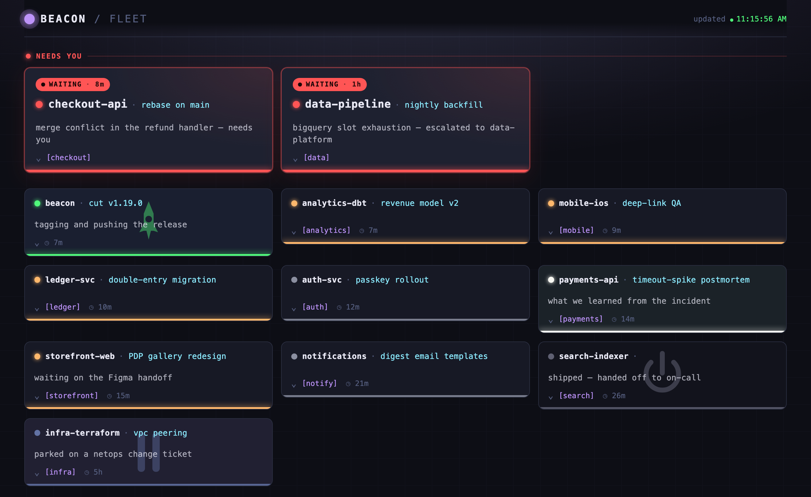
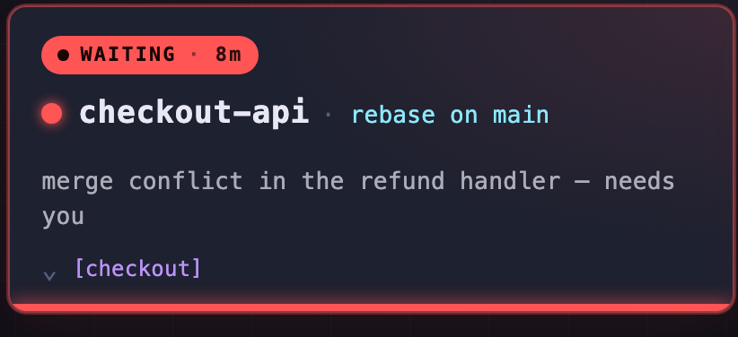

# Try the demo

The fleet view is hard to picture until you've seen a board full of concurrent work drift between states. The demo gives you that without wiring up real Claude Code sessions: it seeds a fictional commerce org's fleet, serves the real dashboard against it, and runs a calm simulation you can click through.

It's the fastest way to answer "what would beacon look like with my sessions in it?" — and on Windows or any non-iTerm terminal, the dashboard it serves *is* the whole product, so the demo doubles as a full tour.

## Run it

The demo lives in the repo, so clone and run it directly — no install, no real sessions:

```bash
git clone https://github.com/chris-peterson/beacon
cd beacon
python3 dev/demo.py
```

Then open <http://127.0.0.1:8788/>. Press `Ctrl-C` to stop.

Everything the demo writes lands in a throwaway directory (`/tmp/beacon-demo`) and an isolated tack home, so your real beacon state and tack routes are untouched. Re-running reseeds from scratch.

A few flags worth knowing:

```bash
python3 dev/demo.py --port 9000      # serve on a different port
python3 dev/demo.py --interval 8     # seconds between simulation ticks (default 5)
python3 dev/demo.py --seed-only      # write a static fleet and exit (no serve)
```

## What you'll see

A card per session, colored by what each is doing right now — the same colors beacon paints on an iTerm2 pane. Sessions that need you (waiting, or flagged) rise into a loud **Needs you** band at the top; the rest of the fleet sits quietly below:



- **Gray** — idle, at rest, waiting for its next prompt
- **Amber** — Claude is working
- **Red** — waiting for you (a permission or idle prompt), or a status you set yourself
- **Mode colors** — a session you've moved into a cycle: `pause` (purple), `release` (green), `retro` (white on green), `done` (dim gray), `handoff` (pink). See [The beacon palette](/palette).

Each card carries the recall context a glance needs: the project, the current task, the [tack](https://github.com/chris-peterson/tack) route chip, the branch, and a free-text note about *why* it's in this state.



## Click a red card to clear it

The simulation mirrors how a real fleet behaves: sessions churn quietly between working and idle, but every so often one **stalls** — it blocks on you and turns red. Stalled sessions stay stalled and pile up; only you clear them.

A red card is the only kind you can click. In the demo, clicking it **returns that session to its agent** — the stand-in for what a live `beacon serve` does, which is raise the session's iTerm2 window so you can answer the prompt. The card flips back to working and the red ring clears. Hover a card and the `×` forgets that session outright.

Let the board run for a minute and you'll watch it drift redder as work stalls, then clear it card by card — the loop the fleet view is built to support.

## On Windows or a non-iTerm terminal

The demo is the real thing here. The fleet dashboard reads session state and paints no pane, so it runs anywhere Python 3 does — the screenshots above are the same dashboard a Windows or Linux coworker sees. Install the plugin, run `beacon serve`, open `http://127.0.0.1:8787/`, and you have this view over your own sessions. The per-pane tab and status-bar painting is an iTerm2 adapter and is skipped automatically off iTerm2.

See [On Windows or a non-iTerm terminal](/?id=on-windows-or-a-non-iterm-terminal) for the install steps.

## On macOS + iTerm2: per-pane painting

iTerm2 gets everything the demo shows, plus the same state painted onto each pane — the tab's label and color, and the status bar — so you can scan concurrent panes without opening the dashboard at all. The demo serves only the dashboard; the per-pane surfaces appear once you install beacon and run real sessions. See [In iTerm2: per-pane painting](/iterm) for the full anatomy.

## Next steps

Liked what you saw? [Install beacon](/?id=install) to run it over your own sessions.
