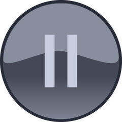

# The beacon palette

beacon organizes a session's life into **SDLC cycles**, and paints each one so a glance tells you where a session is — no reading required. Every cycle carries a **badge color**; the mode cycles additionally swap the whole pane into a background of their own. The same colors ride the [fleet dashboard](/demo) cards, so the pane and the browser view always agree.

Colors are drawn from the [Dracula palette](https://draculatheme.com/contribute), each hue serving one meaning across every surface.

<!--
  Figures are drawn in HTML from the spec palette (BADGE_COLOR_PALETTE /
  MODE_PROFILES, THEME-02) rather than screenshotted, since the pane surfaces
  don't exist off macOS. The mode watermarks are the real generated assets
  (iterm/resources/<phase>-bg.png), thumbnailed to images/wm-<phase>.png by
  iterm/make-bg.py. Keep the hexes in sync with scripts/beacon.
-->

## dev — the default cycle

Everyday development. There's no mode background — the pane stays your own profile — and the badge color is a **dynamic stoplight** the hooks drive as Claude works. Green is deliberately **not** in it: at rest the badge is a calm neutral gray, so a fresh session has a known default before its first turn, and green is freed to mean one thing only — [`release`](#mode-cycles).

  

    
checkout-api

    
idle — at rest, ready for a prompt #8b8fa0

  

  

    
checkout-api

    
working — Claude is processing #ffb86c

  

  

    
checkout-api

    
waiting for you — a prompt or a permission #ff5555

  

The badge text is the project name (plus `: <task>` when a task is set). The hooks own these three transitions; you never set them by hand.

## Mode cycles

The four mode cycles are ones you (or a skill) declare. Each swaps the pane into its own dynamic profile for a whole-pane background the badge color alone can't express — a distinct color plus a faint slate watermark — and each carries **no badge glyph**: the pane background and badge color are the entire cue. They persist until you `resume` (only `pause` also lifts automatically, on your next prompt).

  

    

      
      checkout-api
    

    

      <h4>pause /beacon:pause</h4>
      
You've parked the session. The one mode that can happen anytime — and the one that lifts on its own, the next prompt you send.

      
badge #6272a4pane #3c3357

    

  

  

    

      
      checkout-api
    

    

      <h4>release /beacon:release</h4>
      
A ship-it flow is in progress. The one active mode — a rocket climbing a deep launch-sky, under the green you never see during dev, so it reads unmistakably as "shipping."

      
badge #50fa7bpane #212c45

    

  

  

    

      
      checkout-api
    

    

      <h4>retro /beacon:retro</h4>
      
A post-work follow-up or retro phase. A calm green pane under a white badge, with a faint checklist-clipboard watermark — looking back over the work.

      
badge #f8f8f2pane #2c4636

    

  

  

    

      
      checkout-api
    

    

      <h4>done /beacon:done</h4>
      
Session complete, ready to hand off. The dimmest, "powered-off" pane under a faint checkered finish-flag watermark. The badge shows the project alone — the task is dropped.

      
badge #5f6072pane #1a1622

    

  

## Branch colors

The status-bar titlebar carries the current git branch, colored so the branch you're *working* pulls your eye while the default branch recedes. Two axes drive it — **which** branch (default vs. not) and, for a feature branch, its **sync state** — all [Dracula](https://draculatheme.com/contribute) hues:

  

    
main

    
default branch — home base, quiet whatever its state #6272a4

  

  

    
feature

    
feature, synced with upstream — nothing to push #8be9fd

  

  

    
↑2↓1 feature

    
feature, diverged — ahead / behind upstream #f1fa8c

  

  

    
feature

    
feature, untracked — no upstream, new local work #ffb86c

  

The default branch is de-emphasized across *all* states — so `main` recedes even with unpushed commits — while a feature branch reads by sync state: cyan synced, yellow diverged, orange untracked. Green is absent here too (reserved for `release`), so a synced feature branch is cyan, not green.

## Why these colors

- **Green means one thing.** It's absent from the dev stoplight and reserved for `release`, so a green pane is always "shipping," never "idle."
- **Gray is the calm default.** A session at rest — and a session that's `done` — sit in neutral grays that recede, so the loud colors (orange, red, green) are the ones that pull your eye.
- **Each mode owns a background.** `pause` a muted purple, `release` a deep launch-sky navy (a darkened Dracula *comment*), `retro` a muted green, `done` a near-black powered-off purple — recognizable whole-pane, not just by the badge.
- **No badge glyphs.** A mode is read by its color and background — the same faint slate watermark on the pane, the [dashboard card](/demo), and the fleet list — never a symbol wedged into the badge text.
- **The branch you're on, not the one you're not.** The default branch recedes; a feature branch's sync state (cyan / yellow / orange) pulls your eye — the work lives on the branch, not on `main`.

The full color contract lives in the [specification](/spec) (THEME, BADGE, RENDER); the hexes are tunable in one place in `scripts/beacon` (`BADGE_COLOR_PALETTE`, `MODE_PROFILES`).
