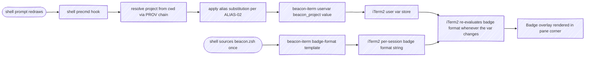
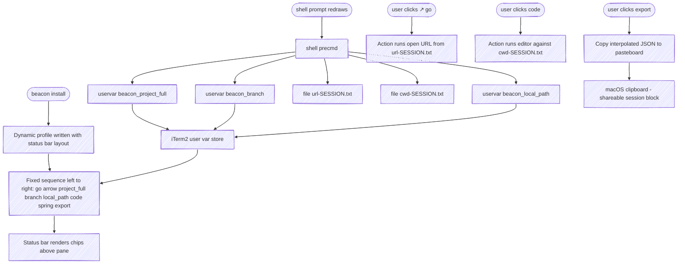
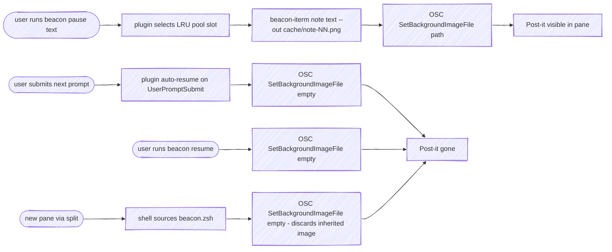

# beacon — Specification

At-a-glance session awareness across many concurrent Claude Code sessions. Each session displays its identity (which project, what task) and lifecycle state (what stage, what status) on a render target the user can scan without focusing — terminal background, badge, color, dock.

This document specifies requirements in [EARS](https://alistairmavin.com/ears/) form and outlines the first implementation: a CLI plus a Claude Code plugin targeting iTerm2 on macOS with zsh.

---

## 1. Concepts

### 1.1 Session

A single Claude Code instance running in a terminal window or pane. Sessions are independent and may number in the dozens concurrently. Session identity must persist across the lifetime of the terminal session (not just one Claude turn).

### 1.2 Signals

Each session has four signals that together describe it. Signals are orthogonal — each varies independently of the others.

| Signal  | Cardinality | Purpose                                          |
|---------|-------------|--------------------------------------------------|
| project | 1           | Identifies *which codebase* this session is in   |
| task    | 0..1        | Identifies *what unit of work* this session is on |
| stage   | 1           | Identifies *what phase* the work is in           |
| status  | 1           | Identifies *what's happening right now*          |

### 1.3 Stage values

**Stage = workflow phase / intent.** What kind of work is this session doing? Slow-changing, lasts minutes-to-hours, driven by *what the user is doing strategically*. Default `none`.

| Value | Meaning | Driven by |
|:---|:---|:---|
| `none` | Unknown / not yet labeled | Default; no signal received |
| `plan` | Architecting, designing, exploring options | Skill: Claude detects entry to plan mode (Shift+Tab) |
| `dev` | Writing or editing code | Hook PreToolUse: `Write` / `Edit` / `MultiEdit` / `NotebookEdit` (only if current is `plan`/`none`/unset); ExitPlanMode |
| `review` | Reading, auditing, QA work | Skill: Claude detects user requesting code review / inspection |
| `shipping` | Deploying, releasing | Hook PreToolUse: `Bash` matching deploy regex (`git push origin main`, `npm publish`, `terraform apply`, `gh release create`, etc.) |

Stage is **never demoted by hooks** — once `review` or `shipping`, a subsequent `Write` doesn't roll back to `dev`. Only an explicit user action (`/beacon set stage <x>`, `/beacon clear stage`, `/beacon resume`) reverses stage.

### 1.4 Status values

**Status = activity right now.** Is Claude processing, waiting on input, or sitting? Fast-changing, flips multiple times per turn, driven entirely by *what is currently happening*. Default `idle`.

| Value | Meaning | Driven by |
|:---|:---|:---|
| `idle` | Not actively engaged (just opened, paused, or freshly resumed) | Default; pause sets it explicitly |
| `working` | Claude is processing a turn | Hook UserPromptSubmit |
| `waiting` | Claude is waiting on the user (highest user-attention priority) | Hook Stop (when `stop_hook_active` not set); Hook Notification (`idle_prompt` / `permission_prompt`) |

Both stage and status accept user override via `/beacon set <field> <value>` and revert to provider chain on `/beacon clear <field>`.

### 1.5 Stage vs status at a glance

Both are signals; they answer different questions about the same session:

| | Stage | Status |
|:---|:---|:---|
| **Question** | What *kind* of work? | What's happening *right now*? |
| **Cardinality** | 5 values | 3 values |
| **Pace** | Minutes to hours | Sub-second to seconds |
| **Drivers** | Skill (plan, review) + Hooks (dev, shipping) + override | Hooks (working, waiting) + override |
| **Per-session lifecycle** | Roughly monotonic (plan → dev → review → shipping) | Cycles continuously (idle ↔ working ↔ waiting) |
| **Dropouts** | Demotion blocked (HOOK-05) | Free to flip in any direction |

### 1.6 Render target

A surface where signal state becomes visible. Render targets are pluggable; the first implementation targets iTerm2 on macOS. Other plausible targets: tmux status line, menubar app, Stream Deck, web dashboard.

### 1.7 Render collaborators

Three components write to iTerm2:

- **CLI** (`beacon-iterm`) — a stateless executable that translates simple commands into iTerm2 escape sequences and writes them to `/dev/tty`. Knows nothing about signals, sessions, or projects. The only writer that touches iTerm2 directly.
- **Plugin** (`beacon`) — a Claude Code plugin reacting to hooks, slash commands, and skill signals. Resolves signals through a chain-of-responsibility engine, then invokes the CLI to surface results. Owns `stage`, `status`, the post-it overlay, and dock attention.
- **Shell integration** — a sourceable zsh snippet shipped with the plugin. Owns `project` and `branch`, refreshed on every prompt. Calls the CLI directly to publish user vars; never goes through the plugin.

The plugin and shell write to disjoint user-var slots, so neither overwrites the other. The badge format (set once on the iTerm2 profile) consumes all four slots and re-evaluates whenever any var changes.

### 1.8 Provider

A function that attempts to derive a signal value from some source (file, environment, command output, user override). Each signal is resolved by walking a list of providers in priority order.

### 1.9 Chain of responsibility

For each signal, a list of named providers is consulted in order. The first provider that returns a non-empty value wins. The provenance (which provider supplied the value) is recorded for debugging.

---

## 2. Deliverables

beacon ships as three discrete deliverables. Section 3 organizes requirements around them.

| ID  | Deliverable | Form | Owns |
|:---|:---|:---|:---|
| **D1** | This specification | `docs/spec.md`, served via the docsify site | Requirements, architecture, scope. |
| **D2** | `beacon-iterm` CLI | A standalone executable on `$PATH` | Translating subcommands into iTerm2 escape sequences. Stateless; no Claude awareness. |
| **D3** | `beacon` Claude Code plugin | A plugin tree (hooks, skill, command, scripts, shell snippet, profile installer) | Hook handlers, COR resolver, slash command, skill, shell integration, profile installation. Calls D2 for every iTerm2 surface change. |

**Boundary discipline.** D2 has no knowledge of D3. D3 ships its shell snippet, which calls D2. D2 can be used outside Claude Code entirely (e.g. from CI scripts, ad-hoc terminal tools) — that is the test of whether the seam is clean.

---

## 3. Functional Requirements (EARS) — target-agnostic

These requirements describe what beacon does conceptually. They would apply unchanged to a non-iTerm2 render-target adapter (e.g. a future `beacon-tmux` or `beacon-kitty`). The iTerm2-specific implementation details are factored into §4.

| Namespace | Slice                                                       |
|:---|:---|
| `RES`   | Signal resolution model |
| `PROV`  | Provider chains |
| `ALIAS` | Project name aliases (post-resolve substitution) |
| `HOOK`  | Claude Code hook event handlers |
| `OVR`   | User overrides (`set` / `clear`) |
| `PAUSE` | Pause / resume semantics |
| `SKILL` | Skill-driven stage signals |
| `CMD`   | Slash command surface |

### 3.1 Signal resolution (RES)

**RES-01.** The plugin shall resolve each signal via a chain of providers, returning the first non-empty value.

**RES-02.** The plugin shall record the name of the provider that supplied each resolved value.

**RES-03.** When no provider returns a value for `stage`, the plugin shall use `none`.

**RES-04.** When no provider returns a value for `status`, the plugin shall use `idle`.

**RES-05.** When no provider returns a value for `task`, the plugin shall treat task as absent (omit from displays).

**RES-06.** When no provider returns a value for `project`, the plugin shall use the placeholder `?` so downstream rendering does not fail.

### 3.2 Provider chains (PROV)

**PROV-01.** For `project`, the plugin shall consult providers in this order: user override, package manifest (`package.json` `name`, `Cargo.toml` `[package].name`, `pyproject.toml` `[project].name`), git remote origin (top-level group + repo, dropping intermediate subgroups — e.g. `acme/widgets`, `bigcorp/docs`), project root directory name. See PROV-06 for the final pwd fallback when none of these provide a value, and ALIAS-02 for the post-resolve substitution applied to the chain's output.

**PROV-02.** For `task`, the plugin shall consult providers in this order: user override, GitHub PR title (`gh pr view`), git branch name (when not in `{main, master, develop, trunk, HEAD}`).

**PROV-03.** For `stage`, the plugin shall consult providers in this order: user override, hook signal, default (`none`).

**PROV-04.** For `status`, the plugin shall consult providers in this order: user override, hook signal, default (`idle`).

**PROV-05.** When detecting project root, the plugin shall walk parent directories looking for any of `.git`, `package.json`, `Cargo.toml`, `pyproject.toml`, `go.mod`, `.hg`, `pom.xml`, `Gemfile`, stopping at `$HOME`. The first directory containing any marker (and within `$HOME`) is the project root.

**PROV-06.** When no provider in PROV-01's chain returns a value for `project` (no override, no package manifest, no git remote, no project root marker found within `$HOME`), the plugin shall use the abbreviated current working directory as a spatial-context fallback: `$HOME` substituted with `~`. Examples:

```text
/Users/cpeterson/src          →  ~/src
/Users/cpeterson              →  ~
/tmp                          →  /tmp
```

The fallback is not parenthesized — it appears as a real path so it reads naturally in the badge alongside actual project names. The PROV chain order is therefore: override → package manifest → git remote → project-root dir name → pwd fallback. The chain's output is subject to alias substitution (ALIAS-02) before being published.

**PROV-07.** For `url` (the "best URL relevant to this session"), the plugin shall consult providers in this order, returning the first non-empty value:

1. **User override** — set via `/beacon set url <url>`
2. **Tack-derived URL** — when `tack` is on `$PATH` and has a route whose slug matches the current git branch (or whose `tack find <pwd>` returns a route), an inner chain of:
   a. The route's first `status: in_progress` tack's `deliverable.url`
   b. The route's most-recently-updated `status: done` tack's `deliverable.url`
   c. The first `link.url` on any tack
3. **Branch URL** — derived from the git remote: `<remote>/tree/<branch>` for GitHub-like, `<remote>/-/tree/<branch>` for GitLab-like (only when not on a default branch)
4. **Project URL** — bare git remote URL (e.g. `https://git.example/acme/widgets`)
5. **Empty** — when none of the above produces a value

The integration with `tack` is *soft*: beacon detects `tack` at runtime and uses it if present. There is no hard dependency, no shipped tack code in beacon. Users can replace step 2 with another provider (Linear, Jira, GitHub Issues, custom) by overriding the shell function `_beacon_resolve_url`.

### 3.3 Project name aliases (ALIAS)

Aliases let users shorten verbose group/repo names rendered into the badge and status bar. They apply *after* PROV-01 has produced a `<top-group>/<repo>` form, substituting per segment.

**ALIAS-01.** The plugin shall maintain a persistent table of project aliases mapping full segment names to short forms. The table shall live at `${CLAUDE_PLUGIN_DATA}/aliases.txt` in `<full>=<short>` line format, shared across all sessions.

**ALIAS-02.** When the project signal is resolved (PROV-01), both the plugin and the shell integration shall split the resolved value on `/` and substitute each segment that matches an alias key with its short form, then rejoin. Substitution applies *after* PROV-01's "drop intermediate subgroups" step. Example: with alias `acmecorp=ac` and a git remote of `https://git.example/acmecorp/platform/auth-svc.git`, the resolved project is `ac/auth-svc` (PROV-01 drops `platform`, ALIAS-02 swaps `acmecorp` for `ac`).

**ALIAS-03.** When the user invokes `beacon alias <full> <short>`, the plugin shall add or update the mapping for `<full>`.

**ALIAS-04.** When the user invokes `beacon alias` with no arguments, the plugin shall list all defined aliases (one `<full>=<short>` per line).

**ALIAS-05.** When the user invokes `beacon alias clear <full>`, the plugin shall remove the mapping for `<full>`. When invoked as `beacon alias clear` with no `<full>`, the plugin shall remove all aliases.

### 3.4 Hook handlers (HOOK)

**HOOK-01.** When the user submits a prompt, the plugin shall set `signal.status = working`.

**HOOK-02.** When Claude finishes a turn (Stop hook fires) and `stop_hook_active` is not set, the plugin shall set `signal.status = waiting`.

**HOOK-03.** When Claude requests user attention (Notification hook with matcher `idle_prompt|permission_prompt`), the plugin shall set `signal.status = waiting`.

**HOOK-04.** When Claude invokes any of `Write`, `Edit`, `MultiEdit`, `NotebookEdit`, the plugin shall promote `signal.stage = dev` only if the current stage is `plan`, `none`, or unset.

**HOOK-05.** Write-tool invocation shall never demote stage from `review` or `shipping`.

**HOOK-06.** When Claude exits plan mode (PreToolUse for the `ExitPlanMode` tool), the plugin shall set `signal.stage = dev`.

**HOOK-07.** When Claude invokes `Bash` with a command matching a deploy pattern, the plugin shall set `signal.stage = shipping`. Patterns include: `git push` to main/master/production/release branches, `git push --tags`, `npm publish`, `yarn publish`, `pnpm publish`, `cargo publish`, `docker push`, `terraform apply`, `kubectl apply`, `gh release create`, `flyctl deploy`, `vercel deploy` / `vercel --prod`, `heroku ... master`.

### 3.5 User overrides (OVR)

**OVR-01.** When the user invokes `set <field> <value>`, the plugin shall persist the value as an override for that field. Valid fields: `project`, `task`, `stage`, `status`, `url`.

**OVR-02.** The override provider shall always be first in every signal's chain.

**OVR-03.** When the user invokes `clear <field>`, the plugin shall remove only that field's override.

**OVR-04.** When the user invokes `clear` with no field, the plugin shall remove all overrides for the session.

### 3.6 Pause and resume (PAUSE)

**PAUSE-01.** When the user invokes `pause`, the plugin shall snapshot current resolved values for `project`, `task`, and `stage` into overrides, set `override.status = idle`, and write a `paused` marker.

**PAUSE-02.** When `pause` is invoked with a note argument, the plugin shall use the note as the `task` override.

**PAUSE-03.** When `pause` is invoked with a note argument and the render target supports rich graphics, the plugin shall produce a visual note overlay (e.g. a post-it card) carrying the note text. Adapter-specific overlay behaviors are in §4.4.

**PAUSE-04.** When the user submits a prompt and the session is paused, the plugin shall remove the paused marker and `override.status` before processing the prompt's hook signal. The render adapter shall clear any pause-related visuals.

**PAUSE-05.** Auto-resume (PAUSE-04) shall preserve `task` and `stage` overrides set by the pause.

**PAUSE-06.** When the user invokes `resume`, the plugin shall remove all overrides and the paused marker. The render adapter shall clear any pause-related visuals.

### 3.7 Skill-driven signals (SKILL)

**SKILL-01.** The plugin shall include a skill that instructs Claude to invoke `signal stage plan` when the conversation transitions to a planning/architecting phase that hooks cannot observe (e.g., entry to plan mode).

**SKILL-02.** The skill shall instruct Claude to invoke `signal stage review` when the user requests inspection, code review, or QA work that hooks cannot reliably distinguish from `dev`.

**SKILL-03.** The skill shall instruct Claude not to invoke beacon for signals already covered by hooks (status, dev/shipping stages).

**SKILL-04.** The skill shall instruct Claude not to narrate its beacon invocations to the user.

### 3.8 Slash command (CMD)

**CMD-01.** When the user invokes `show`, the plugin shall display each signal's current value, the provider that supplied it, and whether the session is paused.

**CMD-02.** When the user invokes `set <field> <value>`, the plugin shall apply OVR-01 and re-render.

**CMD-03.** When the user invokes `clear [<field>]`, the plugin shall apply OVR-03 or OVR-04 and re-render.

**CMD-04.** When the user invokes `pause [<note>]`, the plugin shall apply PAUSE-01..03 and re-render.

**CMD-05.** When the user invokes `resume`, the plugin shall apply PAUSE-06 and re-render.

**CMD-06.** When the user invokes `reset`, the plugin shall remove all per-session state and clear all render-adapter surfaces.

**CMD-07.** When the user invokes `render`, the plugin shall force a re-render with the current resolved state without changing any state.

**CMD-08.** When the user invokes `install`, the plugin shall perform all bootstrap steps for the active render adapter that can run while iTerm2 is open. For the iTerm2 adapter (§4) this includes: appending the shell snippet `source` line to `.zshrc`, installing zsh tab completion, setting iTerm2's `PerPaneBackgroundImage` default, pre-approving the post-it pool paths in iTerm2's `AlwaysAllowBackgroundImage`, and writing the beacon dynamic profile (with status bar layout) to `DynamicProfiles/`. The plugin shall print one line per step. Setting the beacon profile as iTerm2's default is deliberately **not** part of `install` — see STATUS-BAR-01 and CMD-12.

**CMD-09.** When the user invokes `completions zsh`, the plugin shall write the completion script to `~/.zsh/completions/_beacon` and ensure `fpath` is configured before `compinit` in `.zshrc`. With `--print`, the plugin shall print the script to stdout instead of installing.

**CMD-10.** When the user invokes `copy-status`, the plugin shall print the formatted shareable state block (see SHARE-01) to stdout. The status-bar copy action (STATUS-BAR-07) pipes that output through `pbcopy`.

**CMD-11.** When the user invokes `beacon alias <full> <short>`, `beacon alias` (no args), or `beacon alias clear [<full>]`, the plugin shall apply ALIAS-03..05 and re-render so any in-flight session picks up the new alias table.

**CMD-12.** When the user invokes `set-default-profile`, the plugin shall make the beacon dynamic profile iTerm2's default by orchestrating an iTerm2 quit + relaunch:

1. If the beacon profile is already the default and iTerm2 is not running, the plugin shall exit early.
2. If iTerm2 is not running, the plugin shall write `Default Bookmark Guid` directly via `defaults write` and relaunch iTerm2 via `open -a iTerm`.
3. If iTerm2 is running, the plugin shall:
   a. Confirm intent interactively (read y/N from `/dev/tty`). The `--yes` flag skips the prompt.
   b. Spawn a detached helper process (`nohup`, `start_new_session=True`) that polls until iTerm2 has fully exited, then writes the default-profile pref, then relaunches iTerm2.
   c. Send `tell application "iTerm" to quit` via `osascript`. The helper survives our process being SIGHUP'd by iTerm2 and finishes the job.

The user is warned in the prompt that all iTerm2 windows and panes (including the one running this command) will close. The helper logs to a tempfile so post-mortem inspection is possible if the relaunch doesn't happen.

---

## 4. iTerm2 adapter requirements

The first deliverable adapter targets iTerm2 on macOS with zsh. Section 4 collects every requirement that depends on iTerm2 specifics — escape sequences, OSC payloads, plist quirks, profile layouts. A future adapter for tmux / kitty / a web dashboard would replace §4 entirely while leaving §3 untouched.

### 4.1 Pane anatomy

beacon writes to **exactly three areas** of an iTerm2 pane. Every other surface is owned by Claude Code, the user's profile, or other tools, and beacon shall not touch them:

```text
┌─────────────────────────────────────────────────┐
│ STATUS BAR  ↗ project_url · branch · cwd · code │ ← §4.4 fixed layout, neutral color
│                                       · export  │
├─────────────────────────────────────────────────┤
│                                       ┌────────┐│
│   pane content (terminal output)      │ project││ ← §4.3 badge
│                                       │ + color││   text + status-driven color
│                                       └────────┘│
│   ┌──────────────┐                              │
│   │  post-it     │ ← §4.5 background image      │
│   │  (only       │   (only when paused)         │
│   │   on pause)  │                              │
│   └──────────────┘                              │
└─────────────────────────────────────────────────┘
```

| Area | Section | Namespace | Purpose | Mechanism |
|:---|:---|:---|:---|:---|
| Badge | §4.3 | `BADGE` | At-a-glance "where am I" + traffic-light status color | OSC `SetBadgeFormat` + `SetUserVar` + `SetColors=badge=` |
| Status bar | §4.4 | `STATUS-BAR` | Fixed-layout context + cross-session actions (`go`, `code`, `export`) | Dynamic profile + `SetUserVar` + Action component |
| Background image | §4.5 | `OVERLAY` | Post-it overlay during pause | OSC `SetBackgroundImageFile` |

beacon shall **not** write to: tab color, terminal background color, terminal foreground color, window title, tab title, cursor color/shape. These are Claude Code's domain (window title) or the user's profile (terminal colors, cursor). The badge is the only signal-coloring surface beacon paints — it's scoped to one corner of the pane and visible in Mission Control where chips are too small to read.

### 4.2 CLI: `beacon-iterm` (CLI)

The CLI is the only writer to iTerm2. It exposes one subcommand per surface beacon writes to.

**CLI-01.** The system shall expose a single executable `beacon-iterm` with subcommands for every iTerm2 surface beacon writes to.

**CLI-02.** All escape sequences shall be written to `/dev/tty`. When `/dev/tty` is unavailable, the CLI shall fall back to stdout so the tool remains usable in piped contexts.

**CLI-03.** When invoked as `beacon-iterm uservar <name> <value>`, the CLI shall publish `user.<name>=<base64(value)>` via `OSC 1337 SetUserVar`. An empty `<value>` is allowed and clears the slot.

**CLI-04.** When invoked as `beacon-iterm bg-image <path>`, the CLI shall set the per-session background image via `OSC 1337 SetBackgroundImageFile=<base64(path)>`. When invoked as `beacon-iterm bg-image clear`, the CLI shall clear the per-session image.

**CLI-05.** When invoked as `beacon-iterm note <text> [--out <path>]`, the CLI shall compose a post-it-style note image containing `<text>`, save it (to `<path>` if provided, else a tempfile), and set it as the per-session background image.

**CLI-06.** When invoked as `beacon-iterm badge-format <template>`, the CLI shall set the per-session badge format via `OSC 1337 SetBadgeFormat=<base64(template)>`. The template may reference user variables as `\(user.foo)`; iTerm2 re-evaluates the template whenever any referenced variable changes.

**CLI-07.** When invoked as `beacon-iterm clear`, the CLI shall reset the surfaces it controls — badge color to default and bg image to empty.

**CLI-08.** Re-invoking the CLI with the same arguments shall produce the same iTerm2 effect (idempotent).

**CLI-09.** The CLI shall require no environment variables to operate. It shall exit non-zero with a clear error message on invalid arguments and shall not silently fail.

**CLI-10.** When invoked as `beacon-iterm badge-color <hex|default>`, the CLI shall set the per-session badge color via `OSC 1337 SetColors=badge=<hex>` (or `=default` to revert). The hex is 6 digits without a leading `#`.

### 4.3 Badge area (BADGE)

The badge carries **just `<project>`** as its text — the most compact signal possible, visible in the corner of every pane regardless of profile. Project value is the post-alias-substitution form of PROV-01 (e.g. `acme/widgets`, or `ac/auth-svc` after applying alias `acmecorp=ac`).

Beyond text, the badge carries one additional signal: **color, driven by `status`** (BADGE-09). This is the highest-leverage surface for many-window awareness — the badge is the only beacon-painted element large enough to read in Mission Control / Exposé. Branch and richer context are surfaced in the status bar (§4.4) instead.



**BADGE-01.** The plugin distribution shall include a sourceable shell integration (`shell/beacon.zsh`) that the user adds to `.zshrc`.

**BADGE-02.** When the shell prompt redraws (precmd / chpwd), the integration shall invoke `beacon-iterm uservar beacon_project <value>` with the value derived per PROV-01 + ALIAS-02 from the current working directory.

**BADGE-03.** The system shall set the iTerm2 badge format via `OSC 1337 SetBadgeFormat` to a compact static template: `\(user.beacon_project)`. The shell integration shall set this format on source (once per shell).

**BADGE-04.** When the project provider chain finds no marker, the shell integration shall publish the PROV-06 pwd fallback (e.g. `~/src`) so the badge always carries useful spatial context, never empty.

**BADGE-05.** The shell integration shall use the same project-root walk algorithm as PROV-05 to keep `user.beacon_project` consistent with the plugin's notion of project.

**BADGE-06.** The shell integration shall be idempotent — sourcing it twice in the same shell shall not duplicate hooks or output.

**BADGE-07.** The shell integration shall expose `beacon` as an alias to the plugin script so `beacon <subcommand>` works as an interactive command and so tab completion (loaded as `_beacon`) attaches to the right command name.

**BADGE-08.** The shell integration shall expose `_beacon_resolve_url()` as a public zsh function implementing the PROV-07 chain. Users may redefine this function in their `.zshrc` (after sourcing `beacon.zsh`) to substitute non-tack URL providers (Linear, Jira, GitHub Issues, etc.) without forking beacon.

**BADGE-09.** The plugin shall set the badge color via `beacon-iterm badge-color` (CLI-10) on every status change, mapping the resolved status to a logical color state:

| Status | Color state | Semantics |
|:---|:---|:---|
| `idle` | `ready` | Default; nothing is happening |
| `working` | `busy` | Claude is processing; don't interrupt |
| `waiting` | `blocked` | Claude needs the user (highest attention) |
| (paused) | `blocked` | Pause is a user-initiated block; the post-it bg image distinguishes it visually from `waiting` |

The mapping `state → hex` lives in implementation, not this spec, so the palette can be tuned without amending requirements. Logical names (`ready` / `busy` / `blocked`) are the contract.

### 4.4 Status bar area (STATUS-BAR)

The status bar carries **a fixed-layout strip of values and actions** that complement the badge: full project URL (cmd+click target), branch, local cwd, plus action buttons to navigate (`go`), open the cwd in an editor (`code`), and export the session state (`export`). It is delivered via a beacon-managed dynamic profile that the user opts into.

Layout is fixed (no dynamic show/hide based on values). Chip text is rendered in the profile's default text color — kind-based per-chip palettes were tried and dropped because, with positions fixed, the colors became decorative rather than informative. Value-based coloring (e.g. status chip turns red when waiting) requires a custom Python component and is out of scope; the badge color (BADGE-09) covers the same need.



**STATUS-BAR-01.** The `install` command shall write a dynamic profile to `~/Library/Application Support/iTerm2/DynamicProfiles/beacon.json` named `beacon` inheriting from the user's "Default" profile. iTerm2 watches that directory and reloads dynamic profiles without restart, so this write succeeds even while iTerm2 is running.

The `install` command shall **not** make the beacon profile iTerm2's default automatically. Setting `Default Bookmark Guid` requires iTerm2 to be fully quit (it caches prefs in memory and overwrites the plist on quit), and silently quitting the user's only terminal is unacceptable. Instead, the installer shall print:

1. The manual click path: *iTerm2 → Settings → Profiles → 'beacon' → Other Actions ▾ → Set as Default*.
2. A pointer to the dedicated subcommand `beacon set-default-profile` (CMD-12) which orchestrates the quit + relaunch.

**STATUS-BAR-02.** The dynamic profile shall enable the status bar (`Show Status Bar: true`) with the following fixed chip sequence, left to right:

1. **`go` action button** — `iTermStatusBarActionComponent` titled `↗` (open-external glyph). Reads the per-session URL file written by the shell snippet and runs `open <url>`. Sits adjacent to the URL chip so the action is proximal to its data.
2. **Full project path** — `\(user.beacon_project_full)` (e.g. `git.example/acme/widgets`); cmd+click target.
3. **Branch** — `\(user.beacon_branch)`.
4. **Local path** — `\(user.beacon_local_path)` (`$HOME` substituted as `~`).
5. **`code` action button** — `iTermStatusBarActionComponent` titled `code`. Reads the per-session cwd file written by the shell snippet and runs `code <cwd>` to open the directory in VS Code. Sits adjacent to the local-path chip.
6. **Spring** — `iTermStatusBarSpringComponent`, pushes the export button to the right edge.
7. **`export` action button** — `iTermStatusBarActionComponent` titled `export`. Copies a one-line JSON object containing all signal values to the macOS pasteboard via action enum `72` ("Copy to Pasteboard").

The chip sequence is **fixed** — chips are not hidden when their underlying value is empty. The layout's `remove empty components` setting is left enabled at the framework level but no chip relies on it.

**STATUS-BAR-03.** Two component classes are used:

- **Data chips** — `iTermStatusBarSwiftyStringComponent` with knobs `expression`, `minwidth`, `maxwidth`, `base: priority`, `base: compression resistance`, `shared font`. No click action.
- **Action buttons** — `iTermStatusBarActionComponent` with the same shared knobs plus an `action` knob:

  ```json
  {
    "applyMode": 0,
    "escaping": 1,
    "title": "<short label, e.g. '↗', 'code', 'export'>",
    "parameter": "<command or interpolated value>",
    "action": <enum>,
    "version": 2
  }
  ```

  Action enum `72` = "Copy to Pasteboard" (used by `export`). Action enum `35` runs the parameter as a shell coprocess command (used by `↗` and `code`); these read per-session files (`url-$ITERM_SESSION_ID.txt`, `cwd-$ITERM_SESSION_ID.txt`) because coprocess actions do not interpolate `\(user.*)` reliably.

The layout shall use `algorithm: 1` (tight pack with `|` separators), `font: SF Mono 18` (monospace, sized to read clearly across many panes), `auto-rainbow style: 0`. (Schema verified empirically against iTerm2 3.6.x.)

**STATUS-BAR-04.** *(removed)* Per-chip `shared text color` is no longer specified. All chips render in the profile's default text color. Value-based status coloring is delivered via the badge (BADGE-09); kind-based palette was decorative once layout positions stabilized.

**STATUS-BAR-05.** When the shell prompt redraws, the integration shall publish these additional user vars (beyond the badge-side `beacon_project`):
- `beacon_project_full` — full git remote URL (e.g. `git.example/acme/widgets`); empty when not in a recognized project
- `beacon_branch` — current git branch, or empty when not in a repo
- `beacon_local_path` — cwd with `$HOME` substituted as `~`
- `beacon_url` — full URL resolved per PROV-07

The shell shall additionally write two per-session files (`url-$ITERM_SESSION_ID.txt`, `cwd-$ITERM_SESSION_ID.txt`) under `${CLAUDE_PLUGIN_DATA}/cache/` for the `↗` and `code` action buttons to read. (Coprocess actions cannot interpolate user vars, hence the file-based handoff.)

**STATUS-BAR-06.** The plugin shall not modify any other iTerm2 profile (the user's default, or any pre-existing profile). The status bar feature is delivered solely via the beacon dynamic profile.

**STATUS-BAR-07.** When the user clicks the `export` button, the action shall copy a shareable JSON block containing the resolved session state (project, branch, stage, status, url, cwd, claude session id) to the macOS clipboard, formatted so a colleague reading it in chat understands what context the original user was in. (Format details — see SHARE namespace.)

**STATUS-BAR-08.** The action button parameters use `\(user.beacon_*?)` (nullable) so clicks never error on undefined values. `beacon_stage`, `beacon_status`, and `beacon_claude_session` are still published by the plugin — though no chip displays them, the `export` button's interpolated JSON references them.

### 4.5 Background image area (OVERLAY)

The background image is **only** set during a paused session — to render the post-it card. Otherwise it is unset. This keeps the surface free for users' own iTerm2 customization outside of pause moments.



**OVERLAY-01.** When `pause` is invoked with a note (PAUSE-03), the plugin shall invoke `beacon-iterm note <text>` to render and paint the post-it card. The post-it shall contain only the note text — no project icon.

**OVERLAY-02.** On source, the shell integration shall discard any background image inherited from a parent pane (iTerm2's `PerPaneBackgroundImage` setting prevents drift between panes once they diverge but does not clear the inherited image when a pane is created via split). The user-visible effect is that a paused pane's post-it does not carry over into a fresh split.

**OVERLAY-03.** The plugin shall render note images into a fixed-size pool of paths (`cache/note-NN.png`, N=8) using LRU rotation. The plugin shall avoid overwriting a slot currently referenced by another session's `note-image` state. Pool files persist across resume/reset.

**OVERLAY-04.** The `install` command shall pre-approve the pool paths (OVERLAY-03) and the empty-path sentinel (which the shell integration sends per OVERLAY-02) in iTerm2's `AlwaysAllowBackgroundImage` array, so `SetBackgroundImageFile` never triggers a trust prompt. When iTerm2 is running at install time, the writes are deferred — iTerm2 caches prefs in memory and would overwrite the plist on quit — and the user is told to quit iTerm2 and re-run.

### 4.6 Render orchestration (RENDER)

These requirements describe **when** the plugin invokes the CLI and **with what** arguments. The CLI's contract is in §4.2.

**RENDER-01.** Re-rendering the same resolved state shall produce the same sequence of CLI invocations (idempotent).

**RENDER-02.** After any signal change (hook, override, clear, pause, resume), the plugin shall re-render.

**RENDER-03.** The plugin shall write a snapshot of the last-rendered resolved state including provenance, for debugging.

**RENDER-04.** On every render, the plugin shall ensure that `user.beacon_stage` and `user.beacon_status` reflect the current resolved state. The plugin may skip a `beacon-iterm uservar` invocation when the value is unchanged from the prior render's snapshot.

**RENDER-05.** The plugin shall invoke `beacon-iterm bg-image` only when entering or leaving the paused state — never for `idle` / `working` / `waiting` transitions.

### 4.7 Cross-session sharing (SHARE)

The copy-status-bar feature (STATUS-BAR-07) packages the resolved session state for human-to-human handoff. A colleague reading the copied token in Slack should understand "where" the originator was working. v1 ships the copy direction only; structured import is deferred.

**SHARE-01.** The `beacon copy-status` command shall format the resolved session state as a multi-line block suitable for direct paste into chat or commit messages. The block shall include: project (full + namespace/repo forms), branch, stage, status, local path (abbreviated), session id, and the pause note if paused.

**SHARE-02.** The copy action chip in the status bar (STATUS-BAR-07) shall invoke `beacon copy-status` and place the resulting block on the macOS clipboard via `pbcopy`. No additional confirmation or UI shall be required.

**SHARE-03.** *(deferred)* `beacon paste-status <token>` for structured import (set overrides matching the originator's state). Captured as a future feature.

---

## 5. Non-functional Requirements (NFR)

### 5.1 Performance

**NFR-01.** Hook handlers shall complete within 250 ms in the common case so as not to perceptibly delay Claude Code interactions.

**NFR-02.** The post-it note image shall be cached and regenerated only when its inputs (note text, pane dimensions) change.

**NFR-03.** The shell integration shall add no perceptible latency to prompt redraw — the per-prompt cost shall be dominated by a single `git` invocation when in a repository, and zero `git` work when not.

**NFR-04.** A single CLI invocation shall complete within 50 ms in the common case (no image composition). The `note` subcommand may exceed this since it composites; it shall complete within 500 ms for typical pane sizes.

### 5.2 Robustness

**NFR-05.** A provider that throws an exception shall not block other providers in the chain.

**NFR-06.** When an optional dependency is missing, the plugin shall degrade gracefully — text-only signals continue to work; only the post-it visual is skipped (CLI's `note` subcommand may report "Pillow not available" and exit non-zero, which the plugin tolerates).

**NFR-07.** The plugin shall function in directories that are not inside any recognized project (no git, no manifest).

### 5.3 Isolation

**NFR-08.** Per-session plugin state shall be keyed by a stable session identifier so concurrent sessions do not interfere.

### 5.4 Compatibility

**NFR-09.** The first implementation shall target iTerm2 on macOS with zsh.

**NFR-10.** The architecture shall not preclude additional render-target CLIs (`beacon-tmux`, `beacon-kitty`, etc.), additional shell adapters (`shell/beacon.bash`, `shell/beacon.fish`), or additional driver plugins (consumers other than Claude Code).

**NFR-11.** The CLI shall be usable independently of the plugin — e.g., from a shell script, a CI job, or another tool — so future drivers can adopt it without taking a Claude Code dependency.

---

## 6. Architecture

### 6.1 Layers

```
┌──────────────────────────────────────────────────────────┐
│  Inputs (plugin)                Inputs (shell)           │
│  ├─ Hook events                 ├─ precmd                │
│  ├─ Slash commands              └─ chpwd                 │
│  └─ Skill-driven signals                                 │
└──────────────────────────────────────────────────────────┘
                         │
            ┌────────────┴───────────┐
            ▼                        ▼
┌────────────────────────┐  ┌────────────────────────────┐
│  Plugin state          │  │  (shell — stateless;       │
│  ├─ override.{...}     │  │   recomputes per prompt)   │
│  ├─ signal.{stage,     │  └────────────────────────────┘
│  │           status}   │              │
│  ├─ paused             │              │
│  └─ note-image         │              │
└────────────────────────┘              │
            │                           │
            ▼                           │
┌────────────────────────┐              │
│  COR Resolver          │              │
│  → (value, provenance) │              │
└────────────────────────┘              │
            │                           │
            ▼                           ▼
┌──────────────────────────────────────────────────────────┐
│  beacon-iterm CLI (the only writer to iTerm2)            │
│  ├─ uservar     ├─ badge-format ├─ badge-color          │
│  ├─ attention   ├─ bg-image     ├─ note                 │
│  └─ clear                                                │
└──────────────────────────────────────────────────────────┘
                         │
                         ▼
                    /dev/tty
```

### 6.2 State storage (plugin only)

```
state/<session-hash>.override.{project,task,stage,status}
state/<session-hash>.signal.{stage,status}
state/<session-hash>.paused
state/<session-hash>.note-image
state/<session-hash>.resolved
cache/note-<session-hash>.png
```

Session hash is derived from `$ITERM_SESSION_ID` (stable for the lifetime of an iTerm tab). SHA-1 truncated to 12–16 chars is sufficient — collisions are not a security concern.

The shell side and the CLI are both stateless: each shell prompt recomputes project + branch and republishes via the CLI; each CLI invocation emits its escape sequence and exits.

### 6.3 CLI: `beacon-iterm`

A single Python 3 script with subcommand dispatch. Dependencies:

- **stdlib only** for `uservar`, `badge-format`, `badge-color`, `attention`, `bg-image`, `clear`.
- **Pillow** required for `note` (post-it composition). When missing, `note` exits non-zero with `"Pillow required for note composition; install via 'pip install Pillow'"`.

All subcommands open `/dev/tty` lazily, write the escape sequence, flush, and close. No persistent process, no shared state.

### 6.4 Plugin: `beacon`

Python 3 script reacting to hooks, slash commands, and skill signals. Owns the COR resolver, all state files, and the orchestration policy that decides which CLI calls to make for each resolved-state change.

The plugin invokes the CLI via subprocess. It does **not** implement any iTerm2 escape sequence directly — that is exclusively the CLI's job.

### 6.5 Shell integration: `shell/beacon.zsh`

Sourceable file the user adds to `.zshrc`. Registers `precmd` and `chpwd` hooks. Each hook shells out to `beacon-iterm uservar …`.

```zsh
# Pseudocode
_beacon_precmd() {
  beacon-iterm uservar beacon_project "$(_beacon_project_name)"
}
_beacon_chpwd() {
  beacon-iterm uservar beacon_branch "$(_beacon_branch_name)"
  _beacon_precmd
}
add-zsh-hook precmd _beacon_precmd
add-zsh-hook chpwd  _beacon_chpwd
```

Idempotent via a sentinel variable. Empty values are allowed and clear the slot (BADGE-06).

### 6.6 Badge format and color

The badge format (text template) is set per-session via the OSC `SetBadgeFormat` escape sequence:

```
\(user.beacon_project)
```

Two writers set this same template:

- **Shell integration** sets it once on source (interactive zsh sessions).
- **Plugin** sets it on the first render of each session (covers non-zsh, ssh, and edge cases where the shell snippet didn't run before Claude Code started).

Once the format is set on a session, iTerm2 re-evaluates it whenever the referenced `user.*` variable changes, so subsequent project updates flow in automatically.

Badge **color** is owned by the plugin and updated on every status change via `beacon-iterm badge-color <hex>` (BADGE-09). The plugin maintains a small dict mapping logical states (`ready` / `busy` / `blocked`) to hex values, so the palette can be tuned without touching call sites.

Neither writer modifies any iTerm2 profile — both work via per-session OSC sequences, so the format and color apply in any profile.

### 6.7 Render flow (plugin)

```
hook fires
  ↓
write signal.<field>
  ↓
resolve()  → state{value, provider}
  ↓
apply(state):
  load prev resolved snapshot (or empty on first render)
  if first render of this session:
    beacon-iterm badge-format <template>
  if status changed:
    beacon-iterm badge-color <hex>     # logical state → palette → hex
  if stage changed:
    beacon-iterm uservar beacon_stage  <stage>
  if status changed:
    beacon-iterm uservar beacon_status <status>
  if paused with note and note image is new:
    beacon-iterm bg-image <path>
  elif resuming from pause:
    beacon-iterm bg-image clear
  if status transitioned to waiting:
    beacon-iterm attention
write state/<sid>.resolved (provenance snapshot)
```

Diff-against-previous keeps the per-render escape-sequence count low — typical mid-session render emits zero or one CLI call.

### 6.8 Skill

A skill at `skills/beacon/SKILL.md` instructs Claude to invoke beacon only as a backstop where hooks cannot observe a transition. See SKILL-01 .. SKILL-04.

### 6.9 Slash command

A single command `/beacon:beacon` exposes all subcommands. See CMD-01 .. CMD-07.

### 6.10 Known iTerm2 caveats

1. **Escape sequences require `/dev/tty`** when invoked from non-TTY contexts.
2. **One-time iTerm2 permission prompt** for control codes and background image setting on first use of each.
3. **Per-Pane Background Image** must be enabled in iTerm2 preferences for the post-it to scope to the pane rather than the window. `beacon install` sets this via `defaults write com.googlecode.iterm2 PerPaneBackgroundImage -bool true`.

---

## 7. Implementation

### 7.1 Repo layout

```
beacon/
├── README.md
├── AGENTS.md
├── CLAUDE.md
├── docs/
│   ├── spec.md                     # D1 — behavioral specification
│   ├── README.md                   # docsify landing page
│   ├── _sidebar.md
│   ├── index.html
│   └── favicon.svg
├── bin/
│   ├── beacon-iterm                # D2 — CLI executable
│   └── _compose.py                 # post-it Pillow composition library
├── .claude-plugin/                 # D3 begins
│   └── plugin.json
├── hooks/
│   └── hooks.json
├── skills/
│   └── beacon/
│       └── SKILL.md
├── commands/
│   └── beacon.md
├── scripts/
│   └── beacon                      # plugin entry: resolver + handlers
└── shell/
    └── beacon.zsh                  # zsh hooks + alias + tab-completion install target
```

### 7.2 Install model

Plugin install (via Claude marketplace) places the tree at `~/.claude/plugins/cache/<author>/beacon/<version>/`. The user then runs `/beacon install` once per machine. That command:

1. Adds a `source "<plugin-root>/shell/beacon.zsh"` line to `.zshrc`, marked with a sentinel comment so future upgrades update the path in place.
2. Writes `~/.zsh/completions/_beacon` and inserts `fpath=(~/.zsh/completions $fpath)` before the user's existing `compinit` (or appends `fpath` + `compinit` if neither is present).
3. Sets `defaults write com.googlecode.iterm2 PerPaneBackgroundImage -bool true`.

No iTerm2 profile is installed or modified. No user-default profile is changed.

## 8. Out of scope

### 8.1 Cut from the original design (v1 pivot)

- **Status background images** — gradient + icon backgrounds keyed to `idle` / `working` / `waiting`. Tried, then briefly replaced by tab+bg color shifts (also too loud), now replaced by **badge color** alone (BADGE-09). The badge is the only signal-coloring surface beacon paints — small enough not to disrupt the pane, large enough to read in Mission Control.
- **Tab color and terminal bg color shifts** — emitted briefly during the transition out of full-screen status images. Loud, low information density, dropped in favor of the badge.
- **Dynamic iTerm2 profile installer** for the badge format — beacon originally installed three profiles (one per status), then a single profile carrying the static badge format. Both are gone. The badge format is set per-session via `SetBadgeFormat` so beacon works in any profile and never modifies user profile state. (A profile *is* installed for the status bar layout, see §4.4.)
- **Stage hue rotation** — moot once status bg images were dropped.
- **Project icon support** — icon discovery, normalization, transparency stripping, post-it composition with icon. The visual added complexity (rasterizers, background detection, flood-fill) that didn't pay off. Post-it is text-only in v1.
- **Per-chip kind-based text colors** in the status bar (originally STATUS-BAR-04) — once chip positions stabilized as fixed, the kind-coloring became decorative. Removed.
- **Status bar chips for stage, status, claude session id** — the badge color carries `status`; `stage` is rarely informative across windows; the claude session id is only useful in the export JSON, which still includes it.

### 8.2 Always out of scope

- Render targets other than iTerm2 (tmux, kitty, web, etc.) — architecture allows future `beacon-tmux` etc., but v1 ships only `beacon-iterm`.
- Shell adapters other than zsh (bash, fish) — same architectural posture.
- Drivers other than Claude Code (other agents, CI hooks) — the CLI is usable from any caller, but only the Claude Code plugin ships in v1.
- Cross-machine session sync.
- Historical state browsing (timeline of stages, time-on-task).
- Mobile / remote notifications.
- Integration with external task systems (Linear, Jira) as a `task` provider.
- Stage transitions driven by file-content analysis.
