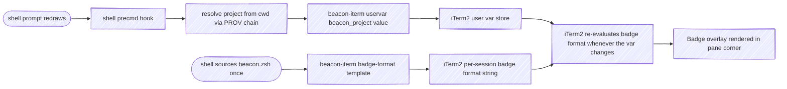
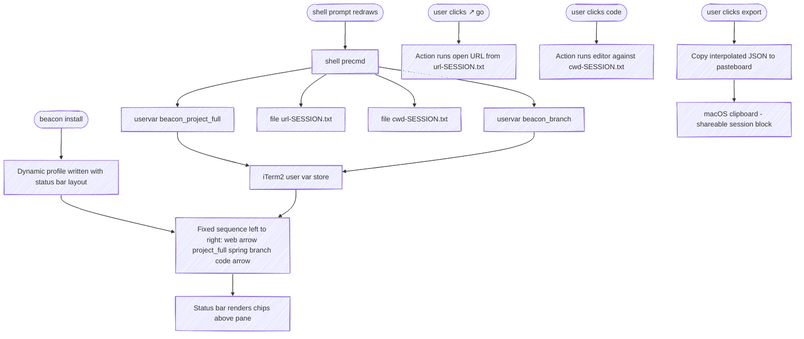

# beacon — Specification

At-a-glance session awareness across concurrent Claude Code sessions. Each session displays its identity (which project, what task) and what's happening right now (status, with an optional user-supplied description) on a surface the user can scan without focusing.

beacon surfaces that state two ways:

- a **terminal-agnostic fleet view** (§3.8) — `wip` / `watch` / `serve` read every session's state and render it as a snapshot, a live TTY view, or a localhost HTTP feed for an external dashboard. A session row in that dashboard can be clicked to focus its window (§3.9). The fleet view paints no per-pane surface, so it works in any terminal with Python 3.
- an **iTerm2 per-pane render adapter** (§4) — paints a single session's state onto its own pane (badge, status bar, tab color) so the user can scan many panes without focusing each.

This document specifies requirements in [EARS](https://alistairmavin.com/ears/) form. §3 is render-agnostic and applies to any adapter; §4 collects the iTerm2-specific implementation (macOS, zsh).

---

## 1. Concepts

### 1.1 Session

A single Claude Code instance running in a terminal window or pane. Sessions are independent and may number in the dozens concurrently. Session identity must persist across the lifetime of the terminal session (not just one Claude turn).

### 1.2 Signals

Each session has three signals that together describe it. Signals are orthogonal — each varies independently of the others.

| Signal  | Cardinality | Purpose                                          |
|---------|-------------|--------------------------------------------------|
| project | 1           | Identifies *which codebase* this session is in   |
| task    | 0..1        | Identifies *what unit of work* this session is on |
| status  | 1 (+ optional description) | Identifies *what's happening right now* |

### 1.3 Status values

**Status = what's happening right now.** Driven primarily by hooks (Claude activity) and secondarily by user overrides. Default `idle`.

Status values are organized around the **SDLC cycles** a session moves through, each named for the phase it represents (STATE-13). The default cycle is **dev**: everyday development, whose status is hook-driven and whose badge color is the dynamic stoplight. The rest are **mode cycles** the user or a skill declares.

| Value | Cycle | Meaning | Driven by |
|:---|:---|:---|:---|
| `idle` | dev | Not actively engaged (turn just ended, just opened, freshly resumed) | Default; Hook Stop (turn finished, calm) |
| `working` | dev | Claude is processing a turn | Hook UserPromptSubmit; Hook PreToolUse / PostToolUse (any tool) |
| `waiting` | dev | Claude is actively blocked on the user (permission/idle prompt — highest user-attention priority) | Hook Notification (`idle_prompt` / `permission_prompt`) |
| `paused` | pause | User has parked the session | `/beacon pause` or `/beacon status paused` |
| `release` | release | User has entered a release / ship-it flow | `/beacon release` or `/beacon status release` (set by a session or skill) |
| `retro` | retro | Session is in a post-work follow-up / retro phase | `/beacon retro` or `/beacon status retro` (set by a session or skill) |
| `done` | done | Session is complete and ready to hand off to another | `/beacon done` or `/beacon status done` (set by a session or skill) |

`idle` / `working` / `waiting` are the **dev** cycle: no mode profile, and the badge color is the dynamic stoplight (BADGE-09) — a neutral **gray** at rest, **orange** while working, **red** while blocked on the user. `paused`, `release`, `retro`, and `done` are **mode states** (RENDER-05): each owns a dedicated dynamic profile so the whole pane signals the cycle. `paused` is a user halt; `release` marks a ship-it flow in progress (the one active mode); `retro` is a deliberate closing-out phase a session or skill declares; `done` is the terminal "this session is finished, handing off" signal a closing-out skill reaches for instead of `pause`. They differ in lifecycle — `paused` auto-resumes on the next prompt (STATE-04); `release`, `retro`, and `done` persist until explicitly cleared.

Status accepts a user override via `/beacon status <value> [<description>]` (or `/beacon set status <value>`) and reverts to the provider chain on `/beacon clear status`. The optional description is a free-text note that surfaces in the fleet view (§3.8) as recall context; it lets the user attach a reminder to any user-set status (e.g. `status waiting "bg data refresh ~30 min"`), not just `paused`.

### 1.4 Render target

A surface where signal state becomes visible. Two ship today: the render-agnostic fleet view (§3.8), which reads across all sessions and works in any terminal, and the iTerm2 per-pane adapter (§4), which paints one session's state onto its own pane. Render targets are pluggable — other plausible per-pane adapters: tmux status line, menubar app, Stream Deck, kitty.

### 1.5 Render collaborators

Three components write to iTerm2:

- **CLI** (`beacon-iterm`) — a stateless executable that translates simple commands into iTerm2 control operations: escape sequences written to `/dev/tty` for the painted surfaces, and Apple Events for out-of-band actions like focusing a session. Knows nothing about signals, sessions, or projects. The only writer that touches iTerm2 directly.
- **Plugin** (`beacon`) — a Claude Code plugin reacting to hooks and slash commands. Resolves signals through a chain-of-responsibility engine, then invokes the CLI to surface results. Owns `status` and the status description.
- **Shell integration** — a sourceable zsh snippet shipped with the plugin. Owns `project` and `branch`, refreshed on every prompt. Calls the CLI directly to publish user vars; never goes through the plugin.

The plugin and shell write to disjoint user-var slots, so neither overwrites the other. The badge format (set once on the iTerm2 profile) consumes the relevant slots and re-evaluates whenever any var changes.

### 1.6 Provider

A function that attempts to derive a signal value from some source (file, environment, command output, user override). Each signal is resolved by walking a list of providers in priority order.

### 1.7 Chain of responsibility

For each signal, a list of named providers is consulted in order. The first provider that returns a non-empty value wins. The provenance (which provider supplied the value) is recorded for debugging.

---

## 2. Deliverables

beacon ships as three discrete deliverables. Section 3 organizes requirements around them.

| ID  | Deliverable | Form | Owns |
|:---|:---|:---|:---|
| **D1** | This specification | `docs/spec.md`, served via the docsify site | Requirements, architecture, scope. |
| **D2** | `beacon-iterm` CLI | A standalone executable on `$PATH` | Translating subcommands into iTerm2 control operations — escape sequences for painted surfaces, Apple Events for out-of-band actions like focus. Stateless; no Claude awareness. |
| **D3** | `beacon` Claude Code plugin | A plugin tree (hooks, skill, command, scripts, shell snippet, profile installer) | Hook handlers, COR resolver, slash command, skill, shell integration, profile installation. Calls D2 for every iTerm2 surface change. |

**Boundary discipline.** D2 has no knowledge of D3. D3 ships its shell snippet, which calls D2. D2 can be used outside Claude Code entirely (e.g. from CI scripts, ad-hoc terminal tools) — that is the test of whether the seam is clean.

---

## 3. Functional Requirements (EARS) — target-agnostic

These requirements describe what beacon does conceptually. They would apply unchanged to a non-iTerm2 render-target adapter (e.g. a future `beacon-tmux` or `beacon-kitty`). The iTerm2-specific implementation details are factored into §4.

| Namespace | Slice                                                       |
|:---|:---|
| `RES`   | Signal resolution model |
| `PROV`  | Provider chains |
| `HOOK`  | Claude Code hook event handlers |
| `OVR`   | User overrides (`set` / `clear`) |
| `STATE` | User-set status, pause / resume semantics |
| `SKILL` | Skill responsibilities (CLI freshness) |
| `CMD`   | Slash command surface |
| `WIP`   | Cross-session introspection / export |
| `WATCH` | Live fleet view |
| `COLOR` | Human-readable output coloring |
| `FOCUS` | Dashboard-driven session focus |
| `FORGET`| Dashboard-driven session forget (state delete) |
| `PERF`  | Fleet-scan performance objectives |

### 3.1 Signal resolution (RES)

**RES-01.** The plugin shall resolve each signal via a chain of providers, returning the first non-empty value.

**RES-02.** The plugin shall record the name of the provider that supplied each resolved value.

**RES-03.** When no provider returns a value for `status`, the plugin shall use `idle`.

**RES-04.** When no provider returns a value for `task`, the plugin shall treat task as absent (omit from displays).

**RES-05.** When no provider returns a value for `project`, the plugin shall use a non-empty placeholder so downstream rendering does not fail.

### 3.2 Provider chains (PROV)

**PROV-01.** For `project`, the plugin shall consult providers in this order: user override, package manifest (`package.json` `name`, `Cargo.toml` `[package].name`, `pyproject.toml` `[project].name`), git remote origin (repo basename — the last path segment of the remote URL), project root directory name. The badge wants a short, scannable label; the owner-bearing identity is exposed separately via the `project_full` status-bar chip. See PROV-06 for the final pwd fallback when none of these provide a value.

**PROV-02.** For `task`, the plugin shall consult providers in this order: user override, Claude Code `/rename` (the `custom-title` signal, PROV-09), GitHub PR title (`gh pr view`), git branch name (when not in `{main, master, develop, trunk, HEAD}`), Claude Code's auto-generated `ai-title` (PROV-09). `/rename` sits directly below the explicit beacon override because it is a deliberate, durable label the user reached for; `ai-title` is the weakest fallback — a machine guess used only when nothing stronger (not even a branch name) is available, so a session that never labels itself still carries a readable headline.

**PROV-09.** The plugin shall harvest three Claude Code session signals from the session transcript, which records each as a dedicated JSONL record: `/color` (`agent-color`), `/rename` (`custom-title`), and the auto-generated `ai-title`. Claude Code fires no hook for these slash commands, so the plugin reads the transcript tail (the same transport as WIP-11 / HOOK-03c) on every hook that carries a `transcript_path`, persisting the latest value of each as per-session state (`cc.agent_color`, `cc.custom_title`, `cc.ai_title`). A value scrolls out of the bounded tail window once set early in a long session, so a record type absent from the tail leaves its prior persisted value in place rather than blanking a still-current signal (mirrors WIP-11). `custom-title` and `ai-title` feed the `task` chain (PROV-02); `agent-color` is fleet-view metadata only (WIP-13) and is never painted — beacon's badge/tab color is the status traffic-light (BADGE-09), a closed contract the user's aesthetic color must not override. This is a soft dependency on a Claude-Code-internal format: if a record type disappears the signal goes quiet, never crashing a hook. A fresh-start wipe (HOOK-08a) and disengagement (HOOK-09) both clear the harvested signals so a reused pane does not inherit a prior tenant's title or color.

**PROV-02a.** When a Claude session's live subprocess cwd has wandered into a different project root than its SessionStart anchor (HOOK-08), the plugin shall prefix the `task` slot with an `@<wandered-project>` location marker (the wandered project root's directory name) as secondary spatial context. The task text after the marker is the session's pinned label (an explicit task override or `/rename`, PROV-02) when one is set; with no pinned label, the task chain (PR title → branch, PROV-02) is re-resolved at the wandered cwd so the marker carries what's happening there; with neither, the marker stands alone (the `ai-title` fallback is too weak to caption a wander and is skipped here). The project slot stays pinned to the anchor (BADGE-02); only the task slot reflects the drift, so the badge reads e.g. `beacon: @ai-sdlc: committing dashboard tweaks` (override) or `beacon: @ai-sdlc` (nothing to show there). Gating is on the resolved project *root*, not the raw cwd: navigation within the anchored project (into a subdirectory) does not displace the branch task. A wander is only recognized when the live cwd resolves to a marker-bearing project root (a `.git` repo, etc.); a uniquified scratch directory the agent cd's into for ad-hoc work (e.g. a `mktemp` path under `/tmp` or `$TMPDIR`) carries no project marker and so never paints an `@marker`. The marker applies only while the session is actively working (the `busy` logical state); at rest — idle, blocked on a prompt, or paused — the task re-resolves from the anchor and the marker is dropped. This is what removes the marker once a session comes home: the returning turn's Stop renders at rest and clears it even if no working render fired at the home cwd, and a session that blocks or ends mid-wander never freezes a stale marker into its last-rendered snapshot (which is what the fleet view reads). Rationale: a session that cd's out of its home project is doing cross-project work; surfacing where it went, and what it's doing there, is live recall context, but the session's identity (the project it belongs to) is still the anchor, and a parked or finished session's resting identity is home.

**PROV-03.** For `status`, the plugin shall consult providers in this order: user override, hook signal, default (`idle`). When the user override is `status paused [description]`, the description is persisted alongside the override and surfaces in the fleet view (§3.8); user-set descriptions on non-paused statuses (e.g. `status waiting "bg refresh"`) follow the same path.

**PROV-05.** When detecting project root, the plugin shall walk parent directories looking for any of `.git`, `package.json`, `Cargo.toml`, `pyproject.toml`, `go.mod`, `.hg`, `pom.xml`, `Gemfile`, stopping at `$HOME`. The first directory containing any marker (and within `$HOME`) is the project root.

**PROV-06.** When no provider in PROV-01's chain returns a value for `project` (no override, no package manifest, no git remote, no project root marker found within `$HOME`), the plugin shall use the abbreviated current working directory as a spatial-context fallback: `$HOME` substituted with `~`. Examples:

```text
/Users/cpeterson/src          →  ~/src
/Users/cpeterson              →  ~
/tmp                          →  /tmp
```

The fallback is not parenthesized — it appears as a real path so it reads naturally in the badge alongside actual project names. The PROV chain order is therefore: override → package manifest → git remote → project-root dir name → pwd fallback.

**PROV-07.** For `url` (the "best URL relevant to this session"), the plugin shall consult providers in this order, returning the first non-empty value:

1. **User override** — set via `/beacon set url <url>`
2. **Tack-derived URL** — when `tack` is on `$PATH` and has a route whose slug matches the current git branch, an inner chain of:
   a. The route's first `status: in_progress` tack's `deliverable.url`
   b. The route's most-recently-updated `status: done` tack's `deliverable.url`
   c. The first `link.url` on any tack
3. **Forge probe** — when the git remote is on a recognized forge and the matching CLI is on `$PATH`, query the forge for an open PR/MR whose source branch matches the current branch: `gh pr list --head <branch>` for github hosts, `glab mr list --source-branch <branch>` for gitlab hosts. Returns the first match. Probes are silent on missing tool, unrecognized host, or failure
4. **Branch URL** — derived from the git remote: `<remote>/tree/<branch>` for GitHub-like, `<remote>/-/tree/<branch>` for GitLab-like (only when not on a default branch)
5. **Project URL** — bare git remote URL (e.g. `https://git.example/acme/widgets`)
6. **Empty** — when none of the above produces a value

The integrations with `tack`, `gh`, and `glab` are *soft*: beacon detects each at runtime and uses it if present. There is no hard dependency, no shipped tool code in beacon. Users can replace step 2 or step 3 with another provider (Linear, Jira, GitHub Issues, custom) by overriding the shell function `_beacon_resolve_url`.

**PROV-08.** For `icon` (the project's favicon, surfaced in the fleet view to distinguish work streams visually), the plugin shall consult: user override (`icon <path|url>`), then the project's icon on disk — the first existing file among the conventional locations under the project root (`docs/favicon.svg`, root `favicon.{svg,ico,png}`, the `public/` / `static/` / `app/` web roots, `icon.*` / `logo.*`), SVG preferred over raster. The discovered path is anchored at SessionStart (HOOK-08) so the fleet commands read a known path rather than re-walking the tree on every request. A project with no icon at a known path and no override resolves to no icon. The icon is fleet-view enrichment surfaced through `wip` / `serve` (WIP-01, WIP-08); it is never painted on a pane — §4.1 lists the painted surfaces, and this is not one.

### 3.3 Hook handlers (HOOK)

**HOOK-01.** When the user submits a prompt, the plugin shall set `signal.status = working`.

**HOOK-02.** When Claude finishes a turn (Stop hook fires) and `stop_hook_active` is not set, the plugin shall set `signal.status = idle`. Rationale: a finished turn is calm, not user-blocking. Reserving `waiting` (red) for actual permission/idle prompts (HOOK-03) makes red high-signal — "this pane needs an answer right now" — so a glance at many panes distinguishes calm sessions from sessions truly blocked on the user.

**HOOK-03.** When Claude requests user attention (Notification hook with matchers `permission_prompt` and `idle_prompt`, configured as separate matcher entries), the plugin shall set `signal.status = waiting`. Both prompt kinds produce the same red `blocked` badge; beacon does not distinguish them on the pane.

**HOOK-03a.** When any tool is about to run (PreToolUse) or has just returned (PostToolUse), the plugin shall set `signal.status = working`. This re-asserts working state mid-turn so the badge does not remain red for the rest of the turn while Claude is actively running tools and thinking. A user-set status override (including a mode status, `status paused` / `status release` / `status retro` / `status done`) wins per OVR-02, so an explicitly-parked, releasing, retro, or completed session is unaffected.

**HOOK-03b.** When Claude requests user attention (HOOK-03), the plugin shall set a sticky `pending-attention` marker. The marker survives subsequent PostToolUse `working` writes and shall be cleared when the next tool actually starts (PreToolUse), when the user submits a prompt (UserPromptSubmit), or when the turn ends (Stop). While the marker is set, the resolved badge shall reflect the `blocked` color state regardless of `signal.status` (BADGE-09a). Rationale: hook delivery is not strictly ordered, so a late PostToolUse for an earlier tool may arrive after a fresh permission-prompt Notification for a new tool; without the sticky marker, the badge would briefly flip back to `busy` while the user is in fact still blocked.

**HOOK-08.** When a Claude session starts (SessionStart hook), the plugin shall capture the cwd Claude was invoked with as the session's **navigational anchor** and publish the full set of status-bar slots (`beacon_project`, `beacon_project_full`, the five `beacon_branch*` slots, `beacon_url`) plus the per-session handoff files (`cwd-$ITERM_SESSION_ID.txt`, `url-$ITERM_SESSION_ID.txt`) that the `↗ code` and `↖ web` action buttons consume. The plugin shall additionally record the resolved project name as `anchor.project` and the discovered project icon path (PROV-08) as `anchor.icon` per-session state. The anchor cwd is fixed at SessionStart and does not follow Claude's Bash subprocess cwd; chip *values* read from the anchor may evolve (see HOOK-08b). This duplicates the shell integration's prompt-driven publish path (§6.5); in interactive (non-Claude) shell sessions the shell continues to track the user's actual PWD as expected.

**HOOK-08a.** When SessionStart fires with `source` other than `resume` (i.e. `startup` or `clear`), the plugin shall clear stale per-session signals before publishing the anchor — specifically `override.*`, `signal.status`, `pending-attention`, `latest_turn`, the harvested Claude Code signals (`cc.*`, PROV-09), and `description`. Rationale: per-session state files key on `ITERM_SESSION_ID`, which is the iTerm pane and outlives any single Claude session, so a fresh `claude` invocation or `/clear` in a pane that previously hosted a session ending mid-permission-prompt would otherwise inherit `signal.status = waiting` + `pending-attention` and render red. `resume` is excluded because resumed sessions continue prior context by design.

**HOOK-08b.** On the Stop hook (end of each turn), the plugin shall re-resolve and republish the chip slots (`beacon_project_full`, the five `beacon_branch*` slots, `beacon_url`) and the per-session handoff files from the anchor cwd. `beacon_project` and `beacon_task` are owned by the engagement renderer (BADGE-02 / BADGE-12) and are not touched. Rationale: turn-by-turn the agent may create a branch, switch branches, or sharpen the URL provider's answer (e.g. the user pins a tack deliverable mid-session) — these are narrowings of the session's identity, not subprocess drift, and the chips should reflect them. The shell's prompt-driven publish path (§6.5) cannot run while Claude holds the terminal; this hook covers the gap.

**HOOK-09.** When a Claude session ends (SessionEnd hook), the plugin shall disengage the pane (BADGE-14): blank the badge user vars, revert badge and tab color to default, swap the pane back to the base `beacon-dev` profile (RENDER-05, so a session that ends mid-mode does not keep its `paused` / `release` / `retro` / `done` background — the color-only revert cannot undo a profile background), and remove the engagement marker and the resolved snapshot, so an exited session leaves the pane looking unmanaged rather than carrying its last-painted color and text. The plugin shall skip disengagement for the `clear` and `resume` end reasons: `clear` is immediately followed by a fresh SessionStart (HOOK-08a) that re-engages the same pane, and `resume` suspends the session expecting its state to persist. Rationale: the badge marks a live session; once the session is gone the shell resumes ownership of the status bar (§6.5) but per BADGE-02 never writes `beacon_project` / `beacon_task` or the badge color, so without this hook the last Claude-painted badge persists indefinitely. SessionEnd is best-effort — it does not fire on a hard crash or `kill -9`; HOOK-03c and the next session's HOOK-08a wipe remain the backstops for state a missed SessionEnd would leave behind.

**HOOK-10.** At SessionStart the plugin shall emit its bundled ambient rules to the session — proactive upkeep guidance such as keeping the session's work label current — so a session carries beacon's fleet-view hygiene without any user setup. The rules are beacon's own bundled content emitted as session context; they add no per-pane surface (they are not part of the §4.1 anatomy) and need no cooperation beyond what the model already does. Rationale: the fleet view is only as useful as each session's label (WIP-01, WIP-11); emitting the upkeep rule at session start is what makes beacon useful standalone, without the user having to wire the guidance themselves.

**HOOK-01a.** When the user submits a prompt that begins with a fresh-start slash command (currently `/recipe`), the plugin shall apply the same wipe as HOOK-08a before processing the prompt's `signal.status = working` (HOOK-01). Rationale: in-session commands that re-bootstrap context are not surfaced to hooks as a SessionStart event, so without this, signals from the prior task would contaminate the new context. The set of fresh-start commands is a tunable list maintained alongside the hook handler.

**HOOK-03c.** When the resolved badge would be `blocked` because of `pending-attention` or `signal.status = waiting`, the plugin shall consult the session's transcript (path captured from any hook payload's `transcript_path`). If the most recent assistant message text matches an idle pattern (currently `^\s*ready\b`, case-insensitive), the plugin shall clear the stale markers and re-resolve. Rationale: HOOK-03b's natural clears (Stop / PreToolUse / UserPromptSubmit) are not always reachable — a session killed mid-permission-prompt leaves the markers behind with no hook firing to clear them. The transcript is the ground truth for whether Claude actually finished a turn; the heuristic forgives the missing Stop without requiring it. When the heuristic doesn't apply (no transcript, non-matching text), the user can fall back to `clear` (no field, OVR-04) for an unconditional reset to calm defaults.

### 3.4 User overrides (OVR)

**OVR-01.** When the user invokes `set <field> <value>`, the plugin shall persist the value as an override for that field. Valid fields: `project`, `task`, `status`, `url`.

**OVR-02.** A user override shall always win over auto-detected values for the same signal.

**OVR-03.** When the user invokes `clear <field>`, the plugin shall remove only that field's override. Clearing `status` also removes the user-set description (STATE-02).

**OVR-04.** When the user invokes `clear` with no field, the plugin shall remove all overrides for the session, remove the description, and drop sticky red markers (`pending-attention` and `signal.status` if equal to `waiting`). Rationale: `clear` is the user saying "return this pane to calm defaults"; the description, pending-attention, and a stuck `waiting` signal all belong in that set of transient state to wipe. Leaving `pending-attention`/`signal.status=waiting` would keep the badge red on a session the user has just told us is calm. If the session is genuinely blocked, the next Notification re-asserts both. `clear <field>` remains overrides-only.

**OVR-05.** The `icon` override (PROV-08) is a dedicated command outside the `set <field>` set, since the icon is not a painted badge field: `icon <path|url>` persists `override.icon`; `icon` with no value clears it, reverting to auto-discovery. The all-field `clear` (OVR-04), `resume`, and a fresh SessionStart (HOOK-08a, which clears `override.*`) all drop the icon override too, so a pane returned to calm defaults or reused by a new session does not inherit a prior icon.

### 3.5 User-set status (STATE)

Pause is no longer a separate concept; it is one possible status value (`paused`) the user can set, alongside `idle`, `working`, `waiting`, `release`, `retro`, and `done`. `paused`, `release`, `retro`, and `done` are mode states that own a dedicated profile (RENDER-05); `idle` / `working` / `waiting` are the dev cycle (BADGE-09). Any user-set status accepts an optional description that surfaces in the fleet view (§3.8) as recall context. Skill plan/review signaling is gone with stage (see §3.6 for what remains of SKILL).

**STATE-01.** When the user invokes `status <value> [<description>]`, the plugin shall persist `<value>` as `override.status` and `<description>` (if any) as the session's description. `<value>` must be one of `idle`, `working`, `waiting`, `paused`, `release`, `retro`, `done`.

**STATE-02.** The plugin shall persist the description as per-session state and expose it in the cross-session export (WIP-01) so the fleet view and dashboard can surface it as recall context. The description shall not write a `task` override; the badge's task slot keeps whatever it had. Rationale: descriptions carry recall context and are typically a sentence or longer; reusing them as the task signal overflows the badge.

**STATE-03.** When the user sets `status paused`, the plugin shall snapshot the project and task the badge is currently displaying into overrides, so the badge keeps its identity while the session is parked. The snapshot reads the last-rendered resolved state rather than re-resolving from scratch: re-resolving would run the task chain's PR-title provider (a `gh`/`glab` network call) in this hot, user-facing path, and would discard an active `project`/`task` override instead of freezing it. When no resolved state has been recorded yet (the badge has not painted this session), the plugin shall fall back to a live resolve. Only a non-default value is frozen.

**STATE-04.** When the user submits a prompt and `override.status` is `paused`, the plugin shall remove the status override and description before processing the prompt's hook signal. Other user-set status overrides (e.g. `status waiting "bg refresh"`) are not auto-cleared on prompt submission — only `paused` is. Rationale: pause means "I'm stepping away"; a returning prompt is the natural resume signal. Other user-set statuses are deliberate labels the user expects to persist until they explicitly clear them.

**STATE-04a.** When the user submits a prompt whose text matches a pause-intent pattern (e.g. "stepping away", "brb", "break 'til 4", "pause until …"), the plugin shall apply STATE-01..03 with `status paused` and the full prompt text as the description, instead of clearing the paused override. The prompt itself is not suppressed — it still flows through to Claude. Rationale: lets users announce a pause in natural language without remembering the explicit `pause` subcommand.

**STATE-05.** Auto-resume (STATE-04) shall preserve `task` and `project` overrides set by STATE-03.

**STATE-06.** When the user invokes `resume`, the plugin shall remove all overrides and the description.

**STATE-07.** `pause [<note>]` shall be a synonym for `status paused [<note>]`. `resume` (STATE-06) is the natural inverse for both surfaces.

**STATE-08.** `retro [<note>]` shall be a synonym for `status retro [<note>]` — the entry point a session or skill uses to declare a post-work follow-up / retro phase (the `retro` mode state, RENDER-05). Unlike `pause` it shall not snapshot the badge identity (STATE-03 is paused-only; a retro session is still active, so re-resolution is fine) and shall not auto-resume on the next prompt (STATE-04 is paused-only); it persists until `resume` (STATE-06) or session end. The optional note is persisted as the description (STATE-02) and surfaces in the fleet view.

**STATE-09.** `done [<note>]` shall be a synonym for `status done [<note>]` — the entry point a session or skill uses to declare the session complete and ready to hand off to another (the `done` mode state, RENDER-05); it is the terminal counterpart to `retro` that a closing-out skill reaches for instead of `pause`. Its lifecycle matches `retro` (STATE-08): it shall not snapshot the badge identity (STATE-03 is paused-only) and shall not auto-resume on the next prompt (STATE-04 is paused-only); it persists until `resume` (STATE-06) or session end. The optional note is persisted as the description (STATE-02) and surfaces in the fleet view. Additionally, per STATE-12, the `done` cycle suppresses the task slot.

**STATE-10.** `pause` shall accept a `--clear-screen` flag that, after applying the pause (STATE-07 / STATE-01..03), additionally clears the session's terminal screen **and** scrollback — the Cmd+K / "Clear Buffer" equivalent — for a clean stand-down (e.g. the retro launcher parking a spent session). The clear is a terminal-control operation the iTerm2 adapter owns (a `clear-screen` CLI subcommand emitting `CSI H` + `CSI 2J` + `CSI 3J` straight to the controlling tty), so it reaches the pane even when the caller's stdout is captured — the constraint that stops a Claude agent from clearing its own buffer. It shall degrade gracefully: outside iTerm2, or when no tty is reachable, the clear is skipped and the pause still applies (no error). The flag is `pause`-only and does not touch the `clear` subcommand's meaning (which clears overrides, OVR-03), nor the badge/scrollback of any other session.

**STATE-11.** `release [<note>]` shall be a synonym for `status release [<note>]` — the entry point a session or skill uses to declare a release / ship-it flow in progress (the `release` mode state, RENDER-05). Its lifecycle matches `retro` (STATE-08): it shall not snapshot the badge identity (STATE-03 is paused-only; a release session is still active) and shall not auto-resume on the next prompt (STATE-04 is paused-only); it persists until `resume` (STATE-06) or session end. The optional note is persisted as the description (STATE-02) and surfaces in the fleet view.

**STATE-12.** While the resolved status is `done`, the plugin shall suppress the `task` slot — the badge and fleet view show the `project` alone, no task — while leaving `project` resolved as usual (BADGE-02). The suppression is presentation-only and reversible: it is applied at resolve time based on the `done` status, not by deleting any `task` override, so `resume` / `clear` restores the prior task. Rationale: a session that has declared itself complete has no active task to caption; dropping the task while keeping the project reads as "this project's work here is finished," the natural terminal counterpart to the identity a `paused` session freezes (STATE-03).

**STATE-13.** Status values are grouped into named **SDLC cycles** (§1.3): `idle` / `working` / `waiting` are the **dev** cycle (dynamic stoplight, no mode profile, BADGE-09); `paused`, `release`, `retro`, and `done` are the mode cycles, each owning a dynamic profile named for its cycle (`beacon-dev` for dev, `beacon-pause` / `beacon-release` / `beacon-retro` / `beacon-done` for the modes, RENDER-05 / §6.6). The cycle name is the vocabulary the CLI, slash commands, fleet view, and profiles all speak; call sites never name an iTerm profile directly (the `status → profile` mapping lives in `MODE_PROFILES`, RENDER-05).

### 3.6 Skill responsibilities (SKILL)

**SKILL-01.** The skill shall instruct Claude not to invoke beacon for signals already covered by hooks (status transitions during a turn).

**SKILL-02.** The skill shall instruct Claude not to narrate its beacon invocations to the user.

**SKILL-03.** The skill shall, on first invocation per session, compare `beacon --version` against `<plugin-root>/.claude-plugin/plugin.json#version` and offer `/beacon:beacon install` (or equivalent) when they differ. This catches CLI-wrapper drift after a plugin upgrade — the same drift signal CMD-13 / Architecture Rule 11 cover from the hook side.

### 3.7 Slash command (CMD)

**CMD-01.** When the user invokes `show`, the plugin shall display each signal's current value, the provider that supplied it, and the description (if set).

**CMD-02.** When the user invokes `set <field> <value>`, the plugin shall apply OVR-01 and re-render.

**CMD-03.** When the user invokes `clear [<field>]`, the plugin shall apply OVR-03 or OVR-04 and re-render.

**CMD-04.** When the user invokes `status <value> [<description>]`, the plugin shall apply STATE-01..03 (the project/task snapshot in STATE-03 fires only for `paused`) and re-render. When the user invokes `pause [<note>]`, the plugin shall treat it as `status paused [<note>]` per STATE-07; when the user invokes `retro [<note>]`, the plugin shall treat it as `status retro [<note>]` per STATE-08; when the user invokes `release [<note>]`, the plugin shall treat it as `status release [<note>]` per STATE-11; when the user invokes `done [<note>]`, the plugin shall treat it as `status done [<note>]` per STATE-09.

**CMD-05.** When the user invokes `resume`, the plugin shall apply STATE-06 and re-render.

**CMD-06.** When the user invokes `reset`, the plugin shall remove all per-session state and clear all render-adapter surfaces.

**CMD-07.** When the user invokes `render`, the plugin shall force a re-render with the current resolved state without changing any state.

**CMD-08.** When the user invokes `install`, the plugin shall perform the terminal-agnostic bootstrap steps (CLI wrapper on `$PATH`, tab completion), then write the beacon dynamic profile (STATUS-BAR-01), printing one line per step. iTerm2 reloads its `DynamicProfiles` directory without a restart, so every install step completes in place — no pref needs iTerm2 quit, so there is no deferred-action step. When no render adapter is applicable — iTerm2 absent (not macOS, or iTerm.app not installed) — the plugin shall perform only the terminal-agnostic steps and point the user at the fleet view (`wip` / `watch` / `serve`). `install` shall not start the serve service (WIP-07) — it is opt-in — but shall point the user at it.

**CMD-09.** When the user invokes `completions zsh`, the plugin shall install a tab-completion script such that `beacon <TAB>` works in a fresh zsh session. With `--print`, the plugin shall print the script to stdout instead of installing. Install location and `fpath` plumbing are implementation details (see §6.5).

**CMD-13.** When the user invokes `install-cli [--dir <path>]`, the plugin shall write an executable wrapper named `beacon` to `<path>` (default `~/.local/bin`) that execs the source script at `${PLUGIN_ROOT}/scripts/beacon`. The wrapper hardcodes its target path at install time and does not auto-refresh on plugin upgrade — drift is detected by the SessionStart freshness hook (Architecture Rule 11), which compares `beacon --version` against `plugin.json#version` and nudges the user to re-run install-cli when they differ. The subcommand shall also install zsh completions (CMD-09) so users never need a second command for tab completion to work. When the target directory is not on `$PATH`, the plugin shall print a warning.

**CMD-14.** When the user invokes `copy-url`, the plugin shall copy the resolved `url` signal to the system clipboard. This is the back-end for the `↖ web` action chip's coprocess (STATUS-BAR-02). When invoked as `open-url`, the plugin shall open the resolved `url` in the user's default browser. Both subcommands read from the per-session handoff files written by the shell integration (STATUS-BAR-05).

**CMD-16.** When the user invokes `review`, the plugin shall diff the whole current branch against the default branch, the way a reviewer sees a CR/PR, through git's configured difftool. It shall resolve the default branch as `origin/HEAD` (symbolic), then `origin/main`, then `origin/master`; diff the three-dot range `<default>...HEAD` under `git difftool --no-prompt --dir-diff`; and set the `MOOR_CONTEXT` env var to a sidecar file it pre-populates with the review header, so that when the difftool is [moor](https://github.com/chris-peterson/moor) the review feedback (comments + exit code) is written back and relayed on stdout as `REVIEW_VERDICT` / `REVIEW_OUTPUT` (moor's sidecar contract). On the default branch, or outside a git repository, it shall report there is nothing to review rather than open an empty diff. This is the back-end for the `⇄ review` action chip (STATUS-BAR-02); the chip types `beacon review` into the pane, so the review runs in the reader's context (a shell, or a Claude session that consumes the relayed verdict). The subcommand is moor-*aware* only insofar as it sets the sidecar env var and relays the result — it is otherwise Claude-unaware, honoring the CLI/plugin boundary (§2): the difftool, and whether a reader acts on the verdict, are not its concern.

**CMD-15.** When the user invokes `json`, the plugin shall print the resolved-state payload (signals, providers, description) as a single JSON object on stdout. This is consumed by the shell integration and by external observers (e.g. iTerm2 status bar coprocesses) that need the full state without parsing the human-readable `show` output.

**CMD-17.** When the `beacon` CLI is invoked with no subcommand, it shall print the usage text to stderr and exit non-zero. When invoked as `beacon --help` / `-h` / `help`, it shall print the usage text to stdout and exit zero. The `/beacon:beacon` slash command shim preserves the bare-invocation convenience by passing `show` when given no arguments.

**CMD-18.** The plugin shall provide a dedicated `/beacon:pause [<note>]` slash command — a thin shim that runs the CLI's `pause` subcommand (CMD-04) directly, so parking a session is a single keystroke rather than `/beacon:beacon pause`. It carries no behavior of its own: `pause`'s semantics (the `status paused` mapping of STATE-07 and the STATE-03 project/task snapshot) live in the CLI, and the badge repaint is immediate because the CLI renders synchronously. The shim instructs the model to do no reasoning beyond running the command and confirming in one line. It shall **not** pin a `model:` override: a cheaper model would run on a different model than the session, whose prompt cache cannot be reused, forcing a cold prefill of the entire initial context — slower than the one-line reply costs on the session model. The latency of a slash command is prefill, not generation, so keeping the turn on the session model (warm cache) is what makes it fast. For a truly instant, no-model-turn pause, the CLI (`beacon pause`) is the path.

**CMD-19.** The plugin shall provide a dedicated `/beacon:retro [<note>]` slash command — the `retro`-mode counterpart of CMD-18. It is a thin shim that runs the CLI's `retro` subcommand (CMD-04 / STATE-08), so a session declaring a post-work follow-up / retro phase is a single keystroke. It carries no behavior of its own (the `status retro` mapping lives in the CLI), instructs the model to do no reasoning beyond running the command and confirming in one line, and shall **not** pin a `model:` override, for the same warm-cache reason as CMD-18. For a no-model-turn entry, the CLI (`beacon retro`) is the path.

**CMD-20.** The plugin shall provide a dedicated `/beacon:done [<note>]` slash command — the `done`-mode counterpart of CMD-18/19. It is a thin shim that runs the CLI's `done` subcommand (CMD-04 / STATE-09), so a session declaring itself complete and ready to hand off is a single keystroke. It carries no behavior of its own (the `status done` mapping lives in the CLI), instructs the model to do no reasoning beyond running the command and confirming in one line, and shall **not** pin a `model:` override, for the same warm-cache reason as CMD-18. For a no-model-turn entry, the CLI (`beacon done`) is the path.

**CMD-21.** When the user invokes `data-dir`, the plugin shall print the resolved `<DATA_DIR>` path on stdout. This is an internal contract used by the shell integration to locate the per-session handoff files.

**CMD-22.** The plugin shall provide a dedicated `/beacon:release [<note>]` slash command — the `release`-mode counterpart of CMD-18/19/20. It is a thin shim that runs the CLI's `release` subcommand (CMD-04 / STATE-11), so a session declaring a release / ship-it flow is a single keystroke. It carries no behavior of its own (the `status release` mapping lives in the CLI), instructs the model to do no reasoning beyond running the command and confirming in one line, and shall **not** pin a `model:` override, for the same warm-cache reason as CMD-18. For a no-model-turn entry, the CLI (`beacon release`) is the path.

---

### 3.8 Cross-session introspection / export (WIP)

`wip`, `watch`, and `serve` read across **all** sessions' state — not just the current pane. `wip` and `serve` emit a machine-readable snapshot of active work streams; `watch` renders the same snapshot as a live, person-facing view. They are read-only: unlike every other plugin command they invoke no render adapter and paint no surface (the §4.1 pane anatomy is unchanged). Because they need no adapter, they are the surface beacon offers in **any** terminal — the fleet view a user on a non-iTerm2 terminal relies on. Their purpose is to surface "what is actually being worked on right now" with higher signal than a planned-work tracker alone can give — feeding external dashboards (e.g. the goals "wip" tab) or, for `watch`, a person scanning their own fleet of panes.

The state-file directory (§6.2) is the single source of record. Every consumer reads it: the per-pane adapter resolves the current session's fields, the fleet commands enumerate all sessions, and `serve` re-reads on every request (WIP-04) — it holds no state of its own. So the fleet view and the per-pane adapter cannot disagree: they project the same files.

**WIP-01.** When the user invokes `wip`, the plugin shall enumerate every session with state on disk, resolve each from its stored fields (status, task, anchored project/cwd, description, last-activity, Claude session id), and emit one record per session. With `--json` the plugin shall emit a single object `{ generated_at, window_since, sessions[] }`; otherwise a human-readable table grouped by correlated route. Each record carries both the Claude session id (`session`) and beacon's per-pane hash, plus a `focusable` boolean (FOCUS-03), the resolved `task` (PROV-02 — read from the last-rendered snapshot, since task is not anchored like project), an `icon` reference (PROV-08, WIP-08 — null when the project ships no icon), the bound tacks (`tacks`, WIP-09 — the route-scoped tacks the session is driving, empty when none is recorded), and the most recent conversation turn (`latest_turn`, WIP-11 — null when none is recorded). When two state buckets carry the same Claude session id — a session that moved panes (e.g. `claude --resume` in a new pane) leaves its prior pane's bucket behind — the plugin shall emit only the most recently active bucket's record; buckets with no session id are distinct panes and are never collapsed. Resolution uses the anchored project/cwd (HOOK-08), not the live provider chain, so the snapshot does not depend on any pane's current subprocess cwd. A session that carries only a session id with no project/cwd anchor is omitted — it carries no work-stream signal.

**WIP-02.** For each session, the plugin shall correlate a tack route by the first authoritative match, then by location heuristics: (1) the Claude session id appearing in a route's `sessions[]` block — the exact beacon↔tack join, since Claude Code issues the id, beacon stores it per pane, and tack records it on the route the session worked (ties broken by latest `started_at`). This join also yields the specific tack(s) the session is driving when tack recorded them (WIP-09); then (2) a `.tack` pin file at the anchor cwd; (3) the branch name; (4) the resolved project name, whole or as its last path segment (so `owner/repo` correlates to route `repo`) — each looked up as `$TACK_HOME/routes/<name>.yaml` with the canonical slug read from inside the file. When nothing resolves, the route is null. Correlation is best-effort and shall never fail the command.

**WIP-03.** `wip` shall window by session last-activity (the newest mtime across a session's state files). With no flag it shall default to a trailing window (the bare command shows recent work, not the full history); `--since <ISO-8601>` shall set an explicit start; `--all` shall disable the window. The intended explicit window is "since the prior dashboard refresh", so the snapshot shows what has been active since the user last looked; within the window, recency (age of last activity) is the dashboard's cue for visual intensity, not for layout order. Sessions in a mode state (logical state `paused`, `release`, `retro`, or `done`) are exempt from the window: a parked, shipping, wrapping-up, or completed-and-handed-off session is a deliberate mode declaration that stays relevant however long it sits, so it survives past the cutoff where an idle/working session of the same age would be dropped. The fleet view surfaces these to the right of active sessions.

**WIP-04.** When the user invokes `serve [run] [--port <n>]` — `run` is the default action, so the bare verb runs in the foreground — the plugin shall serve the `wip --json` payload over HTTP on `127.0.0.1` (default port 8787) at `GET /wip.json`, honoring optional `?since=` / `?all=` queries, with a permissive CORS header so a locally-opened dashboard can fetch it. At `GET /` (and `/index.html`) it shall serve the bundled reference dashboard (WIP-10). The server binds loopback only; beyond the read-only `GET /` and `GET /wip.json` it exposes the mutating `POST /focus` (FOCUS-01) and `POST /forget` (FORGET-01) actions, which follow the tighter FOCUS-04 access model rather than wip.json's permissive CORS. This enables near-realtime polling when the dashboard is opened locally; a deployed dashboard that cannot reach loopback falls back to a snapshot baked at refresh time. The same `serve` verb's `install` / `uninstall` / `status` actions manage the always-on supervised unit (WIP-07).

**WIP-05.** A `--since` value shall accept either a relative duration (`90s`, `30m`, `2h`, `1d`, `1w` — that long before now) or an ISO-8601 timestamp.

**WIP-06.** When the user invokes `prune [--since <when>]` (alias `--keep`), the plugin shall keep sessions active within that window and remove all per-session state for the rest (default 30 days; same duration/ISO grammar as `wip --since`), always keeping the current session. This is garbage collection for accumulated pane state — including project-less sessions that never reached SessionStart; a pruned session repaints on its next hook event.

**WIP-08.** A record's `icon` field (PROV-08) shall carry a URL the dashboard can load, or null. When the icon is an `http(s)` override, the field shall be that URL directly, so an online icon loads from any dashboard origin. When the icon is a local file (an override path, or the discovered project icon), the field shall be the reference `/icon/<hash>`, and `serve` shall stream that file's bytes at `GET /icon/<hash>` on the same loopback bind as `GET /wip.json` (WIP-04) — CORS-open like the read feed, with a content type chosen by extension. The route serves only beacon's own anchored/override path for the requested hash (the request carries the hash, never a path) and shall refuse any resolved path whose extension is not an allowed image type, so the loopback route cannot be steered into serving arbitrary files. Local-file icons therefore require the live loopback endpoint the near-realtime feed already uses; a dashboard reachable only by the baked snapshot still renders online (`http`) icons.

**WIP-10.** The plugin shall bundle a self-contained reference dashboard (`dashboard/index.html`: inline CSS/JS, no build step, no external dependencies) and `serve` shall serve it at `GET /` (WIP-04). It polls `GET /wip.json` from its own loopback origin, renders one card per session (project, task, logical color state, description, latest turn, branch, route, last-activity age — the latest turn ellipsized to a single line per WIP-11), and surfaces sessions blocked on the user (`waiting` or pending-attention) in a prominent band above the calmer fleet. Each card also surfaces the session's bound-tack references (WIP-09) as links, emphasized in order — change requests, then issues, then other. Clicking a card expands it to reveal the full turn (fetched on demand per WIP-14) and further detail (cwd, capture time, session hash); a dedicated per-card control focuses the session (FOCUS-01) and another dismisses it (FORGET-01) — both reaching the same loopback routes, so the served dashboard satisfies the FOCUS-04 / FORGET-03 access model without extra config. A non-focusable session (`focusable: false`, FOCUS-03) shows no focus control. The dashboard is a starting point a user can clone and restyle, or replace with their own consumer of the same `/wip.json` + `/focus` + `/forget` contract; the fleet view requires no iTerm2 or macOS, so the dashboard works in any browser regardless of the session's terminal.

**WIP-07.** The serve service is opt-in — the user enables it explicitly, and `install` does not (CMD-08). When the user invokes `serve <install|uninstall|status>` — the lifecycle actions of the same `serve` verb whose bare form runs in the foreground (WIP-04) — the plugin shall manage a platform-native supervised process that keeps `serve` always running, so an external dashboard has a stable endpoint to poll. `serve install` shall write and load a launchd user agent (macOS) or systemd user unit (Linux) that restarts the process on failure; `serve uninstall` shall unload and remove it; `serve status` shall report whether the unit is installed and running. On a platform with no supported supervisor, the command shall print the manual `serve` invocation rather than fail. The unit shall invoke the stable CLI wrapper (`~/.local/bin/beacon`, CMD-13), not a version-pinned path, so a plugin upgrade that refreshes the wrapper keeps the service working without rewriting the unit. The service changes no contract: the state files remain the source of record and the server stays a stateless projection (WIP-04); the per-pane render path (§4) is never routed through it.

**WIP-09.** When a session is correlated to a route by the Claude-session-id join (WIP-02 tier 1) and tack has recorded which tack(s) the session is driving (the session entry's `tacks` array, RT-11 in the tack schema), each `wip` record shall carry a `tacks` array: the bound tacks in touch order — the last is the session's current focus — each as `{ id: "<slug>/<tack-id>", tack_id, summary, status, kind, refs }`. Tack IDs are route-scoped, so `id` is qualified with the route slug (the cross-route address tack itself uses for `tack tree` / `tack move`). `kind` is `existing` when the tack carries a deliverable or a forge PR/MR/issue link, else `emerging` — derived from the tack's own state rather than stored, so a fleet view can distinguish work resumed on a tracked tack from work spun up fresh in the session. `refs` is the tack's reference URLs (its deliverable and links) each classified `{ type, url }` where `type` is `cr` (a GitHub pull request / GitLab merge request), `issue`, or `other` — the emphasis order a consumer surfaces them in (change requests first). The array is empty when the route was correlated by a location heuristic (WIP-02 tiers 2–4) rather than a recorded binding, or when a bound session predates tack writing the field. beacon reads this from the route file directly, so the join does not depend on the installed tack CLI being a version that knows the field.

**WIP-11.** Each `wip` record shall carry a `latest_turn` object — the session's most recent conversation turn — or null when none is recorded. The object is `{ role, text, at }`: `role` is `human` (the user's prompt) or `agent` (Claude's reply); `text` is a single-line excerpt of that turn; `at` is its ISO-8601 capture time. The plugin shall derive it from observable events with no agent cooperation: at `UserPromptSubmit` from the submitted prompt, at `Stop` from the trailing text of the session's last assistant message (HOOK-03c reads the same transcript). It shall be written at hook time and persisted as per-session state, so the cross-session scan (WIP-01) reads a stored value and never opens a transcript. `text` is the turn's first non-empty line with leading markdown markers removed and whitespace collapsed, capped only to bound the payload — the *display* truncation (the trailing ellipsis, placed at the consumer's available width) belongs to the consumer (WIP-10), not to this stored value. A turn that yields no text (e.g. a pure tool-use turn at `Stop`) leaves the prior value in place rather than blanking it; a fresh-start wipe (HOOK-08a) clears it. Rationale: `task` (PROV-02) is the curated headline a session sets when its focus shifts and is only as current as that cooperation; `latest_turn` is the always-on play-by-play that fills the gap, so a session that never labels itself still carries signal in the fleet view.

**WIP-12.** A mode state carries no text glyph in any fleet consumer; every state — dev or mode — reads by its color dot and `status` label alone. The text-only consumers (the human table `wip` and the live view `watch`) render each state's reason with a plain `—` lead-in, present only when there is a description. The reference dashboard (WIP-10) conveys a mode state through the mode-card treatment (WIP-17) — the pane-analog watermark and tint. This standardizes on background/color as the mode cue everywhere (BADGE-11): the pane, the dashboard card, and the fleet dot all speak the same logical state, with no glyph layered on top.

**WIP-13.** Each `wip` record shall carry an `agent_color` field — the color the user set with Claude Code's `/color` (PROV-09) — or null when none is set. It is fleet-view metadata for consumer dashboards, not a painted surface: the pane's badge/tab color stays the status traffic-light (BADGE-09), so the user's aesthetic color surfaces only in the fleet view. The reference dashboard (WIP-10) honors it as the session's identity color — a colored label echoing Claude Code's own `/color` framing, distinct from the status dot — using the raw color name as a CSS color (an unrecognized value simply renders no fill).

**WIP-14.** The plugin shall persist the most recent turn's *full* text (`latest_turn_full`) alongside the single-line excerpt (WIP-11), written at the same hook time from the same source and cleared by the same fresh-start wipe (HOOK-08a). `serve` shall expose it at `GET /turn/<hash>` — same loopback bind and permissive CORS as `GET /wip.json` / `GET /icon/<hash>` (WIP-04 / WIP-08) — returning `{ hash, role, text, at }`, where `text` is the full turn (bounded generously, with a trailing ellipsis when clipped) and `role` / `at` mirror the record's `latest_turn`. The bulk `/wip.json` payload stays single-line so the cross-session feed stays small (WIP-11); the full text is fetched only on demand, when a consumer expands a session (the reference dashboard does this on card expand, WIP-10). A hash with no recorded turn yields `404`; a turn stored before this field existed falls back to the excerpt. Rationale: the fleet scan wants one scannable line per session, but a user drilling into one session wants the whole thing — splitting bulk excerpt from on-demand full text serves both without bloating every poll.

**WIP-15.** Where the reference dashboard (WIP-10) has more than one active session for the same project, it shall collapse them into a single stack in place of separate cards — the most-recently-active session shown in front, the others tucked behind and brought forward on demand (click or keyboard). The collapse is presentation-only: every session stays individually represented (one card each, WIP-10) and independently focusable/forgettable, and a stack of one is an ordinary card. Rationale: concurrent sessions on one project are the common case for a heavy user, and one project-stack per column keeps the fleet scannable instead of paying a full card for each near-duplicate.

**WIP-16.** The reference dashboard (WIP-10) shall organize the fleet by correlated route group (WIP-02): sessions sharing a route group are shown together beneath that group's label, the group with the most recent activity leading; sessions with no route group are shown together in an unlabeled section after the labeled groups. Grouping is automatic and unconditional — there is no user-facing toggle — and degrades silently when the signal is absent: a fleet in which no session carries a route group renders as a single unlabeled set. Rationale: the route group is beacon's existing correlation of related work (WIP-02); using it to lay out the fleet needs no configuration, and a missing signal should collapse quietly to a flat list rather than surface an "ungrouped" bucket.

**WIP-17.** In the reference dashboard (WIP-10) a session in a mode state (`paused` / `release` / `retro` / `done`) shall carry a mode-card treatment that echoes its iTerm2 pane background (RENDER-05): a muted tint in the mode's hue and, for a mode whose pane paints a watermark image, a large faint centered watermark of the same mark (`||` for paused, the rocket for release, the power-off ring for done; retro is tint-only, matching its imageless pane). This is the dashboard's mode cue. It is presentation-only — derived from the record's `state`, needing no new payload field. Because a mode state is a deliberate declaration, the dashboard shall not hoist such a session into the attention band on a lingering `pending-attention` marker: the mode outranks the attention signal, mirroring the pane's logical-state precedence (BADGE-09a), so a parked or shipping session reads as its mode rather than as needing the user.

**WATCH-01.** When the user invokes `watch [--interval <secs>] [--since <when>] [--all]`, the plugin shall render the `wip` snapshot as a live view that refreshes in place until the user quits with `q` (or interrupts), windowing per WIP-03/05 with `--interval` setting the refresh cadence (default 1s). It is interactive by definition: it shall require an interactive terminal (stdout is a TTY) and otherwise exit pointing the user at `wip`. It shall own its render loop and repaint only the rows that changed against the previous frame, so an idle fleet produces no output; it shall restore the terminal (cursor, alternate-screen buffer, canonical mode) on every exit path.

**WATCH-02.** `watch` shall order sessions as a flat recency feed — most-recently-active first — so a session that transitions rises to the head. This differs from `wip`'s route-grouped layout, where recency drives visual intensity rather than order (WIP-03). The correlated tack route (WIP-02) shall be shown only when it carries signal beyond the project name: suppressed when the route slug equals the project name, whole or last path segment, case-insensitively, since a route resolved by the project-name tier (WIP-02 tier 4) merely echoes it.

**COLOR-01.** For the plugin's human-readable output (`wip`, `watch`), color shall resolve by precedence: an explicit global `--color=auto|always|never` flag wins; otherwise the environment conventions apply (`NO_COLOR` forces off, `FORCE_COLOR` / `CLICOLOR_FORCE` force on); otherwise color follows whether stdout is a TTY. This lets a pipe-wrapping consumer (e.g. `watch --color`) keep color via `--color=always` or `FORCE_COLOR`, while redirects and pipes stay plain by default. `watch` forces color on (WATCH-01) unless `--color` has explicitly pinned it.

### 3.9 Session focus (FOCUS)

Clicking a session in the fleet dashboard brings that session's terminal surface to the foreground. The browser cannot focus a native window, but the always-on `serve` process (WIP-07) runs on the same machine and can, so the dashboard POSTs to it and `serve` dispatches to the active render adapter's focus operation. The mechanism is render-agnostic: a future tmux or kitty adapter would record its own focus handle and supply its own focus operation, leaving these requirements unchanged.

**FOCUS-01.** When the service receives a `POST /focus` request naming a session by its per-pane hash, the plugin shall resolve that session's recorded focus handle (FOCUS-02) and invoke the active render adapter's focus operation for it. If the named session has no recorded handle, the service shall respond that the session is not focusable rather than attempting a focus.

**FOCUS-02.** When a session starts under a render adapter that can address its own surface, the plugin shall record a focus handle for that session — the adapter-specific token that identifies the surface. A session with no recorded handle (e.g. a non-iTerm terminal) is not focusable. The iTerm2 handle and its storage are specified in §4 / §6.2.

**FOCUS-03.** The `wip --json` payload shall carry a per-session `focusable` boolean derived from whether a focus handle is recorded, and shall not expose the handle itself — the dashboard sends the session hash back to `POST /focus`, which resolves the handle server-side.

**FOCUS-04.** The `/focus` route shall be reachable only on the loopback bind it shares with `GET /wip.json` (WIP-04). If a `/focus` request carries a `Host` header that is not the loopback endpoint (DNS-rebind defense) or an `Origin` outside the dashboard allowlist, then the plugin shall reject it. The allowlist shall be the built-in public dashboard origin plus the `focus_origins` list in the user config file (`$XDG_CONFIG_HOME/beacon/config.json`, default `~/.config/beacon/config.json`), so a deployment on a private host extends the allowlist without committing its origin to the source. The config is read at serve startup; an absent or malformed file degrades to the built-in allowlist rather than failing. The wildcard CORS header applies to the read-only `GET /wip.json` only, not to `/focus`. Rationale: a mutating endpoint reachable from any page the user's browser visits could yank window focus; the read-only feed carries no such risk, so the two routes use different access models.

### 3.10 Session forget (FORGET)

A long-idle session lingers in the fleet view — a paused or aged-out pane the user has moved on from. `prune` (WIP-06) sweeps these in bulk by age, but the user often wants to clear one named session now, from the dashboard, rather than reason about an age cutoff. The close button on a timed-out card does this: the dashboard POSTs the session's hash to the always-on `serve` process (WIP-07), which deletes that session's state. It is the targeted counterpart to `prune` and parallels FOCUS — both are dashboard-driven actions the browser routes to the loopback server.

**FORGET-01.** When the service receives a `POST /forget` request naming a session by its per-pane hash, the plugin shall delete all per-session state for that session (every `<hash>.*` state file). The same operation shall be available as the CLI verb `forget <hash>`. A forgotten session repaints on its next hook event, exactly as after a prune; the operation is idempotent, so forgetting a session with no state on disk reports success rather than an error.

**FORGET-02.** The plugin shall accept only a well-formed per-pane hash (the hex token the `wip --json` payload exposes), refusing any other value before touching the filesystem, so the state-file glob cannot be steered outside the state bucket. Unlike `prune` (WIP-06), `forget` carries no current-session protection — it removes exactly the named session, since the dashboard only offers it for sessions other than a live, active one.

**FORGET-03.** The `/forget` route shall share the FOCUS-04 access model: reachable only on the loopback bind (WIP-04), rejecting a non-loopback `Host` (DNS-rebind defense) or an `Origin` outside the same dashboard allowlist `/focus` uses, and excluded from the wildcard CORS header that covers the read-only feed. Rationale: a mutating endpoint that deletes state must not be reachable from an arbitrary page the user's browser visits.

---

### 3.11 Fleet-scan performance (PERF)

The fleet scan behind `wip` / `serve` (WIP-01) and the dashboard's polling of `GET /wip.json` (WIP-04) runs on every refresh, so its cost is felt directly as dashboard latency. These objectives bound that cost; they constrain *how fast*, not *what* the scan returns (WIP-01 owns the payload).

**[PERF-01]** The cost of a fleet scan shall scale with the number of sessions it **emits** (those inside the activity window, WIP-03), not the total number of sessions with state on disk. A fleet that accumulates hundreds of stale sessions shall not slow the surfacing of the recent few — adding stale history is sub-linear in the emitted path.

**[PERF-02]** To meet PERF-01 the scan shall avoid per-stale-session work: it shall derive every session's last-activity from a single directory scan (not a per-session glob of the whole state dir); determine the emitted set without the per-session git branch probe (branch feeds neither the dedup nor the window); and probe git for the branch only for emitted sessions, memoized per working directory (branch is a property of the directory, not the session).

**[PERF-03]** `beacon wip --timing` shall print a scan-timing breakdown to stderr — per-phase durations plus session and git-probe counts — and shall not alter the payload. It is the instrument for verifying PERF-01/02 and catching regressions.

**[PERF-04]** Reference budget (not a hard gate; hardware- and fleet-dependent): on a warm filesystem the default-window `wip --json` should complete within a few hundred milliseconds for a fleet of several hundred sessions, dominated by the cheap read pass and a git probe per *emitted* cwd. The `--timing` breakdown (PERF-03) is the measurement of record.

---

## 4. iTerm2 adapter requirements

The first deliverable adapter targets iTerm2 on macOS with zsh. Section 4 collects every requirement that depends on iTerm2 specifics — escape sequences, OSC payloads, plist quirks, profile layouts. A future adapter for tmux / kitty / a web dashboard would replace §4 entirely while leaving §3 untouched.

### 4.1 Pane anatomy

beacon writes to a small fixed set of surfaces of an iTerm2 window — three on every status change, plus the pane background in a mode state (`paused` / `release` / `retro` / `done`, RENDER-05). Every other surface is owned by Claude Code, the user's profile, or other tools, and beacon shall not touch them:

```text
┌─[ tab ]─────────────────────────────────────────┐ ← §4.6 tab color
│ STATUS BAR  ↖ web · project  ⇄ review  branch cwd↗│ ← §4.4 fixed layout, two springs
├─────────────────────────────────────────────────┤
│                                       ┌────────┐│
│   pane content                        │ project││ ← §4.3 badge
│                                       └────────┘│   in top-right corner
└─────────────────────────────────────────────────┘
```

| Area | Section | Namespace | Purpose | Mechanism |
|:---|:---|:---|:---|:---|
| Badge | §4.3 | `BADGE` | At-a-glance "where am I" + traffic-light status color | OSC `SetBadgeFormat` + `SetUserVar` for text; OSC `SetColors=badge=` for the status traffic-light color. The base profile (§6.6) carries badge sizing |
| Status bar | §4.4 | `STATUS-BAR` | Fixed-layout context + cross-session actions (`↖ web`, `⇄ review`, `↗ code`) | Base profile status-bar layout + `SetUserVar` + Action component |
| Tab color | §4.6 | `TAB` | Tab-strip mirror of the badge traffic-light, for tabs-not-panes workflows | OSC `SetColors=tab=` for the status traffic-light color |
| Pane background | §4.5 | `RENDER` | Whole-pane mode cue — **mode states (`paused`, `release`, `retro`, `done`) only** | Swap into the mode's dynamic profile (§6.6), which carries a distinct background (and, for `paused` / `release` / `done`, a faint background image); leaving the mode swaps back (RENDER-05) |

beacon shall **not** write to: terminal foreground color, window title, tab title, cursor color/shape. These are Claude Code's domain (window title — see §8 for why beacon does not paint it despite the pull to) or the user's profile (foreground, cursor). The pane background is the one exception, and a narrow one: it is painted **only** in a mode state (`paused`, `release`, `retro`, `done`) and **only** by swapping into that mode's profile (RENDER-05), never by an ad-hoc background OSC the user's profile would then have to reclaim. Outside a mode, the background belongs to the user's profile as before. Badge and tab color are the signal-coloring surfaces beacon paints on every status change — both carry the same logical traffic-light state on different scopes (badge is per-pane, visible inside the pane and in Mission Control; tab color is per-tab, visible in the tab strip when many tabs are open).

### 4.2 CLI: `beacon-iterm` (CLI)

The CLI is the only writer to iTerm2. It exposes one subcommand per surface beacon writes to, plus out-of-band control actions like focus.

**CLI-01.** The system shall expose a single executable `beacon-iterm` with subcommands for every iTerm2 surface beacon writes to.

**CLI-02.** All escape sequences shall be written to `/dev/tty`. When `/dev/tty` is unavailable, the CLI shall fall back to stdout so the tool remains usable in piped contexts.

**CLI-03.** When invoked as `beacon-iterm uservar <name> <value>`, the CLI shall publish `user.<name>=<base64(value)>` via `OSC 1337 SetUserVar`. An empty `<value>` is allowed and clears the slot.

**CLI-06.** When invoked as `beacon-iterm badge-format <template>`, the CLI shall set the per-session badge format via `OSC 1337 SetBadgeFormat=<base64(template)>`. The template may reference user variables as `\(user.foo)`; iTerm2 re-evaluates the template whenever any referenced variable changes.

**CLI-07.** When invoked as `beacon-iterm clear`, the CLI shall reset the surfaces it controls — badge color to default and tab color to default.

**CLI-08.** Re-invoking the CLI with the same arguments shall produce the same iTerm2 effect (idempotent).

**CLI-09.** The CLI shall require no environment variables to operate. It shall exit non-zero with a clear error message on invalid arguments and shall not silently fail.

**CLI-10.** When invoked as `beacon-iterm badge-color <hex|default>`, the CLI shall set the per-session badge color via `OSC 1337 SetColors=badge=<hex>` (or `=default` to revert). The hex is 6 digits without a leading `#`.

**CLI-11.** When invoked as `beacon-iterm tab-color <hex|default>`, the CLI shall set the per-tab color via `OSC 1337 SetColors=tab=<hex>` (or `=default` to revert). The hex is 6 digits without a leading `#`. iTerm2 binds tab color to the tab containing the calling session; in multi-pane tabs the most-recent painter wins, which the user is expected to manage via a tabs-not-panes workflow (one Claude session per tab).

**CLI-12.** When invoked as `beacon-iterm uservar-batch`, the CLI shall read newline-separated `<name>=<value>` pairs from stdin and publish each via the same OSC 1337 `SetUserVar` mechanism as CLI-03, in a single process invocation. This reduces flicker when SessionStart paints the full status-bar slot set (HOOK-08), where 10 sequential CLI invocations produced visible incremental redraws.

**CLI-14.** When invoked as `beacon-iterm set-profile <name>`, the CLI shall switch the current session's profile via `OSC 1337 SetProfile=<name>`. The named profile must exist in iTerm2's DynamicProfiles directory; iTerm2 silently ignores unknown names, which the plugin treats as a fatal install-time misconfiguration rather than a runtime error. The plugin uses this to switch a session into the base `beacon-dev` profile (status bar layout + badge sizing) without making it iTerm2's default (§6.6).

**CLI-16.** When invoked as `beacon-iterm --help` (`-h`, `help`), the CLI shall print the usage text and exit zero. When invoked with no arguments, the CLI shall print the same usage text to stderr and exit non-zero.

**CLI-17.** When invoked as `beacon-iterm focus <session-id>`, the CLI shall bring the iTerm2 session whose unique id is `<session-id>` to the foreground — selecting its pane, tab, and window and activating iTerm2. It shall locate the target by enumerating sessions with no side effects, then perform the selection; selecting a window mid-enumeration reorders iTerm2's window list and invalidates the in-flight session reference (iTerm2 raises `Invalid index (-1719)` on nested split layouts). When no session matches `<session-id>`, the CLI shall exit non-zero. This is an Apple Events operation (via `osascript`), not an OSC escape sequence — the one CLI action that addresses iTerm2 out-of-band rather than writing to the calling pane's tty.

### 4.3 Badge area (BADGE)

The badge carries **just `<project>`** as its text — the most compact signal possible, visible in the corner of every pane regardless of profile. Project value is PROV-01 (e.g. `acme/widgets`).

Beyond text, the badge carries one additional signal: **color, driven by `status`** (BADGE-09). This is the highest-leverage surface for many-window awareness — the badge is the only beacon-painted element large enough to read in Mission Control / Exposé. Branch and richer context are surfaced in the status bar (§4.4) instead.

The whole section is gated on **engagement** (BADGE-14): a pane that has never been the subject of a beacon-aware action shows no badge at all, so a freshly-opened terminal looks like an unmanaged terminal. All requirements below describing badge painting, color, and text apply only once the pane has engaged.



**BADGE-01.** The plugin distribution shall include a sourceable shell integration (`shell/beacon.zsh`) that the user adds to `.zshrc`.

**BADGE-02.** The plugin shall be the sole writer of `beacon_project`. The shell integration shall not publish `beacon_project` from precmd or chpwd — the badge text follows intentional signals (user overrides via `set project`, SessionStart anchor via HOOK-08) rather than the user's current working directory. The status-bar user-vars (branch, project_full, url) remain cwd-driven and continue to be published by the shell integration on every prompt — the status bar is a different surface with a different contract.

**BADGE-03.** The shell integration shall set the iTerm2 badge format on source so the badge renders the project and task user-vars. The format string is an implementation detail; the user-observable contract is "the badge text reflects the resolved project value, followed by the resolved task value when present" (BADGE-02 + BADGE-04). The task slot is self-collapsing — when no task is resolved (RES-05), the badge shows project alone.

**BADGE-04.** When the project provider chain finds no marker, the plugin — the sole writer of `beacon_project` (BADGE-02), in its anchor publish — shall use the PROV-06 pwd fallback (e.g. `~/src`) so the badge always carries useful spatial context, never empty.

**BADGE-05.** The plugin shall derive the badge's project with the same project-root walk as PROV-05, so `beacon_project` matches the provider chain's notion of project. (The shell integration mirrors the same walk for the status-bar chips it owns, but does not write `beacon_project` — BADGE-02.)

**BADGE-06.** The shell integration shall be idempotent — sourcing it twice in the same shell shall not duplicate hooks or output.

**BADGE-07.** The plugin shall provide an `install-cli` subcommand that drops a `beacon` wrapper at `~/.local/bin/beacon` (or a user-supplied directory via `--dir`) so `beacon <subcommand>` works as an interactive command on PATH and so tab completion (loaded as `_beacon`) attaches to the right command name. The wrapper hardcodes a path to the source script at install time and is the single mechanism by which `beacon` appears on PATH; the shell integration does not define a `beacon` alias. Plugin upgrades do not auto-refresh the wrapper — see CMD-13 and Architecture Rule 11.

**BADGE-08.** The shell integration shall expose `_beacon_resolve_url()` as a public zsh function implementing the PROV-07 chain. Users may redefine this function in their `.zshrc` (after sourcing `beacon.zsh`) to substitute non-tack URL providers (Linear, Jira, GitHub Issues, etc.) without forking beacon.

**BADGE-09.** The plugin shall set the badge color on every status change, mapping the resolved status to a logical color state:

| Status | Color state | Semantics |
|:---|:---|:---|
| `idle` | `ready` | Default; nothing is happening — a neutral **gray** at rest |
| `working` | `busy` | Claude is processing; don't interrupt — **orange** |
| `waiting` | `blocked` | Claude needs the user (highest attention) — **red** |

This is the **dev** cycle's dynamic stoplight. Green is deliberately **not** in it: `ready` (at rest) is a neutral gray, so a fresh session has a known, calm default before its first turn, and green is reserved as the pinned `release` badge (THEME-02) — a color the user rarely sees during dev, so it reads unambiguously as "shipping." The mapping `state → hex` lives in implementation, not this spec, so the palette can be tuned without amending requirements. Logical names (`ready` / `busy` / `blocked`) are the contract.

**BADGE-09a.** Two conditions take precedence over the BADGE-09 mapping and force a fixed color state regardless of the underlying provider chain. Precedence is a **mode status** (`paused` / `release` / `retro` / `done`, when set via override) > `pending-attention` — a mode is the most explicit user/session intent; pending attention demands action:

- A mode `override.status` (STATE-01) forces that mode's logical state (BADGE-10 / RENDER-05) — `paused` is a user-initiated halt, `release` a ship-it flow in progress, `retro` a deliberate post-work phase, `done` a completed-and-handing-off session; all are distinct from being blocked on the user, and each owns a dedicated profile.
- The `pending-attention` marker (HOOK-03b) forces the `blocked` state, sticky over the BADGE-09 mapping so a stray PostToolUse from an earlier tool can't repaint the badge `busy` while a prompt is still open.

When neither flag is set, BADGE-09 applies.

**BADGE-10.** While the session is paused, the plugin shall set the badge color to the `paused` logical state — a de-emphasized color (e.g., gray) distinct from `ready` / `busy` / `blocked` — so a paused session is visually distinguishable from a session blocked on the user. The badge color carries the at-a-glance "this session is parked" signal, readable in Mission Control; the session's description (if any) surfaces in the fleet view (§3.8), not on the pane. The `state → hex` mapping lives in implementation, consistent with BADGE-09.

**BADGE-11.** No mode prefixes the badge text with a glyph; a mode's cue is its dynamic profile — the pane background (a color, and for `paused` / `release` / `done` a faint watermark: `||` bars for paused, a rocket for release, a `⏻` power-symbol for done) — plus the badge color (BADGE-10 / RENDER-05). The badge text is always the raw `project` (and task, BADGE-03), never decorated. This standardizes on background + color as the single mode cue across every surface — pane, dashboard card (WIP-17), and fleet dot (WIP-12) — so nothing has to add, and later strip, a text marker.

**BADGE-12.** When the resolved `project` value changes between render passes — whether driven by `set project` / `clear project` (OVR-01 / OVR-03), or by any provider re-evaluation — the plugin shall republish `beacon_project` so the badge text tracks the value reported by `show` (CMD-01). Provider re-evaluation runs against the SessionStart anchor cwd (HOOK-08), not Claude's live subprocess cwd, so per BADGE-02 the badge text never follows a mid-turn `cd` into another project — only an override or a narrowing of the anchored project's own identity changes it. Rationale: HOOK-08 paints `beacon_project` once at SessionStart; without BADGE-12, subsequent overrides land in state and `show` reports them but the iTerm badge silently keeps the SessionStart value, diverging from `show`.

**BADGE-13.** The plugin shall render the badge such that it remains legible when the pane is shrunk to Mission Control / Exposé thumbnail size while not occluding the terminal content beneath it at normal zoom. The plugin shall achieve this through a combination of sizing constraints on the badge's bounding box and partial transparency on the badge color; specific values (height fraction, alpha) are tunable in implementation.

**BADGE-14.** While no beacon-aware action has occurred in a pane, the plugin shall leave the badge unpainted in that pane. A beacon-aware action is any of: a Claude Code hook invocation, a `/beacon` slash command, or a direct `beacon` CLI invocation in that pane. When `beacon clear` is invoked, the plugin shall return the badge to its unpainted state and swap the pane back to the base `beacon-dev` profile (RENDER-05, so clearing mid-mode drops the mode background), requiring a subsequent beacon-aware action to re-engage.

### 4.4 Status bar area (STATUS-BAR)

The status bar carries **a fixed-layout strip of values and actions** that complement the badge: an abbreviated project URL (identification) and the branch, paired with action buttons to navigate (`↖ web`) and open the cwd in an editor (`↗ code`). It is delivered via a beacon-managed dynamic profile that the user opts into.

Layout is fixed (no dynamic show/hide based on values). Chip text is rendered in the profile's default text color — kind-based per-chip palettes were tried and dropped because, with positions fixed, the colors became decorative rather than informative. Value-based coloring (e.g. status chip turns red when waiting) requires a custom Python component and is out of scope; the badge color (BADGE-09) covers the same need.



**STATUS-BAR-01.** The `install` command shall write the base `beacon-dev` dynamic profile (carrying the status bar layout from STATUS-BAR-02 and the badge sizing from BADGE-13) into iTerm2's `DynamicProfiles` directory, inheriting from the user's currently-default profile, alongside one mode-profile variant per mode state — `beacon-pause`, `beacon-release`, `beacon-retro`, `beacon-done` (RENDER-05 / §6.6) — derived from the same layout. iTerm2 watches that directory and reloads dynamic profiles without restart, so this write succeeds even while iTerm2 is running. Filename and exact directory path are an iTerm2 contract documented in §6.

beacon does **not** make the `beacon-dev` profile iTerm2's default — that would require quitting iTerm2 to write `Default Bookmark Guid`. Instead, each session is switched into the `beacon-dev` profile at runtime via `set-profile` (CLI-14): the plugin switches Claude panes at SessionStart, and the shell integration switches interactive panes on source (§6.6). This activates the profile without touching the user's default and without any pref write that needs iTerm2 quit.

**STATUS-BAR-02.** The dynamic profile shall enable the status bar with the following fixed chip layout, left to right. The sequence places the **`↖ web` action + project identity** flush left and the **branch + `↗ code` action** flush right, with the **`⇄ review` action centered between two springs** that absorb the slack on either side of it — each edge pairs an action chip with the data chip it acts on, and the branch-review affordance sits in the middle, tied to neither edge.

Chip-by-chip behavior:

1. **`↖ web` action button** — link-blue. Always visible. Clicking shall navigate to the URL resolved for the session (PROV-07); when no URL has been resolved, clicking shall navigate to a generic search-engine landing page so the click is never a no-op.
2. **Project identity** — abbreviated remote project URL (e.g. `gh:acme/widgets`), rendered in a dimmer link-blue so the action chip reads as the bright control and the identity reads as its target. Known forge hosts (`github.com`, `gitlab.com`, `bitbucket.org`) collapse to a 2-letter prefix joined by `:`; unknown hosts render as `host/owner/repo`. When the resolved `↖ web` URL points at a forge issue/PR/MR (PROV-07 — typically a tack-tracked deliverable or a user override), the chip appends `#<n>` for issues/PRs or `!<n>` for GitLab merge requests (e.g. `gh:acme/widgets#42`, `gl:foo/bar!17`) so the chip answers "what am I working on" rather than only "what repo am I in." Bare repo and branch-tree URLs leave the chip showing project identity only. Identification only — not clickable.
3. **Spring** — the leading spring; together with the trailing spring it centers the `⇄ review` action.
4. **`⇄ review` action button** — magenta, centered. Always visible. Unlike the other action chips (coprocess `open`), this is an iTerm2 **Send Text** action: clicking shall type `beacon review` into the pane and submit it (CMD-16). It thus runs in the reader's context — a shell (moor opens for a manual review) or a live Claude session (Claude runs it and consumes the sidecar verdict), so a review of the branch against its default branch is one click from any painted pane. Off a git repo, or on the default branch, `beacon review` reports there is nothing to review rather than opening an empty diff.
5. **Spring** — the trailing spring; pushes the branch + `↗ code` cluster to the right edge.
6. **Branch (synced)** — bare branch name, rendered in green. Visible only when the local branch is synced with its upstream.
7. **Branch (diverged)** — branch name with a leading ahead/behind indicator (`↑N`, `↓N`, or `↑N↓M` — e.g. `↑3 main`, `↓1 feature`, `↑3↓1 main`), rendered in orange. Visible only when the branch is ahead, behind, or both. The indicator sits left of the name so a vertical scan of stacked panes can spot divergent branches without re-parsing each name.
8. **Branch (untracked)** — bare branch name, rendered in dim gray. Visible only when the branch has no upstream tracking ref. The three branch chips are **mutually exclusive** — exactly one renders when in a git repo, none when outside one.
9. **`↗ code` action button** — magenta. Always visible. Clicking shall open the session's local cwd in VS Code.

Action-chip color matches the data cluster it anchors so each CTA visually ties to its target; data chips render in a dimmer shade. The chip sequence is fixed in position; only the mutually-exclusive branch triple collapses.

**STATUS-BAR-03.** Action chips shall remain visible regardless of underlying state. Data chips other than the branch triple shall always render. The branch triple shall use value-based coloring (green / orange / dim gray) to communicate sync state at a glance. Empirical iTerm2 quirks that constrain the implementation (action chips ignoring `remove empty components`, coprocess actions not interpolating user vars, SwiftyString comparison expressions being unreliable) are captured in §6.10.

**STATUS-BAR-05.** When the shell prompt redraws, the shell integration shall publish the values the status bar consumes — full project URL, branch text + sync state (with derived per-state slots so the profile does not need conditional expressions), local cwd with `~`-substitution, and the resolved URL. The integration shall also write per-session handoff files for the `↖ web` and `↗ code` action buttons, since iTerm2 coprocess actions cannot interpolate user variables. During a Claude session the shell prompt cannot redraw, so the plugin covers the gap: SessionStart paints the anchor (HOOK-08) and Stop re-resolves chips from the anchor cwd each turn (HOOK-08b) so a new branch or a narrowed URL becomes visible. Between Claude sessions the shell resumes prompt-driven publishing and follows the user's actual PWD. The exact user-var names and handoff-file paths are an implementation contract between the shell snippet, the plugin, and the dynamic profile (see §6.5).

**STATUS-BAR-06.** The plugin shall not modify any other iTerm2 profile (the user's default, or any pre-existing profile). The status bar feature is delivered solely via the beacon dynamic profile.

### 4.5 Render orchestration (RENDER)

These requirements describe **when** the plugin invokes the CLI and **with what** arguments. The CLI's contract is in §4.2.

**RENDER-01.** Re-rendering the same resolved state shall produce the same sequence of CLI invocations (idempotent).

**RENDER-02.** After any signal change (hook, override, clear, pause, resume), the plugin shall re-render.

**RENDER-03.** The plugin shall write a snapshot of the last-rendered resolved state including provenance, for debugging.

**RENDER-04.** On every status change, the plugin shall set the badge and tab color to the resolved logical state's hex via OSC — `badge-color` (CLI-10) and `tab-color` (CLI-11). For the `ready` / `busy` / `blocked` states (the dev cycle) the color is a pure OSC overlay on top of the base `beacon-dev` profile (switched in once via `set-profile`, per STATUS-BAR-01 / §6.6) — no profile swap. The **mode states** (`paused`, `release`, `retro`, `done`) are the exception (RENDER-05): each carries a background change the badge-color OSC cannot express, so each swaps profiles.

**RENDER-05.** A **mode state** is a user/session-set status that owns a dedicated dynamic profile because its cue is a pane background (a color, optionally a faint background image) the badge-color OSC cannot set — currently `paused` (`beacon-pause`), `release` (`beacon-release`), `retro` (`beacon-retro`), and `done` (`beacon-done`). The dev cycle rides the base `beacon-dev` profile with no swap. When the resolved logical state crosses between a mode and any other state, or between two modes, the plugin shall switch the session's dynamic profile: into the mode's profile on entering it, back to the base `beacon-dev` profile on leaving it for a non-mode state. Each mode profile is identical to `beacon-dev` but for a distinct background, so the pane is recognizable whole-pane, not just by its badge. The profile *swap* is the restore mechanism: switching back to `beacon-dev` reinstates the user's background with nothing to track, which is why a mode does not paint the background via an ad-hoc OSC. Because `SetProfile=` wipes the session's OSC overrides for the keys it sets (§6.10), after each swap the plugin shall re-emit the badge format, the `beacon_project` / `beacon_task` user vars, and the badge / tab color for the current logical state. Only mode⇄non-mode (and mode⇄mode) transitions swap; movement among `ready` / `busy` / `blocked` stays OSC-only per RENDER-04. The mode → profile / background mapping lives in implementation (`MODE_PROFILES`), consistent with the BADGE-09 palette: call sites speak the logical mode name, so a profile or hue can be tuned in one place.

**RENDER-06.** The beacon dynamic profile shall disable iTerm2's own alerting for the panes it manages — notification-center delivery and terminal-generated alerts — so the permission-prompt and idle-prompt events Claude Code raises, which beacon already surfaces through the badge / tab traffic-light color (BADGE-09), do not also fire duplicate iTerm2 notifications. Rationale: beacon's color state is the intended signal for those events; a second, redundant notification adds no information and can transiently overlay the badge.

### 4.6 Tab color (TAB)

The tab color is the second signal-coloring surface beacon paints, mirroring the badge's traffic-light state on the iTerm2 tab strip. Where the badge answers "what's this pane doing?" from inside the pane, the tab color answers the same question from a tab-strip-only glance — useful when many tabs are open and the badge is offscreen.

Tab color is *complementary* to the badge, not redundant: the badge is per-pane and visible inside the pane (and in Mission Control); tab color is per-tab and visible only in the tab strip. The two together cover both glance-modes (focused window with many tabs, vs. zoomed-out Mission Control across many windows). They share the same logical state (`ready` / `busy` / `blocked`) and hex palette so there is no second source of truth to keep in sync.

**TAB-01.** The tab color shall mirror the same logical color state used by BADGE-09 (`ready` / `busy` / `blocked` → palette hex), so the badge and tab strip never diverge. It is delivered by `tab-color` (CLI-11) as an OSC write on every status change, alongside the badge color (RENDER-04).

**TAB-02.** When the resolved session is cleared (CMD-06 reset, or `beacon-iterm clear`), the tab color shall revert to `default` so the user's profile colors take over again.

**TAB-03.** beacon shall not infer or guarantee the per-pane semantics of tab color — iTerm2 binds tab color to the *tab*, not the pane, so multi-pane tabs will show the most-recent painter. The intended workflow is one Claude session per tab; users who split panes within a tab accept that the tab color reflects whichever pane painted last. This is a workflow constraint, not a bug to engineer around.

### 4.7 Color theme (THEME)

beacon's visible color values are drawn from the [Dracula palette](https://draculatheme.com/contribute). One palette across all surfaces — badge color, tab color, status-bar chip text, the docs-site favicon — keeps a glance across many panes coherent and the project's visual identity unified.

The dev stoplight (BADGE-09) uses **neutral gray / orange / red** for at-rest / working / blocked — green is retired from it so it can pin the `release` badge (THEME-02), where it reads unambiguously as "shipping." **comment** does de-emphasis (`paused`); **pink** is the single "interactive" accent on action chips. **Green** is the "go / good" hue — it signals both a clean branch (the `beacon_branch_clean` chip) and an in-flight `release`, and appears in no dev status; **orange** and **comment** branch-state chips still mirror the dev stoplight (diverged / untracked) so the same color carries the same meaning across surfaces.

**THEME-01.** Visible color values that beacon paints (badge color via BADGE-09 / -10, tab color via TAB-01, status-bar chip text via STATUS-BAR-02, the mode pane backgrounds via RENDER-05) shall be drawn from the Dracula palette, with one deliberate exception: the two *neutral* states — `ready` (dev at rest) and `done` — use palette-neutral grays so they recede rather than signal, since Dracula has no true neutral gray (its `comment` is bluish and owned by `paused`). Each hue shall serve a single semantic role across surfaces — colors that signal state shall not be reused as decorative chip identity, and the action-affordance hue (pink) shall not overlap with state hues. Green in particular is reserved for the `release` badge and appears in no dev state (BADGE-09), so it reads unambiguously as "shipping." Hex values are tunable in one place per surface (`BADGE_COLOR_PALETTE` in the plugin script for badge/tab; the dynamic profile template for chip text); call sites speak in logical names so the palette can be retuned without touching call sites.

**THEME-02.** The badge / tab palette maps logical states to Dracula hex:

| State          | Hex       | Name          | When                                                               |
|:---------------|:----------|:--------------|:-------------------------------------------------------------------|
| `ready`        | `#8b8fa0` | neutral gray  | idle / at rest — the dev cycle's calm default (BADGE-09)           |
| `busy`         | `#ffb86c` | orange        | working — UserPromptSubmit, Pre/PostToolUse                        |
| `blocked`      | `#ff5555` | red           | waiting — permission or idle prompt (BADGE-09)                     |
| `paused`       | `#6272a4` | comment       | `override.status = paused` (de-emphasized; BADGE-10)               |
| `release`      | `#50fa7b` | green         | `override.status = release` (pinned green; unseen in dev, so reads as "shipping") |
| `retro`        | `#f8f8f2` | foreground    | `override.status = retro` (post-work; white, high-contrast on the green pane) |
| `done`         | `#5f6072` | dim gray      | `override.status = done` (complete / handoff; dimmest, task suppressed per STATE-12) |

The mode pane backgrounds (RENDER-05) are delivered by the mode profiles rather than the badge/tab OSC: `paused` is a muted purple (`#3c3357`) that harmonizes with the comment-gray badge and carries a faint `||` watermark; `release` is a deep "launch-sky" navy (`#212c45`, a darkened Dracula `comment` so it stays on-palette) carrying a faint rocket watermark, against which the green badge reads as go into the night sky; `retro` is a muted green (`#2c4636`, no image) under a white badge; `done` is a near-black "powered off" purple (`#1a1622`) — the dimmest — carrying a faint `⏻` power-symbol watermark under a dim-gray badge. All are tunable in one place — the `MODE_PROFILES` table in the plugin script. The `release` badge is pinned green because green is retired from the dev stoplight (BADGE-09), so a shipping session is unmistakable; `retro`'s white badge separates a wrapping-up session from the green pane it sits on; `done`'s dim gray reads as terminal / powered-down, distinct from `paused`'s bluer comment-gray.

**THEME-03.** The status-bar chip text colors map purpose to Dracula hex. Three roles, three hues — action chips share one accent; identity chips share the de-emphasized comment color; branch chips reuse the badge state palette:

| Chip                      | Hex       | Role                                 |
|:--------------------------|:----------|:-------------------------------------|
| `↖ web` action            | `#ff79c6` | pink — action affordance             |
| `↗ code` action           | `#ff79c6` | pink — action affordance             |
| `beacon_project_full`     | `#6272a4` | comment — identity / label           |
| `beacon_branch_clean`     | `#50fa7b` | green — branch state (synced)        |
| `beacon_branch_diverged`  | `#ffb86c` | orange — branch state (ahead/behind) |
| `beacon_branch_untracked` | `#6272a4` | comment — branch state (no upstream) |

The base dynamic profile stores chip colors as RGB float components (sRGB). The hex values above are authoritative; the float forms in `iterm/profile.json.template` are derived from them.

---

## 5. Non-functional Requirements (NFR)

### 5.1 Performance

**NFR-01.** Hook handlers shall complete within 250 ms in the common case so as not to perceptibly delay Claude Code interactions.

**NFR-03.** The shell integration shall add no perceptible latency to prompt redraw — the per-prompt cost shall be dominated by a single `git` invocation when in a repository, and zero `git` work when not.

**NFR-04.** A single CLI invocation shall complete within 50 ms in the common case. The `focus` subcommand may exceed this since it shells out to `osascript` to drive Apple Events; it shall complete within 500 ms.

### 5.2 Robustness

**NFR-05.** A provider that throws an exception shall not block other providers in the chain.

**NFR-06.** When an optional integration is unavailable (`tack`, `gh`, or `glab` absent, or `osascript` unavailable off-macOS), the plugin shall degrade gracefully — text signals continue to work, the affected provider or action is skipped, and no hook or command fails.

**NFR-07.** The plugin shall function in directories that are not inside any recognized project (no git, no manifest).

### 5.3 Isolation

**NFR-08.** Per-session plugin state shall be keyed by a stable session identifier so concurrent sessions do not interfere.

### 5.4 Compatibility

**NFR-09.** The first implementation shall target iTerm2 on macOS with zsh.

**NFR-10.** The architecture shall not preclude additional render-target CLIs (`beacon-tmux`, `beacon-kitty`, etc.), additional shell adapters (`shell/beacon.bash`, `shell/beacon.fish`), or additional driver plugins (consumers other than Claude Code).

**NFR-11.** The CLI shall be usable independently of the plugin — e.g., from a shell script, a CI job, or another tool — so future drivers can adopt it without taking a Claude Code dependency.

---

## 6. Architecture

### 6.1 Layers

```
┌──────────────────────────────────────────────────────────┐
│  Inputs (plugin)                Inputs (shell)           │
│  ├─ Hook events                 ├─ precmd                │
│  ├─ Slash commands              └─ chpwd                 │
│  └─ Skill-driven signals                                 │
└──────────────────────────────────────────────────────────┘
                         │
            ┌────────────┴───────────┐
            ▼                        ▼
┌────────────────────────┐  ┌────────────────────────────┐
│  Plugin state          │  │  (shell — stateless;       │
│  ├─ override.{...}     │  │   recomputes per prompt)   │
│  ├─ signal.status      │  └────────────────────────────┘
│  ├─ description        │              │
│  └─ iterm_session_id   │              │
└────────────────────────┘              │
            │                           │
            ▼                           │
┌────────────────────────┐              │
│  COR Resolver          │              │
│  → (value, provenance) │              │
└────────────────────────┘              │
            │                           │
            ▼                           ▼
┌──────────────────────────────────────────────────────────┐
│  beacon-iterm CLI (the only writer to iTerm2)            │
│  ├─ uservar     ├─ badge-format ├─ badge-color          │
│  ├─ tab-color   ├─ set-profile  ├─ clear                │
│  └─ focus                                               │
└──────────────────────────────────────────────────────────┘
                         │
                         ▼
                    /dev/tty
```

### 6.2 State storage (plugin only)

```
state/<session-hash>.override.{project,task,status,url}
state/<session-hash>.override.icon          # PROV-08: icon override (local path or http url)
state/<session-hash>.anchor.icon            # PROV-08: discovered project icon path
state/<session-hash>.signal.status
state/<session-hash>.description
state/<session-hash>.pending-attention
state/<session-hash>.latest_turn        # WIP-11: most recent turn {role,text,at} for the fleet view
state/<session-hash>.iterm_session_id   # FOCUS-02: iTerm2 session GUID (focus handle)
state/<session-hash>.resolved
```

Session hash is derived from `$ITERM_SESSION_ID` (stable for the lifetime of an iTerm tab). SHA-1 truncated to 12–16 chars is sufficient — collisions are not a security concern.

State and cache live under `${CLAUDE_PLUGIN_DATA}` when set (Claude Code provides this for hook invocations) and otherwise under a path derived from `${CLAUDE_PLUGIN_ROOT}` to match Claude Code's `<plugin>-<owner>` data-dir convention. Falling back to env-only would scatter state across two directories — hooks see one, slash commands and the on-PATH wrapper see another — so the plugin computes a single canonical path regardless of how it was invoked.

The shell side and the CLI are both stateless: each shell prompt recomputes project + branch and republishes via the CLI; each CLI invocation emits its escape sequence and exits.

### 6.3 CLI: `beacon-iterm`

A single Python 3 script with subcommand dispatch. Dependencies:

- **stdlib only** for every subcommand: `uservar`, `badge-format`, `badge-color`, `tab-color`, `set-profile`, `clear`, and `focus`. beacon has no third-party Python dependency.
- `focus` shells out to `/usr/bin/osascript` (Apple Events); on a non-macOS host where `osascript` is absent it exits non-zero.

The escape-sequence subcommands open `/dev/tty` lazily, write, flush, and close; `focus` invokes `osascript` and exits. No persistent process, no shared state.

### 6.4 Plugin: `beacon`

Python 3 script reacting to hooks, slash commands, and skill signals. Owns the COR resolver, all state files, and the orchestration policy that decides which CLI calls to make for each resolved-state change.

The plugin invokes the CLI via subprocess. It does **not** implement any iTerm2 escape sequence directly — that is exclusively the CLI's job.

The plugin's `SessionStart` handler (HOOK-08) publishes the full set of status-bar slots, writes the per-session action-button handoff files, and records the iTerm2 session GUID as the session's focus handle (FOCUS-02). The `Stop` handler (HOOK-08b) re-resolves the chip subset each turn from the anchor cwd so branch / URL changes the agent or user made during the turn become visible — the user's interactive shell `precmd` cannot fire while Claude is running. This duplicates project / branch / URL resolution from `shell/beacon.zsh`; the two sites are kept in sync — the contracts are the `(display, state, indicator)` triplet driving the branch slots and the project-name resolver mirrored from `_beacon_project_name`.

### 6.5 Shell integration: `shell/beacon.zsh`

Sourceable file the user adds to `.zshrc`. Registers `precmd` and `chpwd` hooks. Each hook shells out to `beacon-iterm uservar …`.

The status bar's chips and action buttons (STATUS-BAR-02 / STATUS-BAR-05) consume a fixed user-var name set published by this snippet:

| User var | Source | Empty when |
|:---|:---|:---|
| `beacon_project` | PROV-01 | not in a recognized project (uses PROV-06 fallback instead) |
| `beacon_project_full` | abbreviated remote identity, `<forge>:<owner>/<repo>` for known forges else `host/owner/repo`; appends `#<n>` (issue/PR) or `!<n>` (GitLab MR) when PROV-07 returns a deliverable URL | not in a recognized project |
| `beacon_branch` | branch name, prefixed with the ahead/behind indicator only when diverged | not in a repo |
| `beacon_branch_state` | `clean` / `diverged` / `untracked` | not in a repo |
| `beacon_branch_clean` | `beacon_branch` when state is `clean`, else empty | n/a |
| `beacon_branch_diverged` | `beacon_branch` when state is `diverged`, else empty | n/a |
| `beacon_branch_untracked` | `beacon_branch` when state is `untracked`, else empty | n/a |
| `beacon_url` | PROV-07 | when no provider returns a value |
| `beacon_task` | plugin-only; carries `" · <task>"` when the resolved task (PROV-02) is non-empty | no task resolved |

Per-session handoff files for the action buttons (see §6.10 caveat 6) live at `<DATA_DIR>/cache/url-$ITERM_SESSION_ID.txt` and `<DATA_DIR>/cache/cwd-$ITERM_SESSION_ID.txt` — `<DATA_DIR>` resolved per the convergence rule above so the shell, hooks, and slash commands all read and write the same files.

Tab-completion install (CMD-09) writes `~/.zsh/completions/_beacon` and inserts `fpath=(~/.zsh/completions $fpath)` ahead of the user's `compinit` call (or appends `fpath` + `compinit` if neither is present).

```zsh
# Pseudocode
_beacon_precmd() {
  beacon-iterm uservar beacon_project "$(_beacon_project_name)"
}
_beacon_chpwd() {
  _beacon_precmd  # re-publishes branch + branch_clean/branch_diverged via _beacon_branch_info
}
add-zsh-hook precmd _beacon_precmd
add-zsh-hook chpwd  _beacon_chpwd
```

Idempotent via a sentinel variable. Empty values are allowed and clear the slot (BADGE-06).

### 6.6 Badge format, color, and the base profile

**Text** is delivered per-session via OSC `SetBadgeFormat`:

```text
\(user.beacon_project)\(user.beacon_task)
```

The task slot is empty when no task is resolved (RES-05), so the rendered badge is just the project. When a task is set, the slot becomes `: <task>` and the badge reads e.g. `beacon: render-on-badge`.

Two writers set this format:

- **Shell integration** sets it once on source (interactive zsh sessions).
- **Plugin** sets it on the first render of each session (covers non-zsh, ssh, and edge cases where the shell snippet didn't run before Claude Code started).

Once set, iTerm2 re-evaluates the format whenever a referenced `user.*` variable changes, so subsequent project updates flow in automatically.

**Sizing and the status-bar layout** are delivered via the **base `beacon` dynamic profile**. The profile carries the status-bar layout (STATUS-BAR-02), badge sizing (BADGE-13), font, and margins. It is not made iTerm2's default; sessions are switched into it at runtime via `set-profile` (CLI-14) — the plugin at SessionStart for Claude panes, the shell integration on source for interactive panes.

`install` writes the base `beacon-dev` profile plus one **mode profile** per `MODE_PROFILES` entry — `beacon-pause`, `beacon-release`, `beacon-retro`, and `beacon-done` (RENDER-05). Each mode profile is derived from the base at install time — same status-bar layout, badge sizing, font, and margins — differing only in a distinct `Background Color` (and, for `paused` / `release` / `done`, a faint `Background Image` watermark at a low `Blend`). Deriving them programmatically (rather than hand-maintaining sibling templates) keeps the layout single-sourced so the profiles never drift. The `ready` / `busy` / `blocked` states (the dev cycle) are color OSC overlays on the base profile, with no per-state profile; the mode states swap profiles, because a background change cannot be expressed by the badge-color OSC.

**Color** (badge and tab) is delivered by OSC on top of whichever profile is active: `badge-color` (CLI-10) and `tab-color` (CLI-11) set the logical-state hex on every status change (RENDER-04). For `ready` / `busy` / `blocked` no profile swap is involved, so there is nothing to wipe and no flicker. Entering or leaving a mode swaps the profile (RENDER-05); because `SetProfile=` wipes session OSC (§6.10), the swap is followed by re-emitting the badge format, user vars, and badge / tab color.

| Logical state | Badge / tab color | Profile           | Background        |
|:---|:---|:---|:---|
| `ready`    | neutral gray   | `beacon-dev`       | user's profile    |
| `busy`     | orange         | `beacon-dev`       | user's profile    |
| `blocked`  | red            | `beacon-dev`       | user's profile    |
| `paused`   | comment (gray) | `beacon-pause`     | muted purple + `\|\|` watermark |
| `release`  | green          | `beacon-release`   | deep launch-sky navy + rocket watermark |
| `retro`    | white          | `beacon-retro`     | muted green       |
| `done`     | dim gray       | `beacon-done`      | near-black "powered off" + `⏻` watermark |

**Engagement gating (BADGE-14)** sits orthogonal to this: an unengaged pane publishes no `user.beacon_project` user var and sets no badge color, so it reads like an unmanaged terminal. The first beacon-aware action populates the user var (badge text appears), switches the pane into the `beacon-dev` profile, and sets the badge color. `beacon clear` reverses this — clearing the user var and reverting badge / tab color to `default`.

### 6.7 Render flow (plugin)

```
hook fires
  ↓
write signal.<field>
  ↓
resolve()  → state{value, provider}
  ↓
apply(state):
  load prev resolved snapshot (or empty on first render)
  place engagement marker for this pane                        # BADGE-14
  logical_state = state.status if state.status in MODE_PROFILES  # paused/release/retro/done (BADGE-09a + RENDER-05)
                else blocked if state.pending_attention          # BADGE-09a precedence
                else STATUS_TO_BADGE_STATE[state.status]         # BADGE-09 mapping
  target_profile = MODE_PROFILES[logical_state].profile if logical_state in MODE_PROFILES else beacon-dev  # RENDER-05
  if target_profile changed (covers first render):
    beacon-iterm set-profile <target_profile>                  # base (beacon-dev) or a mode profile (RENDER-05)
    beacon-iterm badge-format <template>                       # re-emit: SetProfile wipes OSC (§6.10)
    re-publish beacon_project / beacon_task user vars          # re-emit (non-empty only)
    force badge-color / tab-color for logical_state            # re-emit
  if logical_state changed (and no swap above):
    beacon-iterm badge-color <logical_state_hex>               # OSC, RENDER-04
    beacon-iterm tab-color   <logical_state_hex>               # OSC, RENDER-04
  badge text = project (never decorated); task suppressed when done  # BADGE-11 / STATE-12
write state/<sid>.resolved (provenance snapshot incl. profile)
```

Diff-against-previous keeps the per-render escape-sequence count low — a typical mid-session render among `ready` / `busy` / `blocked` emits zero or two OSC calls (badge + tab color), and only when the logical state actually changed. A mode transition (entering/leaving `paused` / `release` / `retro` / `done`) is the heavier path (swap + re-emit), but it fires only on that rare, user/session-initiated boundary.

### 6.8 Skill

A skill at `skills/beacon/SKILL.md` covers CLI-wrapper freshness (SKILL-03) and conventions (SKILL-01, -02). It carries no stage-signaling responsibility — that surface is gone with stage.

### 6.9 Slash command

A single command `/beacon:beacon` exposes all subcommands. See CMD-01 .. CMD-07.

### 6.10 Known iTerm2 caveats

1. **Escape sequences require `/dev/tty`** when invoked from non-TTY contexts.
2. **Status bar action chips don't honor `remove empty components`.** Tried (a) Swifty conditional titles, (b) shell-precomputed glyph user vars, (c) OSC 8 hyperlinks embedded in chip values — none toggle visibility cleanly. The status bar therefore keeps action chips always-visible and routes to a no-op when the underlying value is empty (STATUS-BAR-02 chip 1).
3. **Status bar coprocess actions don't interpolate `\(user.*)`.** The `↖ web` and `↗ code` buttons therefore read per-session handoff files (`url-$ITERM_SESSION_ID.txt`, `cwd-$ITERM_SESSION_ID.txt`) under `<DATA_DIR>/cache/`. The shell snippet writes both on every prompt; the plugin additionally writes both at SessionStart (HOOK-08) and refreshes them on each Stop (HOOK-08b) so the buttons track narrowings of the session anchor (new branch, pinned tack URL). Both buttons launch via macOS `open` (`open "$url"` and `open -a "Visual Studio Code" "$cwd"`) so the action shell's missing interactive `PATH` is moot.
4. **SwiftyString comparison expressions are unreliable across iTerm2 versions.** The mutually-exclusive `beacon_branch_clean` / `beacon_branch_diverged` / `beacon_branch_untracked` triple is therefore pre-resolved in the shell rather than expressed as a profile-side conditional.
5. **Dynamic profile filename.** `install` writes the base `beacon-dev` profile (and its mode variants `beacon-pause` / `beacon-release` / `beacon-retro` / `beacon-done`, RENDER-05) into `~/Library/Application Support/iTerm2/DynamicProfiles/`. The filenames are unconstrained by iTerm2; the directory is the contract, and the profile *name* (not filename) is the OSC contract for `SetProfile=` (CLI-14). iTerm2 reloads the directory live, so the write needs no restart.
6. **Profile switch wipes session OSC overrides.** `OSC 1337 SetProfile=` clears session-specific OSC overrides for the keys it sets — including `SetBadgeFormat`. The badge format therefore lives in the profile JSON's `Badge Text` key as a backstop so it survives a switch. The plugin switches profiles twice over: into `beacon-dev` at engagement, and between `beacon-dev` and a mode profile (`beacon-pause` / `beacon-release` / `beacon-retro` / `beacon-done`) on a mode⇄active transition (RENDER-05). After *either* swap the plugin re-emits the OSC the switch wipes — badge format, `beacon_project` / `beacon_task` user vars, and badge / tab color — so the mode badge keeps its text and color. Mid-state OSC color writes (RENDER-04) within `beacon-dev` involve no swap and so need no re-emit.

---

## 7. Implementation

### 7.1 Repo layout

```
beacon/
├── README.md
├── AGENTS.md
├── CLAUDE.md
├── docs/
│   ├── spec.md                     # D1 — behavioral specification
│   ├── README.md                   # docsify landing page
│   ├── _sidebar.md
│   ├── index.html
│   └── favicon.svg
├── bin/
│   └── beacon-iterm                # D2 — CLI executable
├── .claude-plugin/                 # D3 begins
│   └── plugin.json
├── hooks/
│   └── hooks.json
├── skills/
│   └── beacon/
│       └── SKILL.md
├── commands/
│   └── beacon.md
├── scripts/
│   └── beacon                      # plugin entry: resolver + handlers
└── shell/
    └── beacon.zsh                  # zsh hooks (precmd/chpwd) for the project/branch/cwd/url uservars
```

### 7.2 Install model

Plugin install (via Claude marketplace) places the tree at `~/.claude/plugins/cache/<author>/beacon/<version>/`. The user then runs `/beacon install` once per machine. That command:

1. Adds a `source "<plugin-root>/shell/beacon.zsh"` line to `.zshrc`, marked with a sentinel comment so future upgrades update the path in place.
2. Writes a `beacon` wrapper to `~/.local/bin/beacon` that execs the source script at the install-time path (CMD-13).
3. Writes `~/.zsh/completions/_beacon` and inserts `fpath=(~/.zsh/completions $fpath)` before the user's existing `compinit` (or appends `fpath` + `compinit` if neither is present).
4. Writes the base `beacon-dev` dynamic profile and its mode variants (`beacon-pause` / `beacon-release` / `beacon-retro` / `beacon-done`) into iTerm2's `DynamicProfiles` directory (STATUS-BAR-01 / RENDER-05).

The user's default profile is never changed: sessions switch into the `beacon-dev` profile at runtime via `set-profile` (§6.6), and beacon makes no `defaults write` — so no install step requires iTerm2 to be quit.

The wrapper at `~/.local/bin/beacon` does not auto-refresh on plugin upgrade. The plugin's `SessionStart` hook (`hooks/cli-freshness.sh`) detects drift between `beacon --version` and `plugin.json#version` and nudges the user to re-run `install-cli`.

## 8. Out of scope

- **Painting the window/tab title** (e.g. `project: task`, so a `/rename`d window keeps its project context in a sea of windows). Wanted, but not achievable robustly with the mechanisms beacon uses today, so it is deliberately excluded from the painted surfaces (§4.1). The findings, for whoever revisits this:
  - **The window title bar is OSC-dominated.** Per iTerm2's title model (`docs/names-and-titles.md` in the iTerm2 source), the window title's priority is: OSC 0/2 escape > custom title provider > built-in computation. Claude Code sets its own title (the `/rename` value / auto ai-title) via OSC and **re-emits it on every render** — including the render of each hook's output — so anything beacon writes at hook time is immediately overwritten. beacon is structurally never the last OSC writer. (Verified empirically: an OSC-2 write to an idle pane did not stick; the pane kept Claude Code's title.)
  - **A profile `Custom Window Title` can't win either.** `Title Components = 16` (`iTermTitleComponentsCustom`) + `Custom Window Title = \(user.beacon_window_title)` composes deterministically *only when no OSC title is set* — and Claude Code always sets one, which outranks it. (Verified: a fresh window on such a profile showed the OSC/built-in `user@host:cwd`, not the custom string.) The tab title (`KEY_CUSTOM_TAB_TITLE`, priority `titleOverride` > session presentation) is more promising than the window bar, but the window bar is what "a sea of windows" (Mission Control, ⌘`, the Dock) actually shows.
  - **The one mechanism that outranks OSC is `titleOverride`** (`window.titleOverride` / `tab.titleOverride`), settable *only* through the iTerm2 Python API (a websocket transport). beacon's CLI has no such transport today — `bin/beacon-iterm` notes it as a future refactor that would also unlock interactive surfaces (clickable status bar, menus). Doing the title properly means building that transport first.
  - **What already partially covers the need:** the badge (`project: task`, §4.3) is painted on the pane and shows in Mission Control / Exposé thumbnails, so cross-window identification is not wholly unmet. `/rename` also still surfaces — it feeds the `task` chain (PROV-02), so it reaches the badge and the fleet view even though it does not reach the OS title bar.
- Render targets other than iTerm2 (tmux, kitty, web, etc.) — architecture allows future `beacon-tmux` etc., but 1.0 ships only `beacon-iterm`.
- Shell adapters other than zsh (bash, fish) — same architectural posture.
- Drivers other than Claude Code (other agents, CI hooks) — the CLI is usable from any caller, but only the Claude Code plugin ships in 1.0.
- Cross-machine session sync.
- Historical state browsing (timeline of status transitions, time-on-task).
- Mobile / remote notifications.
- Integration with external task systems (Linear, Jira) as a `task` provider.
- Stage transitions driven by file-content analysis.
