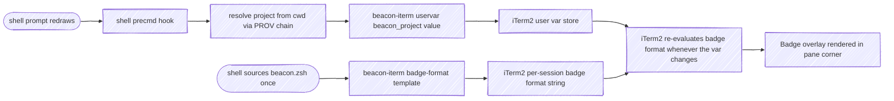
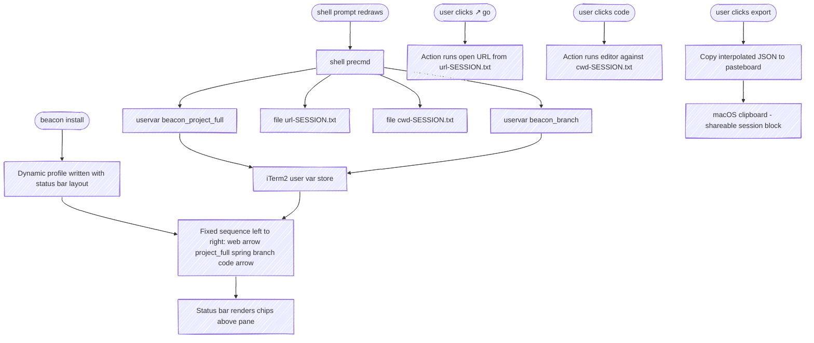
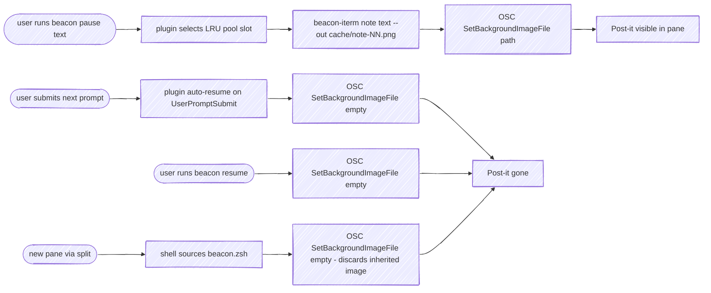

# beacon — Specification

At-a-glance session awareness across many concurrent Claude Code sessions. Each session displays its identity (which project, what task) and what's happening right now (status, with an optional user-supplied description) on a render target the user can scan without focusing — badge, tab color, and a marginalia card for richer context.

This document specifies requirements in [EARS](https://alistairmavin.com/ears/) form and outlines the first implementation: a CLI plus a Claude Code plugin targeting iTerm2 on macOS with zsh.

---

## 1. Concepts

### 1.1 Session

A single Claude Code instance running in a terminal window or pane. Sessions are independent and may number in the dozens concurrently. Session identity must persist across the lifetime of the terminal session (not just one Claude turn).

### 1.2 Signals

Each session has three signals that together describe it. Signals are orthogonal — each varies independently of the others.

| Signal  | Cardinality | Purpose                                          |
|---------|-------------|--------------------------------------------------|
| project | 1           | Identifies *which codebase* this session is in   |
| task    | 0..1        | Identifies *what unit of work* this session is on |
| status  | 1 (+ optional description) | Identifies *what's happening right now* |

### 1.3 Status values

**Status = what's happening right now.** Driven primarily by hooks (Claude activity) and secondarily by user overrides. Default `idle`.

| Value | Meaning | Driven by |
|:---|:---|:---|
| `idle` | Not actively engaged (turn just ended, just opened, freshly resumed) | Default; Hook Stop (turn finished, calm) |
| `working` | Claude is processing a turn | Hook UserPromptSubmit; Hook PreToolUse / PostToolUse (any tool) |
| `waiting` | Claude is actively blocked on the user (permission/idle prompt — highest user-attention priority) | Hook Notification (`idle_prompt` / `permission_prompt`) |
| `paused` | User has parked the session | `/beacon pause` or `/beacon status paused` |

Status accepts a user override via `/beacon status <value> [<description>]` (or `/beacon set status <value>`) and reverts to the provider chain on `/beacon clear status`. The optional description is a free-text note that feeds the marginalia overlay (OVERLAY-01); it lets the user attach recall context to any user-set status (e.g. `status waiting "bg data refresh ~30 min"`), not just `paused`.

### 1.4 Render target

A surface where signal state becomes visible. Render targets are pluggable; the first implementation targets iTerm2 on macOS. Other plausible targets: tmux status line, menubar app, Stream Deck, web dashboard.

### 1.5 Render collaborators

Three components write to iTerm2:

- **CLI** (`beacon-iterm`) — a stateless executable that translates simple commands into iTerm2 escape sequences and writes them to `/dev/tty`. Knows nothing about signals, sessions, or projects. The only writer that touches iTerm2 directly.
- **Plugin** (`beacon`) — a Claude Code plugin reacting to hooks and slash commands. Resolves signals through a chain-of-responsibility engine, then invokes the CLI to surface results. Owns `status`, the status description, and the marginalia overlay.
- **Shell integration** — a sourceable zsh snippet shipped with the plugin. Owns `project` and `branch`, refreshed on every prompt. Calls the CLI directly to publish user vars; never goes through the plugin.

The plugin and shell write to disjoint user-var slots, so neither overwrites the other. The badge format (set once on the iTerm2 profile) consumes the relevant slots and re-evaluates whenever any var changes.

### 1.6 Provider

A function that attempts to derive a signal value from some source (file, environment, command output, user override). Each signal is resolved by walking a list of providers in priority order.

### 1.7 Chain of responsibility

For each signal, a list of named providers is consulted in order. The first provider that returns a non-empty value wins. The provenance (which provider supplied the value) is recorded for debugging.

---

## 2. Deliverables

beacon ships as three discrete deliverables. Section 3 organizes requirements around them.

| ID  | Deliverable | Form | Owns |
|:---|:---|:---|:---|
| **D1** | This specification | `docs/spec.md`, served via the docsify site | Requirements, architecture, scope. |
| **D2** | `beacon-iterm` CLI | A standalone executable on `$PATH` | Translating subcommands into iTerm2 escape sequences. Stateless; no Claude awareness. |
| **D3** | `beacon` Claude Code plugin | A plugin tree (hooks, skill, command, scripts, shell snippet, profile installer) | Hook handlers, COR resolver, slash command, skill, shell integration, profile installation. Calls D2 for every iTerm2 surface change. |

**Boundary discipline.** D2 has no knowledge of D3. D3 ships its shell snippet, which calls D2. D2 can be used outside Claude Code entirely (e.g. from CI scripts, ad-hoc terminal tools) — that is the test of whether the seam is clean.

---

## 3. Functional Requirements (EARS) — target-agnostic

These requirements describe what beacon does conceptually. They would apply unchanged to a non-iTerm2 render-target adapter (e.g. a future `beacon-tmux` or `beacon-kitty`). The iTerm2-specific implementation details are factored into §4.

| Namespace | Slice                                                       |
|:---|:---|
| `RES`   | Signal resolution model |
| `PROV`  | Provider chains |
| `HOOK`  | Claude Code hook event handlers |
| `OVR`   | User overrides (`set` / `clear`) |
| `STATE` | User-set status, pause / resume semantics |
| `SKILL` | Skill responsibilities (CLI freshness) |
| `CMD`   | Slash command surface |

### 3.1 Signal resolution (RES)

**RES-01.** The plugin shall resolve each signal via a chain of providers, returning the first non-empty value.

**RES-02.** The plugin shall record the name of the provider that supplied each resolved value.

**RES-03.** When no provider returns a value for `status`, the plugin shall use `idle`.

**RES-04.** When no provider returns a value for `task`, the plugin shall treat task as absent (omit from displays).

**RES-05.** When no provider returns a value for `project`, the plugin shall use a non-empty placeholder so downstream rendering does not fail.

### 3.2 Provider chains (PROV)

**PROV-01.** For `project`, the plugin shall consult providers in this order: user override, package manifest (`package.json` `name`, `Cargo.toml` `[package].name`, `pyproject.toml` `[project].name`), git remote origin (repo basename — the last path segment of the remote URL), project root directory name. The badge wants a short, scannable label; the owner-bearing identity is exposed separately via the `project_full` status-bar chip. See PROV-06 for the final pwd fallback when none of these provide a value.

**PROV-02.** For `task`, the plugin shall consult providers in this order: user override, GitHub PR title (`gh pr view`), git branch name (when not in `{main, master, develop, trunk, HEAD}`).

**PROV-03.** For `status`, the plugin shall consult providers in this order: user override, hook signal, default (`idle`). When the user override is `status paused [description]`, the description is persisted alongside the override and feeds the marginalia overlay (OVERLAY-01); user-set descriptions on non-paused statuses (e.g. `status waiting "bg refresh"`) follow the same path.

**PROV-05.** When detecting project root, the plugin shall walk parent directories looking for any of `.git`, `package.json`, `Cargo.toml`, `pyproject.toml`, `go.mod`, `.hg`, `pom.xml`, `Gemfile`, stopping at `$HOME`. The first directory containing any marker (and within `$HOME`) is the project root.

**PROV-06.** When no provider in PROV-01's chain returns a value for `project` (no override, no package manifest, no git remote, no project root marker found within `$HOME`), the plugin shall use the abbreviated current working directory as a spatial-context fallback: `$HOME` substituted with `~`. Examples:

```text
/Users/cpeterson/src          →  ~/src
/Users/cpeterson              →  ~
/tmp                          →  /tmp
```

The fallback is not parenthesized — it appears as a real path so it reads naturally in the badge alongside actual project names. The PROV chain order is therefore: override → package manifest → git remote → project-root dir name → pwd fallback.

**PROV-07.** For `url` (the "best URL relevant to this session"), the plugin shall consult providers in this order, returning the first non-empty value:

1. **User override** — set via `/beacon set url <url>`
2. **Tack-derived URL** — when `tack` is on `$PATH` and has a route whose slug matches the current git branch (or whose `tack find <pwd>` returns a route), an inner chain of:
   a. The route's first `status: in_progress` tack's `deliverable.url`
   b. The route's most-recently-updated `status: done` tack's `deliverable.url`
   c. The first `link.url` on any tack
3. **Forge probe** — when the git remote is on a recognized forge and the matching CLI is on `$PATH`, query the forge for an open PR/MR whose source branch matches the current branch: `gh pr list --head <branch>` for github hosts, `glab mr list --source-branch <branch>` for gitlab hosts. Returns the first match. Probes are silent on missing tool, unrecognized host, or failure
4. **Branch URL** — derived from the git remote: `<remote>/tree/<branch>` for GitHub-like, `<remote>/-/tree/<branch>` for GitLab-like (only when not on a default branch)
5. **Project URL** — bare git remote URL (e.g. `https://git.example/acme/widgets`)
6. **Empty** — when none of the above produces a value

The integrations with `tack`, `gh`, and `glab` are *soft*: beacon detects each at runtime and uses it if present. There is no hard dependency, no shipped tool code in beacon. Users can replace step 2 or step 3 with another provider (Linear, Jira, GitHub Issues, custom) by overriding the shell function `_beacon_resolve_url`.

### 3.3 Hook handlers (HOOK)

**HOOK-01.** When the user submits a prompt, the plugin shall set `signal.status = working`.

**HOOK-02.** When Claude finishes a turn (Stop hook fires) and `stop_hook_active` is not set, the plugin shall set `signal.status = idle`. Rationale: a finished turn is calm, not user-blocking. Reserving `waiting` (red) for actual permission/idle prompts (HOOK-03) makes red high-signal — "this pane needs an answer right now" — so a glance at many panes distinguishes calm sessions from sessions truly blocked on the user.

**HOOK-03.** When Claude requests user attention (Notification hook with matchers `permission_prompt` and `idle_prompt`, configured as separate matcher entries), the plugin shall set `signal.status = waiting` and record the prompt subtype (`permission` or `idle`) so BADGE-15 can render the right watermark. The two prompt kinds carry different urgency: `permission_prompt` is hard-blocking (Claude cannot proceed without an answer); `idle_prompt` is softer and often a false positive — Claude Code fires it whenever the agent is idle, including while a `run_in_background` tool is still in flight after the turn's Stop event. Both still produce a red badge; the watermark distinguishes them.

**HOOK-03a.** When any tool is about to run (PreToolUse) or has just returned (PostToolUse), the plugin shall set `signal.status = working`. This re-asserts working state mid-turn so the badge does not remain red for the rest of the turn while Claude is actively running tools and thinking. A user-set status override (including `status paused`) wins per OVR-02, so an explicitly-parked session is unaffected.

**HOOK-03b.** When Claude requests user attention (HOOK-03), the plugin shall set a sticky `pending-attention` marker whose value records the prompt subtype (`permission` or `idle`). The marker survives subsequent PostToolUse `working` writes and shall be cleared when the next tool actually starts (PreToolUse), when the user submits a prompt (UserPromptSubmit), or when the turn ends (Stop). While the marker is set, the resolved badge shall reflect the `blocked` color state regardless of `signal.status` (BADGE-09a) and shall pick the matching watermark per BADGE-15. Rationale: hook delivery is not strictly ordered, so a late PostToolUse for an earlier tool may arrive after a fresh permission-prompt Notification for a new tool; without the sticky marker, the badge would briefly flip back to `busy` while the user is in fact still blocked.

**HOOK-08.** When a Claude session starts (SessionStart hook), the plugin shall capture the cwd Claude was invoked with as the session's **navigational anchor** and publish the full set of status-bar slots (`beacon_project`, `beacon_project_full`, the five `beacon_branch*` slots, `beacon_url`) plus the per-session handoff files (`cwd-$ITERM_SESSION_ID.txt`, `url-$ITERM_SESSION_ID.txt`) that the `↗ code` and `↖ web` action buttons consume. The plugin shall additionally record the resolved project name as `anchor.project` per-session state. The anchor cwd is fixed at SessionStart and does not follow Claude's Bash subprocess cwd; chip *values* read from the anchor may evolve (see HOOK-08b). This duplicates the shell integration's prompt-driven publish path (§6.5); in interactive (non-Claude) shell sessions the shell continues to track the user's actual PWD as expected.

**HOOK-08a.** When SessionStart fires with `source` other than `resume` (i.e. `startup` or `clear`), the plugin shall clear stale per-session signals before publishing the anchor — specifically `override.*`, `signal.status`, `pending-attention`, `description`, and `note-image`. Rationale: per-session state files key on `ITERM_SESSION_ID`, which is the iTerm pane and outlives any single Claude session, so a fresh `claude` invocation or `/clear` in a pane that previously hosted a session ending mid-permission-prompt would otherwise inherit `signal.status = waiting` + `pending-attention` and render red. `resume` is excluded because resumed sessions continue prior context by design.

**HOOK-08b.** On the Stop hook (end of each turn), the plugin shall re-resolve and republish the chip slots (`beacon_project_full`, the five `beacon_branch*` slots, `beacon_url`) and the per-session handoff files from the anchor cwd. `beacon_project` and `beacon_task` are owned by the engagement renderer (BADGE-02 / BADGE-12) and are not touched. Rationale: turn-by-turn the agent may create a branch, switch branches, or sharpen the URL provider's answer (e.g. the user pins a tack deliverable mid-session) — these are narrowings of the session's identity, not subprocess drift, and the chips should reflect them. The shell's prompt-driven publish path (§6.5) cannot run while Claude holds the terminal; this hook covers the gap.

**HOOK-01a.** When the user submits a prompt that begins with a fresh-start slash command (currently `/recipe`), the plugin shall apply the same wipe as HOOK-08a before processing the prompt's `signal.status = working` (HOOK-01). Rationale: in-session commands that re-bootstrap context are not surfaced to hooks as a SessionStart event, so without this, signals from the prior task would contaminate the new context. The set of fresh-start commands is a tunable list maintained alongside the hook handler.

**HOOK-03c.** When the resolved badge would be `blocked` because of `pending-attention` or `signal.status = waiting`, the plugin shall consult the session's transcript (path captured from any hook payload's `transcript_path`). If the most recent assistant message text matches an idle pattern (currently `^\s*ready\b`, case-insensitive), the plugin shall clear the stale markers and re-resolve. Rationale: HOOK-03b's natural clears (Stop / PreToolUse / UserPromptSubmit) are not always reachable — a session killed mid-permission-prompt leaves the markers behind with no hook firing to clear them. The transcript is the ground truth for whether Claude actually finished a turn; the heuristic forgives the missing Stop without requiring it. When the heuristic doesn't apply (no transcript, non-matching text), the user can fall back to `clear` (no field, OVR-04) for an unconditional reset to calm defaults.

### 3.4 User overrides (OVR)

**OVR-01.** When the user invokes `set <field> <value>`, the plugin shall persist the value as an override for that field. Valid fields: `project`, `task`, `status`, `url`.

**OVR-02.** A user override shall always win over auto-detected values for the same signal.

**OVR-03.** When the user invokes `clear <field>`, the plugin shall remove only that field's override. Clearing `status` also removes the user-set description (STATE-02).

**OVR-04.** When the user invokes `clear` with no field, the plugin shall remove all overrides for the session, remove the description and `note-image` reference, and drop sticky red markers (`pending-attention` and `signal.status` if equal to `waiting`). Rationale: `clear` is the user saying "return this pane to calm defaults"; the description, note-image, pending-attention, and a stuck `waiting` signal all belong in that set of transient state to wipe. Leaving the description / `note-image` would keep the marginalia overlay on screen with no override backing it; leaving `pending-attention`/`signal.status=waiting` would keep the badge red on a session the user has just told us is calm. If the session is genuinely blocked, the next Notification re-asserts both. `clear <field>` remains overrides-only.

### 3.5 User-set status (STATE)

Pause is no longer a separate concept; it is one possible status value (`paused`) the user can set, alongside `idle`, `working`, and `waiting`. Any user-set status accepts an optional description that feeds the marginalia overlay (OVERLAY-01). Skill plan/review signaling is gone with stage (see §3.6 for what remains of SKILL).

**STATE-01.** When the user invokes `status <value> [<description>]`, the plugin shall persist `<value>` as `override.status` and `<description>` (if any) as the session's description. `<value>` must be one of `idle`, `working`, `waiting`, `paused`.

**STATE-02.** When the description is non-empty and the render target supports rich graphics, the plugin shall produce the marginalia overlay carrying the description text in a form suited to recall context (legible from outside the pane, not destructive to the underlying terminal content when the user returns). Adapter-specific overlay behaviors are in §4.5. The description shall not write a `task` override; the badge's task slot keeps whatever it had. Rationale: descriptions carry recall context and are typically a sentence or longer; reusing them as the task signal overflows the badge.

**STATE-03.** When the user sets `status paused`, the plugin shall snapshot the current resolved `project` and `task` into overrides so the badge keeps its identity while the session is parked.

**STATE-04.** When the user submits a prompt and `override.status` is `paused`, the plugin shall remove the status override and description before processing the prompt's hook signal. The render adapter shall clear the marginalia overlay. Other user-set status overrides (e.g. `status waiting "bg refresh"`) are not auto-cleared on prompt submission — only `paused` is. Rationale: pause means "I'm stepping away"; a returning prompt is the natural resume signal. Other user-set statuses are deliberate labels the user expects to persist until they explicitly clear them.

**STATE-04a.** When the user submits a prompt whose text matches a pause-intent pattern (e.g. "stepping away", "brb", "break 'til 4", "pause until …"), the plugin shall apply STATE-01..03 with `status paused` and the full prompt text as the description, instead of clearing the paused override. The prompt itself is not suppressed — it still flows through to Claude. Rationale: lets users announce a pause in natural language without remembering the explicit `pause` subcommand.

**STATE-05.** Auto-resume (STATE-04) shall preserve `task` and `project` overrides set by STATE-03.

**STATE-06.** When the user invokes `resume`, the plugin shall remove all overrides and the description. The render adapter shall clear the marginalia overlay.

**STATE-07.** `pause [<note>]` shall be a synonym for `status paused [<note>]`. `resume` (STATE-06) is the natural inverse for both surfaces.

### 3.6 Skill responsibilities (SKILL)

**SKILL-01.** The skill shall instruct Claude not to invoke beacon for signals already covered by hooks (status transitions during a turn).

**SKILL-02.** The skill shall instruct Claude not to narrate its beacon invocations to the user.

**SKILL-03.** The skill shall, on first invocation per session, compare `beacon --version` against `<plugin-root>/.claude-plugin/plugin.json#version` and offer `/beacon:beacon install` (or equivalent) when they differ. This catches CLI-wrapper drift after a plugin upgrade — the same drift signal CMD-13 / Architecture Rule 11 cover from the hook side.

### 3.7 Slash command (CMD)

**CMD-01.** When the user invokes `show`, the plugin shall display each signal's current value, the provider that supplied it, and the description (if set).

**CMD-02.** When the user invokes `set <field> <value>`, the plugin shall apply OVR-01 and re-render.

**CMD-03.** When the user invokes `clear [<field>]`, the plugin shall apply OVR-03 or OVR-04 and re-render.

**CMD-04.** When the user invokes `status <value> [<description>]`, the plugin shall apply STATE-01..03 (the project/task snapshot in STATE-03 fires only for `paused`) and re-render. When the user invokes `pause [<note>]`, the plugin shall treat it as `status paused [<note>]` per STATE-07.

**CMD-05.** When the user invokes `resume`, the plugin shall apply STATE-06 and re-render.

**CMD-06.** When the user invokes `reset`, the plugin shall remove all per-session state and clear all render-adapter surfaces.

**CMD-07.** When the user invokes `render`, the plugin shall force a re-render with the current resolved state without changing any state.

**CMD-08.** When the user invokes `install`, the plugin shall perform every bootstrap step the active render adapter can complete without an iTerm2 restart, print one line per step, and emit a deferred-action notice for any steps it cannot complete in-place (see CMD-12). The adapter's specific step list is captured in the adapter section — for iTerm2, see STATUS-BAR-01 and OVERLAY-04.

**CMD-09.** When the user invokes `completions zsh`, the plugin shall install a tab-completion script such that `beacon <TAB>` works in a fresh zsh session. With `--print`, the plugin shall print the script to stdout instead of installing. Install location and `fpath` plumbing are implementation details (see §6.5).

**CMD-12.** When the user invokes `exclusive-configuration`, the plugin shall apply iTerm2 prefs that require iTerm2 to be fully quit (because iTerm2 caches prefs in memory and overwrites the plist on quit). The covered prefs are:

- **Default profile** — set the beacon dynamic profile as iTerm2's default profile.
- **Bg-image trust pre-approval** — every pool slot path plus the empty-string sentinel approved (subset of CMD-08, finished here when `install` had to defer).

Behavior:

1. If both prefs are already correct, the plugin shall exit early ("nothing to do").
2. If iTerm2 is not running, the plugin shall apply each write conditionally (skip already-correct prefs) and relaunch iTerm2.
3. If iTerm2 is running, the plugin shall confirm intent interactively (skippable with `--yes`), warn the user that all iTerm2 windows and panes will close, quit iTerm2, and apply the writes after iTerm2 has exited. The orchestration mechanism (detached helper, AppleScript quit, log path for post-mortem) is captured in §6.10.

**CMD-13.** When the user invokes `install-cli [--dir <path>]`, the plugin shall write an executable wrapper named `beacon` to `<path>` (default `~/.local/bin`) that execs the source script at `${PLUGIN_ROOT}/scripts/beacon`. The wrapper hardcodes its target path at install time and does not auto-refresh on plugin upgrade — drift is detected by the SessionStart freshness hook (Architecture Rule 11), which compares `beacon --version` against `plugin.json#version` and nudges the user to re-run install-cli when they differ. The subcommand shall also install zsh completions (CMD-09) so users never need a second command for tab completion to work. When the target directory is not on `$PATH`, the plugin shall print a warning.

**CMD-14.** When the user invokes `copy-url`, the plugin shall copy the resolved `url` signal to the system clipboard. This is the back-end for the `↖ web` action chip's coprocess (STATUS-BAR-02). When invoked as `open-url`, the plugin shall open the resolved `url` in the user's default browser. Both subcommands read from the per-session handoff files written by the shell integration (STATUS-BAR-05).

**CMD-15.** When the user invokes `json`, the plugin shall print the resolved-state payload (signals, providers, description) as a single JSON object on stdout. This is consumed by the shell integration and by external observers (e.g. iTerm2 status bar coprocesses) that need the full state without parsing the human-readable `show` output.

**CMD-16.** When the user invokes `data-dir`, the plugin shall print the resolved `<DATA_DIR>` path on stdout. This is an internal contract used by the shell integration to locate the per-session handoff files.

---

## 4. iTerm2 adapter requirements

The first deliverable adapter targets iTerm2 on macOS with zsh. Section 4 collects every requirement that depends on iTerm2 specifics — escape sequences, OSC payloads, plist quirks, profile layouts. A future adapter for tmux / kitty / a web dashboard would replace §4 entirely while leaving §3 untouched.

### 4.1 Pane anatomy

beacon writes to **exactly four surfaces** of an iTerm2 window. Every other surface is owned by Claude Code, the user's profile, or other tools, and beacon shall not touch them:

```text
┌─[ tab ]─────────────────────────────────────────┐ ← §4.7 tab color
│ STATUS BAR  ↖ web · project   branch   cwd ↗    │ ← §4.4 fixed layout, two springs
├─────────────────────────────────────────────────┤
│                                       ┌────────┐│
│   pane content                        │ project││ ← §4.3 badge
│                                       └────────┘│   in top-right corner
│                                 ╭─────────────╮ │
│                                 │█ PAUSED ·   │ │
│                                 │█             │ │ ← §4.5 background image
│                                 │█ description │ │   (when status has
│                                 ╰─────────────╯ │    a description)
└─────────────────────────────────────────────────┘
```

| Area | Section | Namespace | Purpose | Mechanism |
|:---|:---|:---|:---|:---|
| Badge | §4.3 | `BADGE` | At-a-glance "where am I" + traffic-light status color | OSC `SetBadgeFormat` + `SetUserVar` for text; one dynamic profile per status (`SetProfile=`) for color + alpha + optional state image. Paused state overlays via OSC `SetColors=badge=` |
| Status bar | §4.4 | `STATUS-BAR` | Fixed-layout context + cross-session actions (`go`, `code`, `export`) | Dynamic profile + `SetUserVar` + Action component |
| Background image | §4.5 | `OVERLAY` | Pause overlay (marginalia card) | OSC `SetBackgroundImageFile` (overlays the profile's static state image, if any) |
| Tab color | §4.7 | `TAB` | Tab-strip mirror of the badge traffic-light, for tabs-not-panes workflows | Per-status dynamic profile carries `Tab Color`; paused state overlays via OSC `SetColors=tab=` |

beacon shall **not** write to: terminal background color, terminal foreground color, window title, tab title, cursor color/shape. These are Claude Code's domain (window title) or the user's profile (terminal colors, cursor). Badge and tab color are the only signal-coloring surfaces beacon paints — both carry the same logical traffic-light state on different scopes (badge is per-pane, visible inside the pane and in Mission Control; tab color is per-tab, visible in the tab strip when many tabs are open).

### 4.2 CLI: `beacon-iterm` (CLI)

The CLI is the only writer to iTerm2. It exposes one subcommand per surface beacon writes to.

**CLI-01.** The system shall expose a single executable `beacon-iterm` with subcommands for every iTerm2 surface beacon writes to.

**CLI-02.** All escape sequences shall be written to `/dev/tty`. When `/dev/tty` is unavailable, the CLI shall fall back to stdout so the tool remains usable in piped contexts.

**CLI-03.** When invoked as `beacon-iterm uservar <name> <value>`, the CLI shall publish `user.<name>=<base64(value)>` via `OSC 1337 SetUserVar`. An empty `<value>` is allowed and clears the slot.

**CLI-04.** When invoked as `beacon-iterm bg-image <path>`, the CLI shall set the per-session background image via `OSC 1337 SetBackgroundImageFile=<base64(path)>`. When invoked as `beacon-iterm bg-image clear`, the CLI shall clear the per-session image.

**CLI-05.** When invoked as `beacon-iterm note <label> <text> [--out <path>]`, the CLI shall compose a marginalia overlay image (a right-anchored card carrying `<text>` under the uppercase status `<label>` per OVERLAY-01), save it (to `<path>` if provided, else a tempfile), and set it as the per-session background image. The `<text>` accepts a small markdown subset (first line of a multi-line note is the heading; `*`-runs toggle bold, `_`-runs toggle italic, `~`-runs toggle strikethrough; body lines beginning with `* ` render as bulleted list items); the renderer is the single source of truth for which markers it honors.

**CLI-06.** When invoked as `beacon-iterm badge-format <template>`, the CLI shall set the per-session badge format via `OSC 1337 SetBadgeFormat=<base64(template)>`. The template may reference user variables as `\(user.foo)`; iTerm2 re-evaluates the template whenever any referenced variable changes.

**CLI-07.** When invoked as `beacon-iterm clear`, the CLI shall reset the surfaces it controls — badge color to default, tab color to default, and bg image to empty.

**CLI-08.** Re-invoking the CLI with the same arguments shall produce the same iTerm2 effect (idempotent).

**CLI-09.** The CLI shall require no environment variables to operate. It shall exit non-zero with a clear error message on invalid arguments and shall not silently fail.

**CLI-10.** When invoked as `beacon-iterm badge-color <hex|default>`, the CLI shall set the per-session badge color via `OSC 1337 SetColors=badge=<hex>` (or `=default` to revert). The hex is 6 digits without a leading `#`.

**CLI-11.** When invoked as `beacon-iterm tab-color <hex|default>`, the CLI shall set the per-tab color via `OSC 1337 SetColors=tab=<hex>` (or `=default` to revert). The hex is 6 digits without a leading `#`. iTerm2 binds tab color to the tab containing the calling session; in multi-pane tabs the most-recent painter wins, which the user is expected to manage via a tabs-not-panes workflow (one Claude session per tab).

**CLI-12.** When invoked as `beacon-iterm uservar-batch`, the CLI shall read newline-separated `<name>=<value>` pairs from stdin and publish each via the same OSC 1337 `SetUserVar` mechanism as CLI-03, in a single process invocation. This reduces flicker when SessionStart paints the full status-bar slot set (HOOK-08), where 10 sequential CLI invocations produced visible incremental redraws.

**CLI-14.** When invoked as `beacon-iterm set-profile <name>`, the CLI shall switch the current session's profile via `OSC 1337 SetProfile=<name>`. The named profile must exist in iTerm2's DynamicProfiles directory; iTerm2 silently ignores unknown names, which the plugin treats as a fatal install-time misconfiguration rather than a runtime error. A profile switch atomically applies the new profile's `Badge Color` (with alpha), `Tab Color`, and `Background Image Location` — and atomically wipes any prior session-specific OSC overrides for those keys. This atomic wipe-and-apply is the mechanism behind RENDER-04's resume-from-pause cleanup.

**CLI-15.** When invoked as `beacon-iterm clear-screen`, the CLI shall emit ANSI CSI `2J` (erase visible viewport) followed by CSI `H` (cursor home) to `/dev/tty`. Scrollback is intentionally preserved — the user can scroll up to see pre-clear history. Used by the pause render path (OVERLAY-01) so the marginalia card overlay paints onto a blank canvas instead of competing with TUI text rendered on top of it (iTerm2 bg images render *behind* terminal text).

### 4.3 Badge area (BADGE)

The badge carries **just `<project>`** as its text — the most compact signal possible, visible in the corner of every pane regardless of profile. Project value is PROV-01 (e.g. `acme/widgets`).

Beyond text, the badge carries one additional signal: **color, driven by `status`** (BADGE-09). This is the highest-leverage surface for many-window awareness — the badge is the only beacon-painted element large enough to read in Mission Control / Exposé. Branch and richer context are surfaced in the status bar (§4.4) instead.

The whole section is gated on **engagement** (BADGE-14): a pane that has never been the subject of a beacon-aware action shows no badge at all, so a freshly-opened terminal looks like an unmanaged terminal. All requirements below describing badge painting, color, and text apply only once the pane has engaged.



**BADGE-01.** The plugin distribution shall include a sourceable shell integration (`shell/beacon.zsh`) that the user adds to `.zshrc`.

**BADGE-02.** The plugin shall be the sole writer of `beacon_project`. The shell integration shall not publish `beacon_project` from precmd or chpwd — the badge text follows intentional signals (user overrides via `set project`, SessionStart anchor via HOOK-08) rather than the user's current working directory. The status-bar user-vars (branch, project_full, url) remain cwd-driven and continue to be published by the shell integration on every prompt — the status bar is a different surface with a different contract.

**BADGE-03.** The shell integration shall set the iTerm2 badge format on source so the badge renders the project and task user-vars. The format string is an implementation detail; the user-observable contract is "the badge text reflects the resolved project value, followed by the resolved task value when present" (BADGE-02 + BADGE-04). The task slot is self-collapsing — when no task is resolved (RES-05), the badge shows project alone.

**BADGE-04.** When the project provider chain finds no marker, the shell integration shall publish the PROV-06 pwd fallback (e.g. `~/src`) so the badge always carries useful spatial context, never empty.

**BADGE-05.** The shell integration shall use the same project-root walk algorithm as PROV-05 to keep `user.beacon_project` consistent with the plugin's notion of project.

**BADGE-06.** The shell integration shall be idempotent — sourcing it twice in the same shell shall not duplicate hooks or output.

**BADGE-07.** The plugin shall provide an `install-cli` subcommand that drops a `beacon` wrapper at `~/.local/bin/beacon` (or a user-supplied directory via `--dir`) so `beacon <subcommand>` works as an interactive command on PATH and so tab completion (loaded as `_beacon`) attaches to the right command name. The wrapper hardcodes a path to the source script at install time and is the single mechanism by which `beacon` appears on PATH; the shell integration does not define a `beacon` alias. Plugin upgrades do not auto-refresh the wrapper — see CMD-13 and Architecture Rule 11.

**BADGE-08.** The shell integration shall expose `_beacon_resolve_url()` as a public zsh function implementing the PROV-07 chain. Users may redefine this function in their `.zshrc` (after sourcing `beacon.zsh`) to substitute non-tack URL providers (Linear, Jira, GitHub Issues, etc.) without forking beacon.

**BADGE-09.** The plugin shall set the badge color on every status change, mapping the resolved status to a logical color state:

| Status | Color state | Semantics |
|:---|:---|:---|
| `idle` | `ready` | Default; nothing is happening |
| `working` | `busy` | Claude is processing; don't interrupt |
| `waiting` | `blocked` | Claude needs the user (highest attention) |

The mapping `state → hex` lives in implementation, not this spec, so the palette can be tuned without amending requirements. Logical names (`ready` / `busy` / `blocked` / `blocked-idle`) are the contract. The `blocked-idle` state is reserved for idle-prompt subtype waiting (BADGE-15 / HOOK-03b) and shares `blocked`'s red hex; it differs only in its watermark.

**BADGE-09a.** Two conditions take precedence over the BADGE-09 mapping and force a fixed color state regardless of the underlying provider chain. Precedence is `status=paused` (when set via override) > `pending-attention` — pause is the most explicit user intent; pending attention demands action:

- `override.status = paused` (STATE-01) forces the `paused` state (BADGE-10) — pause is a user-initiated halt, distinct from being blocked on the user.
- The `pending-attention` marker (HOOK-03b) forces the `blocked` state when the recorded subtype is `permission` and `blocked-idle` when the subtype is `idle`. Both are sticky over the BADGE-09 mapping so a stray PostToolUse from an earlier tool can't repaint the badge `busy` while a prompt is still open.

When neither flag is set, BADGE-09 applies.

**BADGE-10.** While the session is paused, the plugin shall set the badge color to the `paused` logical state — a de-emphasized color (e.g., gray) distinct from `ready` / `busy` / `blocked` — so a paused session is visually distinguishable from a session blocked on the user. The pause overlay (OVERLAY-01) carries the note text; the badge color carries the at-a-glance "this session is parked" signal that is readable in Mission Control where the overlay's text is not. The `state → hex` mapping lives in implementation, consistent with BADGE-09.

**BADGE-12.** When the resolved `project` value changes between render passes — whether driven by `set project` / `clear project` (OVR-01 / OVR-03), or by any provider re-evaluation — the plugin shall republish `beacon_project` so the badge text tracks the value reported by `show` (CMD-01). Rationale: HOOK-08 paints `beacon_project` once at SessionStart; without BADGE-12, subsequent overrides land in state and `show` reports them but the iTerm badge silently keeps the SessionStart value, diverging from `show`.

**BADGE-13.** The plugin shall render the badge such that it remains legible when the pane is shrunk to Mission Control / Exposé thumbnail size while not occluding the terminal content beneath it at normal zoom. The plugin shall achieve this through a combination of sizing constraints on the badge's bounding box and partial transparency on the badge color; specific values (height fraction, alpha) are tunable in implementation.

**BADGE-14.** While no beacon-aware action has occurred in a pane, the plugin shall leave the badge unpainted in that pane. A beacon-aware action is any of: a Claude Code hook invocation, a `/beacon` slash command, or a direct `beacon` CLI invocation in that pane. When `beacon clear` is invoked, the plugin shall return the badge to its unpainted state, requiring a subsequent beacon-aware action to re-engage.

**BADGE-15.** A status logical state may carry a **static state image** painted as the pane's background, visible behind terminal content as a watermark. The mapping `state → image` is implementation-tunable. At minimum:

- `blocked` shall carry an `!` watermark — the hard-blocking case (permission prompt) where Claude cannot proceed without a human answer.
- `blocked-idle` shall carry a `?` watermark — the softer case (idle prompt) that is often a spurious "Claude is idle" signal during background work.

States without a configured image render no watermark. The marginalia card (OVERLAY-01) is dynamic and takes precedence whenever the session has a non-empty description: the card overlays whatever static state image the underlying status would otherwise show, and is cleared automatically on resume / `clear`.

### 4.4 Status bar area (STATUS-BAR)

The status bar carries **a fixed-layout strip of values and actions** that complement the badge: an abbreviated project URL (identification) and the branch, paired with action buttons to navigate (`↖ web`) and open the cwd in an editor (`↗ code`). It is delivered via a beacon-managed dynamic profile that the user opts into.

Layout is fixed (no dynamic show/hide based on values). Chip text is rendered in the profile's default text color — kind-based per-chip palettes were tried and dropped because, with positions fixed, the colors became decorative rather than informative. Value-based coloring (e.g. status chip turns red when waiting) requires a custom Python component and is out of scope; the badge color (BADGE-09) covers the same need.



**STATUS-BAR-01.** The `install` command shall write a beacon dynamic profile (carrying the status bar layout from STATUS-BAR-02) into iTerm2's `DynamicProfiles` directory, inheriting from the user's currently-default profile. iTerm2 watches that directory and reloads dynamic profiles without restart, so this write succeeds even while iTerm2 is running. Filename and exact directory path are an iTerm2 contract documented in §6.

The `install` command shall **not** make the beacon profile iTerm2's default automatically. Setting `Default Bookmark Guid` requires iTerm2 to be fully quit (it caches prefs in memory and overwrites the plist on quit), and silently quitting the user's only terminal is unacceptable. Instead, the installer shall print:

1. The manual click path: *iTerm2 → Settings → Profiles → 'beacon' → Other Actions ▾ → Set as Default*.
2. A pointer to the dedicated subcommand `beacon exclusive-configuration` (CMD-12) which orchestrates the quit + relaunch.

**STATUS-BAR-02.** The dynamic profile shall enable the status bar with the following fixed chip layout, left to right. The sequence places the **`↖ web` action + project identity** flush left and the **branch + `↗ code` action** flush right, with a single spring absorbing the slack between them — each end pairs an action chip with the data chip it acts on.

Chip-by-chip behavior:

1. **`↖ web` action button** — link-blue. Always visible. Clicking shall navigate to the URL resolved for the session (PROV-07); when no URL has been resolved, clicking shall navigate to a generic search-engine landing page so the click is never a no-op.
2. **Project identity** — abbreviated remote project URL (e.g. `gh:acme/widgets`), rendered in a dimmer link-blue so the action chip reads as the bright control and the identity reads as its target. Known forge hosts (`github.com`, `gitlab.com`, `bitbucket.org`) collapse to a 2-letter prefix joined by `:`; unknown hosts render as `host/owner/repo`. When the resolved `↖ web` URL points at a forge issue/PR/MR (PROV-07 — typically a tack-tracked deliverable or a user override), the chip appends `#<n>` for issues/PRs or `!<n>` for GitLab merge requests (e.g. `gh:acme/widgets#42`, `gl:foo/bar!17`) so the chip answers "what am I working on" rather than only "what repo am I in." Bare repo and branch-tree URLs leave the chip showing project identity only. Identification only — not clickable.
3. **Spring** — pushes the trailing branch + `↗ code` cluster to the right edge.
4. **Branch (synced)** — bare branch name, rendered in green. Visible only when the local branch is synced with its upstream.
5. **Branch (diverged)** — branch name with a leading ahead/behind indicator (`↑N`, `↓N`, or `↑N↓M` — e.g. `↑3 main`, `↓1 feature`, `↑3↓1 main`), rendered in orange. Visible only when the branch is ahead, behind, or both. The indicator sits left of the name so a vertical scan of stacked panes can spot divergent branches without re-parsing each name.
6. **Branch (untracked)** — bare branch name, rendered in dim gray. Visible only when the branch has no upstream tracking ref. The three branch chips are **mutually exclusive** — exactly one renders when in a git repo, none when outside one.
7. **`↗ code` action button** — magenta. Always visible. Clicking shall open the session's local cwd in VS Code.

Action-chip color matches the data cluster it anchors so each CTA visually ties to its target; data chips render in a dimmer shade. The chip sequence is fixed in position; only the mutually-exclusive branch triple collapses.

**STATUS-BAR-03.** Action chips shall remain visible regardless of underlying state. Data chips other than the branch triple shall always render. The branch triple shall use value-based coloring (green / orange / dim gray) to communicate sync state at a glance. Empirical iTerm2 quirks that constrain the implementation (action chips ignoring `remove empty components`, coprocess actions not interpolating user vars, SwiftyString comparison expressions being unreliable) are captured in §6.10.

**STATUS-BAR-05.** When the shell prompt redraws, the shell integration shall publish the values the status bar consumes — full project URL, branch text + sync state (with derived per-state slots so the profile does not need conditional expressions), local cwd with `~`-substitution, and the resolved URL. The integration shall also write per-session handoff files for the `↖ web` and `↗ code` action buttons, since iTerm2 coprocess actions cannot interpolate user variables. During a Claude session the shell prompt cannot redraw, so the plugin covers the gap: SessionStart paints the anchor (HOOK-08) and Stop re-resolves chips from the anchor cwd each turn (HOOK-08b) so a new branch or a narrowed URL becomes visible. Between Claude sessions the shell resumes prompt-driven publishing and follows the user's actual PWD. The exact user-var names and handoff-file paths are an implementation contract between the shell snippet, the plugin, and the dynamic profile (see §6.5).

**STATUS-BAR-06.** The plugin shall not modify any other iTerm2 profile (the user's default, or any pre-existing profile). The status bar feature is delivered solely via the beacon dynamic profile.

### 4.5 Background image area (OVERLAY)

The background image carries two distinct workloads:

1. **Static state images (BADGE-15)** — painted by the active status profile (`blocked.png`, etc.). They live in the profile's `Background Image Location` key and switch atomically when the plugin invokes `set-profile` (CLI-14).
2. **Dynamic pause overlay** — painted only during pause, set per-session via OSC `SetBackgroundImageFile` (CLI-04). The overlay carries the user's note text and is rendered into a bounded image pool (OVERLAY-03).

The OSC overlay layers over whichever static state image is currently active, displacing it for the pane's lifetime until cleared. Resuming from pause invokes `set-profile` (CLI-14) which atomically wipes the OSC overlay and reveals the new status profile's static image (if any).



**OVERLAY-01.** When a session has a non-empty description (STATE-02 — set by `status <value> [<description>]`, `pause [<note>]`, or the natural-language pause-intent path), the plugin shall invoke `beacon-iterm note <text>` to render and paint the marginalia overlay. The overlay shall lay out as a right-anchored card with a small top inset so it clears the iTerm2 status bar (the bg image fills the entire pane region, so a flush-top card visually merges with the status bar above it). The card is a lifted-dark Dracula panel with a vertical accent stripe in the action-affordance hue (pink, THEME-03) running the card's full height on its inner (left) edge — separating the card from the body content of the pane. The badge sits in its profile-configured top-right corner, above the card. The card carries an uppercase status label (`PAUSED` / `WAITING` / etc.) in pink, a comment-colored timestamp on the same baseline, an optional bold subhead, and the description body in Dracula foreground at a size that reads a sentence or two from a half-focused pane. The description text supports a small markdown subset: a multi-line note treats the first non-empty line as the subhead and the remaining lines as the body; within heading and body, any run of `*` chars toggles bold, any run of `_` chars toggles italic, and any run of `~` chars toggles strikethrough — quantity within a run is irrelevant (`*x*` and `**x**` both render the same), and markers compose (`*_x_*` → bold italic). In the body, a line beginning with `* ` (asterisk followed by a space) renders as a bulleted list item; consecutive non-list body lines coalesce into a single paragraph. The leading `* ` is consumed as the list marker, and inline `*` runs inside the item text continue to toggle bold as usual. Default body weight is medium. The remainder of the canvas stays transparent. The overlay is painted via OSC `SetBackgroundImageFile` so it layers over the active status profile's static state image (BADGE-15) without modifying any profile. **After the paint, the plugin shall invoke `clear-screen` (CLI-15)** to wipe the visible TUI text from on top of the overlay — iTerm2 bg images render *behind* terminal content, so an active TUI (Claude Code's chips, input box, transcript) otherwise overlays the card and obliterates legibility; scrollback is preserved so the user can scroll up to recover pre-overlay history. When the description is cleared (resume, `clear`, or a fresh prompt that auto-resumes a paused session), the plugin invokes `set-profile` (CLI-14) which atomically wipes the OSC overlay and restores the new status profile's static image; the plugin shall not emit an explicit `bg-image clear`.

**OVERLAY-02.** On source, the shell integration shall discard any background image inherited from a parent pane (iTerm2's `PerPaneBackgroundImage` setting prevents drift between panes once they diverge but does not clear the inherited image when a pane is created via split). The user-visible effect is that a paused pane's overlay does not carry over into a fresh split. This applies only to OSC-level overlays — static state images live in their respective dynamic profiles and are not subject to inheritance.

**OVERLAY-03.** The plugin shall render note images into a bounded pool of stable cache paths using LRU rotation, avoiding overwrite of slots currently referenced by another session's `note-image` state. Pool files persist across resume/reset. Pool size is a tunable implementation constant; reusing a fixed pool of paths keeps iTerm2's bg-image trust prompt (OVERLAY-04) tractable — every paint hits an already-approved path.

**OVERLAY-04.** The `install` command shall pre-approve the pool paths (OVERLAY-03), the empty-path sentinel (which the shell integration sends per OVERLAY-02), and any static state image paths referenced by status profiles (BADGE-15, e.g. `blocked.png`) in iTerm2's `AlwaysAllowBackgroundImage` array, so neither `SetBackgroundImageFile` nor a state profile loading its image triggers a trust prompt. When iTerm2 is running at install time, the writes are deferred — iTerm2 caches prefs in memory and would overwrite the plist on quit — and the user is told to quit iTerm2 and re-run.

### 4.6 Render orchestration (RENDER)

These requirements describe **when** the plugin invokes the CLI and **with what** arguments. The CLI's contract is in §4.2.

**RENDER-01.** Re-rendering the same resolved state shall produce the same sequence of CLI invocations (idempotent).

**RENDER-02.** After any signal change (hook, override, clear, pause, resume), the plugin shall re-render.

**RENDER-03.** The plugin shall write a snapshot of the last-rendered resolved state including provenance, for debugging.

**RENDER-04.** Status transitions use two distinct mechanisms depending on whether paused is involved:

- **Transitions among `ready` / `busy` / `blocked` / `blocked-idle`** — the plugin shall invoke `set-profile` (CLI-14) with the matching profile name. The profile switch atomically updates badge color, tab color, and the static state image (BADGE-15). No `badge-color`, `tab-color`, or `bg-image` calls are emitted.
- **Entering paused** — the plugin shall not switch profiles. It overlays the active profile via OSC: `badge-color` (CLI-10) to the paused hex, `tab-color` (CLI-11) to the paused hex, and `note` (CLI-05) for the marginalia card.
- **Leaving paused** — the plugin shall invoke `set-profile` with the new status's profile. The atomic profile switch (CLI-14) wipes all session-specific OSC overrides — badge color, tab color, and background image — so no separate cleanup calls are emitted.

### 4.7 Tab color (TAB)

The tab color is the second signal-coloring surface beacon paints, mirroring the badge's traffic-light state on the iTerm2 tab strip. Where the badge answers "what's this pane doing?" from inside the pane, the tab color answers the same question from a tab-strip-only glance — useful when many tabs are open and the badge is offscreen.

Tab color is *complementary* to the badge, not redundant: the badge is per-pane and visible inside the pane (and in Mission Control); tab color is per-tab and visible only in the tab strip. The two together cover both glance-modes (focused window with many tabs, vs. zoomed-out Mission Control across many windows). They share the same logical state (`ready` / `busy` / `blocked`) and hex palette so there is no second source of truth to keep in sync.

**TAB-01.** The tab color shall mirror the same logical color state used by BADGE-09 (`ready` / `busy` / `blocked` → palette hex), so the badge and tab strip never diverge. For non-paused states this is delivered by the status profile's `Tab Color` key, applied atomically with badge color via `set-profile` (CLI-14, per RENDER-04). For paused state, the plugin emits `tab-color` (CLI-11) as an OSC overlay alongside the paused badge color, matching the OSC-overlay model OVERLAY-01 uses for the marginalia card.

**TAB-02.** When the resolved session is cleared (CMD-06 reset, or `beacon-iterm clear`), the tab color shall revert to `default` so the user's profile colors take over again.

**TAB-03.** beacon shall not infer or guarantee the per-pane semantics of tab color — iTerm2 binds tab color to the *tab*, not the pane, so multi-pane tabs will show the most-recent painter. The intended workflow is one Claude session per tab; users who split panes within a tab accept that the tab color reflects whichever pane painted last. This is a workflow constraint, not a bug to engineer around.

### 4.8 Color theme (THEME)

beacon's visible color values are drawn from the [Dracula palette](https://draculatheme.com/contribute). One palette across all surfaces — badge color, tab color, status-bar chip text, the docs-site favicon — keeps a glance across many panes coherent and the project's visual identity unified.

Four hues do all the work: **green / orange / red** for the calm/working/blocked traffic light (BADGE-09); **comment** for de-emphasis; **pink** as the single "interactive" accent on action chips. Branch-state chips intentionally reuse the badge palette (green = clean, orange = diverged, comment = untracked) so the same color carries the same meaning across surfaces.

**THEME-01.** All visible color values that beacon paints (badge color via BADGE-09 / -10, tab color via TAB-01, status-bar chip text via STATUS-BAR-02) shall be drawn from the Dracula palette. Each hue shall serve a single semantic role across surfaces — colors that signal state (green/orange/red/comment) shall not be reused as decorative chip identity, and the action-affordance hue (pink) shall not overlap with state hues. Hex values are tunable in one place per surface (`BADGE_COLOR_PALETTE` in the plugin script for badge/tab; the dynamic profile template for chip text); call sites speak in logical names so the palette can be retuned without touching call sites.

**THEME-02.** The badge / tab palette maps logical states to Dracula hex:

| State          | Hex       | Dracula name | When                                                               |
|:---------------|:----------|:-------------|:-------------------------------------------------------------------|
| `ready`        | `#50fa7b` | green        | idle / calm — Stop hook, fresh session                             |
| `busy`         | `#ffb86c` | orange       | working — UserPromptSubmit, Pre/PostToolUse                        |
| `blocked`      | `#ff5555` | red          | waiting — permission prompt; `!` watermark (BADGE-09 / -15)        |
| `blocked-idle` | `#ff5555` | red          | waiting — idle prompt; `?` watermark (BADGE-09 / -15)              |
| `paused`       | `#6272a4` | comment      | `override.status = paused` (de-emphasized; BADGE-10)               |

**THEME-03.** The status-bar chip text colors map purpose to Dracula hex. Three roles, three hues — action chips share one accent; identity chips share the de-emphasized comment color; branch chips reuse the badge state palette:

| Chip                      | Hex       | Role                                 |
|:--------------------------|:----------|:-------------------------------------|
| `↖ web` action            | `#ff79c6` | pink — action affordance             |
| `↗ code` action           | `#ff79c6` | pink — action affordance             |
| `beacon_project_full`     | `#6272a4` | comment — identity / label           |
| `beacon_branch_clean`     | `#50fa7b` | green — branch state (synced)        |
| `beacon_branch_diverged`  | `#ffb86c` | orange — branch state (ahead/behind) |
| `beacon_branch_untracked` | `#6272a4` | comment — branch state (no upstream) |

The base dynamic profile stores chip colors as RGB float components (sRGB). State profiles inherit these chip colors via `Dynamic Profile Parent Name`, so the status bar reads identically across all state profiles. The hex values above are authoritative; the float forms in `iterm/profile.json.template` are derived from them.

---

## 5. Non-functional Requirements (NFR)

### 5.1 Performance

**NFR-01.** Hook handlers shall complete within 250 ms in the common case so as not to perceptibly delay Claude Code interactions.

**NFR-02.** The pause overlay image shall be cached and regenerated only when its inputs (note text, pane dimensions) change.

**NFR-03.** The shell integration shall add no perceptible latency to prompt redraw — the per-prompt cost shall be dominated by a single `git` invocation when in a repository, and zero `git` work when not.

**NFR-04.** A single CLI invocation shall complete within 50 ms in the common case (no image composition). The `note` subcommand may exceed this since it composites; it shall complete within 500 ms for typical pane sizes.

### 5.2 Robustness

**NFR-05.** A provider that throws an exception shall not block other providers in the chain.

**NFR-06.** When an optional dependency is missing, the plugin shall degrade gracefully — text-only signals continue to work; only the pause overlay is skipped (CLI's `note` subcommand may report "Pillow not available" and exit non-zero, which the plugin tolerates).

**NFR-07.** The plugin shall function in directories that are not inside any recognized project (no git, no manifest).

### 5.3 Isolation

**NFR-08.** Per-session plugin state shall be keyed by a stable session identifier so concurrent sessions do not interfere.

### 5.4 Compatibility

**NFR-09.** The first implementation shall target iTerm2 on macOS with zsh.

**NFR-10.** The architecture shall not preclude additional render-target CLIs (`beacon-tmux`, `beacon-kitty`, etc.), additional shell adapters (`shell/beacon.bash`, `shell/beacon.fish`), or additional driver plugins (consumers other than Claude Code).

**NFR-11.** The CLI shall be usable independently of the plugin — e.g., from a shell script, a CI job, or another tool — so future drivers can adopt it without taking a Claude Code dependency.

---

## 6. Architecture

### 6.1 Layers

```
┌──────────────────────────────────────────────────────────┐
│  Inputs (plugin)                Inputs (shell)           │
│  ├─ Hook events                 ├─ precmd                │
│  ├─ Slash commands              └─ chpwd                 │
│  └─ Skill-driven signals                                 │
└──────────────────────────────────────────────────────────┘
                         │
            ┌────────────┴───────────┐
            ▼                        ▼
┌────────────────────────┐  ┌────────────────────────────┐
│  Plugin state          │  │  (shell — stateless;       │
│  ├─ override.{...}     │  │   recomputes per prompt)   │
│  ├─ signal.status      │  └────────────────────────────┘
│  ├─ description        │              │
│  └─ note-image         │              │
└────────────────────────┘              │
            │                           │
            ▼                           │
┌────────────────────────┐              │
│  COR Resolver          │              │
│  → (value, provenance) │              │
└────────────────────────┘              │
            │                           │
            ▼                           ▼
┌──────────────────────────────────────────────────────────┐
│  beacon-iterm CLI (the only writer to iTerm2)            │
│  ├─ uservar     ├─ badge-format ├─ badge-color          │
│  ├─ tab-color   ├─ set-profile  ├─ bg-image             │
│  ├─ note        ├─ clear        ├─ clear-screen          │
└──────────────────────────────────────────────────────────┘
                         │
                         ▼
                    /dev/tty
```

### 6.2 State storage (plugin only)

```
state/<session-hash>.override.{project,task,status,url}
state/<session-hash>.signal.status
state/<session-hash>.description
state/<session-hash>.pending-attention
state/<session-hash>.note-image
state/<session-hash>.resolved
cache/note-NN.png             # bounded LRU pool, OVERLAY-03
```

Session hash is derived from `$ITERM_SESSION_ID` (stable for the lifetime of an iTerm tab). SHA-1 truncated to 12–16 chars is sufficient — collisions are not a security concern.

State and cache live under `${CLAUDE_PLUGIN_DATA}` when set (Claude Code provides this for hook invocations) and otherwise under a path derived from `${CLAUDE_PLUGIN_ROOT}` to match Claude Code's `<plugin>-<owner>` data-dir convention. Falling back to env-only would scatter state across two directories — hooks see one, slash commands and the on-PATH wrapper see another — so the plugin computes a single canonical path regardless of how it was invoked.

The shell side and the CLI are both stateless: each shell prompt recomputes project + branch and republishes via the CLI; each CLI invocation emits its escape sequence and exits.

### 6.3 CLI: `beacon-iterm`

A single Python 3 script with subcommand dispatch. Dependencies:

- **stdlib only** for `uservar`, `badge-format`, `badge-color`, `tab-color`, `set-profile`, `bg-image`, `clear`, `clear-screen`.
- **Pillow** required for `note` (pause overlay composition). When missing, `note` exits non-zero with `"Pillow required for note composition; install via 'pip install Pillow'"`.

All subcommands open `/dev/tty` lazily, write the escape sequence, flush, and close. No persistent process, no shared state.

### 6.4 Plugin: `beacon`

Python 3 script reacting to hooks, slash commands, and skill signals. Owns the COR resolver, all state files, and the orchestration policy that decides which CLI calls to make for each resolved-state change.

The plugin invokes the CLI via subprocess. It does **not** implement any iTerm2 escape sequence directly — that is exclusively the CLI's job.

The plugin's `SessionStart` handler (HOOK-08) publishes the full set of status-bar slots and writes the per-session action-button handoff files. The `Stop` handler (HOOK-08b) re-resolves the chip subset each turn from the anchor cwd so branch / URL changes the agent or user made during the turn become visible — the user's interactive shell `precmd` cannot fire while Claude is running. This duplicates project / branch / URL resolution from `shell/beacon.zsh`; the two sites are kept in sync — the contracts are the `(display, state, indicator)` triplet driving the branch slots and the project-name resolver mirrored from `_beacon_project_name`.

### 6.5 Shell integration: `shell/beacon.zsh`

Sourceable file the user adds to `.zshrc`. Registers `precmd` and `chpwd` hooks. Each hook shells out to `beacon-iterm uservar …`.

The status bar's chips and action buttons (STATUS-BAR-02 / STATUS-BAR-05) consume a fixed user-var name set published by this snippet:

| User var | Source | Empty when |
|:---|:---|:---|
| `beacon_project` | PROV-01 | not in a recognized project (uses PROV-06 fallback instead) |
| `beacon_project_full` | abbreviated remote identity, `<forge>:<owner>/<repo>` for known forges else `host/owner/repo`; appends `#<n>` (issue/PR) or `!<n>` (GitLab MR) when PROV-07 returns a deliverable URL | not in a recognized project |
| `beacon_branch` | branch name, prefixed with the ahead/behind indicator only when diverged | not in a repo |
| `beacon_branch_state` | `clean` / `diverged` / `untracked` | not in a repo |
| `beacon_branch_clean` | `beacon_branch` when state is `clean`, else empty | n/a |
| `beacon_branch_diverged` | `beacon_branch` when state is `diverged`, else empty | n/a |
| `beacon_branch_untracked` | `beacon_branch` when state is `untracked`, else empty | n/a |
| `beacon_url` | PROV-07 | when no provider returns a value |
| `beacon_task` | plugin-only; carries `": <task>"` when the resolved task (PROV-02) is non-empty | no task resolved |

Per-session handoff files for the action buttons (see §6.10 caveat 6) live at `<DATA_DIR>/cache/url-$ITERM_SESSION_ID.txt` and `<DATA_DIR>/cache/cwd-$ITERM_SESSION_ID.txt` — `<DATA_DIR>` resolved per the convergence rule above so the shell, hooks, and slash commands all read and write the same files.

Tab-completion install (CMD-09) writes `~/.zsh/completions/_beacon` and inserts `fpath=(~/.zsh/completions $fpath)` ahead of the user's `compinit` call (or appends `fpath` + `compinit` if neither is present).

```zsh
# Pseudocode
_beacon_precmd() {
  beacon-iterm uservar beacon_project "$(_beacon_project_name)"
}
_beacon_chpwd() {
  _beacon_precmd  # re-publishes branch + branch_clean/branch_diverged via _beacon_branch_info
}
add-zsh-hook precmd _beacon_precmd
add-zsh-hook chpwd  _beacon_chpwd
```

Idempotent via a sentinel variable. Empty values are allowed and clear the slot (BADGE-06).

### 6.6 Badge format, color, and state profiles

**Text** is delivered per-session via OSC `SetBadgeFormat`:

```text
\(user.beacon_project)\(user.beacon_task)
```

The task slot is empty when no task is resolved (RES-05), so the rendered badge is just the project. When a task is set, the slot becomes `: <task>` and the badge reads e.g. `beacon: render-on-badge`.

Two writers set this format:

- **Shell integration** sets it once on source (interactive zsh sessions).
- **Plugin** sets it on the first render of each session (covers non-zsh, ssh, and edge cases where the shell snippet didn't run before Claude Code started).

Once set, iTerm2 re-evaluates the format whenever a referenced `user.*` variable changes, so subsequent project updates flow in automatically.

**Color, alpha, sizing, and the static state image** are delivered via **a family of dynamic profiles** — one per non-paused logical state (`ready` / `busy` / `blocked` / `blocked-idle`). All state profiles inherit from a shared base `beacon` profile via `Dynamic Profile Parent Name`, so they share the status-bar layout (STATUS-BAR-02), badge sizing (BADGE-13), font, and margins. The base profile sets `Blend: 1.0` so every bg image — overlay card (OVERLAY-01) or static state image (BADGE-15) — renders at the composed tone the writer intended; no state profile overrides Blend. The `!` / `?` watermark PNGs carry their own pre-faded alpha so they read as a quiet backdrop behind active terminal content without depending on profile Blend. The marginalia card relies on the same `Blend: 1.0`: when an overlay is painted while the active profile is `beacon-blocked` (description + pending_attention), the card must inherit the base's full blend, not a per-state dilution. Each state profile overrides only the values that vary by state:

| Profile               | Badge Color (alpha) | Tab Color | Background Image           |
|:----------------------|:--------------------|:----------|:---------------------------|
| `beacon-ready`        | green (translucent) | green     | none                       |
| `beacon-busy`         | orange (translucent)| orange    | none                       |
| `beacon-blocked`      | red (translucent)   | red       | `blocked.png` (`!`)        |
| `beacon-blocked-idle` | red (translucent)   | red       | `blocked-idle.png` (`?`)   |

State transitions among these profiles fire `OSC 1337 SetProfile=<name>` (CLI-14, RENDER-04), which iTerm2 applies atomically — badge color, tab color, and static state image swap in one operation with no flicker (verified empirically). The atomicity is load-bearing: it lets the plugin avoid orchestrating sequential OSC writes that would race.

The base `beacon` profile is the only profile beacon's `install` step makes default in iTerm2. State profiles are switched into per session by the plugin; they never appear as iTerm2's default.

**Paused state is exempt.** Pause's image is per-note (dynamic text rendered into a PNG, OVERLAY-01), which can't be baked into a single profile JSON. Instead, pause overlays whatever profile is currently active via OSC: `badge-color`, `tab-color`, and `note`. On resume, the plugin calls `set-profile` with the new status's profile; iTerm2 atomically wipes all OSC-set session-specific values and applies the new profile's values, so no explicit OSC cleanup is needed.

**Engagement gating (BADGE-14)** sits orthogonal to this: an unengaged pane uses the base `beacon` profile (iTerm2's default), publishes no `user.beacon_project` user var, and so renders an empty badge. The first beacon-aware action both populates the user var (badge text appears) and fires `set-profile` to a status-specific profile (badge color / image appear). `beacon clear` reverses both: it clears the user var and switches back to the base `beacon` profile.

### 6.7 Render flow (plugin)

```
hook fires
  ↓
write signal.<field>
  ↓
resolve()  → state{value, provider}
  ↓
apply(state):
  load prev resolved snapshot (or empty on first render)
  place engagement marker for this pane                        # BADGE-14
  if first render of this session:
    beacon-iterm badge-format <template>
  logical_state = paused       if state.status == "paused"                 # BADGE-09a + BADGE-10
                else blocked-idle if pending_attention == "idle"             # BADGE-09a + BADGE-15
                else blocked     if state.pending_attention                  # BADGE-09a precedence
                else STATUS_TO_BADGE_STATE[state.status]                     # BADGE-09 mapping
  if logical_state changed or description changed:
    if state.description is non-empty:
      beacon-iterm badge-color <logical_state_hex>             # OSC overlay (keeps the
      beacon-iterm tab-color   <logical_state_hex>             # marginalia card readable
      beacon-iterm note <label> <description>                  # OSC overlay
      beacon-iterm clear-screen                                # OVERLAY-01: CSI 2J + H
    else:
      beacon-iterm set-profile beacon-<logical_state>          # atomic profile swap
                                                                # — wipes any prior OSC overlays
write state/<sid>.resolved (provenance snapshot)
```

Diff-against-previous keeps the per-render escape-sequence count low — typical mid-session render emits zero or one CLI call. Resume-from-pause is a single `set-profile` (it carries the overlay wipe).

### 6.8 Skill

A skill at `skills/beacon/SKILL.md` covers CLI-wrapper freshness (SKILL-03) and conventions (SKILL-01, -02). It carries no stage-signaling responsibility — that surface is gone with stage.

### 6.9 Slash command

A single command `/beacon:beacon` exposes all subcommands. See CMD-01 .. CMD-07.

### 6.10 Known iTerm2 caveats

1. **Escape sequences require `/dev/tty`** when invoked from non-TTY contexts.
2. **One-time iTerm2 permission prompt** for control codes and background image setting on first use of each.
3. **Per-Pane Background Image** must be enabled in iTerm2 preferences for the pause overlay to scope to the pane rather than the window. `beacon install` sets this via `defaults write com.googlecode.iterm2 PerPaneBackgroundImage -bool true`.
4. **Prefs cache vs. on-disk plist.** While iTerm2 is running it holds its prefs in memory and rewrites the plist on quit, clobbering any `defaults write` that ran in between. Pref writes that need to survive an iTerm2 restart must therefore happen with iTerm2 quit. CMD-12 orchestrates this — currently via a detached helper that polls until iTerm2 exits, then re-invokes `beacon exclusive-configuration --yes` to perform the writes; quit is requested via `osascript`. The helper logs to a tempfile so a failed relaunch is debuggable.
5. **Status bar action chips don't honor `remove empty components`.** Tried (a) Swifty conditional titles, (b) shell-precomputed glyph user vars, (c) OSC 8 hyperlinks embedded in chip values — none toggle visibility cleanly. The status bar therefore keeps action chips always-visible and routes to a no-op when the underlying value is empty (STATUS-BAR-02 chip 1).
6. **Status bar coprocess actions don't interpolate `\(user.*)`.** The `↖ web` and `↗ code` buttons therefore read per-session handoff files (`url-$ITERM_SESSION_ID.txt`, `cwd-$ITERM_SESSION_ID.txt`) under `<DATA_DIR>/cache/`. The shell snippet writes both on every prompt; the plugin additionally writes both at SessionStart (HOOK-08) and refreshes them on each Stop (HOOK-08b) so the buttons track narrowings of the session anchor (new branch, pinned tack URL). Both buttons launch via macOS `open` (`open "$url"` and `open -a "Visual Studio Code" "$cwd"`) so the action shell's missing interactive `PATH` is moot.
7. **SwiftyString comparison expressions are unreliable across iTerm2 versions.** The mutually-exclusive `beacon_branch_clean` / `beacon_branch_diverged` / `beacon_branch_untracked` triple is therefore pre-resolved in the shell rather than expressed as a profile-side conditional.
8. **Dynamic profile filenames.** `install` writes one base profile and N state profiles into `~/Library/Application Support/iTerm2/DynamicProfiles/`. Filenames are unconstrained by iTerm2; the directory is the contract, and profile *names* (not filenames) are the OSC contract for `SetProfile=` (CLI-14).

9. **Profile switch wipes session OSC overrides.** `OSC 1337 SetProfile=` atomically applies the new profile's color and background-image keys *and* clears any session-specific OSC overrides for those same keys (verified empirically: an OSC-set background image was wiped by the first `SetProfile=` switch). This includes `SetBadgeFormat` — the session-OSC badge format is wiped on profile switch, so the format must live in the profile JSON's `Badge Text` key to survive the swap. State profiles inherit it from the base `beacon` profile via `Dynamic Profile Parent Name`. The plugin relies on the wipe for resume-from-pause cleanup (RENDER-04, OVERLAY-01).

### 6.11 Marginalia overlay rendering approach

The marginalia overlay (OVERLAY-01) composes via Pillow `ImageDraw` with a custom inline-emphasis walker (`bin/_compose.py`). Markdown parsing is folded into the walker rather than delegated to a separate library.

This is a constrained choice, not a comfortable one — CSS is a better layout language for a card with mixed inline emphasis and (eventually) blocks; Pillow `ImageDraw` is closer to "lay glyphs on a canvas" than "lay out a document." Three constraints shape the current path:

1. **NFR-04 budget.** The overlay paints synchronously on every status change with a non-empty description (RENDER-04), under a 500 ms ceiling. Per-invocation headless-browser rendering is out — Chrome cold-start alone is ~1.5–3 s.

2. **Install weight.** Pillow is the plugin's only third-party dependency (§6.3) and is optional — the rest of beacon is stdlib-only, and a user who skips the overlay never installs it. Chrome headless or Playwright adds ~150 MB. The current "`pip install Pillow` if you want overlays" story is load-bearing for the plugin's lightweight posture.

3. **Process statelessness.** Every CLI invocation is "open `/dev/tty`, emit OSC, exit" (§6.3). This is what makes the CLI usable outside Claude Code (NFR-11) — from CI, ad-hoc scripts, future driver plugins.

**The intended escape hatch, when the subset outgrows the walker, is a persistent renderer daemon backed by headless Chrome (or Playwright)** — not a synchronous HTML/CSS rasterizer like `weasyprint`. Per-invocation rasterizers sit ~250–400 ms cold (right at the NFR-04 ceiling, with no headroom for input growth, larger overlays, or slower hardware); a daemon swallows the cold-start cost once at startup and services subsequent `note` calls in ~50 ms over an IPC socket. The daemon brings full CSS layout — lists, strikethrough, code blocks, tables, syntax highlighting — at performance that meets NFR-04 with margin. The cost is real architectural surface: process lifecycle, IPC, crash recovery, install hooks, and a second runtime mode that breaks NFR-11's "exit after each call" posture for any caller that wants the daemon's rendering quality.

While the desired subset stays inline-emphasis-plus-light-blocks, growing the walker remains the right move.

---

## 7. Implementation

### 7.1 Repo layout

```
beacon/
├── README.md
├── AGENTS.md
├── CLAUDE.md
├── docs/
│   ├── spec.md                     # D1 — behavioral specification
│   ├── README.md                   # docsify landing page
│   ├── _sidebar.md
│   ├── index.html
│   └── favicon.svg
├── bin/
│   ├── beacon-iterm                # D2 — CLI executable
│   └── _compose.py                 # pause overlay (marginalia card) Pillow composition library
├── .claude-plugin/                 # D3 begins
│   └── plugin.json
├── hooks/
│   └── hooks.json
├── skills/
│   └── beacon/
│       └── SKILL.md
├── commands/
│   └── beacon.md
├── scripts/
│   └── beacon                      # plugin entry: resolver + handlers
└── shell/
    └── beacon.zsh                  # zsh hooks (precmd/chpwd) for the project/branch/cwd/url uservars
```

### 7.2 Install model

Plugin install (via Claude marketplace) places the tree at `~/.claude/plugins/cache/<author>/beacon/<version>/`. The user then runs `/beacon install` once per machine. That command:

1. Adds a `source "<plugin-root>/shell/beacon.zsh"` line to `.zshrc`, marked with a sentinel comment so future upgrades update the path in place.
2. Writes a `beacon` wrapper to `~/.local/bin/beacon` that execs the source script at the install-time path (CMD-13).
3. Writes `~/.zsh/completions/_beacon` and inserts `fpath=(~/.zsh/completions $fpath)` before the user's existing `compinit` (or appends `fpath` + `compinit` if neither is present).
4. Sets `defaults write com.googlecode.iterm2 PerPaneBackgroundImage -bool true`.

No iTerm2 profile is installed or modified. No user-default profile is changed.

The wrapper at `~/.local/bin/beacon` does not auto-refresh on plugin upgrade. The plugin's `SessionStart` hook (`hooks/cli-freshness.sh`) detects drift between `beacon --version` and `plugin.json#version` and nudges the user to re-run `install-cli`.

## 8. Out of scope

- Render targets other than iTerm2 (tmux, kitty, web, etc.) — architecture allows future `beacon-tmux` etc., but v1 ships only `beacon-iterm`.
- Shell adapters other than zsh (bash, fish) — same architectural posture.
- Drivers other than Claude Code (other agents, CI hooks) — the CLI is usable from any caller, but only the Claude Code plugin ships in v1.
- Cross-machine session sync.
- Historical state browsing (timeline of status transitions, time-on-task).
- Mobile / remote notifications.
- Integration with external task systems (Linear, Jira) as a `task` provider.
- Stage transitions driven by file-content analysis.
